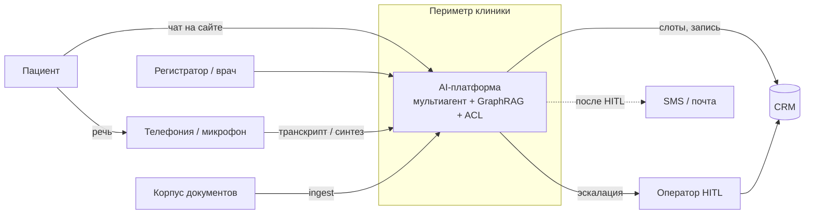
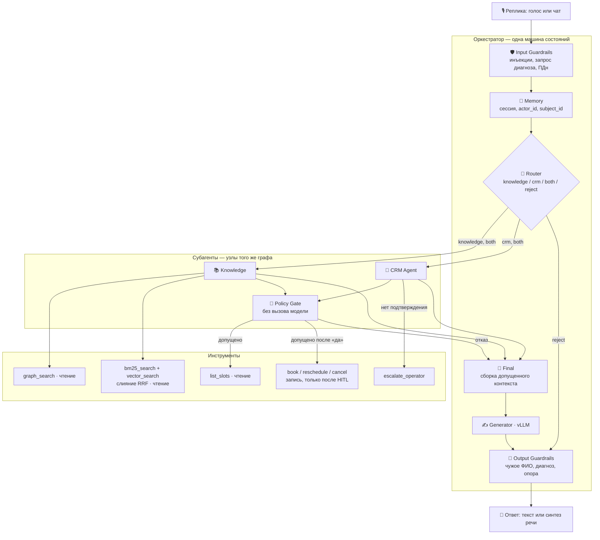
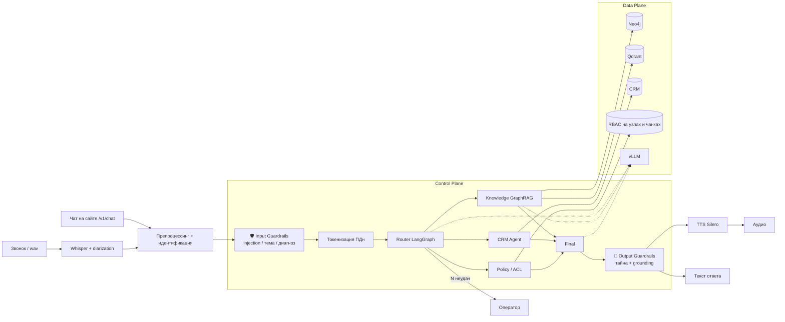
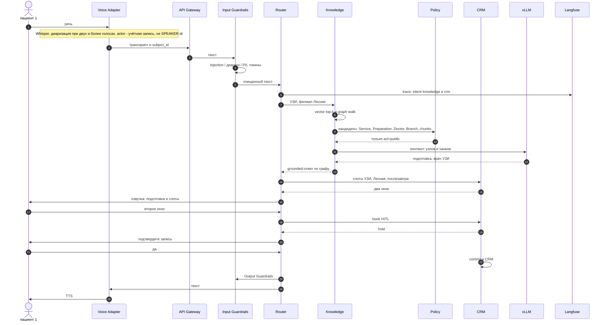
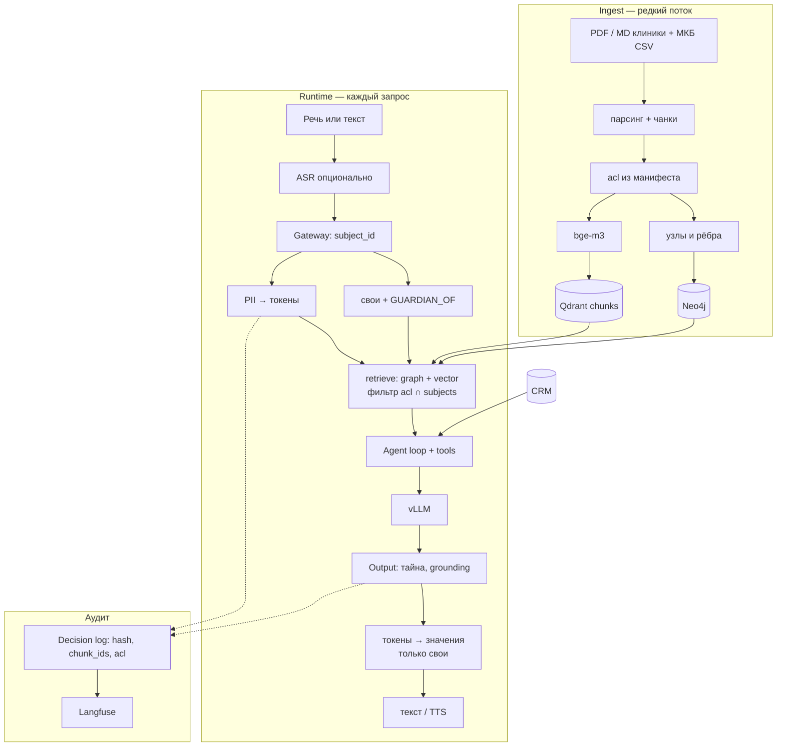
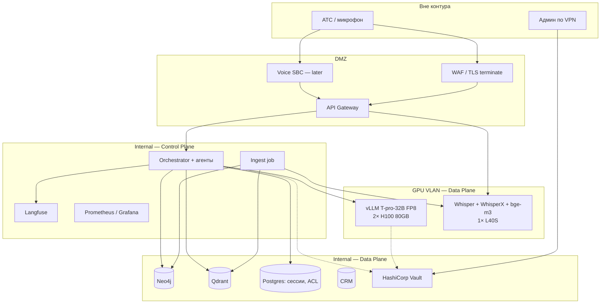
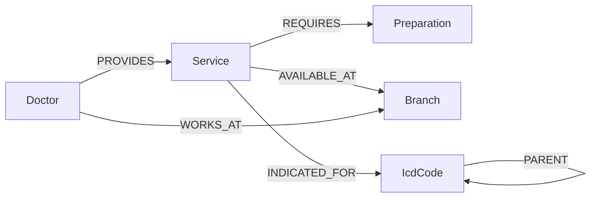
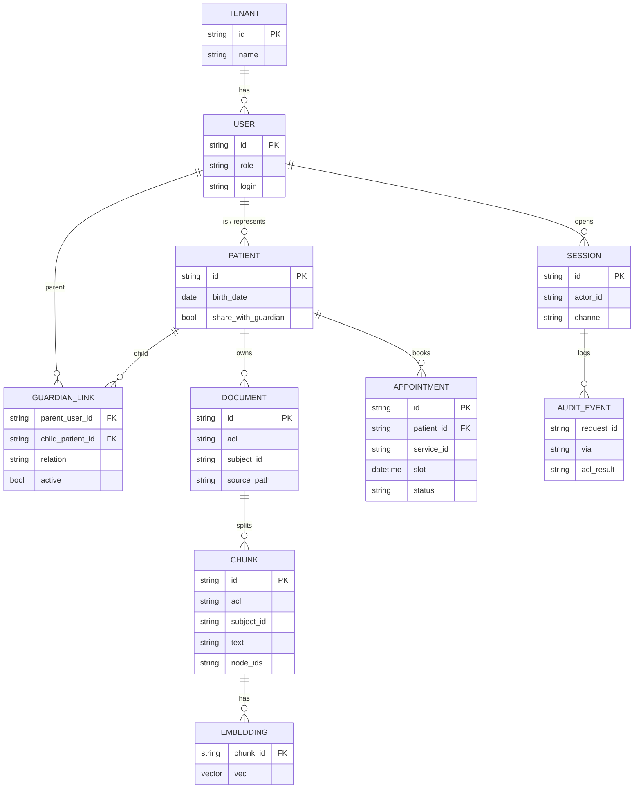
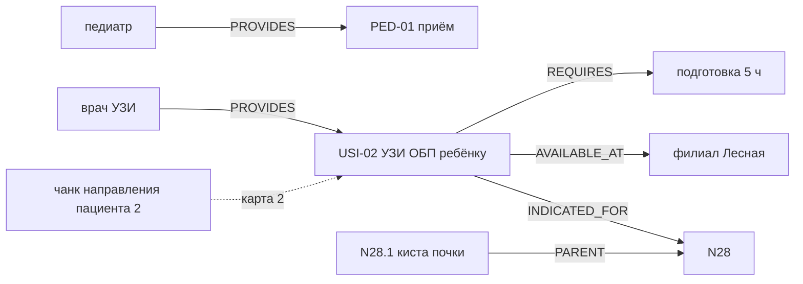
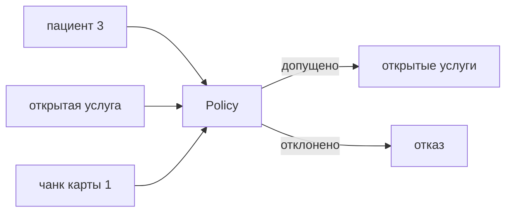

# Проектирование и реализация on-premise мультиагентного голосового ИИ-ассистента медицинского центра с GraphRAG, обеспечением врачебной тайны и соблюдением 152-ФЗ

Система — голосовой ассистент **типового медицинского центра**. Пациент или регистратор запрашивает сведения об услугах, врачах, филиалах, подготовке к исследованиям и записи на приём. Ответ формируется из графа знаний и документов клиники (**GraphRAG**). Запись, перенос и отмена выполняются через инструменты CRM с подтверждением (**HITL**).

Контур **замкнут**: речь, генерация и поиск выполняются внутри периметра. **Внешние API LLM и STT не используются** — так соблюдаются **152-ФЗ** и врачебная тайна. Один пациент не видит карту другого; законный представитель видит карту ребёнка по связи `GUARDIAN_OF`. Канал на права **не влияет**.

> **Система не ставит диагноз** и не подбирает код МКБ по симптомам. Основной канал — **речь** (ADR-0009). Чат на сайте вызывает тот же граф состояний (`POST /v1/chat`). ASR и TTS — адаптер канала, не отдельное решение.

---

## Состав репозитория


| Путь | Что внутри |
| ---- | ---------- |
| [`README.md`](README.md) | этот документ: рамка, архитектура, схемы, нагрузка, метрики, стенд |
| [`docs/adr/`](docs/adr/README.md) | десять записей архитектурных решений: принятый вариант, отклонённые, последствия |
| [`slides/`](slides/) | схемы: исходники Mermaid (`*.mmd`) и собранные `*.svg`, обложка, QR-коды |
| [`presentation.html`](presentation.html) | презентация проекта, публикуется на GitHub Pages |
| [`backend/app/`](backend/app/) | Control Plane: шлюз, оркестратор, субагенты, Policy, guardrails, порты хранилищ |
| [`backend/data/`](backend/data/kb/manifest.yaml) | синтетический корпус клиники с метками ACL, граф в Cypher, регистр CRM, справочник МКБ-10 |
| [`backend/tests/`](backend/tests/) | автотесты доступа, представительства, запрета диагноза, подтверждения записи, обоих каналов, ранжирования |
| [`demo/`](demo/README.md) | демонстрационный стенд на Streamlit: разговор голосом или текстом и разбор решения о доступе |
| [`infra/`](infra/README.md) | Compose целевого Data Plane: Neo4j, Qdrant, PostgreSQL |
| [`scripts/check_docs.py`](scripts/check_docs.py) | сверка документации, презентации и кода |
| [`GLOSSARY.md`](GLOSSARY.md) | расшифровки терминов и сокращений |


### Как поддерживается актуальность

Документация — часть поставки, а не приложение к ней. Расхождение README, ADR, презентации и кода считается дефектом.

- **Одно изменение — один PR.** Правка кода, меняющая решение или контракт, приходит вместе с правкой ADR и README. Решения не переписываются задним числом: старая ADR получает статус «заменена».
- **Автоматическая сверка.** [`scripts/check_docs.py`](scripts/check_docs.py) проверяет, что числовые факты презентации есть в README, что число автотестов совпадает с фактическим, что карта слайдов соответствует презентации и что каждая упомянутая ADR существует. Скрипт запускается в CI на каждый push и pull request.
- **Агент-ревьюер на merge.** На pull request поднимается агент со скиллом проекта: он читает диск изменений, сверяет затронутые модули с README и ADR и оставляет комментарий, если код разошёлся с документацией или в поставку въехал термин без расшифровки в глоссарии.
- **Мониторинг контура — тем же контуром.** Трассировки Langfuse и метрики Prometheus смотрит дежурный; отчёт офлайн-прогона прикладывается к каждому релизу и хранится как основание выкладки.

## Содержание

- [1. Состав репозитория](#состав-репозитория)
- [2. Зачем это клинике](#зачем-это-клинике)
- [3. Цель и задачи](#цель-и-задачи)
- [4. Владение](#владение)
- [5. Объём системы](#объём-системы)
  - [5.1. Что входит](#что-входит)
  - [5.2. Ограничения](#ограничения)
  - [5.3. Принципы контура](#принципы-контура)
- [6. Роли](#роли)
- [7. Стек](#стек)
- [8. Доступ](#доступ)
  - [8.1. Правило Policy](#правило-policy)
  - [8.2. Карточки и граф](#карточки-и-граф)
- [9. Персональные данные в реплике](#персональные-данные-в-реплике)
- [10. Внешние порты](#внешние-порты)
  - [10.1. Телефония](#телефония)
  - [10.2. CRM](#crm)
- [11. Схемы](#схемы)
  - [11.1. C4 L1 — Context](#c4-l1--context)
  - [11.2. C4 L2 — Container](#c4-l2--container)
  - [11.3. C4 L3 — Component](#c4-l3--component)
  - [11.4. Мультиагентная схема](#мультиагентная-схема)
  - [11.5. Когнитивная схема](#когнитивная-схема)
  - [11.6. Sequence](#sequence)
  - [11.7. Data Flow](#data-flow)
  - [11.8. Хранилища и очереди](#хранилища-и-очереди)
  - [11.9. Deployment](#deployment)
  - [11.10. Онтология и ER](#онтология-и-er)
- [12. Нагрузка и стоимость](#нагрузка-и-стоимость)
  - [12.1. Допущения](#допущения)
  - [12.2. Типовой день и пик](#типовой-день-и-пик)
  - [12.3. Капитальные затраты](#капитальные-затраты)
  - [12.4. Операционные затраты](#операционные-затраты-ориентир)
  - [12.5. Стоимость сессии](#стоимость-сессии)
- [13. Мониторинг промышленного контура](#мониторинг-промышленного-контура)
- [14. Метрики и проверка эффекта](#метрики-и-проверка-эффекта)
  - [14.1. Онлайн-метрики](#онлайн-метрики)
  - [14.2. Офлайн-метрики](#офлайн-метрики)
  - [14.3. A/B против живой линии](#ab-против-живой-линии)
  - [14.4. Экономия линии](#экономия-линии)
  - [14.5. Цели первого года](#цели-первого-года)
- [15. Планы развития](#планы-развития)
- [16. Реестр требований](#реестр-требований)
- [17. Стенд](#стенд)
  - [17.1. Запуск](#запуск)
  - [17.2. Развёртывание](#развёртывание)
  - [17.3. Демонстрационный стенд](#демонстрационный-стенд)
  - [17.4. Порты стенда](#порты-стенда)
  - [17.5. Сценарий нагрузки для прогона](#сценарий-нагрузки-для-прогона)
  - [17.6. Локальный прогон](#локальный-прогон)
- [18. Презентация](#презентация)
- [19. Глоссарий терминов и сокращений](GLOSSARY.md)

## Зачем это клинике

Справочная линия двух филиалов — 500 обращений в день, в пиковый час около 100 ([допущения расчёта](#допущения)). Одно справочное обращение занимает у оператора около четырёх минут ([Экономия линии](#экономия-линии)). Слева — состояние линии сегодня, справа — что даёт контур в периметре.


| Сегодня | С ассистентом |
| ------- | ------------- |
| Линия — узкое место: в пиковый час очередь растёт быстрее, чем регистратура успевает её разбирать | Подготовка, филиал и свободное окно закрываются в том же обращении. Цель — до 40% обращений без оператора ([Цели первого года](#цели-первого-года)) |
| Одни и те же вопросы: цена услуги, адрес филиала, подготовка к исследованию, ближайшее окно | Ответ собирается из графа услуг и документов клиники; запись и перенос — только после подтверждения. Нет опоры — отказ или оператор |
| Линия работает 10 часов в день, 250 дней в году; непринятый звонок — несостоявшийся визит (допущение, проверяется в A/B) | Контур отвечает без перерывов. Ориентир устойчивого режима — около 1,5 ставки регистратуры, ≈ 2,2 млн ₽ в год чистой экономии ФОТ |
| Облачный ассистент обошёлся бы в 4–8 ₽ за сессию, но речь и карточки нельзя передавать наружу (152-ФЗ, 323-ФЗ ст. 13) | Всё остаётся в клинике: ≈ 30 ₽ за сессию. Закон закрывается размещением и проверкой прав, эффект — A/B при CSAT не ниже контроля |


## Цель и задачи

**Цель:** спроектировать и довести до работающего стенда on-premise голосового ИИ-ассистента медицинского центра с GraphRAG — так, чтобы врачебная тайна и требования 152-ФЗ обеспечивались архитектурой, а не оговорками в инструкции модели.

| № | Задача | Где закрыта |
| - | ------ | ----------- |
| 1 | Зафиксировать рамку поставки: объём и ограничения, роли, внешние порты, реестр требований | [Объём системы](#объём-системы), [Роли](#роли), [Внешние порты](#внешние-порты), [Реестр требований](#реестр-требований) |
| 2 | Обосновать стек решениями ADR: принятый вариант, отклонённые и причина | [Стек](#стек), [`docs/adr/`](docs/adr/README.md) |
| 3 | Спроектировать архитектуру: C4 L1–L3, сценарии, потоки данных, размещение, ER | [Схемы](#схемы) |
| 4 | Построить модель доступа: роль, своя карта и опека; проверка прав до вызова модели | [Доступ](#доступ) |
| 5 | Собрать знания клиники: онтологию графа, корпус документов с метками доступа, справочник МКБ-10 | [Онтология и ER](#онтология-и-ер), [`backend/data/kb/`](backend/data/kb/manifest.yaml) |
| 6 | Реализовать MVP Control Plane и закрыть сценарии автотестами | [Стенд](#стенд), [Локальный прогон](#локальный-прогон) |
| 7 | Посчитать ёмкость и стоимость владения, задать метрики и план A/B | [Нагрузка и стоимость](#нагрузка-и-стоимость), [Метрики и проверка эффекта](#метрики-и-проверка-эффекта) |

## Владение

Идентификатор контура: `clinic-voice-graphrag`. Дата фиксации: **2026-09-12**. Обновлять при смене модели, Policy или состава GPU.

> Один человек закрывает все роли контура: Распутина Анастасия ([divisee](https://github.com/divisee)).


| Роль                          | Ответственный                         | Должность                              |
| ----------------------------- | ------------------------------------- | -------------------------------------- |
| **Владелец (ML)**             | [divisee](https://github.com/divisee) | ведущий ML-инженер                     |
| **Владелец (бизнес)**         | [divisee](https://github.com/divisee) | руководитель цифровых сервисов клиники |
| **Архитектор**                | [divisee](https://github.com/divisee) | архитектор AI-платформы                |
| **Владелец данных и 152-ФЗ**  | [divisee](https://github.com/divisee) | ответственный за обработку ПДн         |
| **Владелец ACL / Policy**     | [divisee](https://github.com/divisee) | инженер информационной безопасности    |
| **Владелец инференса (vLLM)** | [divisee](https://github.com/divisee) | инженер инференса                      |
| **Владелец речевого канала**  | [divisee](https://github.com/divisee) | инженер речевых технологий             |
| **Владелец затрат (FinOps)**  | [divisee](https://github.com/divisee) | владелец вычислительного бюджета       |
| **Дежурный по инцидентам**    | [divisee](https://github.com/divisee) | инженер сопровождения                  |


| Контур                     | Владелец                              | Должность                              |
| -------------------------- | ------------------------------------- | -------------------------------------- |
| ADR и схемы                | [divisee](https://github.com/divisee) | архитектор AI-платформы                |
| Control Plane (`backend/`) | [divisee](https://github.com/divisee) | ведущий ML-инженер                     |
| Корпус знаний и МКБ        | [divisee](https://github.com/divisee) | руководитель цифровых сервисов клиники |
| Data Plane / Compose       | [divisee](https://github.com/divisee) | инженер инференса                      |
| Нагрузка и TCO             | [divisee](https://github.com/divisee) | владелец вычислительного бюджета       |


## Объём системы

### Что входит


| Сценарий                                                      | Назначение                               |
| ------------------------------------------------------------- | ---------------------------------------- |
| Ответы по услугам, врачам, филиалам, подготовке               | извлечение из графа и чанков             |
| Запись, перенос, отмена визита с подтверждением               | **HITL**                                 |
| Изоляция карточек; законный представитель видит карту ребёнка | **RBAC и ReBAC**, ADR-0002               |
| Загрузка документов клиники в граф и индекс BM25 + векторы    | конвейер знаний                          |
| Речевой канал: ASR → оркестратор → TTS                        | основной канал, ADR-0009                 |
| Чат на сайте: `POST /v1/chat`                                 | тот же оркестратор, не отдельный продукт |
| Отказ и передача оператору без опоры в графе                  | ограничение галлюцинаций                 |
| Трассировка решения ACL                                       | `/v1/audit/{request_id}`                 |


Онтология: `Doctor`, `Service`, `Preparation`, `Branch`, `IcdCode`. Справочник **МКБ-10** — терминология.

### Ограничения

- диагноз и подбор кода МКБ по симптомам система не выполняет;
- клинические назначения система не принимает;
- промышленная CRM (в стенде — синтетический регистр: пациент 1, пациент 2, пациент 3);
- обучение LLM и ASR;
- промышленная АТС (вход — микрофон, wav или транскрипт);
- штатный blue/green и ночная полная переиндексация.

### Принципы контура

- **нет внешних API** генеративных моделей;
- поиск включает **граф**, не только векторы;
- **Control Plane** отделён от **Data Plane**;
- оркестрация — **машина состояний** (ADR-0008);
- эскалация на оператора и состав корпуса — у владельца контура.

## Роли


| Роль в документах и презентации | Учётная запись стенда | Карта в регистре | Права                                                    |
| ------------------------------- | --------------------- | ---------------- | -------------------------------------------------------- |
| пациент 1 — законный представитель | `patient:anna`     | `anna`           | своя карта и карта пациента 2 по ребру `GUARDIAN_OF`     |
| пациент 2 — ребёнок младше 15 лет  | учётной записи нет | `misha`          | запросы выполняет только представитель                   |
| пациент 3 — другой пациент клиники | `patient:boris`    | `boris`          | **только своя карта**                                     |
| регистратор                        | `staff:registrar`  | —                | материалы `public` и `staff`; учётные сведения визита любого пациента в CRM — слот, услуга, филиал, код направления. Документы карты не читает |
| оператор                           | вне контура API    | —                | эскалация при низкой уверенности и на жалобе на самочувствие |

Роли в тексте и на слайдах обезличены. В регистре стенда карточки носят синтетические ФИО — это и есть защищаемые сведения: именно их Policy не отдаёт чужому актору.


## Стек


| Слой                 | Решение                                  | ADR                                               |
| -------------------- | ---------------------------------------- | ------------------------------------------------- |
| Контур               | **self-hosted**                          | [0001](docs/adr/0001-closed-contour.md)           |
| Доступ               | RBAC, `GUARDIAN_OF`                      | [0002](docs/adr/0002-acl-rebac.md)                |
| LLM                  | **T-pro-it-2.1** 32B на H100 + **T-lite-it-2.1** 8B на L40S для шагов субагентов | [0003](docs/adr/0003-llm-t-pro.md)                |
| GPU                  | **2× H100 FP8, 1× L40S**                 | [0004](docs/adr/0004-gpu-budget.md)               |
| Инференс LLM         | **vLLM**                                 | [0005](docs/adr/0005-inference-engine.md)         |
| Поиск                | BM25 + bge-m3, слияние RRF, reranker     | [0006](docs/adr/0006-embeddings.md)               |
| GraphRAG             | Neo4j, Qdrant                            | [0007](docs/adr/0007-graph-and-vectors.md)        |
| Оркестрация          | LangGraph                                | [0008](docs/adr/0008-orchestration.md)            |
| ASR, диаризация, TTS | Whisper large-v3-turbo, WhisperX, Silero | [0009](docs/adr/0009-voice-gigaam-diarization.md) |


**Control Plane** — API и агенты. **Data Plane** — граф, векторы, модели, заглушка CRM.

## Доступ

Арендатор (`tenant`) — организация целиком, а не филиал: карточка пациента общая для всех филиалов сети, приём на Лесной виден и на Южном. Мультитенантность в поставке не разворачивается: другое юридическое лицо — **отдельная установка контура**, а не общая база с разделением по колонке `tenant_id`. Поле `tenant` в модели данных сохранено, чтобы такой переход не требовал переделки схемы (ADR-0002).

### Правило Policy

Ресурс (чанк, узел, визит) имеет `acl` и `subject_id`. Доступ при **одном** из условий (ADR-0002, 323-ФЗ ст. 13, 152-ФЗ):

1. `acl = public`;
2. `acl = staff` и роль актора — `staff`;
3. `subject_id = actor.id`;
4. активная связь `actor GUARDIAN_OF subject` и возраст субъекта **менее 15 лет** либо `share_with_guardian = true`;
5. роль актора — `staff`, и запрашиваются **учётные сведения визита** в CRM: слот, услуга, филиал, статус и код из направления. Медицинские документы карты под это правило не попадают: чанк с `acl = patient` роль `staff` не читает (`decide_crm` против `decide`, основание — 323-ФЗ ст. 13 ч. 4 п. 1, обработка в объёме должностных обязанностей).

> [!IMPORTANT]
> Отклонённый фрагмент **в контекст модели не передаётся**. Канал на ACL **не влияет**. `actor_id` — учётка или АОН, **не** `SPEAKER_`*.

### Карточки и граф

Регистр ПДн — **CRM**. Справочный граф карточек не содержит. Документ пациента (направление, напоминание) может попасть в индекс как чанк с `acl` и `subject_id`: это копия для ответа, не второй регистр.

## Персональные данные в реплике

Реплика пациента почти всегда содержит персональные данные: «Это Соколова Анна, телефон плюс семь..., запишите сына на УЗИ». Значения нужны системе — по ним определяется актор и создаётся запись в CRM, — но не нужны генеративной модели: она формулирует ответ по допущенному контексту, а идентификацию и запись выполняют инструменты. Отсюда правило контура: **значение живёт в состоянии диалога, модель видит токен** ([ADR-0010](docs/adr/0010-pii-detection.md)).


| Куда попадает | Что именно |
| ------------- | ---------- |
| Состояние диалога, инструменты CRM | настоящие значения: телефон, ФИО, номер полиса |
| Промпт генеративной модели | токены `[PHONE_0]`, `[NAME_0]`, `[OMS_0]` |
| Трассировка Langfuse, журнал, метрики | хэш запроса, типы найденных сущностей, счётчики — значений нет |
| Ответ пациенту | токены разворачиваются обратно, но только в значения самого актора |


Замкнутый контур ([ADR-0001](docs/adr/0001-closed-contour.md)) исключает передачу данных наружу; токенизация решает другую задачу — минимизацию состава обрабатываемых данных **внутри** контура (152-ФЗ ст. 5 ч. 5: состав не должен быть избыточным по отношению к цели). Применяемый метод в классификации приказа Роскомнадзора № 996 от 05.09.2013 называется **введением идентификаторов**: значение заменяется идентификатором, соответствие хранится отдельно.

**Три слоя обнаружения.** Каркас — [Microsoft Presidio](https://github.com/microsoft/presidio), открытый (MIT), разворачивается локально как библиотека Python: реестр распознавателей, оценки уверенности, разрешение пересекающихся находок и отдельный шаг анонимизации.

1. **Правила** — телефон, номер полиса ОМС, СНИЛС, дата рождения, адрес электронной почты, номер карты. Работают всегда и первыми.
2. **Именованные сущности** — ФИО, адрес, организация. Модель — **spaCy `ru_core_news_lg`** (метки PER, LOC, ORG; ≈ 500 МБ, работает на CPU, видеопамять речевого узла не занимает): это штатный языковой движок Presidio, подключается конфигурацией `nlp_engine_name: spacy`, `lang_code: ru`. Предопределённые распознаватели Presidio рассчитаны на англоязычные сущности и не применяются. Резерв — Natasha/Slovnet, если полнота по ФИО на золотом наборе клиники окажется ниже 0,95.
3. **Справочник** — точные ФИО пациентов и сотрудников из реестра; ловит то, что пропустили первые два слоя.

Отдельная языковая модель для обнаружения персональных данных **не используется**: обнаружение стало бы недетерминированным, добавило бы сотни миллисекунд к бюджету реплики и потребовало бы передать модели ровно те данные, которые мы прячем.

**Разворачивание обратно.** Выходной guardrails подставляет значение, только если оно принадлежит самому актору или субъекту, к которому актор допущен ([Доступ](#доступ)). Токен чужого значения в ответе означает ошибку маршрута и приводит к отказу, а не к подстановке.

**Что на стенде.** Слои 1 и 3 реализованы в [`app/guardrails/input.py`](backend/app/guardrails/input.py) и закрыты автотестами: токенизация контактов и документов, ФИО из реестра, разворачивание только своих значений, отсутствие ложных срабатываний на терминах клиники и кодах МКБ-10. Слой 2 — целевой контур: на стенде без GPU модель распознавания сущностей не поднимается.

## Внешние порты

Телефония и учёт визитов — **внешние системы**. Оркестратор зависит от контракта, не от вендора АТС или CRM.

### Телефония

Контракт: `call_id`, `caller_id` → `actor_id`, `audio` / `transcript`, `transfer_operator`. SIP/SBC — целевой адаптер. В MVP вход — микрофон, wav или транскрипт.

### CRM

Учёт карточек и визитов. Контракт: `list_slots`, `book` / `reschedule` / `cancel`, `get_patient` **после Policy**. Заглушка — [backend/data/crm/seed.json](backend/data/crm/seed.json). Конкретный вендор не выбирается.

## Схемы

### C4 L1 — Context

Уровень фиксирует границу обработки: внутри контура — одна система, AI-платформа; снаружи — источники обращений, корпус документов, промышленная CRM и получатели уведомлений. Все смежные системы остаются в сети клиники: уведомление о состоявшейся записи контур передаёт внутренней системе рассылки, наружу его отправляет она. Исходящих соединений в публичные сети у контура нет; персональные данные и текст запросов за периметр не передаются.

Синтаксис `C4Context` в превью Markdown и на GitHub не рендерится: нужен экспериментальный плагин. Ниже тот же L1 обычным `flowchart`.




**Снаружи контура: участник и его функция**


| Участник | Функция в сценарии | Что пересекает границу |
| -------- | ------------------ | ---------------------- |
| Пациент | звонит на номер клиники или пишет в чат на сайте | реплика: аудиопоток или текст |
| Регистратор, врач | обращаются с рабочего места; роль определяется на входе и задаёт объём доступных данных | реплика и идентификатор сотрудника |
| Телефония, микрофон | передают аудиопоток; распознавание и синтез выполняются внутри контура | аудио в обе стороны |
| Корпус документов | прайс, регламенты подготовки, расписание филиалов, справочник МКБ-10; попадают в контур заданием ingest — разбор, нарезка на фрагменты, метка доступа, индексация | исходные файлы клиники |
| CRM | промышленная система учёта: чтение свободных слотов, создание и перенос записи | идентификаторы слота и визита |
| Оператор HITL | принимает диалог при эскалации и при отказе по основанию доступа | контекст диалога без карточки |
| Система рассылки клиники | отправляет пациенту SMS или письмо после подтверждения записи; наружу ходит она, а не контур | время визита, филиал, услуга — передаются внутри сети клиники |


**Внутри контура**

- агенты, guardrails, ACL;
- Neo4j, Qdrant, BM25, сессии, аудит;
- vLLM, распознавание и синтез речи;
- секреты (Vault).


### C4 L2 — Container

Control Plane (агенты, API, ingest) и Data Plane (граф, векторы, модели, заглушка CRM, секреты). В MVP часть контейнеров — один процесс FastAPI; на схеме они разделены как в целевом размещении.


| Контейнер                | Плоскость     | Технология                | Назначение                                                          |
| ------------------------ | ------------- | ------------------------- | ------------------------------------------------------------------- |
| API Gateway              | Control       | FastAPI                   | Принимает запросы чата и голоса, передаёт `actor_id`                |
| Voice Adapter            | Control       | Whisper, WhisperX, Silero | Распознаёт речь и синтезирует ответ. Личность по голосу не определяет |
| Orchestrator             | Control       | LangGraph                 | Ведёт сессию: маршрут, повтор, отказ                                |
| Knowledge / CRM / Policy | Control       | тот же runtime            | Извлекает знания, вызывает CRM, применяет ACL                       |
| Ingest Worker            | Control       | Python job                | Загружает документы в граф и векторный индекс                       |
| Neo4j                    | Data          | Neo4j 5                   | Хранит онтологию услуг, врачей, филиалов                            |
| Qdrant                   | Data          | Qdrant                    | Хранит чанки с вектором и меткой ACL                                |
| vLLM                     | Data          | vLLM                      | Генерирует ответ внутри периметра                                   |
| CRM                      | Data          | внешняя система; в стенде — JSON | Учитывает карточки, слоты и визиты                             |
| Vault                    | Data          | Vault; в dev — `.env`     | Хранит секреты                                                      |
| Langfuse + Prom/Grafana  | Observability | self-host                 | Пишет трассировку вызовов и задержку                                |


Контур on-premise. Клиент vLLM обращается к внутреннему URL.

Контрольные потоки:

- ingest прайса в Qdrant и `Service` в Neo4j;
- вопрос «УЗИ на Лесной и подготовка» — обход графа;
- пациент 3 не видит направление пациента 1;
- пациент 1 видит карту пациента 2;
- голос идёт в тот же Orchestrator.

### C4 L3 — Component

Одно приложение: узлы графа состояний, не микросервис на каждый субагент.


| Модуль            | Назначение |
| ----------------- | ---------- |
| Memory            | Хранит сессию: последние реплики, `actor_id`, выбранный `subject_id`, филиал и услугу. Состояние — в `sessions` и checkpoint LangGraph. Карточка пациента в промпт не подставляется. |
| Router            | Классифицирует намерение: знания, CRM, оба контура или отказ. Запрос на диагноз по симптомам направляет в отказ. Текст ответа не генерирует. |
| Tools             | Вызывает граф, векторный поиск и CRM по контракту (`graph_search`, `vector_search`, слоты, запись, отмена, эскалация). Доступ к карточкам — только через Policy. |
| Policy            | Пересекает извлечённые узлы и чанки с правами актора. В контекст модели передаёт только допущенные фрагменты. |
| Generator         | Формирует реплику по допущенному контексту через vLLM. Тот же текст уходит в чат и в TTS. |
| Output Guardrails | Проверяет исходящую реплику: нет чужого ФИО, нет диагноза, есть опора на допущенные узлы и чанки. При нарушении — отказ или эскалация. |

Отдельный векторный индекс «памяти пациента» не ведётся.

### Мультиагентная схема

Автономных агентов в контуре нет. Субагенты — узлы одной машины состояний LangGraph (ADR-0008): маршрут выбирает `Router`, права проверяет отдельный узел `Policy`, а модель вызывается только на шаге генерации. Инструменты закреплены за субагентом и разделены на чтение и запись; операции записи проходят через подтверждение пользователя (HITL).




| Субагент | Инструменты | Права | Код |
| -------- | ----------- | ----- | --- |
| `Knowledge` | `graph_search`, `bm25_search`, `vector_search` | только чтение; выдача проходит через Policy до модели. На стенде плотный поиск отключён, работает BM25 | [app/agents/knowledge.py](backend/app/agents/knowledge.py) |
| `CRM Agent` | `list_slots`, `book`, `reschedule`, `cancel`, `escalate_operator` | чтение расписания; запись только после подтверждения пользователя | [app/agents/crm_node.py](backend/app/agents/crm_node.py) |
| `Policy Gate` | `decide` (документы), `decide_crm` (учётные сведения визита) | решение о доступе; модель на этом шаге не вызывается | [app/policy/acl.py](backend/app/policy/acl.py) |
| `Generator` | vLLM | формулирует ответ только по допущенному контексту | [app/agents/generator.py](backend/app/agents/generator.py) |


Почему не автономные агенты: модель не решает, вызывать ли проверку прав — это обязательный узел маршрута; запись и отмена не выполняются без подтверждения. Исходник схемы — [slides/agents.mmd](slides/agents.mmd).

### Когнитивная схема

Чат на сайте использует тот же оркестратор, что и речевой канал.




Цепочка голоса: аудио → VAD → диаризация при 2+ говорящих → faster-whisper large-v3-turbo → Input Guardrails → LangGraph → Output Guardrails → Silero TTS.

### Sequence

Пациент 1: «Хочу УЗИ на Лесной, как готовиться и есть ли окно послезавтра?»




Пациент 3: «Какое направление у пациента 1 и когда УЗИ?»

- фильтры ввода не блокируют;
- Knowledge находит чанк;
- Policy исключает чужой `acl`;
- CRM по чужому `subject_id` не вызывается;
- ответ — отказ, в журнале фиксируется отказ доступа.

Пациент 1: «Когда УЗИ у сына и что за код N28.1?»

- субъект — пациент 2, по опеке;
- пациенту 2 меньше 15 лет — карта доступна;
- граф: USI-02 → подготовка → врач УЗИ → Лесная;
- `IcdCode:N28.1` — справочник, не диагноз.

Пациент 3 с текстом про «сына пациента 1» — опеки нет, отказ.

### Data Flow




| Данные                   | Куда можно                   | Куда нельзя                  |
| ------------------------ | ---------------------------- | ---------------------------- |
| Публичный прайс, памятки | граф, векторы, промпт        | внешний API                  |
| Регламент регистратуры   | `acl=staff`                  | промпт пациента              |
| Направление пациента 1   | чанк карты 1                 | промпт пациента 3, открытые логи |
| Направление пациента 2   | пациент 1 по опеке           | промпт пациента 3                |
| Телефон, ФИО в реплике   | Token Vault на время запроса | сырьём в vLLM и Langfuse     |
| Аудио                    | диск контура / tmp, TTL      | облачный Speech API          |


### Хранилища и очереди

Отдельный вопрос — что и где лежит, кроме графа и индекса. Всё перечисленное разворачивается внутри периметра; облачных сервисов, включая S3 и управляемые очереди, в контуре нет (ADR-0001).


| Слой | Чем закрыт | Что хранит |
| ---- | ---------- | ---------- |
| Реляционное хранилище | PostgreSQL | сессии диалога и checkpoint LangGraph (чтобы реплика подхватила HITL), журнал решений доступа, учётные связи |
| Граф и векторы | Neo4j, Qdrant | онтология клиники; фрагменты документов с меткой ACL и векторами |
| Разрежённый индекс | BM25 рядом с Qdrant | словарь и частоты корпуса для поиска по кодам и названиям |
| Объектное хранилище | MinIO, S3-совместимое, в периметре | аудиозаписи с TTL, веса моделей с внутреннего зеркала, снапшоты индекса, отчёты офлайн-прогонов |
| Аналитика трассировок | ClickHouse внутри Langfuse | трассировки вызовов модели: хэш запроса, узлы и чанки, задержки по этапам |
| Очередь заданий | Redis/RQ для ingest-job | ночная переиндексация корпуса, разбор новых PDF, пересборка BM25 — задание ставится в очередь, а не блокирует диалог |


Брокера сообщений (Kafka, RabbitMQ) в MVP нет: диалог синхронный, а фоновых потоков ровно один — загрузка корпуса. Брокер появится вместе с исходящими сценариями (напоминания о визите) и интеграцией с АТС: тогда очередь звонков и повторные попытки станут отдельным контуром ([Планы развития](#планы-развития)).

### Deployment




| Узел         | Роль                                              |
| ------------ | ------------------------------------------------- |
| 2× H100 80GB | vLLM FP8; второй GPU — резерв / реплика           |
| 1× L40S 48GB | Whisper, WhisperX, эмбеддинги                     |
| CPU-ноды     | API, LangGraph, Neo4j, Qdrant, Postgres, Langfuse |


| Зона     | Состав                    | Кто ходит                     |
| -------- | ------------------------- | ----------------------------- |
| DMZ      | TLS, gateway, будущий SBC | пациент / АТС                 |
| Internal | агенты, БД, наблюдаемость | gateway и админы              |
| GPU VLAN | vLLM, Whisper             | только Control Plane          |
| Vault    | пароли, токены            | JIT, не env на диске прод-нод |

У внутренних сегментов нет публикуемых портов: снаружи доступен только шлюз в DMZ. Эксплуатационный доступ администратора — исключительно через VPN и под журналом: обновление весов моделей с внутреннего зеркала, смена корпуса и манифеста ACL, выдача секретов из Vault, разбор инцидентов, чтение трассировок и метрик. Удалённый доступ к системе, обрабатывающей ПДн, по защищённому каналу — требование 152-ФЗ.


Контур on-premise: GPU VLAN без маршрута в интернет, веса — с внутреннего зеркала. Сессии LangGraph — в Postgres, чтобы реплика подхватила HITL.

### Онтология и ER

Справочный граф. Карточки пациентов в него не входят.




| Тип           | Пример                | acl    |
| ------------- | --------------------- | ------ |
| `Branch`      | Лесная, Южный         | public |
| `Doctor`      | врач УЗИ              | public |
| `Service`     | УЗИ ОБП, гастроскопия | public |
| `Preparation` | не есть 6 часов       | public |
| `IcdCode`     | K21.0 — код диагноза из направления, не код услуги | public |


`INDICATED_FOR` читается «услуга показана при этом коде», а не «услуга кодируется этим кодом»: МКБ-10 классифицирует болезни, а не медицинские услуги — для услуг действует отдельная номенклатура. Ребро нужно ровно для одного сценария: пациент приходит с направлением, в котором стоит код диагноза, и регистратура по этому коду находит нужную услугу. Связь необязательная и многие-ко-многим: у части услуг кода нет вовсе, у гастроскопии их три (K21, K25, K29).

Сам код система никогда не выводит и не подбирает: она только читает уже выданное направление ([ADR-0001](docs/adr/0001-closed-contour.md), раздел «Ограничения»). Полный МКБ-10: [backend/data/kb/reference/mkb10-parsed.csv](backend/data/kb/reference/mkb10-parsed.csv). В проде — выгрузка НСИ Минздрава `1.2.643.5.1.13.13.11.1005`.

Учётные сущности (пользователь, опека, визит, сессия):




Qdrant: `vector + payload{chunk_id, acl, subject_id, doc_id}`. Фильтр ACL — до LLM.

Поиск гибридный (ADR-0006): **BM25** по разрежённому индексу ловит точные идентификаторы — код МКБ, название услуги, фамилию врача, аббревиатуру (ЭГДС, УЗИ ОБП); **bge-m3** ловит перефразировки пациента («натощак» ↔ «не есть перед процедурой»); списки сливаются по Reciprocal Rank Fusion, затем переранжируются reranker-v2-m3. Фильтр ACL применяется к обоим спискам **до** слияния, чтобы отклонённый фрагмент не влиял на ранг. Обход графа идёт по идентификаторам узлов, связанных с допущенными фрагментами.

---

## Нагрузка и стоимость

*Цены GPU — срез Москвы, сентябрь 2026, рубли с НДС ([ADR-0004](docs/adr/0004-gpu-budget.md)). Допущения расчёта, не прогон на H100.*

### Допущения


| Параметр                      | Значение                                             | Основание                         |
| ----------------------------- | ---------------------------------------------------- | --------------------------------- |
| Филиалы                       | 2 (Лесная, Южный)                                    | корпус                            |
| Рабочий день / год            | 10 ч, 250 дней                                       | регистратура                      |
| Типовой день                  | 500 голосовых сессий                                 | оценка входящей линии среднего МЦ |
| Доля пикового часа            | 20% дневного объёма                                  | 100 сессий/ч ≈ 1,7 сессии/мин     |
| Инженерный потолок            | 30 сессий/мин                                        | ADR-0004                          |
| Реплик пользователя на сессию | 3                                                    | запись / подготовка / уточнение   |
| Длительность реплики          | 5 с аудио                                            | бюджет ASR, ADR-0009              |
| Вызовов LLM на реплику         | 2 вызова 32B (маршрут с tool-calling и ответ) + до 1,2 вызова 8B (переписывание запроса поиска, проверка опоры) | ADR-0008, ADR-0003 |
| p95 ASR                       | ≤ 1,0 с на реплику 5 с                               | RTF ≤ 0,2, L40S                   |
| Бюджет vLLM                   | 10 RPS текста, p95 ≤ 8 с                             | ADR-0005                          |
| Электроэнергия                | 12 ₽/кВт·ч                                           | коммерческий ориентир Москвы      |
| TDP                           | H100 PCIe 350 Вт; L40S 350 Вт; 2 платформы по 250 Вт | паспортные                        |
| Амортизация GPU-контура       | 36 месяцев, 24/7                                     | учёт капитальных затрат           |


`/v1/chat` — контур измерений. `/v1/voice` без GPU в прогон не входит. Метрики: p95 ответа, доля `acl_denied`, доля отказов в диагностике, число вызовов CRM.

### Типовой день и пик

500 сессий × 3 реплики = 1500 распознаваний, 3000 вызовов 32B и около 1800 вызовов 8B в сутки. Пиковый час: 100 сессий × 3 = 300 реплик/ч = 5 реплик/мин.


| Узел                 | Формула                         | Типовой пик         | Потолок 30 сессий/мин  |
| -------------------- | ------------------------------- | ------------------- | ---------------------- |
| ASR, запросов/мин    | сессии/мин × 3                  | 5                   | 90                     |
| GPU-секунды ASR/мин  | запросы × 1,0 с                 | 5 с (загрузка ≈ 8%) | 90 с (коэффициент 1,5) |
| LLM 32B, RPS         | сессии/мин × 3 × 2 / 60         | 0,17                | 3,0                    |
| LLM 8B, RPS          | сессии/мин × 3 × 1,2 / 60       | 0,10                | 1,8                    |
| Доля бюджета 10 RPS  | по 32B                          | 2%                  | 30%                    |
| Одновременные сессии | λ × 120 с (средняя длина 2 мин) | ≈ 3                 | 60                     |


> [!WARNING]
> Потолок **30 сессий/мин** — инженерный запас, не штат двух филиалов. 90 ASR/мин при p95 = 1,0 с превышает ~60 последовательных слотов L40S. Штатный пик **1,7 сессии/мин**: 30 ÷ 1,7 ≈ 17, в расчёте принят консервативный ориентир запаса **15×**.

Второй H100 в расчёте пропускной способности не участвует: это горячий резерв / вторая реплика (ADR-0004). Один H100 покрывает 3 RPS при бюджете 10 RPS.

VRAM генерации (оценка, согласована с ADR-0004): веса T-pro 32B FP8 ≈ 32 ГБ; KV при контексте RAG 8–16k и batch до 8 ≈ 10–20 ГБ; итого 40–55 ГБ на карте 80 ГБ.

Мультиагентность в расчёте учтена: узлы графа состояний ходят к моделям разного размера. Тяжёлые шаги — маршрут с вызовом инструментов и генерация ответа — идут в 32B на H100; вспомогательные шаги субагентов (переписывание запроса перед поиском, проверка опоры в выходных guardrails) — в T-lite-it-2.1 8B FP8 на L40S, ≈ 8–10 ГБ рядом с распознаванием и эмбеддингами: та же архитектура и токенизатор, что у основной модели, поэтому промпты, парсер вызова инструментов и рецепт LoRA общие (ADR-0003). Резерв на случай роста нагрузки — Qwen3-30B-A3B: 3,3 млрд активных параметров из 30,5 дают выше пропускную способность на тех же H100. Policy, обход графа и BM25 модель не вызывают вовсе — это код, а не агент, поэтому рост числа субагентов не увеличивает нагрузку на H100 линейно.

### Капитальные затраты

Середина диапазона закупок:


| Статья                          | Кол-во | Диапазон, млн ₽ | Середина, млн ₽ |
| ------------------------------- | ------ | --------------- | --------------- |
| H100 80GB                       | 2      | 5,0–8,0         | 6,5             |
| L40S 48GB                       | 1      | 0,8–1,5         | 1,15            |
| GPU-серверы                     | 2      | 1,2–2,0         | 1,6             |
| **Итого вычислительный контур** |        | **7,0–11,5**    | **9,25**        |


**Почему такой состав.** H100 выбран под генерацию не из-за FP8 — этот формат поддерживает и L40S, — а из-за двух других величин: 32 ГБ весов плюс 10–20 ГБ кэша внимания не помещаются в 48 ГБ с запасом, а декодирование плотной модели 32B упирается в пропускную способность памяти (≈ 2 ТБ/с против 864 ГБ/с), которая прямо переносится в число токенов в секунду.

Третья карта нужна по профилю нагрузки, а не про запас: распознавание и синтез — короткие частые запросы, их всплеск совпадает с пиком звонков и на общей карте вытесняет кэш внимания генерации. Поселить речь на второй H100 значит остаться без горячего резерва, а третий H100 под 8% загрузки стоил бы 2,5–4,0 млн ₽ вместо 0,8–1,5 млн ₽.

L40S выбран среди карт под речь по памяти и форм-фактору: узлу нужно 18–24 ГБ, потому что распознавание, диаризация, синтез, эмбеддинги и малая модель субагентов работают одновременно. T4 (16 ГБ) не хватает памяти; L4 и A10 (24 ГБ) идут впритык, у A10 нет FP8; RTX 4090 (24 ГБ) без ECC и с охлаждением не под стойку; RTX 6000 Ada подходит по характеристикам, но отклонена по форм-фактору. Подробный отбор — [ADR-0004](docs/adr/0004-gpu-budget.md).

Сеть, СХД и Vault в сумму не входят. Снижение сметы: 1× H100 + 1× L40S ≈ 4–6 млн ₽ и аренда второго H100 на аварию (ADR-0004).

Амортизация середины: 9,25 млн ₽ / 36 мес = 257 тыс. ₽/мес ≈ 352 ₽/ч круглосуточно.

### Операционные затраты (ориентир)

Потребление: 2×350 + 350 + 2×250 = 1,45 кВт.

1,45 кВт × 12 ₽ × 24 × 365 ≈ 152 тыс. ₽/год.


| Статья                                                            | Оценка, тыс. ₽/год |
| ----------------------------------------------------------------- | ------------------ |
| Электроэнергия GPU-контура                                        | 152                |
| Сопровождение 0,3 ставки (ориентир ФОТ с налогами 1,8 млн/ставка) | 540                |
| **Итого OpEx без амортизации**                                    | **692**            |


Аренда вместо покупки (не принято для промышленного контура, ориентир): 2×H100 × 300 ₽/ч × 8760 + L40S × 120 ₽/ч × 8760 ≈ 6,3 млн ₽/год. Дороже амортизации собственной закупки при горизонте от трёх лет. Ограничение: срок поставки H100 — недели.

### Стоимость сессии

Типовой годовой объём: 500 × 250 = 125 000 сессий.


| Составляющая                    | ₽/сессия |
| ------------------------------- | -------- |
| Амортизация 9,25 млн ₽ / 3 года | 24,7     |
| Электроэнергия                  | 1,2      |
| Сопровождение 0,3 ставки        | 4,3      |
| **Итого замкнутый контур**      | **≈ 30** |


Годовая стоимость владения: амортизация 3,08 + электроэнергия 0,15 + сопровождение 0,54 = **3,77 млн ₽/год**; 3,77 млн ₽ ÷ 125 000 сессий = **30,2 ₽/сессия**. Высвобождение линии на устойчивом режиме — ≈ 2,7 млн ₽/год ([Экономия линии](#экономия-линии)). Разница около **1 млн ₽/год** — цена законного канала в периметре.

> **TCO типового объёма:** закупка **9,25 млн ₽** · владение **≈ 3,8 млн ₽/год** · **≈ 30 ₽/сессия** (125 000 сессий/год). Облачный Speech/LLM **отклонён** (ADR-0001): ориентир 4–8 ₽/сессия, данные покидают периметр.

## Мониторинг промышленного контура

Контур наблюдается тремя инструментами: **Prometheus** собирает метрики, **Grafana** показывает их на дашборде дежурного, **Langfuse** хранит трассировку каждого вызова модели. Всё размещается внутри периметра (ADR-0001): наружу не уходит ни текст запроса, ни идентификатор пациента — в трассировку пишутся хэш запроса, идентификаторы допущенных узлов и чанков, решение доступа.


| Группа | Метрики | Порог алерта |
| ------ | ------- | ------------ |
| Задержка по этапам | p50/p95/p99 ответа `/v1/chat`; p95 распознавания; время обхода графа и поиска; время генерации | p95 > 8 с в течение 5 минут; p95 распознавания > 1,0 с |
| Очередь и насыщение | глубина очереди vLLM, время ожидания в очереди, размер батча, занятость KV-cache, утилизация и температура GPU, VRAM | ожидание в очереди > 2 с; KV-cache > 85%; VRAM > 90% |
| Ошибки | доля 5xx шлюза, таймауты к vLLM и CRM, невалидные вызовы инструментов, ошибки ingest | доля 5xx > 1% за 5 минут; любой таймаут CRM |
| Диалог | доля эскалаций, доля отказов в диагнозе, доля отказов в доступе, доля ответов без опоры | всплеск `acl_denied` вдвое к недельной медиане; ответы без опоры > 5% |
| Продукт | доля без оператора, время до записи, CSAT после цикла | ниже целевого коридора двух недель подряд |


**Откуда взяты пороги.** Ни один не выбран по привычке:

- **8 секунд** — бюджет реплики из [ADR-0005](docs/adr/0005-inference-engine.md): 1,0 с распознавания + ≤ 1 с поиска + ≤ 5 с генерации + ≤ 1 с оркестрации и сети. Пауза больше этого в телефонном разговоре читается как обрыв связи;
- **5 минут** — окно усреднения: при сборе метрик раз в 30 секунд это десять точек. Короче — ловим одиночный всплеск и будим дежурного зря, длиннее — узнаём о деградации, когда её уже заметили пациенты;
- **1,0 секунда распознавания** — реплика длиной 5 с при RTF ≤ 0,2 ([ADR-0009](docs/adr/0009-voice-gigaam-diarization.md));
- **2 секунды ожидания в очереди** — четверть бюджета ответа: дальше очередь съедает время, отведённое на генерацию;
- **85% KV-cache** — за этим порогом vLLM начинает вытеснять контексты, и задержка растёт скачком, а не плавно;
- **1% ошибок 5xx** — одно обращение из ста уже заметно на линии в 500 сессий в день;
- **двукратный всплеск отказов в доступе** — либо сломано правило Policy, либо кто-то перебирает чужие карты; оба случая требуют человека сегодня, а не в отчёте за неделю.

Правила дежурства: алерты уходят в Alertmanager и дальше в канал дежурного; критичные — выход чужого фрагмента в контекст, отказ CRM, недоступность vLLM — поднимают инженера сопровождения немедленно, остальные разбираются в рабочие часы. Дашборд Grafana собран из четырёх рядов, по одному на группу; отдельная панель показывает соотношение веток маршрута (знания / запись / отказ) — по ней видно смену поведения пользователей раньше, чем по продуктовым метрикам.

Трассировки Langfuse связаны с журналом решения доступа по `request_id`: по одному идентификатору поднимается и путь реплики по узлам графа, и основание, по которому фрагмент был допущен или отклонён (`GET /v1/audit/{request_id}`).

## Метрики и проверка эффекта

Контуров измерения три, и смешивать их нельзя: у каждого свой источник данных, своя частота и своя реакция на провал.

1. **Онлайн** — живой трафик, каждый рабочий день. Источники: журнал сессии, решение доступа, CRM, оценка после закрытия цикла. Отвечает на вопрос, работает ли контур на людях.
2. **Офлайн** — фиксированный набор сценариев до релиза и при смене графа, индекса или правила доступа. Живой трафик не нужен, результат воспроизводим.
3. **Правовой** — условие эксплуатации, а не целевой показатель: речь, карты и генерация не покидают периметр (152-ФЗ, 323-ФЗ ст. 13). Измеряется он не процентами качества, а инвариантами: у каждого целевое значение 0 или 100%, и отклонение разбирают как инцидент, а не как просадку метрики.


| Инвариант | Целевое значение | Источник | Частота |
| --------- | ---------------- | -------- | ------- |
| Исходящие вызовы контура в публичные сети | 0 | сетевая политика зон, метрики исходящих соединений | непрерывно |
| Решения доступа без записанного основания | 0 | журнал решения, `GET /v1/audit/{request_id}` | непрерывно |
| Отклонённый фрагмент в контексте модели | 0 | офлайн-набор доступа и опеки, счётчик `acl_denied` | каждый релиз и непрерывно |
| Незамаскированные персональные данные в промпте | 0 | золотой набор ПДн, проверка собранного промпта | каждый релиз |
| Запрос диагноза, остановленный до модели | 100% | `reject_diagnosis`, золотой набор симптомов | каждый релиз и непрерывно |
| Срок хранения аудиозаписей | не больше TTL | политика жизненного цикла объектного хранилища | ежемесячная проверка |


Смысл в том, что правовой контур **тоже наблюдаем** — просто у него нет коридора допустимых значений: любое ненулевое отклонение означает остановку и разбор, а не план улучшений на квартал.

Цикл обращения: входящий звонок или чат → ответ или эскалация → при записи подтверждение → визит. Удовлетворённость снимают после закрытия цикла, не в середине диалога.

### Онлайн-метрики

Источник: журнал сессии, решение доступа, CRM, оценка после звонка. Контур измерений — `POST /v1/chat` и `POST /v1/voice`.


| Метрика | Что показывает | Как снимают |
| ------- | -------------- | ----------- |
| Доля без оператора | обращение закрыто ассистентом, эскалации нет | статус сессии |
| Среднее время линии (AHT) | сколько минут занимает цикл у оператора после эскалации или в контрольной группе | АТС / журнал смены |
| Время до записи | от первого намерения «записать» до commit в CRM | метки HITL |
| CSAT после цикла | удовлетворённость пациента по короткой шкале | опрос после визита: балл и причина; текст запроса во внешний сервис не уходит |
| Доля эскалации | перевод на человека | узел оператора |
| Доля отказа в диагнозе | запрос «что у меня» закрыт до модели | `reject_diagnosis` |
| Доля отказа в доступе | чужая карта не ушла в модель | журнал решения |
| p95 ответа | задержка `/v1/chat` | Prometheus |
| p95 ASR | реплика 5 с на L40S | Prometheus |


Целевые пороги инженерии не заменяют продуктовые: p95 `/v1/chat` ≤ 8 с при 10 RPS; p95 ASR ≤ 1,0 с. Продуктовые цели — в таблице первого года.

### Офлайн-метрики

Прогон до релиза и при смене графа, индекса или правила доступа. Живой трафик не нужен.


| Метрика | Набор | Критерий |
| ------- | ----- | -------- |
| Доступ представителя и другого пациента | пациент 1, пациент 2, пациент 3 | представитель видит карту ребёнка; другой пациент получает отказ |
| Запрет диагноза | золотой набор симптомов | отказ до модели, узлы пустые |
| HITL записи | слот и подтверждение | commit только после «да» |
| Recall@10 и nDCG | подготовка, филиал, код МКБ | отчёт о качестве, ADR-0006 |
| Оба канала | `/v1/chat` и `/v1/voice` | один и тот же вердикт доступа |
| Обнаружение ПДн | золотой набор реплик с размеченными сущностями | recall по телефону, полису и СНИЛС — 1,0; по ФИО — не ниже 0,95; ложных срабатываний не выше 0,05 |
| Значение в промпте | собранный промпт на том же наборе | незамаскированных значений — 0 |


Первые три строки работают как ворота релиза: не прошли — релиза нет. К релизу прикладывается отчёт прогона: дата, версия корпуса и правил доступа, вердикт по каждому набору. Стенд без GPU закрывает их 25 автотестами (доступ, опека, обязанности регистратуры, диагноз, HITL, оба канала, ранжирование BM25). Целевой контур добавляет Recall@10 и nDCG на bge-m3.

### A/B против живой линии

Принято. Часть входящих остаётся на операторе (контроль). Часть ведёт ассистент с эскалацией (испытание). Деление стабильно по учётке или номеру: один человек не прыгает между группами в одном периоде.

Не смешивают в одной реплике. Жалоба на самочувствие и запрос диагноза всегда уходят человеку. Запись в обеих группах подтверждается.

Длительность периода — 6–8 недель на одном контуре `clinic`. Первичная продуктовая метрика — доля без оператора при CSAT не ниже контроля (нехудшение). Страховочные: доля отказа в диагнозе, доля отказа в доступе, p95. При нарушении страховочного порога испытание останавливают, трафик возвращают на линию.

Ограничение: на стенде без GPU A/B не гоняют. Там фиксируют контракт доступа.

### Экономия линии

Допущения совпадают с разделом нагрузки: 500 сессий/день, 250 дней, ориентир ФОТ с налогами **1,8 млн ₽/ставка**, среднее время типового справочного звонка **4 мин**.


| Статья | Счёт | Ориентир на устойчивом режиме |
| ------ | ---- | ----------------------------- |
| Закрыто без оператора | 500 × 0,70 × 0,40 = 140 сессий/день | 140 × 4 мин = 9,3 ч/день ≈ **1,2 ставки** |
| Короче цикл после эскалации | −20% AHT на смешанных | ≈ **0,3 ставки** |
| Итого линия | | ≈ **1,5 ставки ≈ 2,7 млн ₽/год** |
| Сопровождение контура | уже в TCO | 0,3 ставки, 540 тыс. ₽/год |
| Чистая экономия ФОТ линии | 2,7 − 0,54 | ≈ **2,2 млн ₽/год** |


Ускорение цикла: целевое время до записи в испытании — не больше контроля и ниже медианы линии на справочных сценариях. Экономия операторов — это высвобожденные ставки линии, не сокращение врачей.

Риск: если доля без оператора останется ниже 25%, окупаемость сдвигается. Тогда оставляют контур как канал записи с HITL и не считают полные 1,5 ставки.

### Цели первого года


| Горизонт | Доля трафика в испытании | Доля без оператора в этом срезе | CSAT | Линия |
| -------- | ------------------------ | ------------------------------- | ---- | ----- |
| 3 месяца, A/B | 20% | ≥ 25% | не ниже контроля | фиксация базы |
| 6–8 недель после расширения | 50% | ≥ 35% | не ниже контроля | −0,7 ставки |
| Устойчивый режим | 70% первого ответа | ≥ 40% | не ниже контроля | ≈ −1,5 ставки |


Облачный Speech/LLM даёт 4–8 ₽/сессия и отклоняется: дешевле по железу, не проходит 152-ФЗ. Замкнутый контур — ≈ 30 ₽/сессия. Смысл закупки — законный канал и высвобождение линии, не гонка за минимальной ценой токена.

## Планы развития

Ближайший шаг зафиксирован — фаза GPU с критериями приёмки (p95 `/v1/chat` ≤ 8 с при 10 RPS, p95 ASR ≤ 1,0 с, отчёт Recall@10). Дальше — направления, приоритет которых определяется после выхода на живую линию.


| Направление | Что делаем | Зачем |
| ----------- | ---------- | ----- |
| Доменная адаптация поиска | синтетические пары «вопрос → фрагмент» локальной моделью, жёсткие негативы из BM25 (соседние коды МКБ), LoRA-дообучение bge-m3 и reranker-v2-m3 ([ADR-0006](docs/adr/0006-embeddings.md)) | лексический поиск путает соседние коды справочника — это видно уже на стенде |
| Адаптация модели под клинику | данные заказчика — расшифровки звонков регистратуры, переписки чата, логи CRM и обращения, закрытые оператором; по возрастанию стоимости: few-shot → классификатор намерений → LoRA на T-lite 8B → LoRA на T-pro-it-2.1 → DPO по правкам редактора ([ADR-0003](docs/adr/0003-llm-t-pro.md)) | ассистент отвечает в формулировках клиники; часть вызовов 32B уходит на меньшие модели |
| Подготовка обучающих данных | деперсонализация тем же обнаружителем ПДн, что в runtime ([ADR-0010](docs/adr/0010-pii-detection.md)); выборка, чекпоинты и обучение — внутри периметра, в сегменте GPU; версионирование и срок хранения | обучающие данные — это ПДн и врачебная тайна (152-ФЗ, 323-ФЗ ст. 13) |
| Словарь клиники | синонимы и сокращения (ЭГДС ↔ гастроскопия, ОБП ↔ органы брюшной полости) в анализатор BM25 и нормализацию запроса; источник — НСИ Минздрава и прайс | половина запросов регистратуры содержит аббревиатуры |
| Телефония по SIP | подключение АТС через SBC вместо микрофона и транскрипта | промышленный голосовой канал |
| Исходящие сценарии | напоминание о визите и подготовке, перенос по инициативе клиники на том же оркестраторе | снижение неявок |
| Расширение корпуса | программы ДМС, страховые реестры, протоколы подготовки как узлы графа | больше обращений закрывается без оператора |
| Второй контур | другая организация — отдельная установка по тому же шаблону, без общей базы | масштабирование без мультитенантности |


Обучение и адаптация выполняются внутри периметра: корпус клиники и запросы пациентов не покидают контур (ADR-0001). Правило доступа при любой адаптации не меняется — офлайн-ворота прогоняются заново.

## Реестр требований


| ID      | Требование                                   | Решение                                      |
| ------- | -------------------------------------------- | -------------------------------------------- |
| R01     | Нет внешних API LLM и Speech                 | принято                                      |
| R02     | Своя карта; `GUARDIAN_OF`; отказ чужому      | принято                                      |
| R03     | Возраст < 15 лет или `share_with_guardian`   | принято                                      |
| R04     | Канал не влияет на ACL; актор не из тембра   | принято                                      |
| R05     | T-pro-it-2.1 через vLLM                      | ограничение стенда: grounded-порт            |
| R06     | 2× H100 + L40S                               | целевой контур                               |
| R07     | bge-m3; ACL до LLM                           | ограничение стенда: лексический индекс       |
| R08     | Neo4j + Qdrant + Postgres                    | ограничение стенда: порты в памяти + Compose |
| R09     | Машина состояний, не линейный скрипт         | принято                                      |
| R10     | HITL на запись и отмену                      | принято                                      |
| R11     | Whisper / Silero; АТС вне MVP                | ограничение стенда: транскрипт               |
| R12     | GraphRAG: онтология + чанки + МКБ-справочник | принято                                      |
| R13     | Запрет диагноза и подбора МКБ по симптомам   | принято                                      |
| R14–R15 | C4, Deployment, Data Flow, Sequence, ER      | принято, схемы ниже                          |
| R16     | Control Plane ≠ Data Plane                   | принято                                      |
| R17     | Телефония и CRM — порты                      | принято                                      |
| R18     | Трассировка ACL                              | принято                                      |
| R19     | Нагрузка через текст; расчёт ёмкости и TCO   | принято                                      |
| R20     | Карточки не в справочном графе               | принято                                      |
| R21     | Онлайн- и офлайн-метрики; A/B против линии   | принято                                      |


Порядок: спецификация → ingest → Policy → оркестратор → `/v1/chat` → `/v1/voice` → GPU-контур.

## Стенд

### Запуск

```text
cd backend
python -m venv .venv && source .venv/bin/activate
pip install -e ".[dev]"
pytest -q
uvicorn app.main:app --port 8080
```

Актор сессии передаётся заголовком `X-Actor-Id`. Значения — логины из [backend/data/crm/seed.json](backend/data/crm/seed.json): `patient:anna` (пациент 1), `patient:boris` (пациент 3), `staff:registrar` (регистратор). Неизвестный логин — `401`.

```text
curl -s localhost:8080/v1/chat \
  -H 'Content-Type: application/json' \
  -H 'X-Actor-Id: patient:anna' \
  -d '{"text":"Когда УЗИ у сына и что за код N28.1?"}'
```

- `**POST /v1/chat**` — автотесты и нагрузка;
- `**POST /v1/voice**` — тот же оркестратор, вход — транскрипт;
- `**GET /v1/audit/{request_id}**` — решение ACL;
- `**GET /health**` — проверка живости процесса.

Целевой Data Plane: `docker compose --profile data up -d` в [infra/](infra/README.md). На CPU-стенде API держит те же контракты в памяти.

### Развёртывание

Один и тот же образ проходит три уровня оркестрации; в MVP используется только первый.


| Уровень | Чем запускается | Что внутри |
| ------- | --------------- | ---------- |
| Стенд (MVP) | `docker compose --profile data up -d` + `uvicorn app.main:app` | Neo4j, Qdrant, PostgreSQL в контейнерах; Control Plane на хосте; корпус и граф загружаются при старте; `pytest -q` — 25 автотестов |
| Сборка | GitHub Actions | линтер, автотесты, офлайн-ворота релиза, сборка образа, публикация в приватный реестр клиники; версия образа фиксируется вместе с версией корпуса и правил доступа |
| Целевой контур | Kubernetes в периметре, Helm-чарт | шлюз, оркестратор, ingest-job, наблюдаемость; vLLM и речевой узел — отдельные Deployment на GPU-узлах с `nodeSelector`; секреты из Vault; миграции PostgreSQL шагом перед выкладкой; blue/green на обновлении корпуса и откат на предыдущий образ |


Terraform в поставку не входит: инфраструктура клиники — bare-metal в собственном периметре, описание кодом имеет смысл только если заказчик переводит контур в частное облако. Kubernetes — целевое состояние промышленного контура; текущая поставка разворачивается локальным стендом.

### Демонстрационный стенд

Разговор с ассистентом в браузере и разбор того, что произошло внутри: маршрут, основание доступа, допущенный контекст, найденные персональные данные и запись журнала. Интерфейс импортирует тот же `Orchestrator`, что и `/v1/chat`, — копии логики нет.

```bash
backend/.venv/bin/pip install -r demo/requirements.txt
backend/.venv/bin/streamlit run demo/app.py
```

Формулировать ответ может любой из трёх исполнителей, переключается в интерфейсе: **сборщик из репозитория** (по умолчанию, без сети и ключей), **Ollama** на этом же хосте или **OpenRouter**. Guardrails и проверка прав остаются в коде при любом выборе: отказ в диагнозе и отказ по доступу формулирует не модель. Внешний API допустим только на стенде — данные синтетические; в промышленном контуре он запрещён ([ADR-0001](docs/adr/0001-closed-contour.md)).

Речевой канал работает локально: распознавание — faster-whisper на CPU (тот же Whisper из [ADR-0009](docs/adr/0009-voice-gigaam-diarization.md), только маленький чекпоинт), синтез — штатный голос macOS. Подробности — [demo/README.md](demo/README.md).

### Порты стенда


| Слой           | Промышленный порт  | Стенд без GPU                                 |
| -------------- | ------------------ | --------------------------------------------- |
| Генерация      | vLLM, T-pro-it-2.1 | grounded-сборщик по допущенным узлам и чанкам |
| Поиск          | BM25 + bge-m3, слияние RRF, reranker | BM25 (k1 = 1,2, b = 0,75), тот же payload ACL |
| Граф           | Neo4j              | Cypher-seed в памяти                          |
| Сессии / опека | PostgreSQL         | сущности из `seed.json`                       |
| ASR / TTS      | Whisper / Silero   | вход — транскрипт; выход — текст для синтеза  |


Фаза GPU не блокирует проверку ACL и GraphRAG. Стенд: **25 тестов** (ACL, ReBAC, обязанности регистратуры, диагностика, HITL, оба канала, BM25).

### Сценарий нагрузки для прогона


| Роль      | `X-Actor-Id`       | Формулировка              | Ожидание            |
| --------- | ------------------ | ------------------------- | ------------------- |
| пациент 1 | `patient:anna`     | УЗИ пациента 2, код N28.1 | опека, ответ        |
| пациент 3 | `patient:boris`    | направление пациента 1    | отказ доступа       |
| регистратор | `staff:registrar` | скидка сотрудникам; визит пациента 1 | `STAFF30`; слот и код направления из CRM, документ карты не выдаётся |
| любая     | любой логин        | симптомы «что это»        | отказ в диагностике |


Критерий стенда без GPU: 25 автотестов. Критерий целевого контура: p95 `/v1/chat` ≤ 8 с при 10 RPS на H100; p95 ASR реплики 5 с ≤ 1,0 с на L40S.

### Локальный прогон

Дата: **2026-09-12**. Хост: macOS, `uvicorn` на `127.0.0.1:8080`. GPU и vLLM не запускались. Генератор — grounded, граф — Cypher-seed в памяти, индекс — BM25. Автотесты: **25 passed**.

**Пациент 1.** «Когда УЗИ у сына и что за код N28.1?»

- намерение — справка, субъект — пациент 2, путь — опека, отказа нет;
- в тексте: N28.1 «Киста почки, приобретенная (не диагноз)», USI-02 3000 ₽, врач УЗИ, подготовка 5 ч, филиал Лесная, направление на 18.09.2026;
- чанк карты пациента 2.

**Пациент 3.** «Какое направление у пациента 1?»

```text
Эти сведения закрыты политикой доступа. Могу помочь с публичными услугами или вашей картой.
```

- отказ доступа; чанк направления пациента 1 в ответ не вошёл.

**Пациент 1.** «Болит живот, что это за диагноз?»

```text
Не могу ставить диагноз или подбирать код МКБ по симптомам. Могу записать к врачу клиники или прочитать код из уже выданного направления.
```

- `intent=reject_diagnosis`; узлы и чанки пустые.

Опора ответа пациента 1 по пациенту 2. Карточка пациента 2 в справочный граф не входит.



Проверка для пациента 3: открытые узлы допускаются, чанк карты 1 отсекается.



BM25-индекс на этом запуске добавляет соседние коды МКБ и строки прайса в `node_ids`. На решение ACL и отказ в диагностике это не влияет.

## Презентация

Слайды — [presentation.html](presentation.html), опубликованы на https://divisee.github.io/otus-ai-architect/. Схемы — [slides/](slides/), исходники Mermaid лежат рядом с SVG. Каждый слайд опирается на раздел этого документа; расшифровки сокращений идут строкой внизу слайда и повторяют [GLOSSARY.md](GLOSSARY.md).

**Маршрут выступления.** Регламент — пять минут, колода при этом остаётся полной: часть слайдов показывается только по вопросам. Звезда в правом верхнем углу отмечает слайд основного выступления. Отмечены четырнадцать: обложка, автор, содержание, цель и задачи, проблема и ценность (слайды 1–5); архитектура контура, управление диалогом и хранилища, мультиагентная система (7–9); матрица доступа (14); стоимость владения и три контура метрик (24–25); результаты, выводы и контакты (30–32). Клавиши `Shift` + `→` и `Shift` + `←` переходят между отмеченными слайдами, обычные стрелки — по всем подряд.


| Слайды | Тема | Раздел README |
| ------ | ---- | ------------- |
| 1–2 | обложка, автор работы | заголовок работы, [Владение](#владение) |
| 3 | содержание | [Содержание](#содержание) |
| 4 | цель и задачи проекта | [Цель и задачи](#цель-и-задачи) |
| 5 | проблема клиники и что закрывает ассистент | [Зачем это клинике](#зачем-это-клинике), [Экономия линии](#экономия-линии) |
| 6 | решение: замкнутый контур, четыре уровня, границы объёма | [Объём системы](#объём-системы), [Стек](#стек) |
| 7–8 | C4 L1, L2 | [Схемы](#схемы) |
| 9 | мультиагентная система: субагенты, инструменты, HITL | [Мультиагентная схема](#мультиагентная-схема), [C4 L3 — Component](#c4-l3--component) |
| 10–11 | каналы и четыре ручки API | [Внешние порты](#внешние-порты), [Стенд](#стенд) |
| 12 | когнитивная схема пути реплики | [Когнитивная схема](#когнитивная-схема) |
| 13 | десять решений ADR | [Стек](#стек), [`docs/adr/`](docs/adr/README.md) |
| 14 | матрица доступа к сведениям | [Доступ](#доступ) |
| 15 | обработка персональных данных в реплике | [Персональные данные в реплике](#персональные-данные-в-реплике), [ADR-0010](docs/adr/0010-pii-detection.md) |
| 16 | запись ребёнка с подтверждением | [Sequence](#sequence) |
| 17–19 | онтология, ER, потоки данных | [Онтология и ER](#онтология-и-ер), [Data Flow](#data-flow) |
| 20 | четыре зоны сети | [Deployment](#deployment), [Хранилища и очереди](#хранилища-и-очереди) |
| 21 | расчёт нагрузки и выбор видеокарт | [Типовой день и пик](#типовой-день-и-пик), [ADR-0004](docs/adr/0004-gpu-budget.md) |
| 22 | CI/CD и ввод в эксплуатацию | [Развёртывание](#развёртывание) |
| 23 | мониторинг промышленного контура | [Мониторинг промышленного контура](#мониторинг-промышленного-контура) |
| 24 | экономика: закупка, владение, цена сессии | [Капитальные затраты](#капитальные-затраты), [Стоимость сессии](#стоимость-сессии) |
| 25–29 | три контура метрик, онлайн, офлайн, A/B, цели года | [Метрики и проверка эффекта](#метрики-и-проверка-эффекта) |
| 30 | результат работы | [Реестр требований](#реестр-требований), [Локальный прогон](#локальный-прогон) |
| 31–32 | итог и контакты | весь документ |


## Глоссарий терминов и сокращений

Расшифровки — [GLOSSARY.md](GLOSSARY.md).
