# Проектирование и реализация on-premise мультиагентного голосового ИИ-ассистента медицинского центра с GraphRAG, обеспечением врачебной тайны и соблюдением 152-ФЗ

Система — голосовой ассистент **типового медицинского центра**. Пациент или регистратор запрашивает сведения об услугах, врачах, филиалах, подготовке к исследованиям и записи на приём. Ответ формируется из графа знаний и документов клиники (**GraphRAG**). Запись, перенос и отмена выполняются через инструменты CRM с подтверждением (**HITL**).

Контур **замкнут**: речь, генерация и поиск выполняются внутри периметра. **Внешние API LLM и STT не используются** — так соблюдаются **152-ФЗ** и врачебная тайна. Один пациент не видит карту другого; законный представитель видит карту ребёнка по связи `GUARDIAN_OF`. Канал на права **не влияет**.

> **Система не ставит диагноз** и не подбирает код МКБ по симптомам. Основной канал — **речь** (ADR-0009). Чат на сайте вызывает тот же граф состояний (`POST /v1/chat`). ASR и TTS — адаптер канала, не отдельное решение.

---

## Содержание

- [1. Владение](#владение)
- [2. Объём системы](#объём-системы)
  - [2.1. Что входит](#что-входит)
  - [2.2. Ограничения](#ограничения)
  - [2.3. Принципы контура](#принципы-контура)
- [3. Роли](#роли)
- [4. Стек](#стек)
- [5. Доступ](#доступ)
  - [5.1. Правило Policy](#правило-policy)
  - [5.2. Карточки и граф](#карточки-и-граф)
- [6. Внешние порты](#внешние-порты)
  - [6.1. Телефония](#телефония)
  - [6.2. CRM](#crm)
- [7. Схемы](#схемы)
  - [7.1. C4 L1 — Context](#c4-l1--context)
  - [7.2. C4 L2 — Container](#c4-l2--container)
  - [7.3. C4 L3 — Component](#c4-l3--component)
  - [7.4. Когнитивная схема](#когнитивная-схема)
  - [7.5. Sequence](#sequence)
  - [7.6. Data Flow](#data-flow)
  - [7.7. Deployment](#deployment)
  - [7.8. Онтология и ER](#онтология-и-er)
- [8. Нагрузка и стоимость](#нагрузка-и-стоимость)
  - [8.1. Допущения](#допущения)
  - [8.2. Типовой день и пик](#типовой-день-и-пик)
  - [8.3. Капитальные затраты](#капитальные-затраты)
  - [8.4. Операционные затраты](#операционные-затраты-ориентир)
  - [8.5. Стоимость сессии](#стоимость-сессии)
- [9. Метрики и проверка эффекта](#метрики-и-проверка-эффекта)
  - [9.1. Онлайн-метрики](#онлайн-метрики)
  - [9.2. Офлайн-метрики](#офлайн-метрики)
  - [9.3. A/B против живой линии](#ab-против-живой-линии)
  - [9.4. Экономия линии](#экономия-линии)
  - [9.5. Цели первого года](#цели-первого-года)
- [10. Реестр требований](#реестр-требований)
- [11. Стенд](#стенд)
  - [11.1. Запуск](#запуск)
  - [11.2. Порты стенда](#порты-стенда)
  - [11.3. Сценарий нагрузки для прогона](#сценарий-нагрузки-для-прогона)
  - [11.4. Локальный прогон](#локальный-прогон)
- [12. Презентация](#презентация)
- [13. Глоссарий терминов и сокращений](GLOSSARY.md)

## Владение

Идентификатор контура: `clinic-voice-graphrag`. Дата фиксации: **2026-09-12**. Обновлять при смене модели, Policy или состава GPU.

> Один человек закрывает все роли контура: [divisee](https://github.com/divisee).


| Роль                          | Ответственный                         | Должность                              |
| ----------------------------- | ------------------------------------- | -------------------------------------- |
| **Владелец (ML)**             | [divisee](https://github.com/divisee) | ведущий ML-инженер                     |
| **Владелец (бизнес)**         | [divisee](https://github.com/divisee) | руководитель цифровых сервисов клиники |
| **Архитектор**                | [divisee](https://github.com/divisee) | архитектор AI-платформы                |
| **Владелец данных и 152-ФЗ**  | [divisee](https://github.com/divisee) | ответственный за обработку ПДн         |
| **Владелец ACL / Policy**     | [divisee](https://github.com/divisee) | инженер информационной безопасности    |
| **Владелец инференса (vLLM)** | [divisee](https://github.com/divisee) | инженер инференса                      |
| **Владелец речевого канала**  | [divisee](https://github.com/divisee) | инженер речевых технологий             |
| **Владелец затрат (FinOps)**  | [divisee](https://github.com/divisee) | владелец вычислительного бюджета       |
| **Дежурный по инцидентам**    | [divisee](https://github.com/divisee) | инженер сопровождения                  |


| Контур                     | Владелец                              | Должность                              |
| -------------------------- | ------------------------------------- | -------------------------------------- |
| ADR и схемы                | [divisee](https://github.com/divisee) | архитектор AI-платформы                |
| Control Plane (`backend/`) | [divisee](https://github.com/divisee) | ведущий ML-инженер                     |
| Корпус знаний и МКБ        | [divisee](https://github.com/divisee) | руководитель цифровых сервисов клиники |
| Data Plane / Compose       | [divisee](https://github.com/divisee) | инженер инференса                      |
| Нагрузка и TCO             | [divisee](https://github.com/divisee) | владелец вычислительного бюджета       |


## Объём системы

### Что входит


| Сценарий                                                      | Назначение                               |
| ------------------------------------------------------------- | ---------------------------------------- |
| Ответы по услугам, врачам, филиалам, подготовке               | извлечение из графа и чанков             |
| Запись, перенос, отмена визита с подтверждением               | **HITL**                                 |
| Изоляция карточек; законный представитель видит карту ребёнка | **RBAC и ReBAC**, ADR-0002               |
| Загрузка документов клиники в граф и индекс                   | конвейер знаний                          |
| Речевой канал: ASR → оркестратор → TTS                        | основной канал, ADR-0009                 |
| Чат на сайте: `POST /v1/chat`                                 | тот же оркестратор, не отдельный продукт |
| Отказ и передача оператору без опоры в графе                  | ограничение галлюцинаций                 |
| Трассировка решения ACL                                       | `/v1/audit/{request_id}`                 |


Онтология: `Doctor`, `Service`, `Preparation`, `Branch`, `IcdCode`. Справочник **МКБ-10** — терминология.

### Ограничения

- диагноз и подбор кода МКБ по симптомам система не выполняет;
- клинические назначения система не принимает;
- промышленная CRM (в стенде — синтетический регистр: пациент 1, пациент 2, пациент 3);
- обучение LLM и ASR;
- промышленная АТС (вход — микрофон, wav или транскрипт);
- штатный blue/green и ночная полная переиндексация.

### Принципы контура

- **нет внешних API** генеративных моделей;
- поиск включает **граф**, не только векторы;
- **Control Plane** отделён от **Data Plane**;
- оркестрация — **машина состояний** (ADR-0008);
- эскалация на оператора и состав корпуса — у владельца контура.

## Роли


| Роль в документах и презентации | Учётная запись стенда | Карта в регистре | Права                                                    |
| ------------------------------- | --------------------- | ---------------- | -------------------------------------------------------- |
| пациент 1 — законный представитель | `patient:anna`     | `anna`           | своя карта и карта пациента 2 по ребру `GUARDIAN_OF`     |
| пациент 2 — ребёнок младше 15 лет  | учётной записи нет | `misha`          | запросы выполняет только представитель                   |
| пациент 3 — другой пациент клиники | `patient:boris`    | `boris`          | **только своя карта**                                     |
| регистратор                        | `staff:registrar`  | —                | материалы `public` и `staff`                             |
| оператор                           | вне контура API    | —                | эскалация при низкой уверенности и на жалобе на самочувствие |

Роли в тексте и на слайдах обезличены. В регистре стенда карточки носят синтетические ФИО — это и есть защищаемые сведения: именно их Policy не отдаёт чужому актору.


## Стек


| Слой                 | Решение                                  | ADR                                               |
| -------------------- | ---------------------------------------- | ------------------------------------------------- |
| Контур               | **self-hosted**                          | [0001](docs/adr/0001-closed-contour.md)           |
| Доступ               | RBAC, `GUARDIAN_OF`                      | [0002](docs/adr/0002-acl-rebac.md)                |
| LLM                  | **T-pro-it-2.1** (база Qwen3-32B)        | [0003](docs/adr/0003-llm-t-pro.md)                |
| GPU                  | **2× H100 FP8, 1× L40S**                 | [0004](docs/adr/0004-gpu-budget.md)               |
| Инференс LLM         | **vLLM**                                 | [0005](docs/adr/0005-inference-engine.md)         |
| Эмбеддинги           | bge-m3, reranker                         | [0006](docs/adr/0006-embeddings.md)               |
| GraphRAG             | Neo4j, Qdrant                            | [0007](docs/adr/0007-graph-and-vectors.md)        |
| Оркестрация          | LangGraph                                | [0008](docs/adr/0008-orchestration.md)            |
| ASR, диаризация, TTS | Whisper large-v3-turbo, WhisperX, Silero | [0009](docs/adr/0009-voice-gigaam-diarization.md) |


**Control Plane** — API и агенты. **Data Plane** — граф, векторы, модели, заглушка CRM.

## Доступ

### Правило Policy

Ресурс (чанк, узел, визит) имеет `acl` и `subject_id`. Доступ при **одном** из условий (ADR-0002, 323-ФЗ ст. 13, 152-ФЗ):

1. `acl = public`;
2. `acl = staff` и роль актора — `staff`;
3. `subject_id = actor.id`;
4. активная связь `actor GUARDIAN_OF subject` и возраст субъекта **менее 15 лет** либо `share_with_guardian = true`.

> [!IMPORTANT]
> Отклонённый фрагмент **в контекст модели не передаётся**. Канал на ACL **не влияет**. `actor_id` — учётка или АОН, **не** `SPEAKER_`*.

### Карточки и граф

Регистр ПДн — **CRM**. Справочный граф карточек не содержит. Документ пациента (направление, напоминание) может попасть в индекс как чанк с `acl` и `subject_id`: это копия для ответа, не второй регистр.

## Внешние порты

Телефония и учёт визитов — **внешние системы**. Оркестратор зависит от контракта, не от вендора АТС или CRM.

### Телефония

Контракт: `call_id`, `caller_id` → `actor_id`, `audio` / `transcript`, `transfer_operator`. SIP/SBC — целевой адаптер. В MVP вход — микрофон, wav или транскрипт.

### CRM

Учёт карточек и визитов. Контракт: `list_slots`, `book` / `reschedule` / `cancel`, `get_patient` **после Policy**. Заглушка — [backend/data/crm/seed.json](backend/data/crm/seed.json). Конкретный вендор не выбирается.

## Схемы

### C4 L1 — Context

Платформа внутри периметра. Персональные данные и текст запросов за периметр не передаются.

Синтаксис `C4Context` в превью Markdown и на GitHub не рендерится: нужен экспериментальный плагин. Ниже тот же L1 обычным `flowchart`.

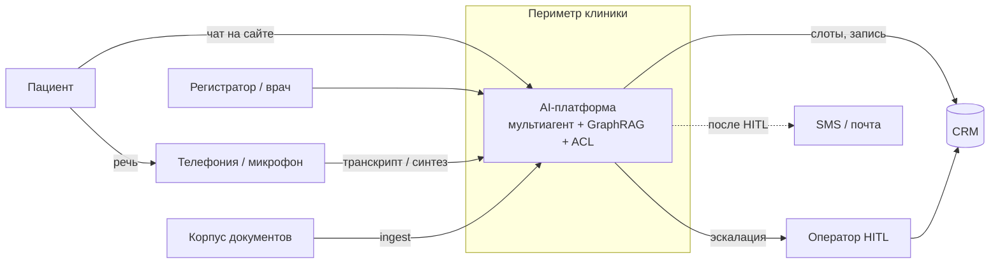


**Снаружи системы**

- пациент, персонал, оператор;
- исходные PDF клиники;
- промышленная CRM;
- SMS-провайдер.

**Внутри периметра**

- агенты, guardrails, ACL;
- Neo4j, Qdrant, сессии, аудит;
- vLLM, Whisper, Silero;
- секреты (Vault).


### C4 L2 — Container

Control Plane (агенты, API, ingest) и Data Plane (граф, векторы, модели, заглушка CRM, секреты). В MVP часть контейнеров — один процесс FastAPI; на схеме они разделены как в целевом размещении.

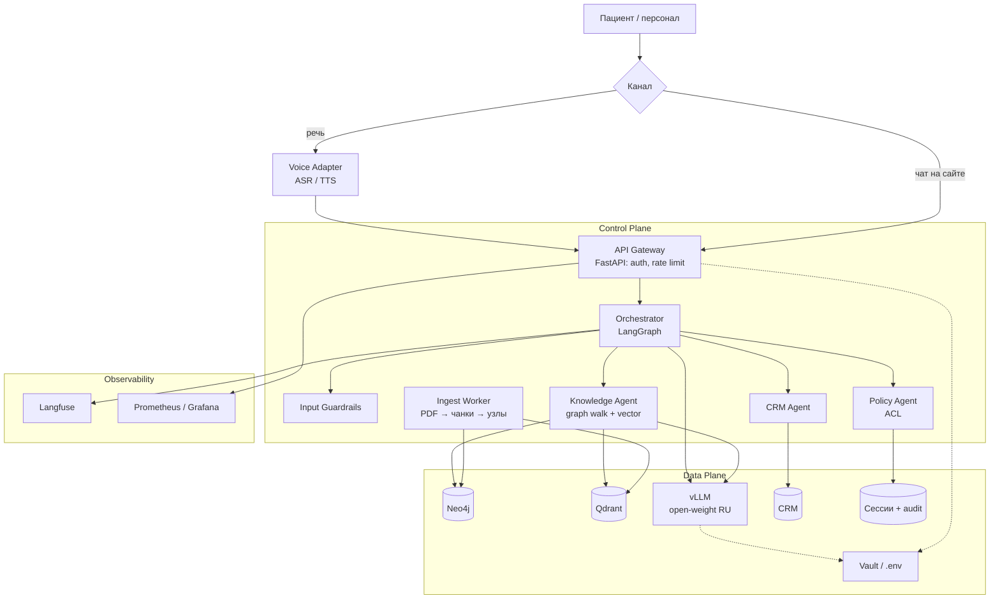


| Контейнер                | Плоскость     | Технология                | Назначение                                                          |
| ------------------------ | ------------- | ------------------------- | ------------------------------------------------------------------- |
| API Gateway              | Control       | FastAPI                   | Принимает запросы чата и голоса, передаёт `actor_id`                |
| Voice Adapter            | Control       | Whisper, WhisperX, Silero | Распознаёт речь и синтезирует ответ. Личность по голосу не определяет |
| Orchestrator             | Control       | LangGraph                 | Ведёт сессию: маршрут, повтор, отказ                                |
| Knowledge / CRM / Policy | Control       | тот же runtime            | Извлекает знания, вызывает CRM, применяет ACL                       |
| Ingest Worker            | Control       | Python job                | Загружает документы в граф и векторный индекс                       |
| Neo4j                    | Data          | Neo4j 5                   | Хранит онтологию услуг, врачей, филиалов                            |
| Qdrant                   | Data          | Qdrant                    | Хранит чанки с вектором и меткой ACL                                |
| vLLM                     | Data          | vLLM                      | Генерирует ответ внутри периметра                                   |
| CRM                      | Data          | внешняя система; в стенде — JSON | Учитывает карточки, слоты и визиты                             |
| Vault                    | Data          | Vault; в dev — `.env`     | Хранит секреты                                                      |
| Langfuse + Prom/Grafana  | Observability | self-host                 | Пишет трассировку вызовов и задержку                                |


Контур on-premise. Клиент vLLM обращается к внутреннему URL.

Контрольные потоки:

- ingest прайса в Qdrant и `Service` в Neo4j;
- вопрос «УЗИ на Лесной и подготовка» — обход графа;
- пациент 3 не видит направление пациента 1;
- пациент 1 видит карту пациента 2;
- голос идёт в тот же Orchestrator.

### C4 L3 — Component

Одно приложение: узлы графа состояний, не микросервис на каждый субагент.

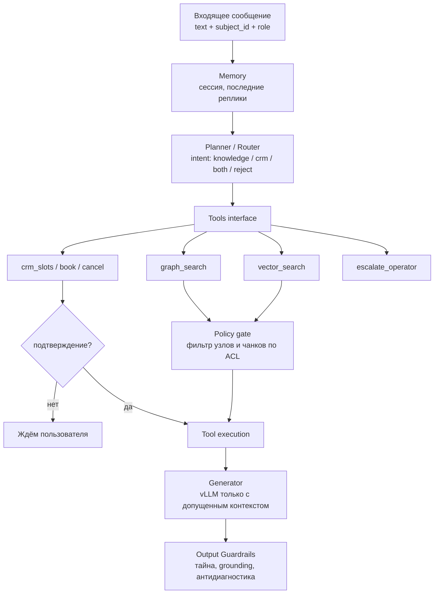


| Модуль            | Назначение |
| ----------------- | ---------- |
| Memory            | Хранит сессию: последние реплики, `actor_id`, выбранный `subject_id`, филиал и услугу. Состояние — в `sessions` и checkpoint LangGraph. Карточка пациента в промпт не подставляется. |
| Router            | Классифицирует намерение: знания, CRM, оба контура или отказ. Запрос на диагноз по симптомам направляет в отказ. Текст ответа не генерирует. |
| Tools             | Вызывает граф, векторный поиск и CRM по контракту (`graph_search`, `vector_search`, слоты, запись, отмена, эскалация). Доступ к карточкам — только через Policy. |
| Policy            | Пересекает извлечённые узлы и чанки с правами актора. В контекст модели передаёт только допущенные фрагменты. |
| Generator         | Формирует реплику по допущенному контексту через vLLM. Тот же текст уходит в чат и в TTS. |
| Output Guardrails | Проверяет исходящую реплику: нет чужого ФИО, нет диагноза, есть опора на допущенные узлы и чанки. При нарушении — отказ или эскалация. |

Отдельный векторный индекс «памяти пациента» не ведётся.

### Когнитивная схема

Чат на сайте использует тот же оркестратор, что и речевой канал.

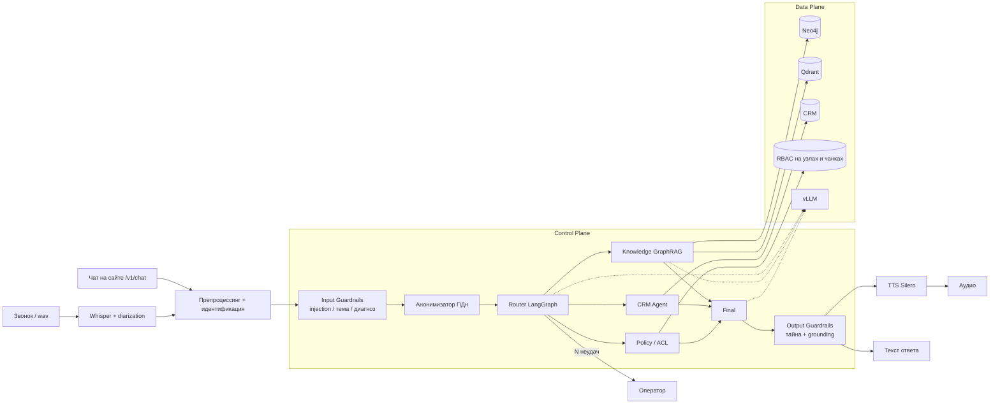


Цепочка голоса: аудио → VAD → диаризация при 2+ говорящих → faster-whisper large-v3-turbo → Input Guardrails → LangGraph → Output Guardrails → Silero TTS.

### Sequence

Пациент 1: «Хочу УЗИ на Лесной, как готовиться и есть ли окно послезавтра?»

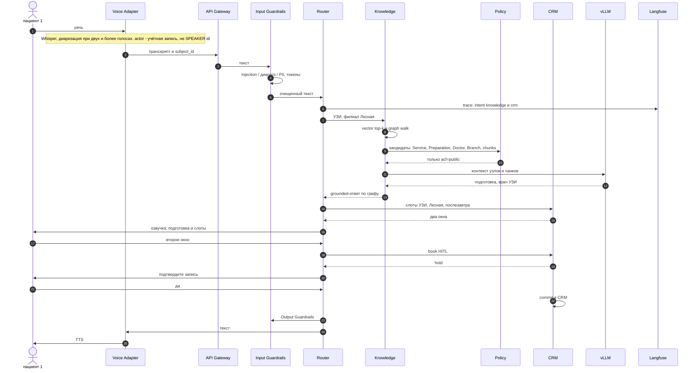


Пациент 3: «Какое направление у пациента 1 и когда УЗИ?»

- фильтры ввода не блокируют;
- Knowledge находит чанк;
- Policy исключает чужой `acl`;
- CRM по чужому `subject_id` не вызывается;
- ответ — отказ, в журнале фиксируется отказ доступа.

Пациент 1: «Когда УЗИ у сына и что за код N28.1?»

- субъект — пациент 2, по опеке;
- пациенту 2 меньше 15 лет — карта доступна;
- граф: USI-02 → подготовка → врач УЗИ → Лесная;
- `IcdCode:N28.1` — справочник, не диагноз.

Пациент 3 с текстом про «сына пациента 1» — опеки нет, отказ.

### Data Flow

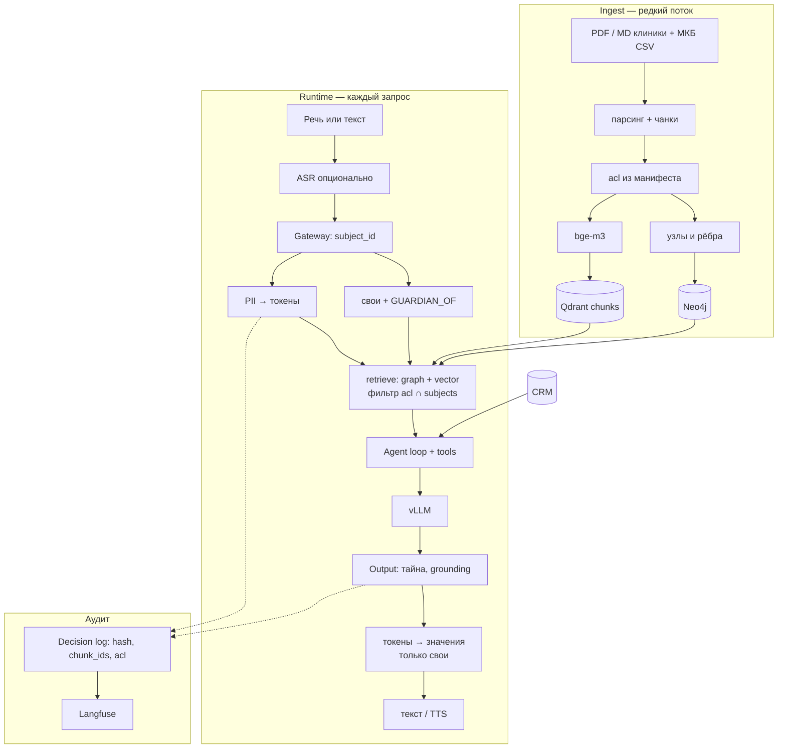


| Данные                   | Куда можно                   | Куда нельзя                  |
| ------------------------ | ---------------------------- | ---------------------------- |
| Публичный прайс, памятки | граф, векторы, промпт        | внешний API                  |
| Регламент регистратуры   | `acl=staff`                  | промпт пациента              |
| Направление пациента 1   | чанк карты 1                 | промпт пациента 3, открытые логи |
| Направление пациента 2   | пациент 1 по опеке           | промпт пациента 3                |
| Телефон, ФИО в реплике   | Token Vault на время запроса | сырьём в vLLM и Langfuse     |
| Аудио                    | диск контура / tmp, TTL      | облачный Speech API          |


### Deployment

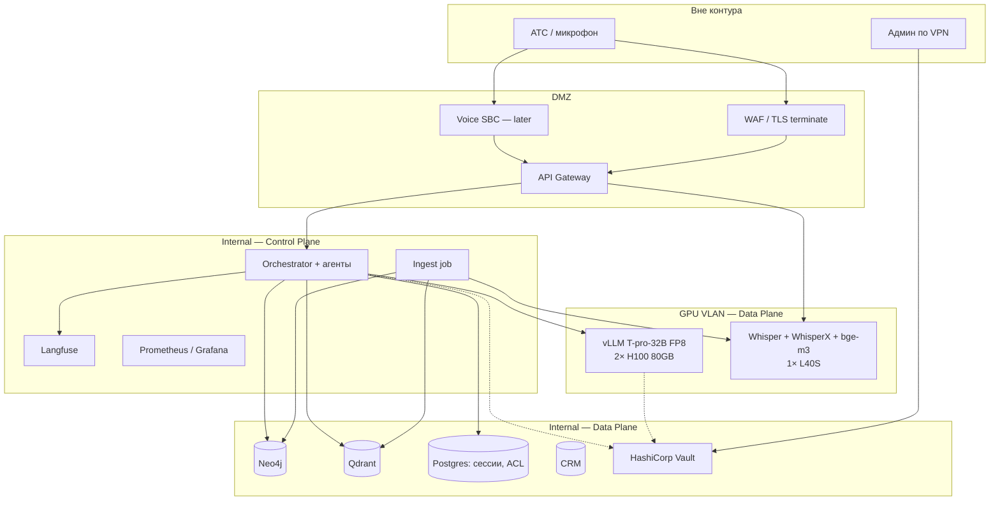


| Узел         | Роль                                              |
| ------------ | ------------------------------------------------- |
| 2× H100 80GB | vLLM FP8; второй GPU — резерв / реплика           |
| 1× L40S 48GB | Whisper, WhisperX, эмбеддинги                     |
| CPU-ноды     | API, LangGraph, Neo4j, Qdrant, Postgres, Langfuse |


| Зона     | Состав                    | Кто ходит                     |
| -------- | ------------------------- | ----------------------------- |
| DMZ      | TLS, gateway, будущий SBC | пациент / АТС                 |
| Internal | агенты, БД, наблюдаемость | gateway и админы              |
| GPU VLAN | vLLM, Whisper             | только Control Plane          |
| Vault    | пароли, токены            | JIT, не env на диске прод-нод |


Контур on-premise: GPU VLAN без маршрута в интернет, веса — с внутреннего зеркала. Сессии LangGraph — в Postgres, чтобы реплика подхватила HITL.

### Онтология и ER

Справочный граф. Карточки пациентов в него не входят.

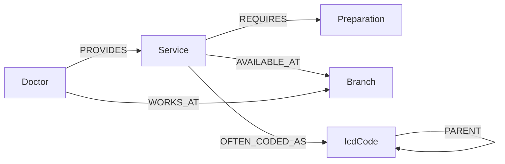


| Тип           | Пример                | acl    |
| ------------- | --------------------- | ------ |
| `Branch`      | Лесная, Южный         | public |
| `Doctor`      | врач УЗИ              | public |
| `Service`     | УЗИ ОБП, гастроскопия | public |
| `Preparation` | не есть 6 часов       | public |
| `IcdCode`     | K21.0                 | public |


`OFTEN_CODED_AS` — подсказка регистратору, не диагноз. Полный МКБ-10: [backend/data/kb/reference/mkb10-parsed.csv](backend/data/kb/reference/mkb10-parsed.csv). В проде — выгрузка НСИ Минздрава `1.2.643.5.1.13.13.11.1005`.

Учётные сущности (пользователь, опека, визит, сессия):

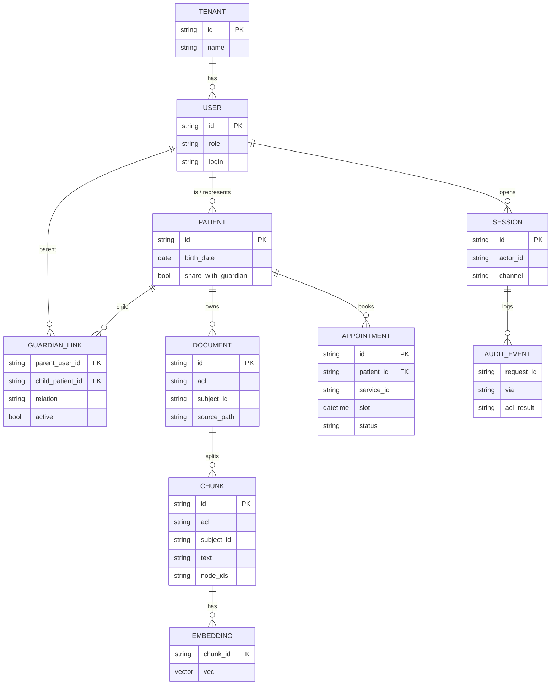


Qdrant: `vector + payload{chunk_id, acl, subject_id, doc_id}`. Фильтр ACL — до LLM.

---

## Нагрузка и стоимость

*Цены GPU — срез Москвы, сентябрь 2026, рубли с НДС ([ADR-0004](docs/adr/0004-gpu-budget.md)). Допущения расчёта, не прогон на H100.*

### Допущения


| Параметр                      | Значение                                             | Основание                         |
| ----------------------------- | ---------------------------------------------------- | --------------------------------- |
| Филиалы                       | 2 (Лесная, Южный)                                    | корпус                            |
| Рабочий день / год            | 10 ч, 250 дней                                       | регистратура                      |
| Типовой день                  | 500 голосовых сессий                                 | оценка входящей линии среднего МЦ |
| Доля пикового часа            | 20% дневного объёма                                  | 100 сессий/ч ≈ 1,7 сессии/мин     |
| Инженерный потолок            | 30 сессий/мин                                        | ADR-0004                          |
| Реплик пользователя на сессию | 3                                                    | запись / подготовка / уточнение   |
| Длительность реплики          | 5 с аудио                                            | бюджет ASR, ADR-0009              |
| Вызовов LLM на реплику        | 2 (маршрут или tool + ответ)                         | ADR-0008                          |
| p95 ASR                       | ≤ 1,0 с на реплику 5 с                               | RTF ≤ 0,2, L40S                   |
| Бюджет vLLM                   | 10 RPS текста, p95 ≤ 8 с                             | ADR-0005                          |
| Электроэнергия                | 12 ₽/кВт·ч                                           | коммерческий ориентир Москвы      |
| TDP                           | H100 PCIe 350 Вт; L40S 350 Вт; 2 платформы по 250 Вт | паспортные                        |
| Амортизация GPU-контура       | 36 месяцев, 24/7                                     | учёт капитальных затрат           |


`/v1/chat` — контур измерений. `/v1/voice` без GPU в прогон не входит. Метрики: p95 ответа, доля `acl_denied`, доля отказов в диагностике, число вызовов CRM.

### Типовой день и пик

500 сессий × 3 реплики = 1500 ASR и 3000 вызовов LLM в сутки. Пиковый час: 100 сессий × 3 = 300 реплик/ч = 5 реплик/мин.


| Узел                 | Формула                         | Типовой пик         | Потолок 30 сессий/мин  |
| -------------------- | ------------------------------- | ------------------- | ---------------------- |
| ASR, запросов/мин    | сессии/мин × 3                  | 5                   | 90                     |
| GPU-секунды ASR/мин  | запросы × 1,0 с                 | 5 с (загрузка ≈ 8%) | 90 с (коэффициент 1,5) |
| LLM, RPS             | сессии/мин × 3 × 2 / 60         | 0,17                | 3,0                    |
| Доля бюджета 10 RPS  |                                 | 2%                  | 30%                    |
| Одновременные сессии | λ × 120 с (средняя длина 2 мин) | ≈ 3                 | 60                     |


> [!WARNING]
> Потолок **30 сессий/мин** — инженерный запас, не штат двух филиалов. 90 ASR/мин при p95 = 1,0 с превышает ~60 последовательных слотов L40S. Штатный пик **1,7 сессии/мин**, запас около **15×**.

Второй H100 в расчёте пропускной способности не участвует: это горячий резерв / вторая реплика (ADR-0004). Один H100 покрывает 3 RPS при бюджете 10 RPS.

VRAM генерации (оценка, согласована с ADR-0004): веса T-pro 32B FP8 ≈ 32 ГБ; KV при контексте RAG 8–16k и batch до 8 ≈ 10–20 ГБ; итого 40–55 ГБ на карте 80 ГБ.

### Капитальные затраты

Середина диапазона закупок:


| Статья                          | Кол-во | Диапазон, млн ₽ | Середина, млн ₽ |
| ------------------------------- | ------ | --------------- | --------------- |
| H100 80GB                       | 2      | 5,0–8,0         | 6,5             |
| L40S 48GB                       | 1      | 0,8–1,5         | 1,15            |
| GPU-серверы                     | 2      | 1,2–2,0         | 1,6             |
| **Итого вычислительный контур** |        | **7,0–11,5**    | **9,25**        |


Сеть, СХД и Vault в сумму не входят. Снижение сметы: 1× H100 + 1× L40S ≈ 4–6 млн ₽ и аренда второго H100 на аварию (ADR-0004).

Амортизация середины: 9,25 млн ₽ / 36 мес = 257 тыс. ₽/мес ≈ 352 ₽/ч круглосуточно.

### Операционные затраты (ориентир)

Потребление: 2×350 + 350 + 2×250 = 1,45 кВт.

1,45 кВт × 12 ₽ × 24 × 365 ≈ 152 тыс. ₽/год.


| Статья                                                            | Оценка, тыс. ₽/год |
| ----------------------------------------------------------------- | ------------------ |
| Электроэнергия GPU-контура                                        | 152                |
| Сопровождение 0,3 ставки (ориентир ФОТ с налогами 1,8 млн/ставка) | 540                |
| **Итого OpEx без амортизации**                                    | **692**            |


Аренда вместо покупки (не принято для промышленного контура, ориентир): 2×H100 × 300 ₽/ч × 8760 + L40S × 120 ₽/ч × 8760 ≈ 6,3 млн ₽/год. Дороже амортизации собственной закупки при горизонте от трёх лет. Ограничение: срок поставки H100 — недели.

### Стоимость сессии

Типовой годовой объём: 500 × 250 = 125 000 сессий.


| Составляющая                    | ₽/сессия |
| ------------------------------- | -------- |
| Амортизация 9,25 млн ₽ / 3 года | 24,7     |
| Электроэнергия                  | 1,2      |
| Сопровождение 0,3 ставки        | 4,3      |
| **Итого замкнутый контур**      | **≈ 30** |


> **TCO типового объёма:** закупка **9,25 млн ₽** · **≈ 30 ₽/сессия** (125 000 сессий/год). Облачный Speech/LLM **отклонён** (ADR-0001): ориентир 4–8 ₽/сессия, данные покидают периметр.

## Метрики и проверка эффекта

Контуров измерения три, и смешивать их нельзя: у каждого свой источник данных, своя частота и своя реакция на провал.

1. **Онлайн** — живой трафик, каждый рабочий день. Источники: журнал сессии, решение доступа, CRM, оценка после закрытия цикла. Отвечает на вопрос, работает ли контур на людях.
2. **Офлайн** — фиксированный набор сценариев до выкладки и при смене графа, индекса или правила доступа. Живой трафик не нужен, результат воспроизводим.
3. **Правовой** — не измеряется процентами и не улучшается со временем: речь, карты и генерация не покидают периметр (152-ФЗ, 323-ФЗ ст. 13). Это условие эксплуатации, а не целевой показатель.

Цикл обращения: входящий звонок или чат → ответ или эскалация → при записи подтверждение → визит. Удовлетворённость снимают после закрытия цикла, не в середине диалога.

### Онлайн-метрики

Источник: журнал сессии, решение доступа, CRM, оценка после звонка. Контур измерений — `POST /v1/chat` и `POST /v1/voice`.


| Метрика | Что показывает | Как снимают |
| ------- | -------------- | ----------- |
| Доля без оператора | обращение закрыто ассистентом, эскалации нет | статус сессии |
| Среднее время линии (AHT) | сколько минут занимает цикл у оператора после эскалации или в контрольной группе | АТС / журнал смены |
| Время до записи | от первого намерения «записать» до commit в CRM | метки HITL |
| CSAT после цикла | удовлетворённость пациента по короткой шкале | опрос после визита: балл и причина; текст запроса во внешний сервис не уходит |
| Доля эскалации | перевод на человека | узел оператора |
| Доля отказа в диагнозе | запрос «что у меня» закрыт до модели | `reject_diagnosis` |
| Доля отказа в доступе | чужая карта не ушла в модель | журнал решения |
| p95 ответа | задержка `/v1/chat` | Prometheus |
| p95 ASR | реплика 5 с на L40S | Prometheus |


Целевые пороги инженерии не заменяют продуктовые: p95 `/v1/chat` ≤ 8 с при 10 RPS; p95 ASR ≤ 1,0 с. Продуктовые цели — в таблице первого года.

### Офлайн-метрики

Прогон до выкладки и при смене графа, индекса или правила доступа. Живой трафик не нужен.


| Метрика | Набор | Критерий |
| ------- | ----- | -------- |
| Доступ представителя и другого пациента | пациент 1, пациент 2, пациент 3 | представитель видит карту ребёнка; другой пациент получает отказ |
| Запрет диагноза | золотой набор симптомов | отказ до модели, узлы пустые |
| HITL записи | слот и подтверждение | commit только после «да» |
| Recall@10 и nDCG | подготовка, филиал, код МКБ | отчёт о качестве, ADR-0006 |
| Оба канала | `/v1/chat` и `/v1/voice` | один и тот же вердикт доступа |


Первые три строки работают как ворота релиза: не прошли — выкладки нет. Стенд без GPU закрывает их 15 автотестами (доступ, опека, диагноз, HITL, оба канала). Целевой контур добавляет Recall@10 и nDCG на bge-m3.

### A/B против живой линии

Принято. Часть входящих остаётся на операторе (контроль). Часть ведёт ассистент с эскалацией (испытание). Деление стабильно по учётке или номеру: один человек не прыгает между группами в одном периоде.

Не смешивают в одной реплике. Жалоба на самочувствие и запрос диагноза всегда уходят человеку. Запись в обеих группах подтверждается.

Длительность периода — 6–8 недель на одном контуре `clinic`. Первичная продуктовая метрика — доля без оператора при CSAT не ниже контроля (нехудшение). Страховочные: доля отказа в диагнозе, доля отказа в доступе, p95. При нарушении страховочного порога испытание останавливают, трафик возвращают на линию.

Ограничение: на стенде без GPU A/B не гоняют. Там фиксируют контракт доступа.

### Экономия линии

Допущения совпадают с разделом нагрузки: 500 сессий/день, 250 дней, ориентир ФОТ с налогами **1,8 млн ₽/ставка**, среднее время типового справочного звонка **4 мин**.


| Статья | Счёт | Ориентир на устойчивом режиме |
| ------ | ---- | ----------------------------- |
| Закрыто без оператора | 500 × 0,70 × 0,40 = 140 сессий/день | 140 × 4 мин = 9,3 ч/день ≈ **1,2 ставки** |
| Короче цикл после эскалации | −20% AHT на смешанных | ≈ **0,3 ставки** |
| Итого линия | | ≈ **1,5 ставки ≈ 2,7 млн ₽/год** |
| Сопровождение контура | уже в TCO | 0,3 ставки, 540 тыс. ₽/год |
| Чистая экономия ФОТ линии | 2,7 − 0,54 | ≈ **2,2 млн ₽/год** |


Ускорение цикла: целевое время до записи в испытании — не больше контроля и ниже медианы линии на справочных сценариях. Экономия операторов — это высвобожденные ставки линии, не сокращение врачей.

Риск: если доля без оператора останется ниже 25%, окупаемость сдвигается. Тогда оставляют контур как канал записи с HITL и не считают полные 1,5 ставки.

### Цели первого года


| Горизонт | Доля трафика в испытании | Доля без оператора в этом срезе | CSAT | Линия |
| -------- | ------------------------ | ------------------------------- | ---- | ----- |
| 3 месяца, A/B | 20% | ≥ 25% | не ниже контроля | фиксация базы |
| 6–8 недель после расширения | 50% | ≥ 35% | не ниже контроля | −0,7 ставки |
| Устойчивый режим | 70% первого ответа | ≥ 40% | не ниже контроля | ≈ −1,5 ставки |


Облачный Speech/LLM даёт 4–8 ₽/сессия и отклоняется: дешевле по железу, не проходит 152-ФЗ. Замкнутый контур — ≈ 30 ₽/сессия. Смысл закупки — законный канал и высвобождение линии, не гонка за минимальной ценой токена.

## Реестр требований


| ID      | Требование                                   | Решение                                      |
| ------- | -------------------------------------------- | -------------------------------------------- |
| R01     | Нет внешних API LLM и Speech                 | принято                                      |
| R02     | Своя карта; `GUARDIAN_OF`; отказ чужому      | принято                                      |
| R03     | Возраст < 15 лет или `share_with_guardian`   | принято                                      |
| R04     | Канал не влияет на ACL; актор не из тембра   | принято                                      |
| R05     | T-pro-it-2.1 через vLLM                      | ограничение стенда: grounded-порт            |
| R06     | 2× H100 + L40S                               | целевой контур                               |
| R07     | bge-m3; ACL до LLM                           | ограничение стенда: лексический индекс       |
| R08     | Neo4j + Qdrant + Postgres                    | ограничение стенда: порты в памяти + Compose |
| R09     | Машина состояний, не линейный скрипт         | принято                                      |
| R10     | HITL на запись и отмену                      | принято                                      |
| R11     | Whisper / Silero; АТС вне MVP                | ограничение стенда: транскрипт               |
| R12     | GraphRAG: онтология + чанки + МКБ-справочник | принято                                      |
| R13     | Запрет диагноза и подбора МКБ по симптомам   | принято                                      |
| R14–R15 | C4, Deployment, Data Flow, Sequence, ER      | принято, схемы ниже                          |
| R16     | Control Plane ≠ Data Plane                   | принято                                      |
| R17     | Телефония и CRM — порты                      | принято                                      |
| R18     | Трассировка ACL                              | принято                                      |
| R19     | Нагрузка через текст; расчёт ёмкости и TCO   | принято                                      |
| R20     | Карточки не в справочном графе               | принято                                      |
| R21     | Онлайн- и офлайн-метрики; A/B против линии   | принято                                      |


Порядок: спецификация → ingest → Policy → оркестратор → `/v1/chat` → `/v1/voice` → GPU-контур.

## Стенд

### Запуск

```text
cd backend
python -m venv .venv && source .venv/bin/activate
pip install -e ".[dev]"
pytest -q
uvicorn app.main:app --port 8080
```

Актор сессии передаётся заголовком `X-Actor-Id`. Значения — логины из [backend/data/crm/seed.json](backend/data/crm/seed.json): `patient:anna` (пациент 1), `patient:boris` (пациент 3), `staff:registrar` (регистратор). Неизвестный логин — `401`.

```text
curl -s localhost:8080/v1/chat \
  -H 'Content-Type: application/json' \
  -H 'X-Actor-Id: patient:anna' \
  -d '{"text":"Когда УЗИ у сына и что за код N28.1?"}'
```

- `**POST /v1/chat**` — автотесты и нагрузка;
- `**POST /v1/voice**` — тот же оркестратор, вход — транскрипт;
- `**GET /v1/audit/{request_id}**` — решение ACL;
- `**GET /health**` — проверка живости процесса.

Целевой Data Plane: `docker compose --profile data up -d` в [infra/](infra/README.md). На CPU-стенде API держит те же контракты в памяти.

### Порты стенда


| Слой           | Промышленный порт  | Стенд без GPU                                 |
| -------------- | ------------------ | --------------------------------------------- |
| Генерация      | vLLM, T-pro-it-2.1 | grounded-сборщик по допущенным узлам и чанкам |
| Эмбеддинги     | bge-m3             | лексический индекс, тот же payload ACL        |
| Граф           | Neo4j              | Cypher-seed в памяти                          |
| Сессии / опека | PostgreSQL         | сущности из `seed.json`                       |
| ASR / TTS      | Whisper / Silero   | вход — транскрипт; выход — текст для синтеза  |


Фаза GPU не блокирует проверку ACL и GraphRAG. Стенд: **15 тестов** (ACL, ReBAC, диагностика, HITL, оба канала).

### Сценарий нагрузки для прогона


| Роль      | `X-Actor-Id`       | Формулировка              | Ожидание            |
| --------- | ------------------ | ------------------------- | ------------------- |
| пациент 1 | `patient:anna`     | УЗИ пациента 2, код N28.1 | опека, ответ        |
| пациент 3 | `patient:boris`    | направление пациента 1    | отказ доступа       |
| регистратор | `staff:registrar` | скидка сотрудникам        | `STAFF30`           |
| любая     | любой логин        | симптомы «что это»        | отказ в диагностике |


Критерий стенда без GPU: 15 автотестов. Критерий целевого контура: p95 `/v1/chat` ≤ 8 с при 10 RPS на H100; p95 ASR реплики 5 с ≤ 1,0 с на L40S.

### Локальный прогон

Дата: **2026-09-12**. Хост: macOS, `uvicorn` на `127.0.0.1:8080`. GPU и vLLM не запускались. Генератор — grounded, граф — Cypher-seed в памяти, индекс — лексический. Автотесты: **15 passed**.

**Пациент 1.** «Когда УЗИ у сына и что за код N28.1?»

- намерение — справка, субъект — пациент 2, путь — опека, отказа нет;
- в тексте: N28.1 «Киста почки, приобретенная (не диагноз)», USI-02 3000 ₽, врач УЗИ, подготовка 5 ч, филиал Лесная, направление на 18.09.2026;
- чанк карты пациента 2.

**Пациент 3.** «Какое направление у пациента 1?»

```text
Эти сведения закрыты политикой доступа. Могу помочь с публичными услугами или вашей картой.
```

- отказ доступа; чанк направления пациента 1 в ответ не вошёл.

**Пациент 1.** «Болит живот, что это за диагноз?»

```text
Не могу ставить диагноз или подбирать код МКБ по симптомам. Могу записать к врачу клиники или прочитать код из уже выданного направления.
```

- `intent=reject_diagnosis`; узлы и чанки пустые.

Опора ответа пациента 1 по пациенту 2. Карточка пациента 2 в справочный граф не входит.

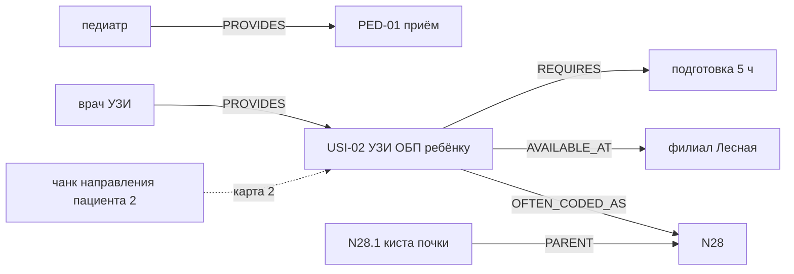

Проверка для пациента 3: открытые узлы допускаются, чанк карты 1 отсекается.

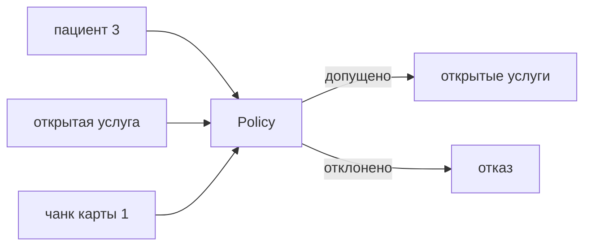

Лексический индекс на этом запуске добавляет соседние коды МКБ и строки прайса в `node_ids`. На решение ACL и отказ в диагностике это не влияет.

## Презентация

Слайды — [presentation.html](presentation.html), опубликованы на https://divisee.github.io/otus-ai-architect/. Схемы — [slides/](slides/), исходники Mermaid лежат рядом с SVG. Каждый слайд опирается на раздел этого документа; расшифровки сокращений идут строкой внизу слайда и повторяют [GLOSSARY.md](GLOSSARY.md).


| Слайды | Тема | Раздел README |
| ------ | ---- | ------------- |
| 1–2 | обложка, автор работы | заголовок работы, [Владение](#владение) |
| 3 | ценность для клиники | [Экономия линии](#экономия-линии), [Цели первого года](#цели-первого-года) |
| 4 | содержание | [Содержание](#содержание) |
| 5 | цель и задачи проекта | [Реестр требований](#реестр-требований) |
| 6 | рамка контура и границы объёма | [Объём системы](#объём-системы) |
| 7–8 | четыре места контура, девять ADR | [Стек](#стек) |
| 9–11 | C4 L1, L2, L3 | [Схемы](#схемы) |
| 12–13 | каналы и четыре ручки API | [Внешние порты](#внешние-порты), [Стенд](#стенд) |
| 14 | когнитивная схема пути реплики | [Когнитивная схема](#когнитивная-схема) |
| 15–18 | правило Policy, три пациента, запись, отказ | [Доступ](#доступ), [Sequence](#sequence) |
| 19–22 | онтология, опора ответа, ER, потоки данных | [Онтология и ER](#онтология-и-ер), [Data Flow](#data-flow) |
| 23 | четыре зоны сети | [Deployment](#deployment) |
| 24 | ёмкость, TCO, локальный прогон | [Нагрузка и стоимость](#нагрузка-и-стоимость), [Локальный прогон](#локальный-прогон) |
| 25–29 | контуры измерения, онлайн, офлайн, A/B, цели года | [Метрики и проверка эффекта](#метрики-и-проверка-эффекта) |
| 30–35 | выводы, итог, контакты | весь документ |


## Глоссарий терминов и сокращений

Расшифровки — [GLOSSARY.md](GLOSSARY.md).
