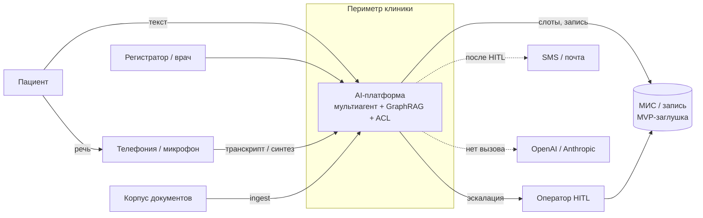
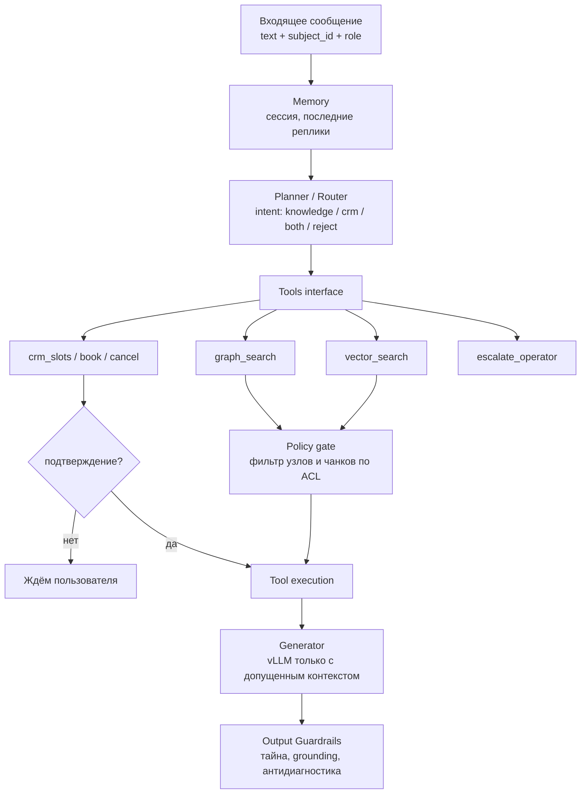
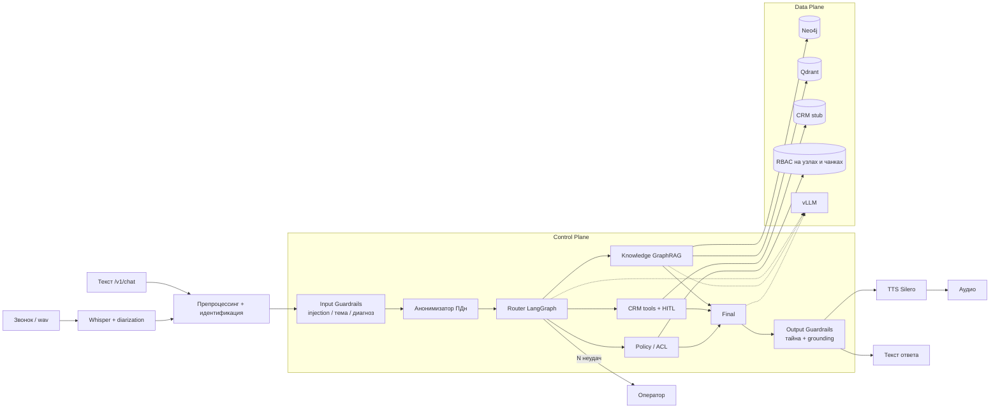
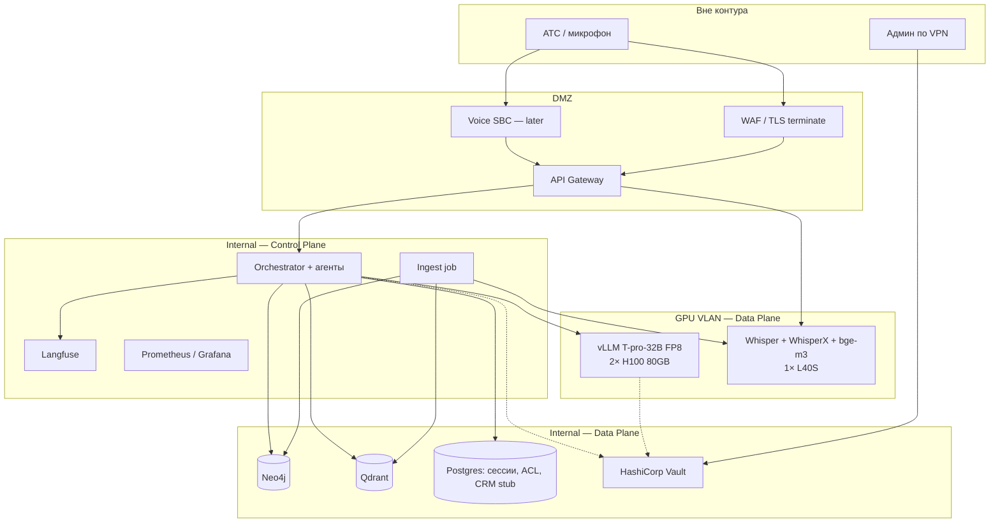
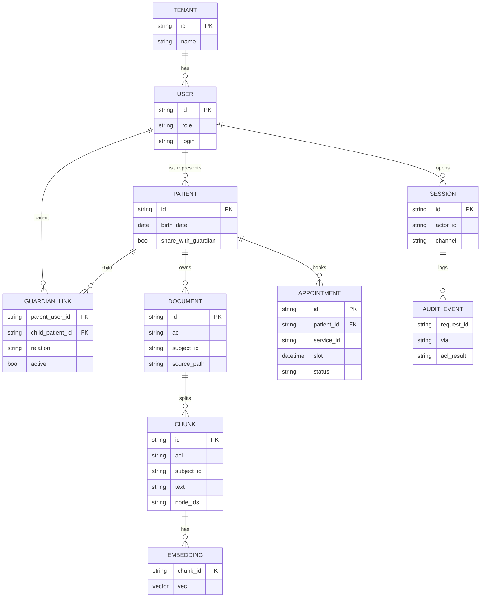

# Платформа голосового ИИ-ассистента МЦ «Северная линия»

On-premise мультиагентный ассистент медицинского центра: GraphRAG, разграничение доступа, соблюдение 152-ФЗ и врачебной тайны.

Пациент обращается голосом или текстом. Система не ставит диагноз. Ответы опираются на связанные знания клиники (услуги, врачи, подготовка, филиалы) и инструменты записи. Голосовой канал (ASR → оркестратор → TTS) использует тот же граф состояний, что и текстовый API. Вычислительный контур замкнут: внешние API LLM и STT не используются.

Обоснование выбора стека — папка [`docs/adr/`](docs/adr/README.md). Код Control Plane — [`backend/`](backend/README.md).

- [Состав репозитория](#состав-репозитория)
- [Рамка MVP](#рамка-mvp)
- [Роли](#роли)
- [Стек](#стек)
- [Доступ](#доступ)
- [Внешние порты](#внешние-порты)
- [Стенд](#стенд)
- [Нагрузка](#нагрузка)
- [Реестр требований](#реестр-требований)
- [Схемы](#схемы)

## Состав репозитория

| Каталог | Содержание |
|---------|------------|
| этот файл | описание системы, рамка, стенд, все схемы |
| [`docs/adr/`](docs/adr/README.md) | решения по стеку (0001–0009) |
| [`backend/`](backend/README.md) | ingest, Policy, оркестратор, API, корпус, тесты |
| [`infra/`](infra/README.md) | Compose целевого Data Plane |

## Рамка MVP

| Сценарий | Назначение |
|----------|------------|
| Ответы по услугам, врачам, филиалам, подготовке | извлечение из графа и чанков, не из весов модели |
| Запись, перенос, отмена визита с подтверждением | HITL |
| Изоляция карточек; законный представитель видит карту ребёнка | RBAC и ReBAC, ADR-0002 |
| Загрузка документов клиники в граф и индекс | конвейер знаний |
| Речевой канал: ASR → тот же оркестратор → TTS | ADR-0009 |
| Отказ и передача оператору без опоры в графе | ограничение галлюцинаций |
| Трассировка решения ACL | `/v1/audit/{request_id}` |

Онтология: `Doctor`, `Service`, `Preparation`, `Branch`, `IcdCode`. Справочник МКБ-10 не используется для постановки диагноза.

Вне объёма: диагноз и подбор МКБ по симптомам; промышленная МИС (в стенде — заглушка Анна / Михаил / Борис); обучение LLM и ASR; отдельный чат на сайте; промышленная АТС (вход — микрофон, wav или транскрипт); штатный blue/green и ночная полная переиндексация.

Ограничения контура: нет внешних API генеративных моделей; поиск включает граф, не только векторы; Control Plane отделён от Data Plane; оркестрация — машина состояний (ADR-0008).

## Роли

| Идентификатор | Права |
|---------------|--------|
| `patient:anna` | своя карта и карта сына (`GUARDIAN_OF`) |
| `patient:misha` | учётной записи нет; запросы выполняет представитель |
| `patient:boris` | только своя карта |
| `staff:registrar` | материалы `public` и `staff` |
| оператор | эскалация при низкой уверенности |

## Стек

| Слой | Решение | ADR |
|------|---------|-----|
| Контур | self-hosted | [0001](docs/adr/0001-closed-contour.md) |
| Доступ | RBAC, `GUARDIAN_OF` | [0002](docs/adr/0002-acl-rebac.md) |
| LLM | T-pro-it-2.1 (база Qwen3-32B) | [0003](docs/adr/0003-llm-t-pro.md) |
| GPU | 2× H100 FP8, 1× L40S | [0004](docs/adr/0004-gpu-budget.md) |
| Инференс LLM | vLLM | [0005](docs/adr/0005-inference-engine.md) |
| Эмбеддинги | bge-m3, reranker | [0006](docs/adr/0006-embeddings.md) |
| GraphRAG | Neo4j, Qdrant | [0007](docs/adr/0007-graph-and-vectors.md) |
| Оркестрация | LangGraph | [0008](docs/adr/0008-orchestration.md) |
| ASR, диаризация, TTS | Whisper large-v3-turbo, WhisperX, Silero | [0009](docs/adr/0009-voice-gigaam-diarization.md) |

Control Plane — API и агенты. Data Plane — граф, векторы, модели, заглушка МИС.

## Доступ

Ресурс (чанк, узел, визит) имеет `acl` и `subject_id`. Доступ при одном из условий (ADR-0002, 323-ФЗ ст. 13, 152-ФЗ):

1. `acl = public`;
2. `acl = staff` и роль актора — `staff`;
3. `subject_id = actor.id`;
4. активная связь `actor GUARDIAN_OF subject` и возраст субъекта менее 15 лет либо `share_with_guardian = true`.

Иначе фрагмент в контекст модели не передаётся. Канал (текст или голос) на решение не влияет. `actor_id` берётся из учётной записи / АОН, не из `SPEAKER_*`.

Карточки пациентов в справочный граф целиком не кладутся: ПДн живут в МИС и в чанках с ACL.

## Внешние порты

Телефония и учёт визитов — внешние системы. Оркестратор зависит от контракта, не от вендора АТС или sales-CRM. AmoCRM не используется: клинике нужна МИС / расписание.

Телефония: `call_id`, `caller_id` → `actor_id`, `audio` / `transcript`, `transfer_operator`. SIP/SBC — целевой адаптер. В MVP вход — микрофон, wav или транскрипт.

МИС: `list_slots`, `book` / `reschedule` / `cancel`, `get_patient` после Policy. Заглушка — [`backend/data/crm/seed.json`](backend/data/crm/seed.json).

## Стенд

```text
cd backend
python -m venv .venv && source .venv/bin/activate
pip install -e ".[dev]"
pytest -q
uvicorn app.main:app --port 8080
```

Заголовок `X-Actor-Id`: `patient:anna`, `patient:boris`, `staff:registrar`.

```text
curl -s localhost:8080/v1/chat \
  -H 'Content-Type: application/json' \
  -H 'X-Actor-Id: patient:anna' \
  -d '{"text":"Когда УЗИ у сына и что за код N28.1?"}'
```

`POST /v1/chat` — автотесты и нагрузка. `POST /v1/voice` — тот же оркестратор, вход — транскрипт. `GET /v1/audit/{request_id}` — решение ACL.

Целевой Data Plane: `docker compose --profile data up -d` в [`infra/`](infra/README.md). На CPU-стенде API держит те же контракты в памяти.

| Слой | Промышленный порт | Стенд без GPU |
|------|-------------------|---------------|
| Генерация | vLLM, T-pro-it-2.1 | grounded-сборщик по допущенным узлам и чанкам |
| Эмбеддинги | bge-m3 | лексический индекс, тот же payload ACL |
| Граф | Neo4j | Cypher-seed в памяти |
| Сессии / опека | PostgreSQL | сущности из `seed.json` |
| ASR / TTS | Whisper / Silero | вход — транскрипт; выход — текст для синтеза |

Фаза GPU (vLLM, Whisper, процессы Neo4j/Qdrant) не блокирует проверку ACL и GraphRAG. Стенд: 15 тестов (ACL, ReBAC, диагностика, HITL, оба канала).

## Нагрузка

Целевой контур — до 30 голосовых обращений в минуту. ASR и генерация — на разных ускорителях.

| Канал | Назначение |
|-------|------------|
| `/v1/chat` | оркестратор, retrieve, Policy, генерация |
| `/v1/voice` | адаптер; без GPU в прогон не входит |

Метрики: p95 `/v1/chat`, доля `acl_denied`, доля отказов в диагностике, вызовы CRM. Бюджет ASR: p95 реплики 5 с — не более 1,0 с на L40S (ADR-0009).

## Реестр требований

| ID | Требование | Решение |
|----|------------|---------|
| R01 | Нет внешних API LLM и Speech | принято |
| R02 | Своя карта; `GUARDIAN_OF`; отказ чужому | принято |
| R03 | Возраст < 15 лет или `share_with_guardian` | принято |
| R04 | Канал не влияет на ACL; актор не из тембра | принято |
| R05 | T-pro-it-2.1 через vLLM | ограничение стенда: grounded-порт |
| R06 | 2× H100 + L40S | целевой контур |
| R07 | bge-m3; ACL до LLM | ограничение стенда: лексический индекс |
| R08 | Neo4j + Qdrant + Postgres | ограничение стенда: порты в памяти + Compose |
| R09 | Машина состояний, не линейный скрипт | принято |
| R10 | HITL на запись и отмену | принято |
| R11 | Whisper / Silero; АТС вне MVP | ограничение стенда: транскрипт |
| R12 | GraphRAG: онтология + чанки + МКБ-справочник | принято |
| R13 | Запрет диагноза и подбора МКБ по симптомам | принято |
| R14–R15 | C4, Deployment, Data Flow, Sequence, ER | принято, схемы ниже |
| R16 | Control Plane ≠ Data Plane | принято |
| R17 | Телефония и МИС — порты | принято |
| R18 | Трассировка ACL | принято |
| R19 | Нагрузка через текст | принято |
| R20 | Карточки не в справочном графе | принято |

Порядок: спецификация → ingest → Policy → оркестратор → `/v1/chat` → `/v1/voice` → GPU-контур.

## Схемы

### C4 L1 — Context

Платформа внутри периметра. Персональные данные и текст запросов за периметр не передаются.

Синтаксис `C4Context` в превью Markdown и на GitHub не рендерится: нужен экспериментальный плагин. Ниже тот же L1 обычным `flowchart`.



| Снаружи системы | Внутри периметра |
|-----------------|------------------|
| Пациент, персонал, оператор | Агенты, guardrails, ACL |
| Исходные PDF клиники | Neo4j, Qdrant, сессии, аудит |
| Настоящая МИС (позже) | vLLM, Whisper, Silero |
| SMS-провайдер (позже) | секреты (Vault) |

### C4 L2 — Container

Control Plane (агенты, API, ingest) и Data Plane (граф, векторы, модели, заглушка МИС, секреты). В MVP часть контейнеров — один процесс FastAPI; на схеме они разделены как в целевом размещении.


| Контейнер | Плоскость | Технология | Ответственность |
|-----------|-----------|------------|-----------------|
| API Gateway | Control | FastAPI | текст и транскрипт, `patient:anna` / `staff:…` |
| Voice Adapter | Control | Whisper, WhisperX, Silero | канал; актор не по тембру |
| Orchestrator | Control | LangGraph | состояние, retry, fallback |
| Knowledge / CRM / Policy | Control | тот же runtime | знания, запись, права |
| Ingest Worker | Control | Python job | PDF/MD → чанки, узлы, рёбра |
| Neo4j | Data | Neo4j 5 | онтология |
| Qdrant | Data | Qdrant | векторы с payload ACL |
| vLLM | Data | vLLM | генерация внутри периметра |
| CRM stub | Data | JSON | слоты и визиты |
| Vault | Data | Vault; в dev — `.env` | ключи |
| Langfuse + Prom/Grafana | Observability | self-host | трейсы, latency |

Из Data Plane нет вызова OpenAI/Anthropic. Клиент vLLM смотрит на внутренний URL.

Контрольные потоки: ingest прайса в Qdrant и `Service` в Neo4j; сложный вопрос «УЗИ на Лесной и подготовка» — обход графа; Борис не видит направление Анны; Анна видит карту Миши; голос — тот же Orchestrator.

### C4 L3 — Component

Одно приложение: узлы графа состояний, не микросервис на каждый субагент.



| Модуль | Делает | Не делает |
|--------|--------|-----------|
| Memory | окно диалога, `subject_id`, филиал/услуга | медкарту в промпте |
| Router | knowledge и/или CRM; отказ на диагностику | ответ из весов модели |
| Tools | контракты к графу, векторам, МИС | SQL в обход ACL |
| Policy | retrieved ∩ `acl` | «модель сама не расскажет» |
| Generator | текст / реплика для TTS | внешний API |
| Output Guardrails | нет чужого ФИО, нет диагноза, есть опора | косметический фильтр |

Memory — `sessions` и checkpoint. Отдельная векторная «память пациента» не используется.

### Когнитивная схема

Речевой канал использует тот же оркестратор.



Цепочка голоса: аудио → VAD → диаризация при 2+ говорящих → faster-whisper large-v3-turbo → Input Guardrails → LangGraph → Output Guardrails → Silero TTS.

### Sequence

Анна: «Хочу УЗИ на Лесной, как готовиться и есть ли окно послезавтра?»

```mermaid
sequenceDiagram
    autonumber
    actor A as Анна
    participant VA as Voice Adapter
    participant GW as API Gateway
    participant IG as Input Guardrails
    participant R as Router
    participant K as Knowledge
    participant P as Policy
    participant C as CRM tools
    participant LLM as vLLM
    participant O as Langfuse

    A->>VA: речь
    Note over VA: Whisper; диаризация при 2+ голосах<br/>actor — учётная запись, не SPEAKER_id
    VA->>GW: транскрипт + subject_id
    GW->>IG: текст
    IG->>IG: injection / диагноз / PII → токены
    IG->>R: очищенный текст
    R->>O: trace: intent=knowledge+crm
    R->>K: УЗИ + филиал Лесная
    K->>K: vector top-k + graph walk
    K->>P: кандидаты: Service, Preparation, Doctor, Branch, chunks
    P-->>K: только acl=public
    K->>LLM: контекст узлов и чанков
    LLM-->>K: подготовка + врач Морозова
    K-->>R: grounded-ответ по графу
    R->>C: слоты УЗИ, Лесная, послезавтра
    C-->>R: два окна
    R->>A: озвучка: подготовка + слоты
    A->>R: второе окно
    R->>C: book HITL
    C-->>R: hold
    R->>A: подтвердите запись
    A->>R: да
    C->>C: commit в CRM stub
    R->>IG: Output Guardrails
    R->>VA: текст
    VA->>A: TTS
```

Борис: «Какое направление у Анны Соколовой и когда её УЗИ?» — фильтры ввода не блокируют; Knowledge находит чанк; Policy исключает чужой `acl`; CRM по чужому `subject_id` не вызывается; ответ — отказ, в трассировке `acl_denied`.

Анна: «Когда УЗИ у сына и что за код N28.1?» — `subject=misha` по `GUARDIAN_OF`; Мише 8 лет — карта доступна; граф: USI-02 → подготовка → Морозова → Лесная; `IcdCode:N28.1` — справочник, не диагноз. Борис с текстом про «сына Соколовой» — нет ребра, отказ.

### Data Flow


| Данные | Куда можно | Куда нельзя |
|--------|------------|-------------|
| Публичный прайс, памятки | граф, векторы, промпт | внешний API |
| Регламент регистратуры | `acl=staff` | промпт пациента |
| Направление Анны | чанк `patient:anna` | промпт Бориса, открытые логи |
| Направление Миши | Анна как `GUARDIAN_OF` | промпт Бориса |
| Телефон, ФИО в реплике | Token Vault на время запроса | сырьём в vLLM и Langfuse |
| Аудио | диск контура / tmp, TTL | облачный Speech API |

### Deployment



| Узел | Роль |
|------|------|
| 2× H100 80GB | vLLM FP8; второй GPU — резерв / реплика |
| 1× L40S 48GB | Whisper, WhisperX, эмбеддинги |
| CPU-ноды | API, LangGraph, Neo4j, Qdrant, Postgres, Langfuse |

| Зона | Состав | Кто ходит |
|------|--------|-----------|
| DMZ | TLS, gateway, будущий SBC | пациент / АТС |
| Internal | агенты, БД, наблюдаемость | gateway и админы |
| GPU VLAN | vLLM, Whisper | только Control Plane |
| Vault | пароли, токены | JIT, не env на диске прод-нод |

Из GPU VLAN нет маршрута в интернет. Веса — внутреннее зеркало. OpenAI/Anthropic не резолвятся. Сессии LangGraph — в Postgres, чтобы реплика подхватила HITL.

### Онтология и ER

```
(:Doctor)-[:PROVIDES]->(:Service)
(:Service)-[:REQUIRES]->(:Preparation)
(:Service)-[:AVAILABLE_AT]->(:Branch)
(:Doctor)-[:WORKS_AT]->(:Branch)
(:Service)-[:OFTEN_CODED_AS]->(:IcdCode)
(:IcdCode)-[:PARENT]->(:IcdCode)
```

| Тип | Пример | acl |
|-----|--------|-----|
| `Branch` | Лесная, Южный | public |
| `Doctor` | Морозова А.П., УЗИ | public |
| `Service` | УЗИ ОБП, гастроскопия | public |
| `Preparation` | не есть 6 часов | public |
| `IcdCode` | K21.0 | public |

`OFTEN_CODED_AS` — подсказка регистратору, не диагноз. Полный МКБ-10: [`backend/data/kb/reference/mkb10-parsed.csv`](backend/data/kb/reference/mkb10-parsed.csv). В проде — выгрузка НСИ Минздрава `1.2.643.5.1.13.13.11.1005`. Симптомы («болит живот, что это») — отказ, без обхода МКБ как «подбери код».



Qdrant: `vector + payload{chunk_id, acl, subject_id, doc_id}`. Фильтр ACL — до LLM.
