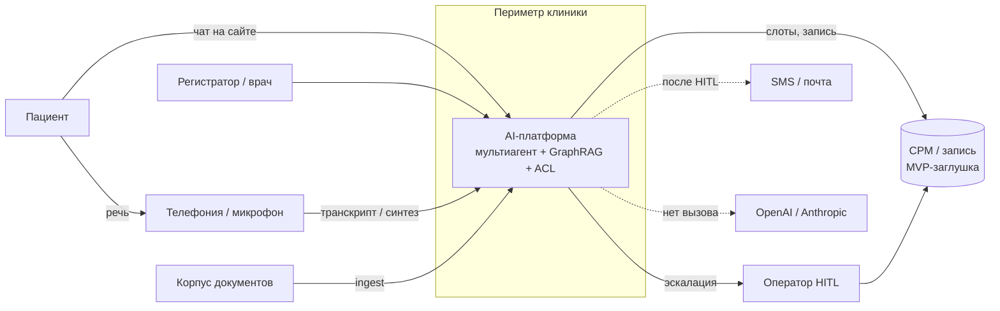
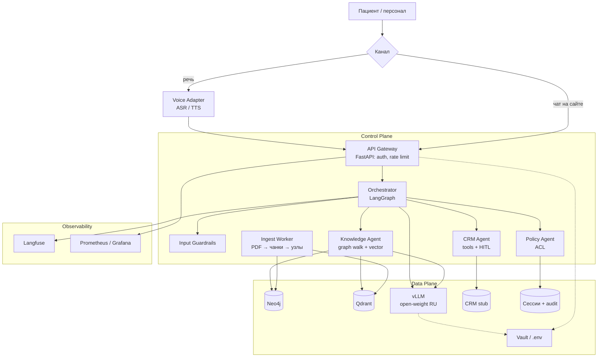
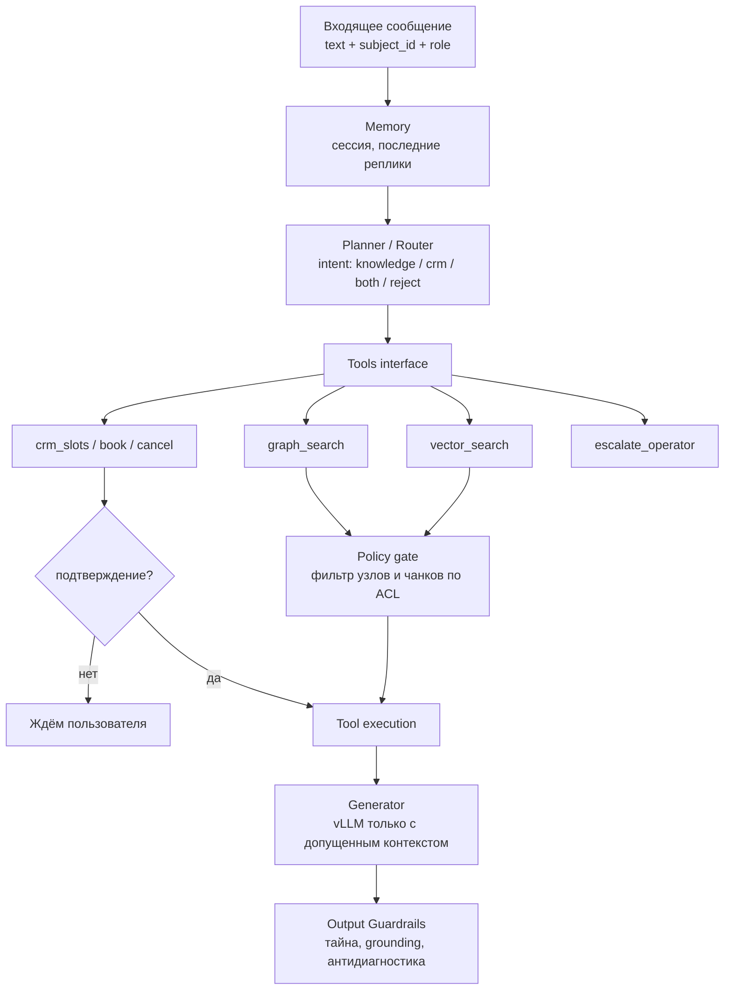
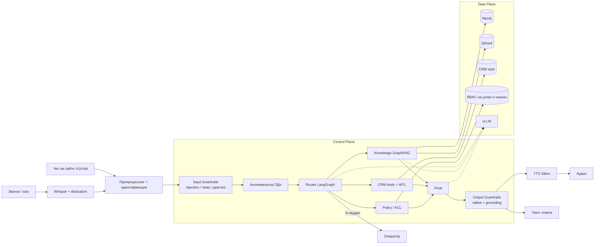
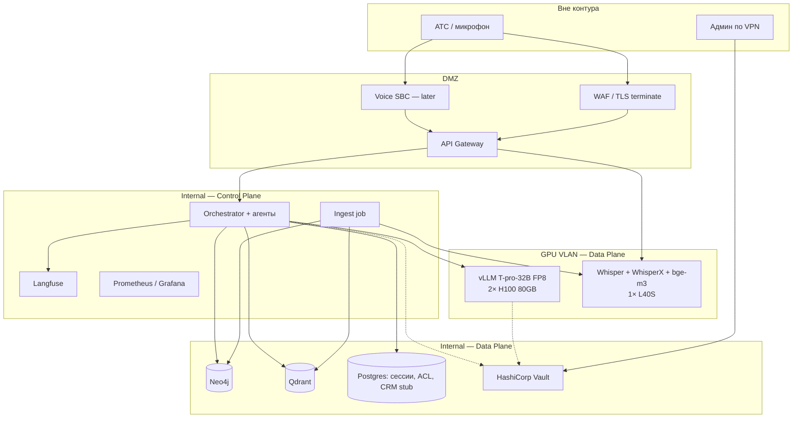
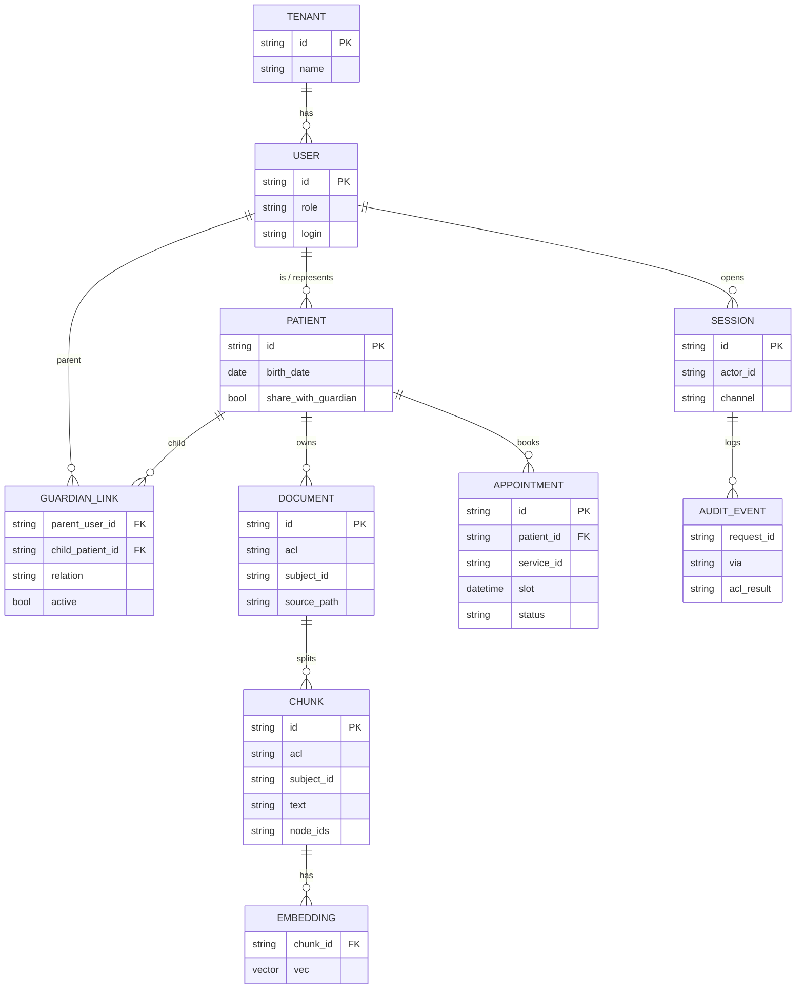

# Проектирование и реализация on-premise мультиагентного голосового ИИ-ассистента медицинского центра с GraphRAG, обеспечением врачебной тайны и соблюдением 152-ФЗ

Система — голосовой ассистент **типового медицинского центра**. Пациент или регистратор запрашивает сведения об услугах, врачах, филиалах, подготовке к исследованиям и записи на приём. Ответ формируется из графа знаний и документов клиники (**GraphRAG**). Запись, перенос и отмена выполняются через инструменты СРМ с подтверждением (**HITL**).

Контур **замкнут**: речь, генерация и поиск выполняются внутри периметра. **Внешние API LLM и STT не используются** — так соблюдаются **152-ФЗ** и врачебная тайна. Один пациент не видит карту другого; законный представитель видит карту ребёнка по связи `GUARDIAN_OF`. Канал на права **не влияет**.

> **Система не ставит диагноз** и не подбирает код МКБ по симптомам. Основной канал — **речь** (ADR-0009). Чат на сайте вызывает тот же граф состояний (`POST /v1/chat`). ASR и TTS — адаптер канала, не отдельное решение.

---

## Содержание

1. [Владение](#владение)
2. [Объём системы](#объём-системы)
  1. [Что входит](#что-входит)
  2. [Ограничения](#ограничения)
  3. [Принципы контура](#принципы-контура)
3. [Роли](#роли)
4. [Стек](#стек)
5. [Доступ](#доступ)
  1. [Правило Policy](#правило-policy)
  2. [Карточки и граф](#карточки-и-граф)
6. [Внешние порты](#внешние-порты)
  1. [Телефония](#телефония)
  2. [СРМ](#срм)
7. [Схемы](#схемы)
  1. [C4 L1 — Context](#c4-l1--context)
  2. [C4 L2 — Container](#c4-l2--container)
  3. [C4 L3 — Component](#c4-l3--component)
  4. [Когнитивная схема](#когнитивная-схема)
  5. [Sequence](#sequence)
  6. [Data Flow](#data-flow)
  7. [Deployment](#deployment)
  8. [Онтология и ER](#онтология-и-er)
8. [Нагрузка и стоимость](#нагрузка-и-стоимость)
  1. [Допущения](#допущения)
  2. [Типовой день и пик](#типовой-день-и-пик)
  3. [Капитальные затраты](#капитальные-затраты)
  4. [Операционные затраты](#операционные-затраты-ориентир)
  5. [Стоимость сессии](#стоимость-сессии)
9. [Реестр требований](#реестр-требований)
10. [Стенд](#стенд)
  1. [Запуск](#запуск)
  2. [Порты стенда](#порты-стенда)
  3. [Сценарий нагрузки для прогона](#сценарий-нагрузки-для-прогона)
11. [Глоссарий терминов и сокращений](#глоссарий-терминов-и-сокращений)

## Владение

Идентификатор контура: `clinic-voice-graphrag`. Дата фиксации: **2026-09-12**. Обновлять при смене модели, Policy или состава GPU.

> Один человек закрывает все роли контура: [divisee](https://github.com/divisee).


| Роль                          | Ответственный                         | Должность                              |
| ----------------------------- | ------------------------------------- | -------------------------------------- |
| **Владелец (ML)**             | [divisee](https://github.com/divisee) | ведущий ML-инженер                     |
| **Владелец (бизнес)**         | [divisee](https://github.com/divisee) | руководитель цифровых сервисов клиники |
| **Архитектор**                | [divisee](https://github.com/divisee) | архитектор AI-платформы                |
| **Владелец данных и 152-ФЗ**  | [divisee](https://github.com/divisee) | ответственный за обработку ПДн         |
| **Владелец ACL / Policy**     | [divisee](https://github.com/divisee) | инженер информационной безопасности    |
| **Владелец инференса (vLLM)** | [divisee](https://github.com/divisee) | инженер инференса                      |
| **Владелец речевого канала**  | [divisee](https://github.com/divisee) | инженер речевых технологий             |
| **Владелец затрат (FinOps)**  | [divisee](https://github.com/divisee) | владелец вычислительного бюджета       |
| **Дежурный по инцидентам**    | [divisee](https://github.com/divisee) | инженер сопровождения                  |


| Контур                     | Владелец                              | Должность                              |
| -------------------------- | ------------------------------------- | -------------------------------------- |
| ADR и схемы                | [divisee](https://github.com/divisee) | архитектор AI-платформы                |
| Control Plane (`backend/`) | [divisee](https://github.com/divisee) | ведущий ML-инженер                     |
| Корпус знаний и МКБ        | [divisee](https://github.com/divisee) | руководитель цифровых сервисов клиники |
| Data Plane / Compose       | [divisee](https://github.com/divisee) | инженер инференса                      |
| Нагрузка и TCO             | [divisee](https://github.com/divisee) | владелец вычислительного бюджета       |


## Объём системы

### Что входит


| Сценарий                                                      | Назначение                                           |
| ------------------------------------------------------------- | ---------------------------------------------------- |
| Ответы по услугам, врачам, филиалам, подготовке               | извлечение из графа и чанков                        |
| Запись, перенос, отмена визита с подтверждением               | **HITL**                                             |
| Изоляция карточек; законный представитель видит карту ребёнка | **RBAC и ReBAC**, ADR-0002                           |
| Загрузка документов клиники в граф и индекс                   | конвейер знаний                                      |
| Речевой канал: ASR → оркестратор → TTS                        | основной канал, ADR-0009                             |
| Чат на сайте: `POST /v1/chat`                                 | тот же оркестратор, не отдельный продукт             |
| Отказ и передача оператору без опоры в графе                  | ограничение галлюцинаций                             |
| Трассировка решения ACL                                       | `/v1/audit/{request_id}`                             |


Онтология: `Doctor`, `Service`, `Preparation`, `Branch`, `IcdCode`.

> [!IMPORTANT]
> Справочник **МКБ-10** — терминология. **Диагноз по симптомам система не ставит.**

### Ограничения

**Назначение.** Система не ставит диагноз и не подбирает код МКБ по симптомам.

**Поставка.** Не реализуются промышленная СРМ (в стенде — заглушка Анна / Михаил / Борис), обучение LLM и ASR, промышленная АТС (вход — микрофон, wav или транскрипт), штатный blue/green и ночная полная переиндексация.

### Принципы контура

- **нет внешних API** генеративных моделей;
- поиск включает **граф**, не только векторы;
- **Control Plane** отделён от **Data Plane**;
- оркестрация — **машина состояний** (ADR-0008);
- **клинические решения** (диагноз, назначение) система не принимает;
- эскалация на оператора и состав корпуса — у владельца контура.

## Роли


| Идентификатор     | Права                                               |
| ----------------- | --------------------------------------------------- |
| `patient:anna`    | своя карта и карта сына (`GUARDIAN_OF`)             |
| `patient:misha`   | учётной записи нет; запросы выполняет представитель |
| `patient:boris`   | **только своя карта**                               |
| `staff:registrar` | материалы `public` и `staff`                        |
| оператор          | эскалация при низкой уверенности                    |


## Стек


| Слой                 | Решение                                  | ADR                                               |
| -------------------- | ---------------------------------------- | ------------------------------------------------- |
| Контур               | **self-hosted**                          | [0001](docs/adr/0001-closed-contour.md)           |
| Доступ               | RBAC, `GUARDIAN_OF`                      | [0002](docs/adr/0002-acl-rebac.md)                |
| LLM                  | **T-pro-it-2.1** (база Qwen3-32B)        | [0003](docs/adr/0003-llm-t-pro.md)                |
| GPU                  | **2× H100 FP8, 1× L40S**                 | [0004](docs/adr/0004-gpu-budget.md)               |
| Инференс LLM         | **vLLM**                                 | [0005](docs/adr/0005-inference-engine.md)         |
| Эмбеддинги           | bge-m3, reranker                         | [0006](docs/adr/0006-embeddings.md)               |
| GraphRAG             | Neo4j, Qdrant                            | [0007](docs/adr/0007-graph-and-vectors.md)        |
| Оркестрация          | LangGraph                                | [0008](docs/adr/0008-orchestration.md)            |
| ASR, диаризация, TTS | Whisper large-v3-turbo, WhisperX, Silero | [0009](docs/adr/0009-voice-gigaam-diarization.md) |


**Control Plane** — API и агенты. **Data Plane** — граф, векторы, модели, заглушка СРМ.

## Доступ

### Правило Policy

Ресурс (чанк, узел, визит) имеет `acl` и `subject_id`. Доступ при **одном** из условий (ADR-0002, 323-ФЗ ст. 13, 152-ФЗ):

1. `acl = public`;
2. `acl = staff` и роль актора — `staff`;
3. `subject_id = actor.id`;
4. активная связь `actor GUARDIAN_OF subject` и возраст субъекта **менее 15 лет** либо `share_with_guardian = true`.

> [!IMPORTANT]
> Отклонённый фрагмент **в контекст модели не передаётся**. Канал на ACL **не влияет**. `actor_id` — учётка или АОН, **не** `SPEAKER_`*.

### Карточки и граф

Карточки пациентов в справочный граф **целиком не кладутся**: ПДн живут в СРМ и в чанках с ACL.

## Внешние порты

Телефония и учёт визитов — **внешние системы**. Оркестратор зависит от контракта, не от вендора АТС или СРМ.

### Телефония

Контракт: `call_id`, `caller_id` → `actor_id`, `audio` / `transcript`, `transfer_operator`. SIP/SBC — целевой адаптер. В MVP вход — микрофон, wav или транскрипт.

### СРМ

Учёт карточек и визитов. Контракт: `list_slots`, `book` / `reschedule` / `cancel`, `get_patient` **после Policy**. Заглушка — `[backend/data/crm/seed.json](backend/data/crm/seed.json)`. Конкретный вендор не выбирается.

## Схемы

### C4 L1 — Context

Платформа внутри периметра. Персональные данные и текст запросов за периметр не передаются.

Синтаксис `C4Context` в превью Markdown и на GitHub не рендерится: нужен экспериментальный плагин. Ниже тот же L1 обычным `flowchart`.




| Снаружи системы             | Внутри периметра             |
| --------------------------- | ---------------------------- |
| Пациент, персонал, оператор | Агенты, guardrails, ACL      |
| Исходные PDF клиники        | Neo4j, Qdrant, сессии, аудит |
| Настоящая СРМ (позже)       | vLLM, Whisper, Silero        |
| SMS-провайдер (позже)       | секреты (Vault)              |


### C4 L2 — Container

Control Plane (агенты, API, ingest) и Data Plane (граф, векторы, модели, заглушка СРМ, секреты). В MVP часть контейнеров — один процесс FastAPI; на схеме они разделены как в целевом размещении.




| Контейнер                | Плоскость     | Технология                | Ответственность                                |
| ------------------------ | ------------- | ------------------------- | ---------------------------------------------- |
| API Gateway              | Control       | FastAPI                   | текст и транскрипт, `patient:anna` / `staff:…` |
| Voice Adapter            | Control       | Whisper, WhisperX, Silero | канал; актор не по тембру                      |
| Orchestrator             | Control       | LangGraph                 | состояние, retry, fallback                     |
| Knowledge / CRM / Policy | Control       | тот же runtime            | знания, запись, права                          |
| Ingest Worker            | Control       | Python job                | PDF/MD → чанки, узлы, рёбра                    |
| Neo4j                    | Data          | Neo4j 5                   | онтология                                      |
| Qdrant                   | Data          | Qdrant                    | векторы с payload ACL                          |
| vLLM                     | Data          | vLLM                      | генерация внутри периметра                     |
| CRM stub                 | Data          | JSON                      | слоты и визиты                                 |
| Vault                    | Data          | Vault; в dev — `.env`     | ключи                                          |
| Langfuse + Prom/Grafana  | Observability | self-host                 | трейсы, latency                                |


Из Data Plane нет вызова OpenAI/Anthropic. Клиент vLLM смотрит на внутренний URL.

Контрольные потоки: ingest прайса в Qdrant и `Service` в Neo4j; сложный вопрос «УЗИ на Лесной и подготовка» — обход графа; Борис не видит направление Анны; Анна видит карту Миши; голос — тот же Orchestrator.

### C4 L3 — Component

Одно приложение: узлы графа состояний, не микросервис на каждый субагент.




| Модуль            | Делает                                    | Не делает                  |
| ----------------- | ----------------------------------------- | -------------------------- |
| Memory            | окно диалога, `subject_id`, филиал/услуга | медкарту в промпте         |
| Router            | knowledge и/или CRM; отказ на диагностику | ответ из весов модели      |
| Tools             | контракты к графу, векторам, СРМ          | SQL в обход ACL            |
| Policy            | retrieved ∩ `acl`                         | «модель сама не расскажет» |
| Generator         | текст / реплика для TTS                   | внешний API                |
| Output Guardrails | нет чужого ФИО, нет диагноза, есть опора  | косметический фильтр       |


Memory — `sessions` и checkpoint. Отдельная векторная «память пациента» не используется.

### Когнитивная схема

Чат на сайте использует тот же оркестратор, что и речевой канал.




Цепочка голоса: аудио → VAD → диаризация при 2+ говорящих → faster-whisper large-v3-turbo → Input Guardrails → LangGraph → Output Guardrails → Silero TTS.

### Sequence

Анна: «Хочу УЗИ на Лесной, как готовиться и есть ли окно послезавтра?»

```mermaid
sequenceDiagram
    autonumber
    actor A as Анна
    participant VA as Voice Adapter
    participant GW as API Gateway
    participant IG as Input Guardrails
    participant R as Router
    participant K as Knowledge
    participant P as Policy
    participant C as CRM tools
    participant LLM as vLLM
    participant O as Langfuse

    A->>VA: речь
    Note over VA: Whisper; диаризация при 2+ голосах<br/>actor — учётная запись, не SPEAKER_id
    VA->>GW: транскрипт + subject_id
    GW->>IG: текст
    IG->>IG: injection / диагноз / PII → токены
    IG->>R: очищенный текст
    R->>O: trace: intent=knowledge+crm
    R->>K: УЗИ + филиал Лесная
    K->>K: vector top-k + graph walk
    K->>P: кандидаты: Service, Preparation, Doctor, Branch, chunks
    P-->>K: только acl=public
    K->>LLM: контекст узлов и чанков
    LLM-->>K: подготовка + врач Морозова
    K-->>R: grounded-ответ по графу
    R->>C: слоты УЗИ, Лесная, послезавтра
    C-->>R: два окна
    R->>A: озвучка: подготовка + слоты
    A->>R: второе окно
    R->>C: book HITL
    C-->>R: hold
    R->>A: подтвердите запись
    A->>R: да
    C->>C: commit в CRM stub
    R->>IG: Output Guardrails
    R->>VA: текст
    VA->>A: TTS
```


Борис: «Какое направление у Анны Соколовой и когда её УЗИ?» — фильтры ввода не блокируют; Knowledge находит чанк; Policy исключает чужой `acl`; CRM по чужому `subject_id` не вызывается; ответ — отказ, в трассировке `acl_denied`.

Анна: «Когда УЗИ у сына и что за код N28.1?» — `subject=misha` по `GUARDIAN_OF`; Мише 8 лет — карта доступна; граф: USI-02 → подготовка → Морозова → Лесная; `IcdCode:N28.1` — справочник, не диагноз. Борис с текстом про «сына Соколовой» — нет ребра, отказ.

### Data Flow


| Данные                   | Куда можно                   | Куда нельзя                  |
| ------------------------ | ---------------------------- | ---------------------------- |
| Публичный прайс, памятки | граф, векторы, промпт        | внешний API                  |
| Регламент регистратуры   | `acl=staff`                  | промпт пациента              |
| Направление Анны         | чанк `patient:anna`          | промпт Бориса, открытые логи |
| Направление Миши         | Анна как `GUARDIAN_OF`       | промпт Бориса                |
| Телефон, ФИО в реплике   | Token Vault на время запроса | сырьём в vLLM и Langfuse     |
| Аудио                    | диск контура / tmp, TTL      | облачный Speech API          |


### Deployment




| Узел         | Роль                                              |
| ------------ | ------------------------------------------------- |
| 2× H100 80GB | vLLM FP8; второй GPU — резерв / реплика           |
| 1× L40S 48GB | Whisper, WhisperX, эмбеддинги                     |
| CPU-ноды     | API, LangGraph, Neo4j, Qdrant, Postgres, Langfuse |


| Зона     | Состав                    | Кто ходит                     |
| -------- | ------------------------- | ----------------------------- |
| DMZ      | TLS, gateway, будущий SBC | пациент / АТС                 |
| Internal | агенты, БД, наблюдаемость | gateway и админы              |
| GPU VLAN | vLLM, Whisper             | только Control Plane          |
| Vault    | пароли, токены            | JIT, не env на диске прод-нод |


Из GPU VLAN нет маршрута в интернет. Веса — внутреннее зеркало. OpenAI/Anthropic не резолвятся. Сессии LangGraph — в Postgres, чтобы реплика подхватила HITL.

### Онтология и ER

```
(:Doctor)-[:PROVIDES]->(:Service)
(:Service)-[:REQUIRES]->(:Preparation)
(:Service)-[:AVAILABLE_AT]->(:Branch)
(:Doctor)-[:WORKS_AT]->(:Branch)
(:Service)-[:OFTEN_CODED_AS]->(:IcdCode)
(:IcdCode)-[:PARENT]->(:IcdCode)
```


| Тип           | Пример                | acl    |
| ------------- | --------------------- | ------ |
| `Branch`      | Лесная, Южный         | public |
| `Doctor`      | Морозова А.П., УЗИ    | public |
| `Service`     | УЗИ ОБП, гастроскопия | public |
| `Preparation` | не есть 6 часов       | public |
| `IcdCode`     | K21.0                 | public |


`OFTEN_CODED_AS` — подсказка регистратору, не диагноз. Полный МКБ-10: `[backend/data/kb/reference/mkb10-parsed.csv](backend/data/kb/reference/mkb10-parsed.csv)`. В проде — выгрузка НСИ Минздрава `1.2.643.5.1.13.13.11.1005`. Симптомы («болит живот, что это») — отказ, без обхода МКБ как «подбери код».




Qdrant: `vector + payload{chunk_id, acl, subject_id, doc_id}`. Фильтр ACL — до LLM.

---

## Нагрузка и стоимость

*Цены GPU — срез Москвы, сентябрь 2026, рубли с НДС ([ADR-0004](docs/adr/0004-gpu-budget.md)). Допущения расчёта, не прогон на H100.*

### Допущения


| Параметр                      | Значение                                             | Основание                         |
| ----------------------------- | ---------------------------------------------------- | --------------------------------- |
| Филиалы                       | 2 (Лесная, Южный)                                    | корпус                            |
| Рабочий день / год            | 10 ч, 250 дней                                       | регистратура                      |
| Типовой день                  | 500 голосовых сессий                                 | оценка входящей линии среднего МЦ |
| Доля пикового часа            | 20% дневного объёма                                  | 100 сессий/ч ≈ 1,7 сессии/мин     |
| Инженерный потолок            | 30 сессий/мин                                        | ADR-0004                          |
| Реплик пользователя на сессию | 3                                                    | запись / подготовка / уточнение   |
| Длительность реплики          | 5 с аудио                                            | бюджет ASR, ADR-0009              |
| Вызовов LLM на реплику        | 2 (маршрут или tool + ответ)                         | ADR-0008                          |
| p95 ASR                       | ≤ 1,0 с на реплику 5 с                               | RTF ≤ 0,2, L40S                   |
| Бюджет vLLM                   | 10 RPS текста, p95 ≤ 8 с                             | ADR-0005                          |
| Электроэнергия                | 12 ₽/кВт·ч                                           | коммерческий ориентир Москвы      |
| TDP                           | H100 PCIe 350 Вт; L40S 350 Вт; 2 платформы по 250 Вт | паспортные                        |
| Амортизация GPU-контура       | 36 месяцев, 24/7                                     | учёт капитальных затрат           |


`/v1/chat` — контур измерений. `/v1/voice` без GPU в прогон не входит. Метрики: p95 ответа, доля `acl_denied`, доля отказов в диагностике, число вызовов CRM.

### Типовой день и пик

500 сессий × 3 реплики = 1500 ASR и 3000 вызовов LLM в сутки. Пиковый час: 100 сессий × 3 = 300 реплик/ч = 5 реплик/мин.


| Узел                 | Формула                         | Типовой пик         | Потолок 30 сессий/мин  |
| -------------------- | ------------------------------- | ------------------- | ---------------------- |
| ASR, запросов/мин    | сессии/мин × 3                  | 5                   | 90                     |
| GPU-секунды ASR/мин  | запросы × 1,0 с                 | 5 с (загрузка ≈ 8%) | 90 с (коэффициент 1,5) |
| LLM, RPS             | сессии/мин × 3 × 2 / 60         | 0,17                | 3,0                    |
| Доля бюджета 10 RPS  |                                 | 2%                  | 30%                    |
| Одновременные сессии | λ × 120 с (средняя длина 2 мин) | ≈ 3                 | 60                     |


> [!WARNING]
> Потолок **30 сессий/мин** — инженерный запас, не штат двух филиалов. 90 ASR/мин при p95 = 1,0 с превышает ~60 последовательных слотов L40S. Штатный пик **1,7 сессии/мин**, запас около **15×**.

Второй H100 в расчёте пропускной способности не участвует: это горячий резерв / вторая реплика (ADR-0004). Один H100 покрывает 3 RPS при бюджете 10 RPS.

VRAM генерации (оценка, согласована с ADR-0004): веса T-pro 32B FP8 ≈ 32 ГБ; KV при контексте RAG 8–16k и batch до 8 ≈ 10–20 ГБ; итого 40–55 ГБ на карте 80 ГБ.

### Капитальные затраты

Середина диапазона закупок:


| Статья                          | Кол-во | Диапазон, млн ₽ | Середина, млн ₽ |
| ------------------------------- | ------ | --------------- | --------------- |
| H100 80GB                       | 2      | 5,0–8,0         | 6,5             |
| L40S 48GB                       | 1      | 0,8–1,5         | 1,15            |
| GPU-серверы                     | 2      | 1,2–2,0         | 1,6             |
| **Итого вычислительный контур** |        | **7,0–11,5**    | **9,25**        |


Сеть, СХД и Vault в сумму не входят. Снижение сметы: 1× H100 + 1× L40S ≈ 4–6 млн ₽ и аренда второго H100 на аварию (ADR-0004).

Амортизация середины: 9,25 млн ₽ / 36 мес = 257 тыс. ₽/мес ≈ 352 ₽/ч круглосуточно.

### Операционные затраты (ориентир)

Потребление: 2×350 + 350 + 2×250 = 1,45 кВт.

1,45 кВт × 12 ₽ × 24 × 365 ≈ 152 тыс. ₽/год.


| Статья                                                            | Оценка, тыс. ₽/год |
| ----------------------------------------------------------------- | ------------------ |
| Электроэнергия GPU-контура                                        | 152                |
| Сопровождение 0,3 ставки (ориентир ФОТ с налогами 1,8 млн/ставка) | 540                |
| **Итого OpEx без амортизации**                                    | **692**            |


Аренда вместо покупки (не принято для промышленного контура, ориентир): 2×H100 × 300 ₽/ч × 8760 + L40S × 120 ₽/ч × 8760 ≈ 6,3 млн ₽/год. Дороже амортизации собственной закупки при горизонте от трёх лет. Ограничение: срок поставки H100 — недели.

### Стоимость сессии

Типовой годовой объём: 500 × 250 = 125 000 сессий.


| Составляющая                    | ₽/сессия |
| ------------------------------- | -------- |
| Амортизация 9,25 млн ₽ / 3 года | 24,7     |
| Электроэнергия                  | 1,2      |
| Сопровождение 0,3 ставки        | 4,3      |
| **Итого замкнутый контур**      | **≈ 30** |


> **TCO типового объёма:** закупка **9,25 млн ₽** · **≈ 30 ₽/сессия** (125 000 сессий/год). Облачный Speech/LLM **отклонён** (ADR-0001): ориентир 4–8 ₽/сессия, данные покидают периметр.

## Реестр требований


| ID      | Требование                                   | Решение                                      |
| ------- | -------------------------------------------- | -------------------------------------------- |
| R01     | Нет внешних API LLM и Speech                 | принято                                      |
| R02     | Своя карта; `GUARDIAN_OF`; отказ чужому      | принято                                      |
| R03     | Возраст < 15 лет или `share_with_guardian`   | принято                                      |
| R04     | Канал не влияет на ACL; актор не из тембра   | принято                                      |
| R05     | T-pro-it-2.1 через vLLM                      | ограничение стенда: grounded-порт            |
| R06     | 2× H100 + L40S                               | целевой контур                               |
| R07     | bge-m3; ACL до LLM                           | ограничение стенда: лексический индекс       |
| R08     | Neo4j + Qdrant + Postgres                    | ограничение стенда: порты в памяти + Compose |
| R09     | Машина состояний, не линейный скрипт         | принято                                      |
| R10     | HITL на запись и отмену                      | принято                                      |
| R11     | Whisper / Silero; АТС вне MVP                | ограничение стенда: транскрипт               |
| R12     | GraphRAG: онтология + чанки + МКБ-справочник | принято                                      |
| R13     | Запрет диагноза и подбора МКБ по симптомам   | принято                                      |
| R14–R15 | C4, Deployment, Data Flow, Sequence, ER      | принято, схемы ниже                          |
| R16     | Control Plane ≠ Data Plane                   | принято                                      |
| R17     | Телефония и СРМ — порты                      | принято                                      |
| R18     | Трассировка ACL                              | принято                                      |
| R19     | Нагрузка через текст; расчёт ёмкости и TCO   | принято                                      |
| R20     | Карточки не в справочном графе               | принято                                      |


Порядок: спецификация → ingest → Policy → оркестратор → `/v1/chat` → `/v1/voice` → GPU-контур.

## Стенд

### Запуск

```text
cd backend
python -m venv .venv && source .venv/bin/activate
pip install -e ".[dev]"
pytest -q
uvicorn app.main:app --port 8080
```

Заголовок `**X-Actor-Id**`: `patient:anna`, `patient:boris`, `staff:registrar`.

```text
curl -s localhost:8080/v1/chat \
  -H 'Content-Type: application/json' \
  -H 'X-Actor-Id: patient:anna' \
  -d '{"text":"Когда УЗИ у сына и что за код N28.1?"}'
```

- `**POST /v1/chat**` — автотесты и нагрузка;
- `**POST /v1/voice**` — тот же оркестратор, вход — транскрипт;
- `**GET /v1/audit/{request_id}**` — решение ACL.

Целевой Data Plane: `docker compose --profile data up -d` в `[infra/](infra/README.md)`. На CPU-стенде API держит те же контракты в памяти.

### Порты стенда


| Слой           | Промышленный порт  | Стенд без GPU                                 |
| -------------- | ------------------ | --------------------------------------------- |
| Генерация      | vLLM, T-pro-it-2.1 | grounded-сборщик по допущенным узлам и чанкам |
| Эмбеддинги     | bge-m3             | лексический индекс, тот же payload ACL        |
| Граф           | Neo4j              | Cypher-seed в памяти                          |
| Сессии / опека | PostgreSQL         | сущности из `seed.json`                       |
| ASR / TTS      | Whisper / Silero   | вход — транскрипт; выход — текст для синтеза  |


Фаза GPU не блокирует проверку ACL и GraphRAG. Стенд: **15 тестов** (ACL, ReBAC, диагностика, HITL, оба канала).

### Сценарий нагрузки для прогона


| Роль              | Формулировка        | Ожидание            |
| ----------------- | ------------------- | ------------------- |
| `patient:anna`    | УЗИ сына, код N28.1 | `via=guardian`      |
| `patient:boris`   | направление Анны    | `acl_denied`        |
| `staff:registrar` | скидка сотрудникам  | `STAFF30`           |
| любая             | симптомы «что это»  | отказ в диагностике |


Критерий стенда без GPU: 15 автотестов. Критерий целевого контура: p95 `/v1/chat` ≤ 8 с при 10 RPS на H100; p95 ASR реплики 5 с ≤ 1,0 с на L40S.

## Глоссарий терминов и сокращений


| Термин            | Расшифровка / значение                                                                               |
| ----------------- | ---------------------------------------------------------------------------------------------------- |
| **152-ФЗ**        | Федеральный закон о персональных данных; обработка ПДн в периметре организации                       |
| **323-ФЗ**        | Закон об основах охраны здоровья; ст. 13 — врачебная тайна, в т.ч. для законного представителя       |
| **ACL**           | Access Control List — метка доступа на чанке, узле или визите (`public`, `staff`, карточка субъекта) |
| **ADR**           | Architecture Decision Record — запись решения по стеку                                               |
| **actor_id**      | Идентификатор субъекта сессии из учётки или АОН; **не** из `SPEAKER_`*                               |
| **AON**           | Определитель номера; сопоставление звонка с `actor_id`                                               |
| **ASR**           | Automatic Speech Recognition — распознавание речи (Whisper)                                          |
| **CapEx / OpEx**  | Капитальные / операционные затраты                                                                   |
| **Control Plane** | API, оркестратор, агенты, ingest                                                                     |
| **Data Plane**    | Граф, векторы, модели, сессии, заглушка СРМ                                                          |
| **FP8**           | 8-битный формат с плавающей точкой на H100; режим генерации T-pro                                    |
| **GraphRAG**      | Ответ с опорой на обход графа и векторный поиск                                                      |
| **grounding**     | Требование: формулировка ответа опирается на допущенные узлы и чанки                                 |
| **GUARDIAN_OF**   | Ребро ReBAC: законный представитель → карта ребёнка                                                  |
| **HITL**          | Human-in-the-loop — подтверждение записи и отмены человеком                                          |
| **KV-cache**      | Кэш ключей и значений внимания; изолирован от пика ASR на L40S                                       |
| **LangGraph**     | Машина состояний оркестратора (не линейный скрипт)                                                   |
| **СРМ / CRM**     | Система учёта карточек и визитов; в стенде — заглушка                                                |
| **МКБ-10**        | Справочник диагнозов; в контуре — терминология, **не** постановка диагноза                           |
| **p95**           | 95-й процентиль задержки                                                                             |
| **Policy gate**   | Фильтр retrieved ∩ права актора **до** вызова модели                                                 |
| **RBAC / ReBAC**  | Доступ по роли / по отношению (`GUARDIAN_OF`)                                                        |
| **RPS / RTF**     | Запросов в секунду / Real-Time Factor ASR (время GPU / длительность аудио)                           |
| **subject_id**    | Чья карточка запрашивается; может отличаться от `actor_id`                                           |
| **TCO**           | Полная стоимость владения (закупка + энергия + сопровождение)                                        |
| **TTS**           | Text-to-Speech — синтез речи (Silero)                                                                |
| **vLLM**          | Единственный промышленный движок инференса LLM в контуре                                             |
| **VRAM**          | Видеопамять GPU (веса, KV, активации)                                                                |


