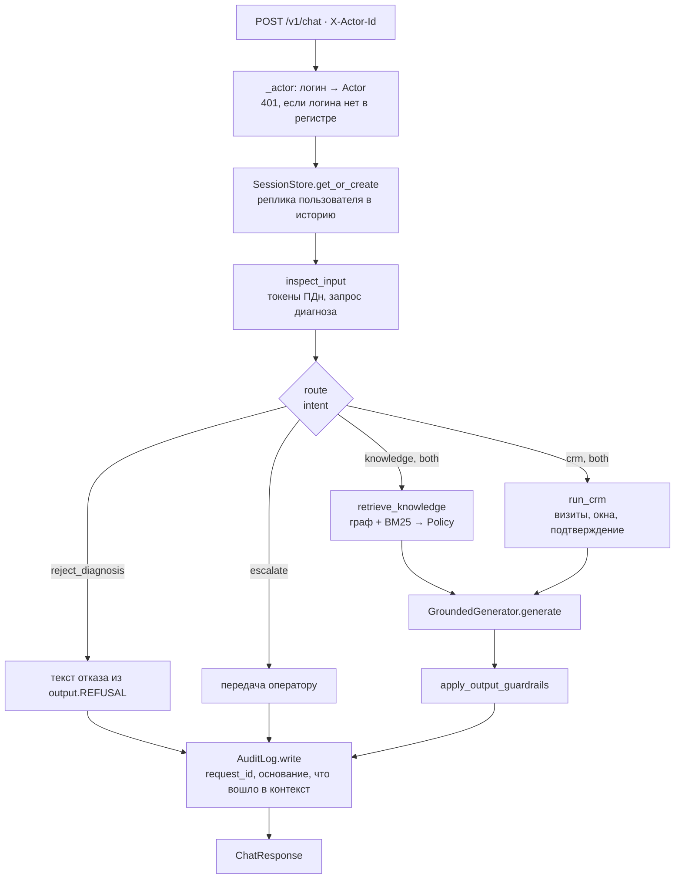

# Control Plane — backend

Реализация управляющего контура ассистента: HTTP-шлюз, оркестратор диалога, субагенты,
проверка прав, guardrails и порты хранилищ. Рамка системы, схемы C4, расчёт нагрузки и
стоимости — в [`../README.md`](../README.md); решения по стеку — в [`../docs/adr/`](../docs/adr/README.md).

Это **одно приложение FastAPI**, а не микросервис на каждый субагент: субагенты — узлы одной
машины состояний ([ADR-0008](../docs/adr/0008-orchestration.md)). Data Plane (Neo4j, Qdrant,
PostgreSQL, vLLM, Whisper) здесь не живёт — он подключается через порты, а на стенде разработки
заменён реализациями в памяти с теми же контрактами.

> **Главное правило контура.** Решение о доступе, отказ в диагнозе и подтверждение записи
> принимает код **до** обращения к генеративной модели. Отклонённый фрагмент в контекст модели
> не передаётся, и инструкцией в промпте это не переубедить.

## Содержание

- [1. Границы модуля](#1-границы-модуля)
- [2. Карта каталогов](#2-карта-каталогов)
- [3. Путь одной реплики](#3-путь-одной-реплики)
- [4. HTTP-контракт](#4-http-контракт)
- [5. Состояние диалога](#5-состояние-диалога)
- [6. Узлы графа состояний](#6-узлы-графа-состояний)
  - [6.1. Router](#61-router--маршрут-и-субъект)
  - [6.2. Input Guardrails](#62-input-guardrails--диагноз-и-персональные-данные)
  - [6.3. Policy](#63-policy--решение-о-доступе)
  - [6.4. Knowledge](#64-knowledge--граф-и-фрагменты)
  - [6.5. CRM](#65-crm--слоты-и-подтверждение)
  - [6.6. Generator](#66-generator--сборка-ответа)
  - [6.7. Output Guardrails](#67-output-guardrails--чужое-фио-в-ответе)
  - [6.8. Голосовой адаптер](#68-голосовой-адаптер)
- [7. Порты хранилищ](#7-порты-хранилищ)
- [8. Данные стенда](#8-данные-стенда)
- [9. Конфигурация](#9-конфигурация)
- [10. Запуск и проверка](#10-запуск-и-проверка)
- [11. Измерения стенда](#11-измерения-стенда)
- [12. Стенд против промышленного контура](#12-стенд-против-промышленного-контура)
- [13. Инварианты](#13-инварианты)
- [14. Как расширять](#14-как-расширять)
- [15. Известные упрощения](#15-известные-упрощения)

## 1. Границы модуля

| Что делает | Чего здесь нет |
| ---------- | -------------- |
| Принимает реплику из чата (`/v1/chat`) и транскрипт звонка (`/v1/voice`) | Распознавания и синтеза речи: ASR и TTS — адаптер канала, на стенде они в [`../demo/`](../demo/README.md) |
| Определяет намерение и субъект запроса, ведёт сессию и подтверждение записи | Автономных агентов: маршрут задан графом, модель не решает, вызывать ли проверку прав |
| Ищет в графе знаний и в индексе документов, пересекает найденное с правами актора | Аутентификации: актор приходит заголовком `X-Actor-Id`, это стенд ([§15](#15-известные-упрощения)) |
| Собирает ответ по допущенному контексту и пишет запись журнала | Обращений во внешние сети: на стенде генератор детерминированный, вызовов наружу нет |

**Зависимости.** Python ≥ 3.11 (локальный прогон — 3.14), `fastapi`, `uvicorn[standard]`,
`pydantic` v2, `pydantic-settings`, `pyyaml`, `httpx`; для прогона тестов — `pytest`.
Ни векторной базы, ни драйвера Neo4j, ни клиента LLM в зависимостях нет: на стенде их роль
играют классы из [`app/stores/`](app/stores/).

## 2. Карта каталогов

| Путь | Назначение |
| ---- | ---------- |
| [`app/main.py`](app/main.py) | HTTP-шлюз FastAPI: четыре эндпоинта, разбор `X-Actor-Id`, сборка ответа |
| [`app/schemas.py`](app/schemas.py) | контракт API: `ChatRequest`, `VoiceRequest`, `ChatResponse` |
| [`app/config.py`](app/config.py) | настройки `pydantic-settings` с префиксом `CLINIC_` |
| [`app/agents/orchestrator.py`](app/agents/orchestrator.py) | машина состояний: порядок узлов, запись в сессию и журнал |
| [`app/agents/state.py`](app/agents/state.py) | `GraphState` — состояние, которое узлы передают друг другу |
| [`app/agents/router.py`](app/agents/router.py) | выбор намерения и разрешение субъекта запроса |
| [`app/agents/knowledge.py`](app/agents/knowledge.py) | поиск по графу и фрагментам, фильтр Policy, расчёт оснований доступа |
| [`app/agents/crm_node.py`](app/agents/crm_node.py) | визиты, свободные окна, подтверждение записи (HITL) |
| [`app/agents/generator.py`](app/agents/generator.py) | стендовый порт генерации: сборка ответа по допущенному контексту |
| [`app/policy/acl.py`](app/policy/acl.py) | правила доступа: роль, своя карта, законное представительство |
| [`app/guardrails/input.py`](app/guardrails/input.py) | запрет диагноза и обнаружение персональных данных |
| [`app/guardrails/output.py`](app/guardrails/output.py) | проверка исходящей реплики, тексты отказов |
| [`app/ingest/bootstrap.py`](app/ingest/bootstrap.py) | загрузка графа, корпуса, регистра CRM при старте процесса |
| [`app/stores/`](app/stores/) | порты хранилищ: граф, индекс, CRM, сессии, журнал |
| [`app/voice/adapter.py`](app/voice/adapter.py) | вход речевого канала: тот же оркестратор, актор не из тембра |
| [`data/kb/`](data/kb/manifest.yaml) | синтетический корпус клиники и манифест ACL |
| [`data/graph/seed.cypher`](data/graph/seed.cypher) | публичный граф услуг, врачей, филиалов, подготовок и кодов МКБ |
| [`data/crm/seed.json`](data/crm/seed.json) | регистр: учётные записи, карточки, связь представительства, визиты |
| [`tests/`](tests/) | 29 автотестов: доступ, представительство, ПДн, HITL, оба канала, ранжирование |

## 3. Путь одной реплики



Порядок шагов в [`Orchestrator.run`](app/agents/orchestrator.py):

1. **Актор.** `X-Actor-Id` → `CrmStub.actor_from_login`. Неизвестный логин — `401`, дальше маршрут не идёт.
2. **Сессия.** `SessionStore.get_or_create` по `session_id`; реплика пользователя дописывается в историю.
3. **Входные guardrails.** `inspect_input` возвращает токенизированный текст, найденные сущности и признак запроса диагноза. Результат кладётся в `state.extra`.
4. **Маршрут.** `route` выбирает намерение: `knowledge`, `crm`, `both`, `reject_diagnosis`, `escalate` — и определяет `subject_id` (о ком речь).
5. **Знания.** `retrieve_knowledge` собирает узлы графа и фрагменты, пересекает их с правами актора и вычисляет основания доступа.
6. **CRM.** `run_crm` читает визиты, предлагает окна и исполняет запись **только** после подтверждения.
7. **Генерация.** `GroundedGenerator.generate` формулирует ответ по тому, что осталось после Policy.
8. **Выходные guardrails.** `apply_output_guardrails` проверяет, что в реплике нет чужого ФИО.
9. **Журнал.** `AuditLog.write` фиксирует `request_id`, актора, субъекта, основание доступа, намерение и идентификаторы всего, что вошло в контекст.

Ветка `reject_diagnosis` обрывает маршрут **до** поиска: узлы и фрагменты остаются пустыми,
текст отказа берётся из кода, а не сочиняется моделью.

## 4. HTTP-контракт

| Метод | Путь | Назначение |
| ----- | ---- | ---------- |
| `POST` | `/v1/chat` | реплика чата; тело `ChatRequest`, ответ `ChatResponse` |
| `POST` | `/v1/voice` | транскрипт звонка; тело `VoiceRequest`, ответ `ChatResponse` с `channel = voice` |
| `GET` | `/v1/audit/{request_id}` | запись журнала по идентификатору запроса |
| `GET` | `/health` | живость процесса: `{"status": "ok"}` |

Заголовок `X-Actor-Id` обязателен для обоих `POST`. Значения — логины из
[`data/crm/seed.json`](data/crm/seed.json): `patient:anna` (пациент 1, законный представитель),
`patient:boris` (пациент 3), `staff:registrar` (регистратор).

**Тела запросов**

| Поле | Тип | Эндпоинт | Смысл |
| ---- | --- | -------- | ----- |
| `text` | строка, ≥ 1 символа | `/v1/chat` | реплика пользователя |
| `transcript` | строка, ≥ 1 символа | `/v1/voice` | результат распознавания речи |
| `session_id` | строка или `null` | оба | продолжение диалога; `null` — новая сессия |
| `channel` | `text` \| `voice` | `/v1/chat` | канал; на права **не влияет** |
| `speakers` | список строк | `/v1/voice` | метки диаризации; на права **не влияют** ([§6.8](#68-голосовой-адаптер)) |

**Ответ `ChatResponse`**

| Поле | Тип | Что означает | Где заполняется |
| ---- | --- | ------------ | --------------- |
| `request_id` | строка | идентификатор запроса, он же ключ журнала | `Orchestrator.run` |
| `session_id` | строка | сессия диалога | `SessionStore` |
| `text` | строка | реплика ассистента после выходных guardrails | `generator` |
| `intent` | строка | выбранная ветка маршрута | `router` |
| `subject_id` | строка или `null` | о ком запрос: сам актор, ребёнок, другой пациент | `router.resolve_subject` |
| `acl_via` | строка или `null` | главное основание доступа: `guardian`, `staff_duty`, `self`, `staff`, `public` | `knowledge`, `crm_node` |
| `acl_denied` | булево | было ли отказано в закрытых сведениях | `knowledge`, `crm_node` |
| `node_ids` | список | узлы графа, вошедшие в контекст | `knowledge` |
| `chunk_ids` | список | фрагменты документов, вошедшие в контекст | `knowledge` |
| `pending_confirm` | булево | ассистент ждёт «да» на запись | `crm_node` |
| `escalate` | булево | запрос передан оператору | `router`, `crm_node` |
| `channel` | `text` \| `voice` | канал ответа | шлюз |

**Коды ответов**

| Код | Когда |
| --- | ----- |
| `200` | успешная обработка, включая отказ по доступу и отказ в диагнозе — это штатные ответы, а не ошибки |
| `401` | логин в `X-Actor-Id` отсутствует в регистре |
| `404` | `GET /v1/audit/{request_id}` с неизвестным идентификатором |
| `422` | нарушен контракт тела или отсутствует заголовок `X-Actor-Id` (валидация pydantic) |

**Пример: законный представитель спрашивает о ребёнке**

```bash
curl -s localhost:8080/v1/chat \
  -H 'Content-Type: application/json' \
  -H 'X-Actor-Id: patient:anna' \
  -d '{"text":"Когда УЗИ у сына и что за код N28.1?"}'
```

```json
{
  "intent": "knowledge",
  "subject_id": "misha",
  "acl_via": "guardian",
  "acl_denied": false,
  "chunk_ids": ["patient_misha/30-napravlenie-uzi-rebenok.md#2", "public/04-podgotovka-uzi.md#0"],
  "pending_confirm": false
}
```

**Пример: тот же вопрос от постороннего пациента**

```bash
curl -s localhost:8080/v1/chat \
  -H 'Content-Type: application/json' \
  -H 'X-Actor-Id: patient:boris' \
  -d '{"text":"Какое направление у Анны Соколовой?"}'
```

Ответ — `acl_denied: true`, текст отказа из [`app/guardrails/output.py`](app/guardrails/output.py),
фрагмента чужой карты нет ни в `chunk_ids`, ни в тексте.

**Журнал.** `GET /v1/audit/{request_id}` возвращает поля `AuditEvent`: актор, субъект, `via`,
полный список оснований `vias`, признак отказа, намерение и идентификаторы узлов и фрагментов.
Это трассировка решения о доступе (требование R18 корневого документа), по ней восстанавливается,
**чем именно** были открыты закрытые сведения.

## 5. Состояние диалога

`GraphState` ([`app/agents/state.py`](app/agents/state.py)) — единственный объект, который узлы
передают друг другу. Узел читает то, что положили до него, и дописывает своё.

| Поле | Кто пишет | Кто читает |
| ---- | --------- | ---------- |
| `request_id`, `actor`, `text`, `channel`, `session` | оркестратор | все узлы |
| `intent` | `router` | оркестратор |
| `subject_id` | `router.resolve_subject` | `knowledge`, `crm_node`, Policy |
| `chunks`, `nodes` | `knowledge` (уже после Policy) | `generator`, журнал |
| `crm_facts` | `crm_node` | `generator` |
| `acl_via`, `acl_vias` | `knowledge`, `crm_node` | ответ, журнал |
| `acl_denied` | `knowledge`, `crm_node` | `generator`, ответ |
| `pending_confirm` | `crm_node` | ответ |
| `escalate` | `router`, `crm_node` | ответ |
| `answer` | `generator` | шлюз, сессия |
| `extra` | `router` (`pii_tokens`, `pii_entities`, `sanitized`) | демонстрационный стенд, трассировка |

**Сессия** ([`app/stores/sessions.py`](app/stores/sessions.py)) хранит историю из последних
**восьми** реплик, `last_subject_id` и `pending` — заготовку записи, ожидающую подтверждения.
Карточка пациента в состояние не копируется: за сведениями узлы ходят в CRM через Policy.

## 6. Узлы графа состояний

### 6.1. Router — маршрут и субъект

[`app/agents/router.py`](app/agents/router.py). Правила, без вызова модели.

**Намерение.** Сравниваются две группы подстрок в реплике, приведённой к нижнему регистру
с заменой `ё` → `е`. Сопоставление идёт по **основам**, а не по словоформам: «запиШите» и
«окнА» не содержат «запис» и «окно».

| Группа | Подстроки |
| ------ | --------- |
| `BOOKING_CUES` | `запис`, `запиш`, `слот`, `окн`, `свободн` |
| `CRM_CUES` | `BOOKING_CUES` + `перенес`, `перенест`, `отмен`, `подтверд` |
| `KNOWLEDGE_CUES` | `подготов`, `цен`, `врач`, `филиал`, `узи`, `код`, `мкб`, `направл`, `гастроскоп`, `анализ`, `прайс`, `услуг`, `как готов`, `педиатр`, `лесн`, `южн` |
| код МКБ | регулярное выражение вида `N28.1` — считается признаком справочного запроса |

Решение: обе группы — `both`; только CRM — `crm`; иначе — `knowledge`. Запрос диагноза
перекрывает всё и уводит в `reject_diagnosis` ещё до разбора групп. Подтверждение («да»,
«подтверждаю», «ок», «хорошо») при заполненном `session.pending` сразу уходит в `crm`.

`BOOKING_CUES` объявлены здесь и импортируются узлом CRM: маршрут и узел решают по одному
и тому же списку, чтобы не разойтись при правке.

**Субъект запроса** (`resolve_subject`), по порядку:

| Условие | `subject_id` |
| ------- | ------------ |
| в реплике «сын», «доч», «ребён…», «Миш…» | `misha` |
| названо имя другого пациента, и актор — не он | идентификатор названного пациента |
| актор — пациент | сам актор |
| актор — сотрудник, имени нет | `session.last_subject_id` (о ком говорили в прошлой реплике) |

Субъект — это **кого касается** запрос, а не кто его задал: права считаются по паре
«актор → субъект» ([§6.3](#63-policy--решение-о-доступе)).

### 6.2. Input Guardrails — диагноз и персональные данные

[`app/guardrails/input.py`](app/guardrails/input.py).

**Запрет диагноза** срабатывает двумя способами: прямая формулировка («поставь диагноз»,
«подбери код», «что у меня за болезнь») либо пара «симптом + вопрос о его причине» («болит»,
«сыпь», «тошнит», «температура» вместе с «что это», «какой диагноз»). Текст отказа —
константа `REFUSAL`, модель к нему не привлекается ([R13](../README.md#реестр-требований)).

**Персональные данные** снимаются слоями ([ADR-0010](../docs/adr/0010-pii-detection.md)).
На стенде работают первый и третий; второй — распознавание именованных сущностей — целевой.

| Порядок | Сущность | Чем ловится |
| ------- | -------- | ----------- |
| 1 | `OMS` | 16 цифр подряд |
| 2 | `SNILS` | `ddd-ddd-ddd dd` |
| 3 | `EMAIL` | адрес электронной почты |
| 4 | `BIRTHDATE` | дата вида `03.06.2018` |
| 5 | `PHONE` | номер телефона с разделителями |
| 6 | `NAME` | точное ФИО из регистра CRM, от длинного к короткому |

Порядок значим: длинные и однозначные сущности снимаются первыми, иначе номер полиса
распался бы на «телефон» и хвост. Каждое значение заменяется токеном `[PHONE_0]`, `[NAME_0]`,
соответствие «токен → значение» остаётся в состоянии диалога (`state.extra["pii_tokens"]`).

Обратная подстановка — `restore(text, tokens, allowed)`: значение возвращается в текст,
**только** если оно принадлежит самому актору или субъекту, к которому актор допущен.
Токен чужого значения в ответе — ошибка маршрута, а не повод подставить значение.

### 6.3. Policy — решение о доступе

[`app/policy/acl.py`](app/policy/acl.py). Узел без вызова модели: на вход — актор и ресурс
(`acl`, `subject_id`), на выход — `AccessDecision(allowed, via, reason)`.

| Условие | Решение | `via` / `reason` |
| ------- | ------- | ---------------- |
| `acl = public` или метка пуста | допуск | `public` |
| `acl = staff`, роль актора `staff` | допуск | `staff` |
| `acl = staff`, роль иная | отказ | `staff_only` |
| субъект не определён | отказ | `missing_subject` |
| `subject_id = actor.id` | допуск | `self` |
| активная связь представительства, возраст субъекта < 15 лет или `share_with_guardian` | допуск | `guardian` |
| связь есть, но возраст ≥ 15 и согласия нет | отказ | `guardian_needs_consent` |
| связи нет | отказ | `no_relation` |

`decide_crm` — отдельное правило для **учётных сведений визита** (слот, услуга, филиал, статус,
код из направления): роль `staff` получает их по должностным обязанностям с основанием
`staff_duty` (323-ФЗ ст. 13 ч. 4 п. 1). На медицинские документы карты оно не распространяется —
для фрагментов остаётся общий `decide`, и регистратор их не читает. Два автотеста в
[`tests/test_acl.py`](tests/test_acl.py) держат именно эту границу.

`filter_chunks` записывает основание **в копию** фрагмента (`dataclasses.replace`): объект
фрагмента живёт в общем индексе, а `via` относится к конкретному актору. Отметить общий индекс
значило бы протечь основанием в чужой запрос — это проверяется тестом
`test_policy_does_not_mark_the_shared_index`.

### 6.4. Knowledge — граф и фрагменты

[`app/agents/knowledge.py`](app/agents/knowledge.py). Этапы:

1. **Затравки графа** — `graph.search(query)` (до 12 узлов) плюс узлы кодов МКБ, явно названных в реплике.
2. **Затравки из CRM** — если субъект определён: код из направления и услуга каждого его визита.
3. **Обход** — `graph.walk(seeds, hops=2)`: два шага по рёбрам в обе стороны. Из кодов МКБ наружу ведут только `PARENT` и `INDICATED_FOR`, иначе обход растекался бы по всему классификатору.
4. **Фрагменты** — `vectors.search(query, limit=10)`, ранжирование BM25.
5. **Policy** — `filter_nodes` и `filter_chunks`: всё, что не прошло, выбрасывается **до** сборки контекста.
6. **Сужение по субъекту** — документы карты остаются только по тому, о ком идёт речь в реплике.
7. **Основания** — из `via` оставшихся фрагментов и решения по карточке собирается `acl_vias`.

Порядок шагов 6 и 7 не случаен: сузить контекст нужно **до** расчёта оснований, иначе в журнал
попадёт основание фрагмента, который в контекст не вошёл. Это ровно тот случай, который держит
тест `test_journal_basis_matches_the_context`: BM25 по слову «УЗИ» достаёт направление ребёнка,
Policy справедливо допускает его по представительству, но если речь в реплике о самой матери,
`guardian` в журнале означал бы основание для того, чего в ответе нет.

`acl_via` — главное основание, `acl_vias` — все. Порядок фиксирован явно, от самого узкого
к самому широкому: `guardian` → `staff_duty` → `self` → `staff` → `public`. Аудитора интересует,
**чем открыли закрытое**, а не то, что нашлось общедоступное; брать основание из неупорядоченного
множества нельзя — ответ перестал бы быть воспроизводимым (`test_access_ground_is_deterministic`).

### 6.5. CRM — слоты и подтверждение

[`app/agents/crm_node.py`](app/agents/crm_node.py). Запись, перенос и отмена — операции
записи, поэтому проходят через подтверждение человеком (HITL, [R10](../README.md#реестр-требований)).

| Шаг | Что происходит |
| --- | -------------- |
| субъект не определён | эскалация к оператору, запись не создаётся |
| `decide_crm` отказал | `acl_denied`, в фактах — «Запись по чужой карте недоступна» |
| реплика — подтверждение и в сессии есть `pending` | `crm.book(...)`, `pending` очищается, в ответ идёт подтверждённый слот |
| реплика содержит запрос окон | `crm.list_slots(...)`, первое окно кладётся в `pending`, ответ просит подтвердить |
| иначе | в факты попадают текущие визиты субъекта |

`pending` — словарь `{subject_id, service_id, branch_id, slot}` в сессии. Пока он не заполнен,
подтверждать нечего: «да» в пустой сессии записи не создаёт.

Услуга и филиал определяются эвристикой `_guess_service_branch`: «гастроскоп» → `END-01`,
«педиатр» → `PED-01`, субъект-ребёнок → `USI-02`, иначе `USI-01`; «южн» → филиал `yuzhny`,
иначе `lesnaya`. В промышленном контуре это шаг разрешения сущностей по графу услуг, а не
подстроки ([§15](#15-известные-упрощения)).

### 6.6. Generator — сборка ответа

[`app/agents/generator.py`](app/agents/generator.py). Стендовый порт генерации: детерминированный
сборщик по допущенному контексту. Промышленный порт — T-pro-it-2.1 через vLLM
([ADR-0005](../docs/adr/0005-inference-engine.md)); в демонстрационном стенде тот же контекст
уходит в локальную модель через Ollama.

Отказы проверяются **до** сборки и возвращаются текстом из кода:

1. `intent = reject_diagnosis` → `REFUSAL`;
2. отказ по чужой карте → `ACL_REFUSAL`;
3. отказ и пустой контекст → `ACL_REFUSAL`;
4. отказ и ни одного публичного узла или фрагмента → `ACL_REFUSAL`.

Если контекст есть, ответ собирается из узлов (до 10), фрагментов (до 4, каждый обрезается
до 280 символов по границе слова) и фактов CRM. Пустой контекст — честный отказ с передачей
оператору, а не догадка.

| Метка узла | Строка ответа |
| ---------- | ------------- |
| `IcdCode` | «Код N28.1 в справочнике МКБ-10: … **(не диагноз)**» |
| `Preparation` | «Подготовка: …, не есть N ч» |
| `Service` | «Услуга USI-01: …, 3200 ₽» |
| `Doctor` | «Врач …, специальность» |
| `Branch` | «Филиал …, адрес» |

Оговорка «не диагноз» стоит в коде, а не в промпте: она не должна зависеть от того,
какая модель формулирует ответ.

### 6.7. Output Guardrails — чужое ФИО в ответе

[`app/guardrails/output.py`](app/guardrails/output.py). Последняя проверка перед выдачей: если
в тексте встретилось полное ФИО пациента, к которому актор не допущен, ответ целиком заменяется
отказом. Правило избыточно по отношению к Policy — и намеренно: оно ловит не ошибку прав,
а ошибку маршрута, при которой чужое имя попало в реплику в обход фильтра.

### 6.8. Голосовой адаптер

[`app/voice/adapter.py`](app/voice/adapter.py). `/v1/voice` вызывает **тот же** оркестратор
с `channel = "voice"`. Метки диаризации (`speakers`) принимаются как метаданные и на права
не влияют: актор определяется учётной записью или АОН, а не тембром
([R04](../README.md#реестр-требований)). Тест `test_chat_and_voice_same_policy` прогоняет один
и тот же запрос обоими каналами и сверяет решение о доступе.

## 7. Порты хранилищ

| Порт | Класс стенда | Промышленная реализация | ADR |
| ---- | ------------ | ----------------------- | --- |
| Граф знаний | `GraphStore` | Neo4j | [0007](../docs/adr/0007-graph-and-vectors.md) |
| Индекс документов | `VectorIndex` | Qdrant, BM25 + bge-m3, слияние RRF | [0006](../docs/adr/0006-embeddings.md) |
| Регистр и визиты | `CrmStub` | CRM клиники через адаптер | — |
| Сессии и чекпойнты | `SessionStore` | PostgreSQL, checkpointer LangGraph | [0008](../docs/adr/0008-orchestration.md) |
| Журнал доступа | `AuditLog` | PostgreSQL + трассировка | [0001](../docs/adr/0001-closed-contour.md) |

**GraphStore** ([`app/stores/graph.py`](app/stores/graph.py)) читает подмножество Cypher:
`MERGE (alias:Label {props})` и `MERGE (a)-[:REL]->(b)`. Строки `CREATE CONSTRAINT` и комментарии
пропускаются — ограничения уникальности держит Neo4j, в памяти их роль играет словарь. Свойства
разбираются как строка, целое или дробное. Поиск — пересечение основ (первые 8 символов токена):
этого хватает, чтобы «гастроскопию» нашла «Гастроскопию», и при этом «гастроскопия» не слиплась
с «гастроэнтерологом». Коды МКБ из поиска исключены, если код не назван в реплике буквально:
иначе классификатор из 12 тысяч узлов забивал бы выдачу.

**VectorIndex** ([`app/stores/vectors.py`](app/stores/vectors.py)) — BM25 с `k1 = 1,2`, `b = 0,75`
и тем же составом полезной нагрузки, что у Qdrant: `acl`, `subject_id`, `doc_id`. Плотной части
на стенде нет — ранжирование то же, эмбеддингов нет ([R07](../README.md#реестр-требований)).

**CrmStub** ([`app/stores/crm.py`](app/stores/crm.py)) держит учётные записи, карточки, связи
представительства и визиты из `seed.json`; `list_slots` выдаёт три ближайших будних дня на 09:00
по московскому времени, `book` создаёт визит в памяти.

**SessionStore** и **AuditLog** — словари в памяти процесса. Перезапуск обнуляет их: это стенд,
в промышленном контуре обе сущности живут в PostgreSQL.

**Объявлено, но оркестратором не вызывается** — заготовки контрактов под целевой контур:

| Символ | Назначение |
| ------ | ---------- |
| `CrmStub.cancel` | отмена визита; в маршруте пока нет ветки отмены |
| `GraphStore.neighbors` | выборка соседей по типу ребра |
| `router.next_after_router` | точка ветвления для условного ребра LangGraph |
| `guardrails.input.restore` | обратная подстановка значений; закрыт тестом, в маршруте появится вместе с генерацией на модели |

## 8. Данные стенда

Загружаются один раз при старте процесса (`load_runtime`, ≈ 0,02 с).

| Источник | Что даёт |
| -------- | -------- |
| [`data/graph/seed.cypher`](data/graph/seed.cypher) | 9 услуг, 5 врачей, 2 филиала, 4 подготовки и рёбра `PROVIDES`, `WORKS_AT`, `AVAILABLE_AT`, `REQUIRES`, `INDICATED_FOR` |
| [`data/kb/reference/mkb10-parsed.csv`](data/kb/reference/README.md) | 12 256 кодов МКБ-10 узлами `IcdCode` и 12 238 рёбер `PARENT` |
| [`data/kb/manifest.yaml`](data/kb/manifest.yaml) | 11 документов корпуса с меткой `acl` и субъектом |
| [`data/crm/seed.json`](data/crm/seed.json) | 3 учётные записи, 3 карточки, 1 связь представительства, 3 визита |

После загрузки в памяти: **12 276 узлов** графа, **12 275 рёбер**, **63 фрагмента** документов
(43 публичных, 12 карточных, 8 для сотрудников), словарь индекса — 501 term.

**Метка доступа берётся из манифеста, а не выводится из текста.** Это ключевое свойство
конвейера: ingest читает `acl` и `subject_id` рядом с путём документа, и ошибка разметки
становится видимой в одном файле, а не растворяется в эвристике по содержимому.

Чанкование — по пустой строке (абзац); идентификатор фрагмента — `путь#порядковый_номер`,
например `patient_misha/30-napravlenie-uzi-rebenok.md#2`. По такому идентификатору из журнала
однозначно находится исходный абзац.

Карточки пациентов в справочный граф **не попадают** ([R20](../README.md#реестр-требований)):
документ пациента живёт в индексе как фрагмент с `acl = patient` и `subject_id`.

## 9. Конфигурация

Переменные окружения с префиксом `CLINIC_`, разбор — `pydantic-settings`.

| Переменная | По умолчанию | Статус |
| ---------- | ------------ | ------ |
| `CLINIC_DATA_DIR` | `backend/data` | читается при старте: граф, корпус, регистр |
| `CLINIC_GENERATOR` | `grounded` | контракт порта генерации; стендовый сборщик выбирается безусловно |
| `CLINIC_VLLM_URL` | `http://127.0.0.1:8000/v1` | адрес vLLM целевого контура |
| `CLINIC_VLLM_MODEL` | `t-pro-it-2.1` | модель целевого контура ([ADR-0003](../docs/adr/0003-llm-t-pro.md)) |

Три последние переменные объявлены как контракт порта и кодом стенда пока не читаются:
генерация на модели живёт в демонстрационном стенде ([`../demo/generator.py`](../demo/generator.py)),
где исполнитель выбирается в интерфейсе. Секретов в конфигурации нет и в репозиторий они
не кладутся.

## 10. Запуск и проверка

```bash
cd backend
python -m venv .venv && source .venv/bin/activate
pip install -e ".[dev]"
pytest -q
uvicorn app.main:app --port 8080
```

Целевые хранилища поднимаются отдельно: `docker compose --profile data up -d`
в [`../infra/`](../infra/README.md). Control Plane при этом остаётся на хосте.

**Автотесты — 29.** Прогон занимает доли секунды: ни модели, ни видеокарты не требуются,
потому что решение о доступе, отказ в диагнозе и подтверждение записи принимает код.

| Файл | Тестов | Что закрывает |
| ---- | ------ | ------------- |
| [`tests/test_acl.py`](tests/test_acl.py) | 12 | возраст субъекта, представительство, отказ постороннему, границы роли `staff`, основание в журнале, детерминизм, поиск по основам |
| [`tests/test_guardrails_and_crm.py`](tests/test_guardrails_and_crm.py) | 9 | отказ в диагнозе, публичная цена, внутренние сведения для сотрудника и их отсутствие у пациента, HITL, словоформы записи, ранжирование BM25 |
| [`tests/test_api.py`](tests/test_api.py) | 4 | живость, неизвестный актор, совпадение решения в чате и в голосе, журнал по `request_id` |
| [`tests/test_pii.py`](tests/test_pii.py) | 4 | токенизация контактов и документов, ФИО из регистра, разворачивание только своих значений, отсутствие ложных срабатываний на терминах клиники |

Один тест: `pytest tests/test_acl.py::test_anna_reads_son_icd -q`.
Общие объекты (`runtime`, `orchestrator`, `client`) создаются один раз на сессию —
[`tests/conftest.py`](tests/conftest.py).

## 11. Измерения стенда

MacBook Pro, Apple M5 Pro, 48 ГБ, Python 3.14, без GPU. Медиана по 20 прогонам, `/v1/chat`
целиком, включая маршрут, поиск, Policy и сборку ответа.

| Сценарий | p50 | Что в контексте |
| -------- | --- | --------------- |
| справка по услуге и подготовке | ≈ 23 мс | 33 узла, 8 фрагментов |
| ребёнок и код из направления | ≈ 23 мс | 33 узла, 8 фрагментов, основание `guardian` |
| отказ по чужой карте | ≈ 22 мс | 26 публичных узлов, фрагмент карты отсечён |
| отказ в диагнозе | < 0,1 мс | контекст пуст, маршрут оборван до поиска |

Почти всё время уходит на `graph.search` (≈ 23 мс): линейный перебор 12 276 узлов с огрублением
до основы. BM25 по 63 фрагментам — 0,03 мс, обход графа на два шага — 0,06 мс. В промышленном
контуре перебор заменяется полнотекстовым индексом Neo4j, и бюджет реплики определяется
генерацией на GPU, а не поиском.

Эти числа описывают **управляющий контур**. Целевые показатели всей системы — p95 `/v1/chat`
≤ 8 с при 10 RPS на H100 — в разделе [Сценарий нагрузки](../README.md#сценарий-нагрузки-для-прогона).

## 12. Стенд против промышленного контура

| Слой | Промышленный порт | Порт стенда | Что проверяется уже сейчас |
| ---- | ----------------- | ----------- | -------------------------- |
| Генерация | vLLM, T-pro-it-2.1 | сборщик по допущенному контексту | состав контекста, тексты отказов |
| Поиск | BM25 + bge-m3, RRF, reranker | BM25 | полезная нагрузка ACL, порядок выдачи |
| Граф | Neo4j | разбор Cypher в память | онтология, обход, коды МКБ |
| Сессии, журнал | PostgreSQL | словари в памяти | контракт полей, трассировка решения |
| Речь | Whisper, Silero | транскрипт на входе | независимость прав от канала |
| ПДн | Presidio + spaCy `ru_core_news_lg` | правила и справочник ФИО | контракт «модель видит токен» |

Существенно, что **проверка прав от этого не зависит**: она выполняется до обращения к модели
и потому воспроизводится на ноутбуке без видеокарт. Замена порта не меняет ни одного
правила доступа.

## 13. Инварианты

Правила, которые нельзя нарушить незаметно — у каждого есть автотест.

| Инвариант | Тест |
| --------- | ---- |
| Отклонённый Policy фрагмент не попадает в контекст модели | `test_boris_denied_anna_referral` |
| Основание в журнале названо только для того, что реально вошло в контекст | `test_journal_basis_matches_the_context` |
| Отказ не записывается с основанием доступа | `test_refusal_carries_no_access_basis` |
| Основание воспроизводимо, не зависит от порядка обхода множества | `test_access_ground_is_deterministic` |
| Policy не помечает общий индекс: `via` живёт в копии фрагмента | `test_policy_does_not_mark_the_shared_index` |
| Канал не влияет на решение о доступе | `test_chat_and_voice_same_policy` |
| Регистратор ведёт расписание, но не читает документы карты | `test_registrar_sees_visits_but_not_card_documents` |
| Диагноз и подбор кода по симптомам — отказ без обращения к поиску | `test_diagnosis_rejected` |
| Запись создаётся только после подтверждения человеком | `test_hitl_booking` |

## 14. Как расширять

**Добавить документ клиники.** Положить файл в [`data/kb/`](data/kb/README.md) и описать его
в [`manifest.yaml`](data/kb/manifest.yaml): путь, `acl`, `subject_id`. Без записи в манифесте
документ в индекс не попадёт — это защита от «тихой» утечки закрытого текста в публичную выдачу.

**Добавить услугу, врача или подготовку.** Дописать `MERGE` в
[`seed.cypher`](data/graph/seed.cypher) и связать рёбрами `PROVIDES`, `AVAILABLE_AT`, `REQUIRES`.
Если услуга должна находиться по названию — проверить, что основа слова (первые 8 символов)
отличает её от соседних.

**Добавить правило доступа.** Только в `PolicyGate.decide` или `decide_crm`, с новым значением
`via`, и внести его в `VIA_PRIORITY` — иначе основание окажется в конце порядка и главным
не станет. Новое правило сопровождается тестом в [`tests/test_acl.py`](tests/test_acl.py)
и строкой в [правиле Policy](../README.md#правило-policy) корневого документа.

**Добавить инструмент CRM.** Метод в `CrmStub` плюс ветка в `run_crm`. Операция записи
обязана пройти через `pending` и подтверждение: инструмент, меняющий данные без HITL,
нарушает [R10](../README.md#реестр-требований).

**Заменить порт на промышленный.** Контракты узкие: графу нужны `search`, `walk`, `get`;
индексу — `search` с полезной нагрузкой `acl`, `subject_id`, `doc_id`; генерации — `generate(state, runtime)`.
Замена реализации не затрагивает ни Policy, ни guardrails.

**Помнить о демонстрационном стенде.** [`../demo/`](../demo/README.md) импортирует
`Orchestrator`, `load_runtime`, `GraphState`, `GroundedGenerator`, `_format_node`,
`apply_output_guardrails` и читает `state.extra["sanitized"]`. Переименование этих символов
ломает стенд, хотя автотесты бэкенда останутся зелёными.

## 15. Известные упрощения

Перечислены честно: это граница стенда, а не скрытый дефект.

| Упрощение | Последствие | Целевой контур |
| --------- | ----------- | -------------- |
| Актор приходит заголовком `X-Actor-Id` без проверки подлинности | подменить актора в запросе тривиально | токен сессии либо АОН телефонии |
| Маршрут и распознавание сущностей — на подстроках | формулировка вне списка основ уходит в ветку `knowledge` | классификатор намерений и разрешение сущностей по графу |
| `list_slots` не учитывает услугу и филиал | окна одинаковы для любой услуги | расписание CRM клиники |
| Ветки отмены и переноса визита нет | `CrmStub.cancel` не вызывается | инструменты `reschedule` и `cancel` за тем же HITL |
| Код МКБ в маршруте распознаётся и в кириллице, в поиске узла — только в латинице | «К80», набранное кириллицей, задаёт справочное намерение, но узла не найдёт | нормализация раскладки на входе |
| Сессии и журнал — в памяти процесса | перезапуск теряет историю и трассировку | PostgreSQL, checkpointer LangGraph |
| Чанкование по абзацу | длинный абзац целиком идёт в контекст | разбиение с перекрытием и переранжирование |
| Обнаружение ПДн без слоя именованных сущностей | ФИО вне регистра не токенизируется | Presidio + spaCy `ru_core_news_lg` ([ADR-0010](../docs/adr/0010-pii-detection.md)) |
