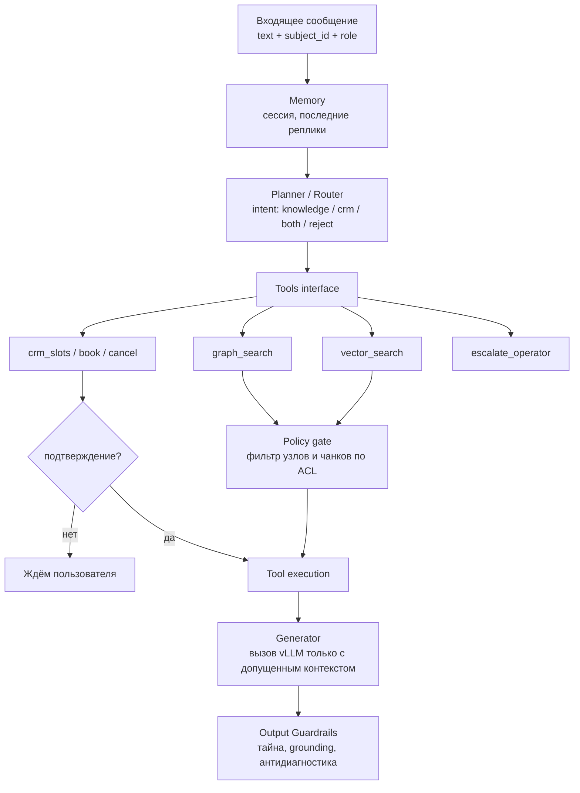

# C4 Level 3 — Component (агент)

Внутренности Orchestrator. Это одно приложение LangGraph: узлы графа состояний, не микросервис на каждый субагент.

## Модули

| Модуль | Что делает | Чего не делает |
|--------|------------|----------------|
| **Memory** | короткое окно диалога, `subject_id`, уже названный филиал/услуга | долговременную медкарту в промпте |
| **Planner / Router** | один или два шага: знания и/или CRM; отказ, если это диагностика | «ответить из весов модели» |
| **Tools interface** | стабильные контракты к графу, векторам, CRM | SQL в обход ACL |
| **Policy gate** | пересечение retrieved ∩ `acl` роли | «модель сама не расскажет» |
| **Generator** | текст ответа / реплика для TTS | вызов внешнего API |
| **Output Guardrails** | нет чужого ФИО, нет диагноза, есть опора на узлы | косметический фильтр мата |

Memory в MVP — таблица `sessions` + checkpoint LangGraph. Не отдельная векторная «память пациента»: это дыра в тайне.
