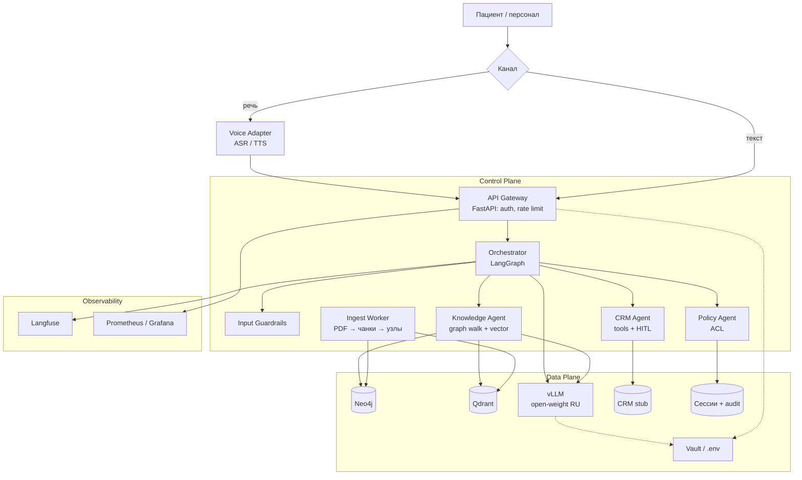

# C4 Level 2 — Container

Граница системы из Context. Здесь видно **Control Plane** (агенты, API, ingest) и **Data Plane** (граф, векторы, модели, CRM-заглушка, секреты).

В MVP часть контейнеров выполняется в одном процессе FastAPI (фильтры, ASR, TTS). На диаграмме они разделены в соответствии с целевым контуром Deployment.

## Контейнеры

| Контейнер | Плоскость | Технология | Ответственность |
|-----------|-----------|------------|-----------------|
| API Gateway | Control | FastAPI | вход текста и транскрипта, идентификация (`patient:anna` / `staff:…`), единый выход |
| Voice Adapter | Control | Whisper, WhisperX, Silero | канал; актор не назначается по тембру |
| Orchestrator | Control | LangGraph | состояние, retry, fallback на оператора |
| Knowledge / CRM / Policy | Control | агенты в том же runtime | знания, запись, права |
| Ingest Worker | Control | Python job | PDF/MD → чанки, эмбеддинги, узлы и рёбра |
| Neo4j | Data | Neo4j 5 | онтология и обход графа |
| Qdrant | Data | Qdrant | векторный поиск с payload-фильтром ACL |
| vLLM | Data | vLLM | генерация, без ПДн в открытом виде |
| CRM stub | Data | JSON / SQLite | слоты и визиты двух пациентов |
| Vault | Data | Vault; в dev — `.env` | ключи БД, токены |
| Langfuse + Prom/Grafana | Observability | self-host | трейсы агентов, latency, токены |

Наружу из Data Plane **нет** вызова OpenAI/Anthropic. Клиент vLLM смотрит только на внутренний URL.

## Контрольные потоки

1. **Ingest:** файл прайса → чанки в Qdrant + узлы `Service` в Neo4j.
2. **Сложный вопрос:** «к кому записаться на УЗИ на Лесной и как готовиться» — граф, не один чанк.
3. **ACL:** Борис спрашивает про направление Анны — отказ. Анна спрашивает про УЗИ сына — Policy пускает карту Миши (`GUARDIAN_OF`).
4. **Голос:** тот же Orchestrator, другой адаптер.
