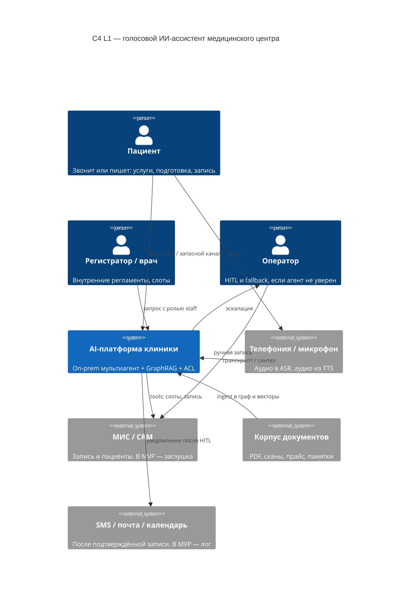
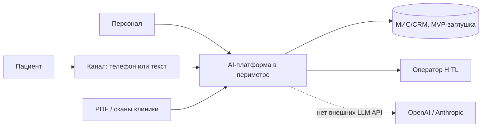

# C4 Level 1 — System Context

Платформа размещается внутри периметра организации. Персональные данные и текст запросов за периметр не передаются.

Если рендер C4-плагина недоступен — та же граница проще:

## Что сознательно снаружи / внутри

| Снаружи системы | Внутри периметра |
|-----------------|------------------|
| Пациент, персонал, оператор | Агенты, guardrails, ACL |
| Исходные PDF клиники (файлы) | Neo4j, Qdrant, сессии, аудит |
| Настоящая МИС (позже) | vLLM, Whisper, Silero |
| SMS-провайдер (позже) | секреты (Vault) |

Исходящих вызовов к внешним API генеративных моделей нет.
