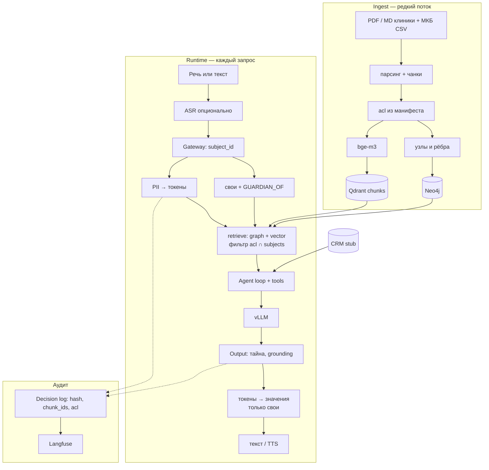

# Data Flow

Два контура: загрузка документов в знания и обработка запроса. Персональные данные не покидают периметр.

## Правила движения данных

| Данные | Куда можно | Куда нельзя |
|--------|------------|-------------|
| Публичный прайс, памятки | граф, векторы, промпт | внешний API |
| Внутренний регламент регистратуры | граф/векторы с `acl=staff` | промпт пациента |
| Направление Анны | чанк `patient:anna` | промпт Бориса, логи в открытом виде |
| Направление Миши | Анна как `GUARDIAN_OF` | промпт Бориса, общий прайс |
| Телефон, ФИО в реплике | Token Vault на время запроса | сырьём в vLLM и в Langfuse |
| Аудио | диск контура / tmp, TTL | облачный Speech API |

Регистратор видит `public` + `staff`. Пациент — `public` + своя карта + карты, где он активный законный представитель. Оператор HITL работает в UI клиники, не через «расскажи всё модели».
