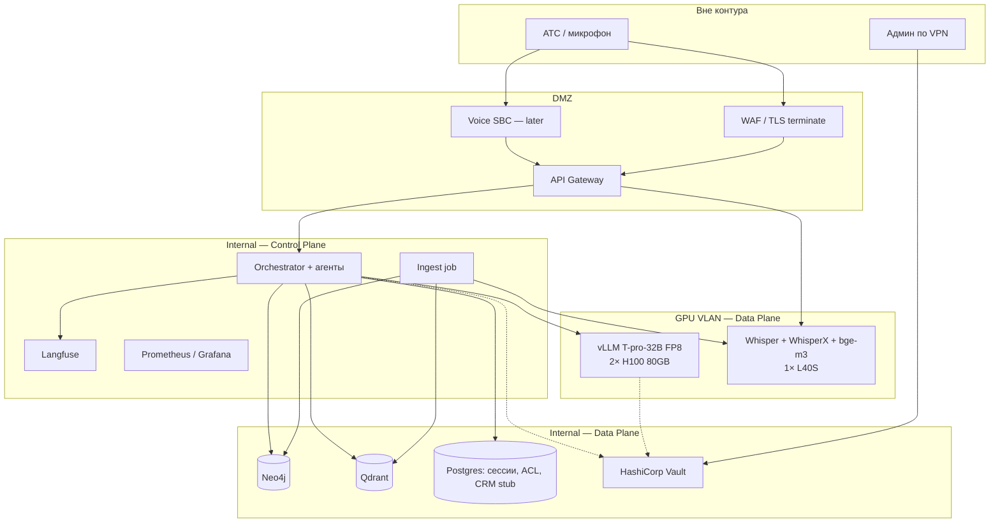

# Deployment

Размещение вычислительного контура, сегментация сети и управление секретами.

## Железо (целевой контур клиники)

| Узел | Роль | Зачем отдельно |
|------|------|----------------|
| 2× H100 80GB | vLLM, FP8, prefix/KV-cache | агентный цикл, HA: второй GPU — горячий резерв / второй реплика |
| 1× L40S 48GB | Whisper, WhisperX, эмбеддинги | речь и индекс изолированы от KV LLM |
| CPU-ноды | API, LangGraph, Neo4j, Qdrant, Postgres, Langfuse | Control ≠ infer |

Расчётная нагрузка — до 30 голосовых обращений в минуту. ASR и генерация размещаются на разных ускорителях.

Баланс: два vLLM за внутренним LB (least-conn). Сессии LangGraph — в Postgres, чтобы реплика подхватила HITL.

## Сеть и секреты

| Зона | Что стоит | Кто ходит |
|------|-----------|-----------|
| DMZ | TLS, gateway, будущий SBC | пациент / АТС |
| Internal | агенты, БД, наблюдаемость | только gateway и админы |
| GPU VLAN | vLLM, Whisper | только Control Plane |
| Vault | пароли БД, токены | JIT, не в env на диске прод-нод |

Из GPU VLAN **нет** маршрута в интернет. Веса моделей — зеркало внутри периметра. OpenAI/Anthropic не резолвятся.

## Dev vs prod

В репозитории `docker compose` поднимает Neo4j, Qdrant, Postgres, Langfuse. vLLM в промышленной среде — systemd или Kubernetes на узлах с H100.
