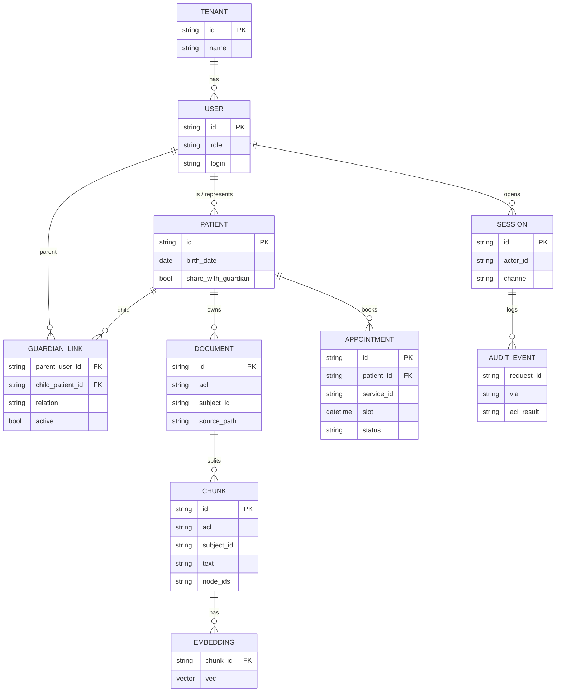

# Онтология GraphRAG и ER

Знания клиники — граф. Справочник МКБ-10 — тоже граф (код → родитель). Карточки пациентов в граф **целиком не кладём**: ПДн живут в CRM/чанке с ACL, в Neo4j максимум идентификатор визита.

## Узлы знаний (5 типов)

| Тип | Пример | acl |
|-----|--------|-----|
| `Branch` | Лесная, Южный | public |
| `Doctor` | Морозова А.П., УЗИ | public |
| `Service` | УЗИ ОБП, гастроскопия | public |
| `Preparation` | «не есть 6 часов» | public |
| `IcdCode` | K21.0 «Гастроэзофагеальный рефлюкс с эзофагитом» | public |

Связи:

```
(:Doctor)-[:PROVIDES]->(:Service)
(:Service)-[:REQUIRES]->(:Preparation)
(:Service)-[:AVAILABLE_AT]->(:Branch)
(:Doctor)-[:WORKS_AT]->(:Branch)
(:Service)-[:OFTEN_CODED_AS]->(:IcdCode)
(:IcdCode)-[:PARENT]->(:IcdCode)
```

`OFTEN_CODED_AS` — подсказка регистратору («гастроскопию часто ставят рядом с K21»), **не** диагноз пациента. Ассистент не говорит «у вас K21».

## МКБ-10 в контуре

Полный классификатор лежит в [`backend/data/kb/reference/mkb10-parsed.csv`](../../backend/data/kb/reference/mkb10-parsed.csv) (~12k строк: code, name, parent, level). Источник парсинга публичного справочника; в проде холдинг берёт выгрузку НСИ Минздрава (`1.2.643.5.1.13.13.11.1005`).

Зачем голосовому ассистенту:

- понять «рефлюкс-эзофагит» / «K21.0» и связать с услугой и врачом;
- ответить «что означает код в направлении» **как справочник**, не как постановка диагноза.

Guardrail: симптомы («у ребёнка болит живот, что это») → отказ в диагностике + запись к педиатру. Обход графа МКБ для такого запроса **не** запускаем как «подбери код».

## Карточки и права (не граф знаний)



Qdrant хранит `vector + payload{chunk_id, acl, subject_id, doc_id}`. Фильтр ACL — **до** LLM, на retrieve.

## Пример обхода

«Запишите сына на УЗИ на Лесной, как готовить и что за код N28 в направлении?»

1. Policy: Анна `GUARDIAN_OF` Миша → карта Миши доступна.
2. Graph: `Service:УЗИ ОБП` → `Preparation` → `Branch:Лесная` → `Doctor:Морозова`.
3. `IcdCode:N28` → название из справочника (публичное).
4. CRM: слоты УЗИ, `patient_id=misha`.
5. В промпт не попадают направление Анны и карта Бориса.
