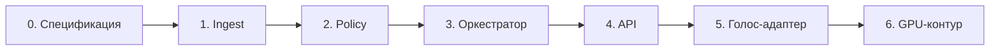

# Последовательный план контура

Документ фиксирует реестр требований и порядок работ. Реализация Control Plane в репозитории соответствует фазам 1–5: ingest, Policy, оркестратор, текстовый и голосовой адаптеры. Фаза 6 (промышленные GPU-сервисы) остаётся целевым контуром.

## Реестр требований

| ID | Требование | Источник | Артефакт | Решение |
|----|------------|----------|----------|---------|
| R01 | Замкнутый контур: нет внешних API LLM и Speech | ADR-0001 | `app/agents/generator.py`, `app/voice` | принято |
| R02 | RBAC и ReBAC: своя карта; `GUARDIAN_OF`; отказ чужому субъекту | ADR-0002 | `app/policy/acl.py`, тесты ACL | принято |
| R03 | Возраст < 15 лет или `share_with_guardian` | ADR-0002, 323-ФЗ | Policy gate | принято |
| R04 | Канал не влияет на ACL; `actor_id` не из тембра | ADR-0002, ADR-0009 | Gateway + Voice Adapter | принято |
| R05 | LLM T-pro-it-2.1 через vLLM | ADR-0003, ADR-0005 | порт `VllmGenerator`; по умолчанию grounded-генератор | ограничение стенда |
| R06 | GPU: 2× H100 + L40S | ADR-0004 | [Deployment](architecture/deployment.md) | целевой контур |
| R07 | Эмбеддинги bge-m3; ACL-фильтр до LLM | ADR-0006 | порт `VectorIndex`; на стенде — лексический индекс с тем же payload | ограничение стенда |
| R08 | Neo4j + Qdrant + Postgres | ADR-0007 | порты Graph/Vector/Sessions; Compose — целевые контейнеры | ограничение стенда |
| R09 | Оркестрация — машина состояний, не линейный скрипт | ADR-0008 | `app/agents/orchestrator.py` | принято |
| R10 | HITL на запись и отмену | ADR-0008, Sequence | CRM-узел, `pending_confirm` | принято |
| R11 | ASR Whisper, TTS Silero; АТС вне MVP | ADR-0009, MVP | `/v1/voice`; без GPU — транскрипт на входе | ограничение стенда |
| R12 | GraphRAG: онтология + чанки + МКБ как справочник | graph-schema, корпус | ingest + Knowledge | принято |
| R13 | Запрет постановки диагноза и подбора МКБ по симптомам | MVP, ADR-0002 | Input Guardrails, Router | принято |
| R14 | C4 Context / Container / Component | architecture | существующие схемы | принято |
| R15 | Deployment, Data Flow, Sequence, ER | architecture | существующие схемы | принято |
| R16 | Control Plane ≠ Data Plane | C4 Container, Deployment | пакеты `app/*` vs Compose | принято |
| R17 | Телефония и МИС — внешние порты, не продукты | C4 Context | [external-ports](architecture/external-ports.md) | принято |
| R18 | Наблюдаемость: трассировка решения ACL | Data Flow | `app/stores/audit.py`, `/v1/audit/{request_id}` | принято |
| R19 | Нагрузка: текст — основной контур измерений | MVP | [load](architecture/load.md), `/v1/chat` | принято |
| R20 | Карточки пациентов не кладутся в справочный граф | graph-schema, ADR-0007 | CRM + чанки с ACL | принято |

## Порядок работ



| Фаза | Содержание | Критерий готовности | Статус |
|------|------------|---------------------|--------|
| 0 | ADR, C4, потоки, корпус, порты | документы согласованы | выполнено |
| 1 | Загрузка MD, Cypher, МКБ, CRM | граф и чанки с `acl` / `subject_id` | выполнено в коде |
| 2 | Policy gate до генерации | Борис не видит Анну; Анна видит Мишу | выполнено в коде |
| 3 | Узлы Memory → Router → Knowledge / CRM → Guardrails | условные переходы, HITL, отказ в диагностике | выполнено в коде |
| 4 | `POST /v1/chat` | автотесты сценариев Sequence | выполнено в коде |
| 5 | `POST /v1/voice` — тот же граф состояний | актор из заголовка, не из `SPEAKER_*` | выполнено в коде |
| 6 | vLLM, Whisper, bge-m3, Neo4j/Qdrant как процессы | профили Compose `data` и `gpu` | целевой контур |

Фазу 6 не смешивают со стендом Control Plane: отсутствие H100 не блокирует проверку ACL и GraphRAG.

## Стенд без GPU

| Слой | Промышленный порт | Реализация стенда |
|------|-------------------|-------------------|
| Генерация | vLLM, T-pro-it-2.1 | grounded-сборщик по допущенным узлам и чанкам |
| Эмбеддинги | bge-m3 | лексический индекс, тот же payload ACL |
| Граф | Neo4j | тот же Cypher-seed в памяти |
| Сессии / опека | PostgreSQL | те же сущности из `seed.json` |
| ASR / TTS | Whisper / Silero | вход — транскрипт; выход — текст для синтеза |

Интерфейсы портов не меняются при подключении промышленных реализаций.

## Проверка сборки

```text
cd final-project/backend
python -m venv .venv && source .venv/bin/activate
pip install -e ".[dev]"
pytest -q
uvicorn app.main:app --port 8080
```

Контрольные запросы — в [backend/README.md](../backend/README.md). Стенд Control Plane собирается: `pytest` в `backend/` — 15 тестов (ACL, ReBAC, диагностика, HITL, `/v1/chat` и `/v1/voice`).
