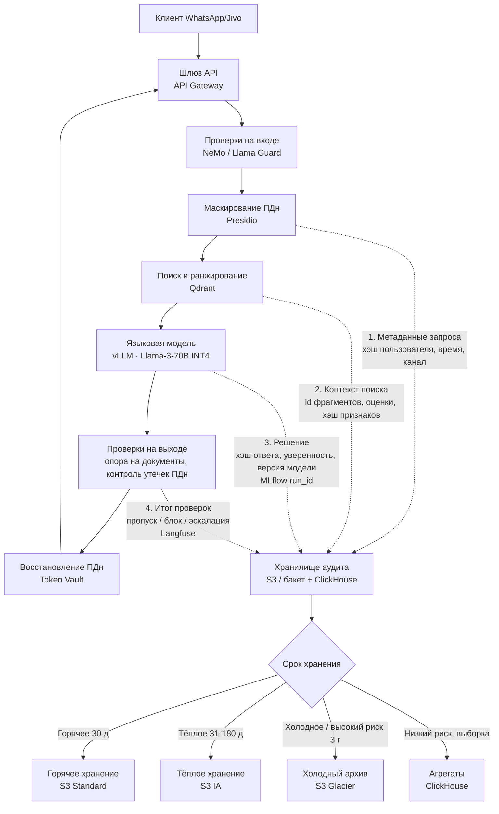

# ДЗ №10. FinOps и Governance: управление стоимостью и этикой AI

**Объект:** голосовой и текстовый ассистент поддержки **TechnoMart** (поиск по базе знаний Confluence и данным заказов ERP/1С, каналы WhatsApp/Jivo).  
**Опора на предыдущие работы:** инференс Llama-3-70B ([ДЗ №7](../hw-7/README.md)), поставка и канареечный выпуск ([ДЗ №8](../hw-8/README.md)), кэширование ([ДЗ №9](../hw-9/README.md)), защита контура ([ДЗ №6](../hw-6/README.md)).  
**Состав документа:** карточка модели, журнал решений для аудита, разбор превышения облачного бюджета на **50%** и план снижения затрат.  
**Теория:** [конспект](summary/README.md).

---

## 1. Карточка модели (Model Card)

**Идентификатор:** `technomart-support-rag-llama3-70b`.

| Поле | Значение |
|------|----------|
| **Модель и версия** | Llama-3-70B-Instruct, квантование **INT4**; версия `v2.4.1`; запись в реестре `tm-rag-2026-08-19-a3f1` |
| **Владелец (ML)** | [divisee](https://github.com/divisee), ведущий ML-инженер |
| **Владелец (бизнес)** | [divisee](https://github.com/divisee), руководитель поддержки TechnoMart |
| **Уровень риска** | **Ограниченный** (консультации по заказам и политикам обслуживания) |
| **Дата** | 2026-09-06; обновлять при переобучении и смене системного промпта |

### 1.1 Назначение и ограничения

**Назначение.** Ответы клиентам TechnoMart (**РФ**) по статусу заказа, возврату и обмену, гарантии, наличию, доставке и типовым вопросам из базы знаний. Путь запроса: **мессенджер → шлюз API → поиск по базе → языковая модель**. Основной язык - **русский**.

| Запрещено использовать для | Обоснование |
|----------------------------|-------------|
| Автоматического отказа в возврате или штрафов без оператора | **Критичное решение**; **152-ФЗ**; нужна процедура обжалования |
| Медицинских и юридических консультаций | Нет предметной экспертизы в базе знаний |
| Кредитного скоринга и обслуживания вне РФ | Другой контур данных или иная правовая база |
| Ответа без опоры на найденные документы / без идентификации сессии | Обязательны входные и выходные проверки ([ДЗ №6](../hw-6/README.md)); **только перевод на оператора** |

**Технические ограничения.** Контекст около **8 тыс. токенов**. **INT4** может уступать полной точности на редких формулировках. Если релевантных фрагментов базы нет - **отказ и эскалация**.

### 1.2 Данные и анализ предвзятости

**Базовая модель:** Meta-Llama-3-70B-Instruct.  
**Доменные источники:** статьи Confluence (около **12 тыс.** фрагментов), обезличенные диалоги поддержки 2023–2026 (около **1,8 млн** пар для оценки и сжатия модели), статусы заказов из ERP по запросу (в веса не входят), контрольный набор из **800** кейсов.  
Персональные данные **маскируются** токенами до LLM (хотя модель self-hosted в периметре): так ПДн не попадают в открытом виде в журналы, аудит и трассировку, снижается риск утечки в чужой ответ; перед клиентом токены восстанавливаются. Разделение контрольного набора **70/15/15** - по категории обращения и региону склада.

| Риск предвзятости | Наблюдение | Мера |
|-------------------|------------|------|
| **Категория товара** | Электроника около **55%**, товары для дома и DIY представлены слабо | Усилить долю этих категорий в проверочной выборке |
| **Тональность жалоб** | Модель копирует излишне жёсткий тон | Правила тона в системном промпте и фильтр ответа |
| **Регион склада** | Москва и СПб около **80%** примеров | Отдельный срез качества по регионам |
| **Язык** | Русский сильно преобладает | Проверка смешанных формулировок; паритет английского **не гарантируется** |
| **Косвенное смещение** | Пол и возраст в признаках **запрещены** | Мониторинг негативных оценок по группам товаров |

**Исключено из контекста:** открытые персональные данные, чужие заказы, внутренние заметки операторов с дискриминационными формулировками.

### 1.3 Метрики качества и справедливости

Для ассистента поддержки классические метрики «равной доли одобрений» не подходят. Используем **равномерность качества ответа** по группам клиентов и категорий.

| Метрика | Цель | Срезы справедливости |
|---------|:----:|----------------------|
| Опора ответа на документы | **≥ 0,85** | Разброс между категориями товаров **≤ 0,05** |
| Релевантность ответа | **≥ 0,80** | Разброс Москва/СПб vs регионы **≤ 0,05** |
| Точность найденного контекста | **≥ 0,75** | Новый vs повторный клиент: разница негативных оценок **≤ 2 п.п.** |
| Доля выдуманных фактов / точность эскалации | **≤ 3%** / **≥ 0,90** | Смешанный язык: релевантность **≥ 0,70** |

При нарушении порога **канареечный выпуск блокируется**, выполняется разбор по срезам до вывода в промышленный контур.

### 1.4 Этические риски

| Риск | Мера |
|------|------|
| **Неверное изложение политики возврата** | Проверка опоры на документ и ссылка на статью; иначе - **оператор** |
| **Утечка персональных данных или чужого заказа** | Маскирование на входе, проверка утечек на выходе, разграничение доступа |
| **Подмена инструкций через документы базы** | Фильтры на входе; уровни доверия к источникам |
| **Непрозрачность и обжалование** | В ответе указывается основание; пишется журнал решения; оператор за **15 минут** в рабочее время |
| **Ответственность** | Владельцы ML и бизнеса; изменения высокого риска - **комитет по этике AI** |

**Контакт:** `ai-governance@technomart.example`.

---

## 2. Журнал решений для аудита

Каждое решение системы должно быть **воспроизводимо** при проверке (**152-ФЗ**, претензии клиентов).

| Поле журнала | Пример | Назначение |
|--------------|--------|------------|
| **Идентификатор запроса**, хэш пользователя, время | uuid, sha256(телефон) | Идентификация без сырых персональных данных |
| **Список фрагментов** и оценки поиска | doc-42, 0,81 | Воспроизведение контекста, который видела модель |
| **Хэш признаков** | sha256(...) | Ссылка на снимок базы знаний без дублирования текста |
| **Хэш ответа** и длина | hash, число токенов | Аудит без полного корпуса ответов в дорогом тире |
| **Версия модели** | `tm-rag-2026-08-19-a3f1` | Конкретная запись в реестре, не абстрактная метка «production» |
| **Итог проверок** | пропуск / блок / эскалация | Фиксация политики безопасности |
| **Уровень риска записи** | низкий / высокий | Разный срок и полнота хранения |

| Уровень риска | Политика хранения |
|---------------|-------------------|
| **Высокий** (претензия, крупный возврат, эскалация) | Полный ответ и тексты фрагментов, холодное хранение **3 года** |
| **Низкий** (типовой вопрос) | Выборка **10%** и агрегаты; горячее хранение **30 дней**, затем более дешёвые тиры и удаление |

> Без срока хранения журнал аудита сам становится источником перерасхода.

---

## 3. FinOps: превышение бюджета на 50%

| Показатель | Значение |
|------------|----------|
| **Утверждённый бюджет** | **2,0 млн ₽/мес** |
| **Факт** | **3,0 млн ₽/мес** |
| **Превышение** | **+50%** (**+1,0 млн ₽**) |
| Ориентир боевого инференса ([ДЗ №7](../hw-7/README.md)) | около **695 тыс. ₽** за три карты A100 |

| Статья | Бюджет, тыс. ₽ | Факт, тыс. ₽ | Δ | Причина отклонения |
|--------|---------------:|-------------:|--:|--------------------|
| GPU, боевой контур | 700 | 700 | 0 | По плану (3×A100) |
| **GPU, обучение и стенды** | 200 | **650** | **+450** | Две карты круглосуточно после эксперимента; загрузка около **15%**; прерываемые инстансы не использовались |
| CPU-узлы кластера | 250 | 380 | +130 | Фиксированное число узлов; стенд сопоставим с боем |
| Хранилище и аудит | 180 | 420 | +240 | Всё в дорогом тире, **без срока жизни данных** |
| Наблюдаемость | 120 | 280 | +160 | Подробный уровень журналов и сырые промпты |
| Сеть | 50 | 120 | +70 | Копии данных между зонами |
| Прочее | 500 | 450 | −50 | - |
| **Итого** | **2 000** | **3 000** | **+1 000** | |

**Корневые причины:**

1. **Забытые GPU** на стендах и обучении.  
2. **Журналы и аудит без срока хранения.**  
3. **Большая модель на типовых вопросах** (около **40%** трафика), где достаточно меньшей модели или кэша.  
4. **Ежедневная полная переиндексация** базы при смещении данных примерно раз в неделю.

Без **меток окружения** и **центра затрат** разнести счёт по владельцам нельзя.

---

## 4. План снижения затрат

**Цель за 4 недели:** не более **2,0 млн ₽/мес** (ориентир после мер: около **1,7–1,9 млн**) без ухудшения опоры ответа ниже целевого уровня.

| № | Мера | Эффект, тыс. ₽ | Срок |
|---|------|---------------:|------|
| 1 | Срок жизни данных: горячее → тёплое → холодное хранение для журналов и аудита | **180–220** | 3 дня |
| 2 | Рабочий уровень журналов вместо отладочного; выборочная запись | **80–120** | 3 дня |
| 3 | Автоотключение GPU на стендах вне рабочего времени | **250–350** | 1 нед. |
| 4 | **Прерываемые инстансы (Spot)** с контрольными точками для обучения и пакетных прогонов | **150–200** | 2 нед. |
| 5 | **Сжатие модели (distillation)** до 8B и маршрутизация: простые → 8B, сложные → 70B | **120–180** | 2–3 нед. |
| 6 | Возврат записи в семантический кэш; автомасштабирование по нагрузке | **80–120** | 2 нед. |
| 7 | Переиндексация базы по сигналу смещения данных, а не каждый день | **40–60** | 1 нед. |

**Три меры из задания:**

1. **Прерываемые инстансы (Spot).** Обучение и пакетная оценка - на Spot с сохранением состояния каждые **10 минут**. Боевой инференс **70B** остаётся на гарантированных мощностях.
2. **Сжатие и маршрутизация.** Не менее **35%** запросов на модель **8B** при качестве опоры **≥ 0,82** на простых сценариях; при сомнении - переход на **70B**.
3. **Срок хранения данных.** Типовые записи аудита: выборка и удаление через **год**. Записи высокого риска: холодное хранение **3 года**. Журналы приложения: горячие **7 дней**.

**Прогноз бюджета после мер** (тыс. ₽/мес):

| Статья | Было | Станет | Δ |
|--------|-----:|-------:|--:|
| GPU, боевой контур | 700 | 620 | −80 |
| GPU, обучение и стенды | 650 | **180** | **−470** |
| CPU-узлы кластера | 380 | 280 | −100 |
| Хранилище и аудит | 420 | **200** | **−220** |
| Наблюдаемость | 280 | 140 | −140 |
| Сеть | 120 | 70 | −50 |
| Прочее | 450 | 450 | 0 |
| **Итого** | **3 000** | **≈ 1 940** | **≈ −1 060** |

Итог укладывается в бюджет **2,0 млн ₽** с запасом около **3%**.

**Контроль:** затраты в день по центру затрат поддержки, загрузка GPU на стендах, объём хранилища аудита, доля запросов на 8B, качество опоры в непрерывной проверке. **Метки на ресурсах обязательны.**

---

## 5. Баланс стоимости и качества

| Решение | Экономия | Риск для качества | Как удерживаем цель |
|---------|----------|-------------------|---------------------|
| **INT4 для 70B** | высокая относительно полной точности | редкие формулировки | контрольный набор и канареечный выпуск |
| **Маршрутизация и сжатие модели** | средняя–высокая | ошибки на простых запросах, устаревание малой модели | порог сложности, возврат на 70B, еженедельное сравнение |
| **Прерываемые GPU для обучения** | высокая | обрыв задач | контрольные точки каждые **10 минут** |
| **Срок хранения и кэш** | высокая | меньше истории для разбора; устаревший ответ из кэша | полный архив высокого риска **3 года**; сброс кэша при обновлении базы |

**Порядок работ:** сначала **прозрачность затрат** и отключение простоя → затем **сроки хранения** → затем **маршрутизация и сжатие модели** под контролем метрик качества.  
**Стоимость** учитывается наравне с **задержкой ответа** и **опорой на документы**.

---

## 6. Вывод

1. Для контура поддержки TechnoMart оформлена **карточка модели**: зафиксированы назначение, ограничения, источники данных, риски предвзятости и срезы справедливости качества.
2. **Подотчётность** обеспечивается журналом решений: каждое обращение трассируется до версии модели и найденного контекста; срок хранения зависит от уровня риска записи.
3. Превышение облачного бюджета на **50%** (с **2,0** до **3,0 млн ₽/мес**) объясняется в основном простаивающими GPU на стендах, хранением журналов без срока жизни и использованием большой модели на типовых вопросах.
4. План снижения затрат опирается на технические меры: **прерываемые инстансы**, **сжатие и маршрутизация**, **политики срока хранения**. Ожидаемый результат - около **1,94 млн ₽/мес** при сохранении целевого качества.
5. Оптимизация выполняется в порядке **«прозрачность → устранение простоя → качество под контролем метрик»**: стоимость рассматривается как **управляемый параметр системы**, а не разовое согласование скидки с облачным провайдером.

---

**Материалы:** [карточки моделей Hugging Face](https://huggingface.co/docs/hub/model-cards), [статья arXiv:1810.03993](https://arxiv.org/abs/1810.03993), [FinOps Framework](https://www.finops.org/framework/).
