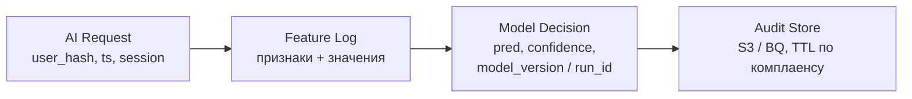

# Конспект: FinOps и Ethical AI by Design (Governance)

Конспект по занятиям курса AI Architect (hw-10), необходимым для ДЗ №10:

1. **FinOps - архитектура, управляемая стоимостью**
2. **Ethical AI by Design и архитектура для Governance**

Дополнительно в папке лекций есть материалы про технологический радар и API как продукт - краткие тезисы в конце.

---

## Содержание

### Раздел I. FinOps

- [Зачем это архитектору](#зачем-это-архитектору-finops)
- [Почему cloud bill выходит из-под контроля](#почему-cloud-bill-выходит-из-под-контроля)
- [FinOps - это инженерия](#finops--это-инженерия)
- [Уравнение стоимости](#уравнение-стоимости)
- [Тепловая карта затрат AI/ML](#тепловая-карта-затрат-aiml)
- [Рычаги архитектора](#рычаги-архитектора)
- [Инструментарий и тегирование](#инструментарий-и-тегирование)
- [Практика: три операции оптимизации](#практика-три-операции-оптимизации)
- [Матрица Impact vs Complexity](#матрица-impact-vs-complexity)
- [Золотое правило](#золотое-правило-ai-архитектора)

### Раздел II. Ethical AI и Governance

- [Responsible AI: три принципа](#responsible-ai-три-принципа)
- [Где встраивать этику в lifecycle](#где-встраивать-этику-в-lifecycle)
- [Четыре уровня Governance-архитектуры](#четыре-уровня-governance-архитектуры)
- [Decision Audit Log](#decision-audit-log)
- [FinOps × Governance](#finops--governance)
- [Чек-лист готовности к деплою](#чек-лист-готовности-к-деплою)
- [Model Card](#model-card)

### [Ключевые тезисы](#ключевые-тезисы) · [Источники](#источники) · [Глоссарий](#глоссарий)

---

# Раздел I. FinOps

## Зачем это архитектору (FinOps)

LLM и GPU - самые дорогие компоненты AI-системы в эксплуатации. Ошибка «запасной» карты или забытый training-кластер - сотни тысяч рублей в месяц. Архитектор обязан считать стоимость **до** закупки и встраивать cost как метрику наравне с latency и availability.

> **Цель занятия:** принимать архитектурные решения с учётом стоимости AI-систем; целевой impact оптимизации ≥ 20%.

---

## Почему cloud bill выходит из-под контроля

Cloud по умолчанию оптимизирован под **скорость развёртывания**, а не под стоимость. Три типичные «утечки»:

| Утечка | Суть | AI-специфика |
|--------|------|--------------|
| **Overprovisioning** | Ресурсы «с запасом» простаивают | GPU ждут training-запусков |
| **Zombie-ресурсы** | Забытые инстансы и orphaned volumes | Нет alerts и lifecycle |
| **Дорогие default** | Hot storage на всю историю; realtime там, где хватит batch | Inference всегда «online» |

> Самая дорогая архитектура - та, которую потом пришлось переделывать.

---

## FinOps - это инженерия

**FinOps = DevOps + Finance + Architecture.** Это не бухгалтерия.

| До FinOps | С FinOps |
|-----------|----------|
| Фиксированный бюджет | Динамическая оптимизация |
| Cost = проблема / наказание | Cost = системная метрика (как latency) |
| Централизованный контроль top-down | Команды владеют своим cost |
| Cost-review раз в квартал (post-mortem) | Cost-review на каждое архитектурное решение |

Протоколы: **Visibility → Accountability → Optimization → Iteration**.

Цикл FinOps Foundation: **Inform → Optimize → Operate** ([finops.org/framework](https://www.finops.org/framework/)).

---

## Уравнение стоимости

```
Cost = f(Architecture, Load, Efficiency)
```

| Рычаг | Кто управляет | Примеры |
|-------|---------------|---------|
| **Architecture** | Архитектор (полный контроль) | Топология, выбор модели, Spot vs On-Demand, batch vs realtime |
| **Load** | Бизнес / рынок (мало контроля) | Трафик, сезоны, кампании |
| **Efficiency** | Архитектор + платформа | Утилизация, autoscaling, права, TTL, теги |

~80% решений о финальной стоимости - в Architecture и Efficiency.

---

## Тепловая карта затрат AI/ML

Типичное распределение по пайплайну (ориентир с лекции):

| Этап | Драйвер | Доля (ориентир) |
|------|---------|-----------------|
| Data Ingestion | Storage + Transfer | малая |
| Feature Engineering | CPU | малая |
| **Training** | **GPU $$$** | **до ~70%** |
| Serving | Latency-driven overprovisioning | ~20% |
| Monitoring | Logging explosion | растёт без TTL |

Дорогие решения часто принимаются «по умолчанию» (ежедневный full retrain без drift-триггера).

---

## Рычаги архитектора

| Домен | Default (дорого) | FinOps-решение |
|-------|------------------|----------------|
| **Compute** | GPU 24/7, realtime везде, fixed instances | GPU только где нужен; batch vs realtime; autoscaling (экономия 50–70% на простое) |
| **Storage** | Всё в S3 Standard без cleanup | Lifecycle: Hot → Warm (~−50%) → Cold/Glacier (−80–95%) |
| **Network** | Cross-region transfer | Data locality в одной AZ; минимизация egress (~$0.08/GB) |

---

## Инструментарий и тегирование

| Слой | Инструменты | Зачем |
|------|-------------|-------|
| Billing | AWS Cost Explorer / GCP Billing / биллинг облака РФ | Визуализация счёта, аномалии |
| K8s | Prometheus + Kubecost / OpenCost | Cost per namespace / pod |
| MLOps | MLflow | Cost per experiment |
| Storage | S3 Lifecycle Policies | Hot → Warm → Cold |

> **Правило:** нет тегов → нет FinOps. Теги `project / team / env / cost-center` - условие accountability и rightsizing.

---

## Практика: три операции оптимизации

Кейс лекции (AS-IS намеренно плохой): e-commerce recommendations, daily full retrain, realtime ~500 RPS, **$23 000/мес**.

### Операция 1. GPU и Training

| AS-IS | TO-BE |
|-------|-------|
| 4× GPU On-Demand 24/7, утилизация ~15% | Spot + checkpoint каждые 10 мин |
| Daily full retrain | Weekly / по drift; incremental training |
| Training днём | Job window 00:00–06:00 |

Эффект: **−60–70% GPU-бюджета** (~$7–8.5k/мес), 2–3 недели.

### Операция 2. S3 Lifecycle («водопад данных»)

| Тир | Политика | Что хранить |
|-----|----------|-------------|
| Hot (Standard) | активные фичи | Feature store, горячее чтение (≤ ~5 TB из 40) |
| Warm (IA) | > 30 дней | Данные старше месяца |
| Cold (Glacier) | > 90 дней | Raw logs, старые эксперименты |

Эффект: **−70–80% storage** (~$2.5–2.8k/мес), 2–3 дня - самый быстрый ROI.

### Операция 3. Elastic Serving + Logging

| Проблема | Решение |
|----------|---------|
| 8 fixed K8s nodes, ночью 10% util | HPA по RPS/CPU; CA 2–10 nodes; Reserved база + Spot пики |
| DEBUG в prod, access log без sampling | INFO + sampling 1/10; TTL hot 7 дней → Glacier |

Эффект: K8s ~$1.5–2k/мес; логи ~$0.9–1.2k/мес.

**Итог кейса:** $23k → ~$10k/мес (**−56%**) без деградации качества сервиса.

---

## Матрица Impact vs Complexity

| Квадрант | Меры | Срок |
|----------|------|------|
| **Quick wins** | S3 Lifecycle, снижение логирования, частота training | 3 дня – 1 неделя |
| **Ключевые проекты** | GPU Spot + scheduling, K8s autoscaling | 2–3 недели |

Парето: **две меры** (Lifecycle + GPU Spot) дают ~**75%** экономии.

---

## Золотое правило AI-архитектора

FinOps - не «экономия ради экономии», а **управляемость системы через стоимость**.

Три вопроса на каждое решение:

1. **Сколько это стоит?** - конкретные ₽/мес, не «примерно дорого».
2. **Можно ли архитектурно дешевле?** - Spot, Batch, Cold Storage, distillation, routing.
3. **Что при росте нагрузки ×3?** - sensitivity analysis бюджета.

---

# Раздел II. Ethical AI и Governance

## Responsible AI: три принципа

**Responsible AI** - прозрачность, справедливость и подотчётность **встроены в архитектуру с начала**, а не «после релиза».

| Принцип | Смысл | Инструменты |
|---------|-------|-------------|
| **Transparency** | Пользователи и аудиторы понимают, как принято решение | SHAP / LIME, Model Cards, decision logs, audit API |
| **Fairness** | Нет дискриминации по защищённым признакам | Demographic parity, Equalized odds, bias analysis, fairness constraints |
| **Accountability** | За каждое решение есть ответственный человек | Ownership matrix, decision log, appeal, governance board |

Регуляторный контекст РФ (ориентиры лекции): **152-ФЗ**, ГОСТ Р 59276-2020, требования ФСТЭК / отраслевые приказы. Отказ от Responsible AI → штрафы, суды, репутация.

### Fairness в пайплайне

1. **До обучения:** oversampling / reweighting недопредставленных групп.
2. **Во время:** fairness penalty в loss; adversarial debiasing.
3. **После:** разные thresholds по группам (если обосновано и задокументировано).

Классический антипример: Amazon recruiting (2018) - bias в данных найма перенёсся в модель.

### Accountability

- Owner модели: ML-инженер + бизнес-владелец.
- Decision log (Langfuse / Phoenix / свой Audit Store).
- Appeal UI со SLA.
- Governance board для high-risk моделей.
- В high-stakes доменах (медицина) ответственность остаётся у человека.

---

## Где встраивать этику в lifecycle

| Этап | Что делать |
|------|------------|
| Data Collection | Согласие, ПДн, аудит bias датасета |
| Model Design | Выбор объяснимой модели / explainability-слой |
| Training | Fairness constraints, сбалансированные батчи |
| Evaluation | Метрики по группам, не только accuracy |
| Deployment | Model Card, owners, appeal |
| Monitoring | Drift + периодический fairness-аудит |

---

## Четыре уровня Governance-архитектуры

**Governance** - правила, процессы и инструменты для: видимости, контроля (stop/rollback), подотчётности и аудируемости за N лет.

| Слой | Содержание |
|------|------------|
| **1. Data** | DVC / версионирование, lineage (OpenLineage), 152-ФЗ |
| **2. Model** | Model Card, MLflow Registry, метаданные (кто/когда/на чём) |
| **3. Decision** | Лог каждого решения: timestamp, user_id (hash), features, prediction, model_version |
| **4. Audit** | Immutable store, ретроспектива, compliance-отчёты |



---

## Decision Audit Log

Минимум 4 поля: **request → features → prediction → model_version** (конкретный MLflow `run_id` / git hash, не строка `"production"`).

Стратегия хранения (иначе Audit съест бюджет):

| Риск решения | Что логируем |
|--------------|--------------|
| High-Risk | Полный контекст (features + ответ + версия) |
| Low-Risk | Агрегаты / sampling |
| Фичи | Hash + ссылка на Feature Store, не сырой дубль |

---

## FinOps × Governance

| Источник затрат | Ошибка | Решение |
|-----------------|--------|---------|
| Decision Log без TTL | Логи растут бесконечно | Retention: hot / cold / delete |
| GPU в dev | Не гасятся ночью | Auto-shutdown + Spot для batch |
| Большая модель на простые задачи | Overkill | Model routing / distillation |
| Полный лог всех inference | Одинаково дорого | Стратификация High/Low risk |
| Сырые фичи в Audit | Дубли | Feature hashing + Feature Store |

---

## Чек-лист готовности к деплою

**Data:** датасет версионирован; Data Sheet (источник, разметка, bias); ПДн по 152-ФЗ.

**Model:** в Registry; Model Card подписана (ML + Business Owner); risk level High / Limited / Minimal.

**Decision:** log включён; только хэши ID; retention задан.

**Audit:** store append-only; appeal со SLA; drift monitoring.

---

## Model Card

Концепция Google (2018–2019), стандарт Hugging Face. «Паспорт» модели.

| Раздел | Содержание |
|--------|------------|
| **Intended Use & Limitations** | Задача, аудитория, контекст, юрисдикция, out-of-scope, граничные случаи |
| **Training Data & Bias** | Источник, период, объём, разметка, preprocess, split, недопредставленные группы, исключённые признаки |
| **Evaluation Results** | Метрики качества + fairness по группам |
| **Ethical Considerations** | Риски, рекомендации, owner и контакт |

Model Card **обновляется при каждом переобучении**.

Шаблоны: [HF Model Cards](https://huggingface.co/docs/hub/model-cards), [Mitchell et al., arXiv:1810.03993](https://arxiv.org/abs/1810.03993).

---

## Краткие тезисы смежных лекций (папка hw-10)

### Технологический радар

Кольца **Hold / Assess / Trial / Adopt**. Перенос в Adopt - через защиту решения: бизнес-риск, ROI, стоимость поддержки (не «красота стека»).

### API как продукт

Consumer-First, Design-First (OpenAPI до кода), Consistency, Evolvability, Discoverability. Для AI API: версионирование, gateway (auth, rate limit, биллинг), депрекейшн с Sunset-header.

---

## Ключевые тезисы

1. `Cost = f(Architecture, Load, Efficiency)` - архитектор крутит Architecture и Efficiency.
2. Нет тегов → нет FinOps; cost - метрика как latency.
3. Responsible AI = Transparency + Fairness + Accountability **by design**.
4. Governance - четыре слоя: Data → Model → Decision → Audit.
5. Decision Log: request, features, prediction, model_version.
6. Model Card - живой документ; баланс цена/качество фиксируется явно (routing, distillation, Spot).

---

## Источники

| Что | Ссылка |
|-----|--------|
| FinOps Framework | https://www.finops.org/framework/ |
| FinOps for AI / K8s | https://www.finops.org/wg/scaling-kubernetes-for-ai-ml-workloads-with-finops/ |
| Model Cards (HF) | https://huggingface.co/docs/hub/model-cards |
| Model Cards (paper) | https://arxiv.org/abs/1810.03993 |
| SHAP | https://shap.readthedocs.io/ |
| LIME | https://github.com/marcotcr/lime |

---

## Глоссарий

| Термин | Определение |
|--------|-------------|
| **FinOps** | Практика управления облачной стоимостью как инженерной дисциплиной |
| **Spot / Preemptible** | Прерываемые инстансы со скидкой 60–90%; нужны checkpoint |
| **Lifecycle / TTL** | Автоперевод/удаление данных по возрасту |
| **Model Distillation** | Обучение меньшей student-модели на выходах teacher |
| **Model Routing** | Маршрутизация запроса к минимально достаточной модели |
| **Model Card** | Документ о назначении, данных, метриках и этических рисках модели |
| **Demographic parity** | Одинаковая доля положительных решений по группам |
| **Equalized odds** | Уравненные TPR/FPR по группам |
| **Decision Audit Log** | Полная трассировка AI-решения для аудита и обжалования |
| **Governance** | Система видимости, контроля, ownership и аудируемости AI |
