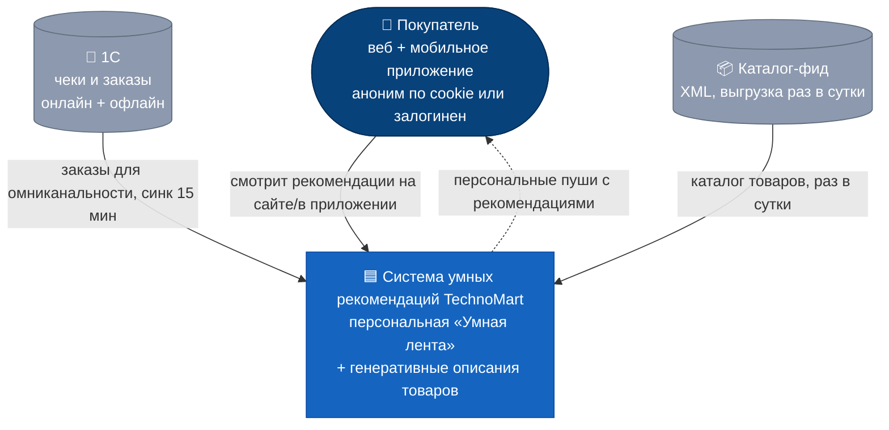
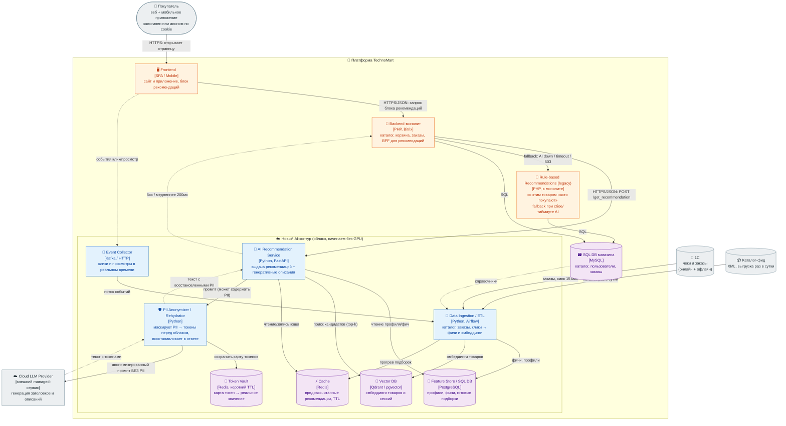
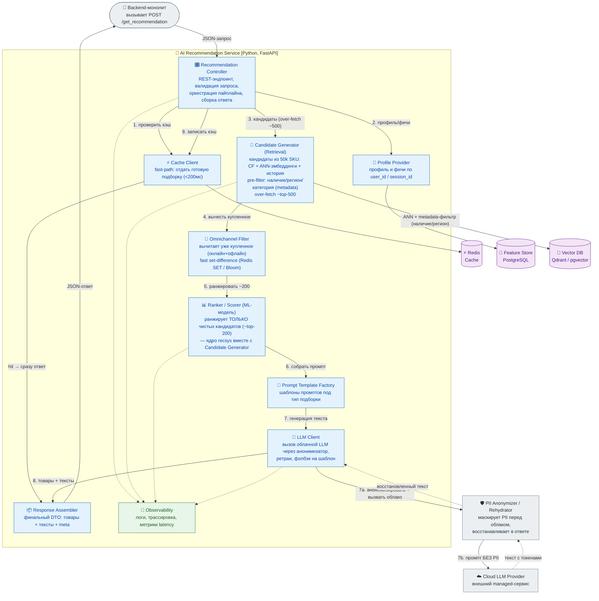
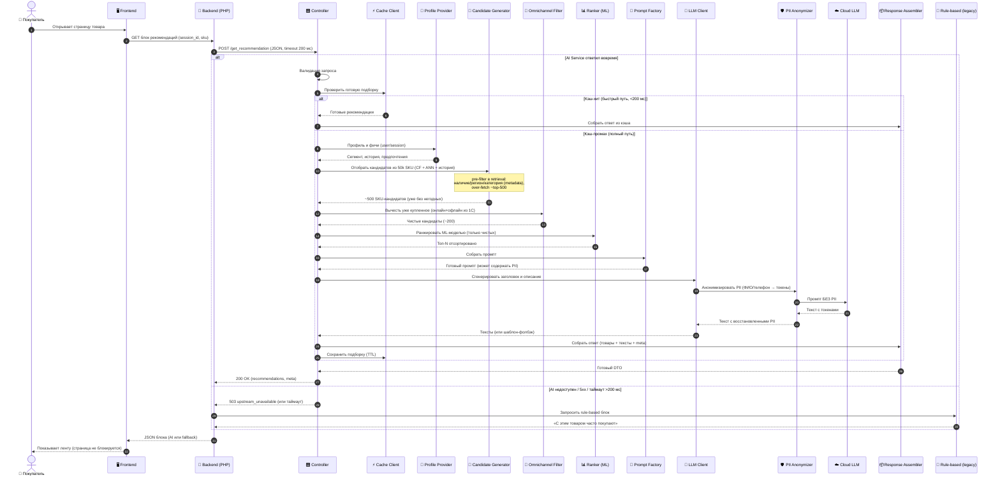

# ДЗ №2. Многоуровневое проектирование: от C4 Model до спецификации API

**Кейс:** система умных рекомендаций для ритейлера **TechnoMart** (продолжение ДЗ №1).

**Цель:** спроектировать многоуровневую архитектуру AI-сервиса с диаграммами **C4** (C2/C3),
**Sequence Diagram** для ключевого сценария и **OpenAPI**-спецификацией API для согласования
интеграции Backend ↔ AI Service.

## Файлы

| Файл | Что это |
|------|---------|
| `diagrams/c1-context.mmd` | C1 — контекст: система и окружение |
| `diagrams/c2-container.mmd` | C2 — контейнеры всей системы |
| `diagrams/c3-component.mmd` | C3 — компоненты внутри AI Service |
| `diagrams/sequence.mmd` | Sequence — «запрос рекомендации» |
| `diagrams/workspace.dsl` | Тот же C1+C2+C3 в Structurizr DSL ([playground](https://playground.structurizr.com/)) |
| `api/openapi.yaml` | OpenAPI 3.0.3 для `/get_recommendation` (валиден) |

PNG/PDF: открыть `.mmd` в [mermaid.live](https://mermaid.live) → Export. API — в [Swagger Editor](https://editor.swagger.io).

## Диаграммы

<details open>
<summary>🌍 C1 — System Context</summary>



Кто пользуется системой (Покупатель) и внешние источники данных (1С, каталог-фид).

</details>

<details>
<summary>📦 C2 — Container Diagram</summary>



Контейнеры системы: Frontend, Backend (BFF), AI Service, Vector DB, SQL DB, кэш, ETL.
Особенности: **облачная LLM + анонимизация PII** (наружу уходит промпт без персональных данных) и **fallback** на старый rule-based блок при сбое/таймауте AI (≤200 мс).

</details>

<details>
<summary>🔬 C3 — Component Diagram (внутри AI Service)</summary>



Внутренности AI Service: каждый компонент — одна зона ответственности (Single Responsibility). Пронумерованные шаги совпадают с Sequence-диаграммой. Как именно работает ядро рекомендаций — в разделе [«Как работает RecSys»](#как-работает-recsys-кратко) ниже.

</details>

<details>
<summary>🔁 Sequence — «Пользователь запрашивает рекомендацию»</summary>



Быстрый путь — из кэша (держит SLA 200 мс). При кэш-промахе — полный пайплайн с генерацией через анонимизатор. При сбое/таймауте AI — fallback на старый rule-based блок.

</details>

## Как работает RecSys (кратко)

Ядро рекомендаций — **классический двухэтапный RecSys**. LLM в подборе товаров **не участвует** — она только генерирует тексты (заголовок/описание) к уже отобранным товарам.

**Offline (заранее, поток ETL):** каталог (XML) + заказы из 1С + клики/просмотры превращаются в фичи и эмбеддинги товаров/сессий и складываются в **Feature Store** и **Vector DB**; популярные подборки прогреваются в **кэш**.

**Online (на запрос, бюджет ≤ 200 мс):**

1. **Retrieval — `Candidate Generator`:** из 50k SKU быстро отбирает кандидатов — collaborative filtering + ANN-поиск эмбеддингов в Vector DB + история. Жёсткие фильтры (наличие/регион/категория) применяются прямо здесь (pre-filter), берётся с запасом (~top-500).
2. **Фильтрация — `Omnichannel Filter`:** вычитает уже купленное (онлайн+офлайн из 1С) быстрым set-difference (Redis SET / Bloom) → ~top-200. Всё лишнее отсекается **до** ранжирования.
3. **Ranking — `Ranker` (ML):** сортирует оставшихся по предсказанной вероятности клика/покупки → top-N.
4. **Тексты — `LLM Client`:** генерирует заголовок/описание к выбранным товарам через **PII Anonymizer** (в облако уходит промпт без персональных данных).
5. **Скорость:** готовые подборки отдаются из кэша за <200 мс; при сбое/таймауте — fallback на старый rule-based блок.

**Cold-start:** аноним/новый пользователь — рекомендации по `session_id`/cookie и популярному в категории/сегменте (`reason = popular_in_segment`); новый товар без истории продаж — по контентным эмбеддингам.

## Порядок работы (по Sequence)

| # | Шаг | Кто → Кто | Что происходит |
|---|-----|-----------|----------------|
| 1 | Открытие страницы | Покупатель → Frontend → Backend | Frontend запрашивает блок рекомендаций (`session_id`, `sku`) |
| 2 | Вызов AI | Backend → Controller | `POST /get_recommendation` с таймаутом 200 мс (Backend = BFF) |
| 3 | Кэш | Controller → Cache Client | Если есть готовая подборка — сразу ответ (**быстрый путь**, <200 мс) |
| 4 | Профиль | Controller → Profile Provider | (кэш-промах) сегмент, история, предпочтения по user/session |
| 5 | Кандидаты | Controller → Candidate Generator | Отбор из 50k SKU (CF + ANN + история), pre-filter, over-fetch ~top-500 |
| 6 | Фильтр | Controller → Omnichannel Filter | Вычесть уже купленное (онлайн+офлайн из 1С) → ~top-200 |
| 7 | Ранжирование | Controller → Ranker (ML) | Сортировка по вероятности покупки → top-N |
| 8 | Промпт | Controller → Prompt Factory | Сборка промпта под тип подборки |
| 9 | Генерация текста | LLM Client → PII Anonymizer → Cloud LLM | PII → токены, облако генерит текст, токены восстанавливаются |
| 10 | Сборка + кэш | Controller → Response Assembler / Cache | Финальный DTO (товары + тексты + meta), запись в кэш (TTL) |
| 11 | Ответ | Controller → Backend → Frontend | `200 OK`, Frontend показывает «Умную ленту» |
| — | **Fallback** | Backend → Rule-based (legacy) | Если AI недоступен / `5xx` / таймаут >200 мс — старый rule-based блок, страница не блокируется |

## API Spec — `/get_recommendation`

Полный контракт: [`api/openapi.yaml`](api/openapi.yaml) (OpenAPI 3.0.3, валиден).

- **Метод/путь:** `POST /v1/get_recommendation` — контракт **Backend → AI Service**.
- **Аутентификация:** сервис-к-сервису по заголовку `X-Api-Key` (+ рекомендован mTLS во внутренней сети).
- **Таймаут:** Backend ждёт ≤ 200 мс; при `5xx`/`503`/таймауте — fallback на rule-based блок.

**Запрос** (`RecommendationRequest`):

| Поле | Тип | Обяз. | Описание |
|------|-----|-------|----------|
| `session_id` | string (uuid) | да | ID сессии из cookie — нужен даже для анонима |
| `user_id` | string \| null | нет | ID пользователя, если залогинен |
| `context.page_type` | enum: `home/product/category/cart/search` | да | Где показывается блок |
| `context.current_sku` | string \| null | нет | SKU текущего товара (для `product`) |
| `context.category_id` | string \| null | нет | Категория |
| `context.device` | enum: `desktop/mobile/app` | нет | Тип устройства |
| `limit` | integer `1..50` | нет | Сколько товаров вернуть (default 10) |
| `generate_text` | boolean | нет | Генерировать ли заголовок/описание (default true) |

**Ответ** (`RecommendationResponse`): `request_id`, массив `recommendations` и `meta`.

| Поле item | Тип | Описание |
|-----------|-----|----------|
| `sku` | string | Артикул |
| `title` | string | Название из каталога |
| `price` / `currency` | number / string | Цена и валюта |
| `score` | number `0..1` | Скор ранжирования |
| `reason` | enum | Причина: `complementary_to_viewed`, `frequently_bought_together`, `personalized`, `popular_in_segment` |
| `generated_title` / `generated_description` | string \| null | Генеративные тексты (null при фолбэке) |
| `image_url` | string (uri) | Картинка |

`meta`: `model_version`, `llm_model`, `cache_hit`, `latency_ms`, `generated`.

**Коды ответов:** `200` OK · `400` битый запрос · `401` нет/неверный ключ · `422` ошибка валидации ·
`429` rate limit (`Retry-After`) · `500` внутренняя · `503` зависимость недоступна → fallback.

**Пример запроса:**

```json
{
  "session_id": "a3f1c9e2-7b44-4d2a-9c11-2f0e8d6b1234",
  "user_id": null,
  "context": { "page_type": "product", "current_sku": "SKU-100500", "device": "mobile" },
  "limit": 6,
  "generate_text": true
}
```

**Пример ответа (фрагмент):**

```json
{
  "request_id": "f17c2b9a-0d3e-4a8b-bb12-91a6f0c7e001",
  "recommendations": [
    {
      "sku": "SKU-200300",
      "title": "Беспроводная мышь Logitech MX",
      "price": 4990.00, "currency": "RUB", "score": 0.92,
      "reason": "complementary_to_viewed",
      "generated_title": "Идеальная пара к вашему ноутбуку",
      "generated_description": "Иван, вы недавно смотрели ноутбуки — эта мышь повысит продуктивность."
    }
  ],
  "meta": { "model_version": "ranker-2.3.1", "llm_model": "cloud-llm-gpt", "cache_hit": false, "latency_ms": 173, "generated": true }
}
```

**Пример ошибки (`503` → fallback):**

```json
{
  "error": {
    "code": "upstream_unavailable",
    "message": "LLM timeout, fallback recommended",
    "request_id": "f17c2b9a-0d3e-4a8b-bb12-91a6f0c7e001"
  }
}
```
