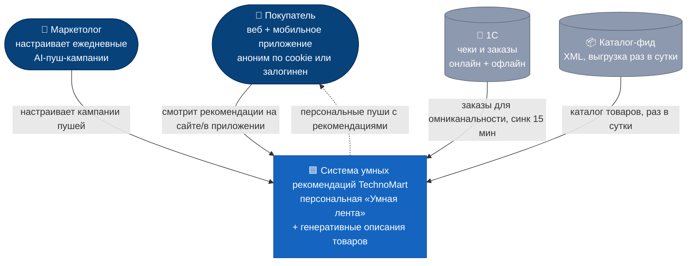
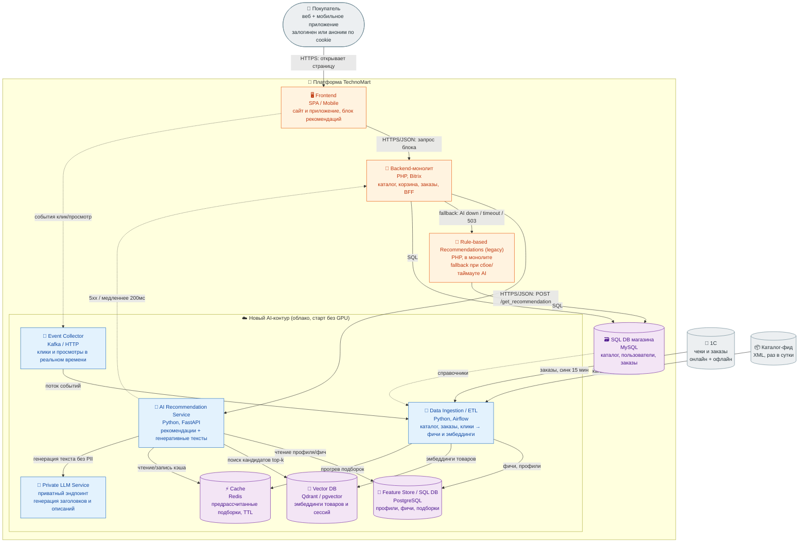
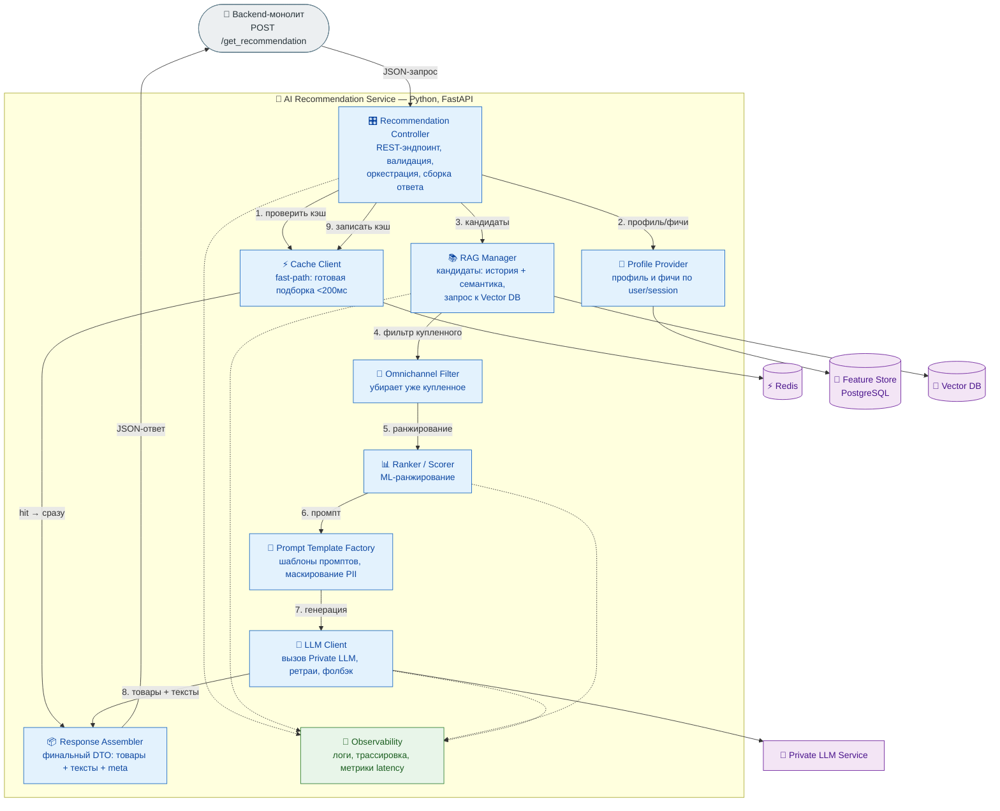
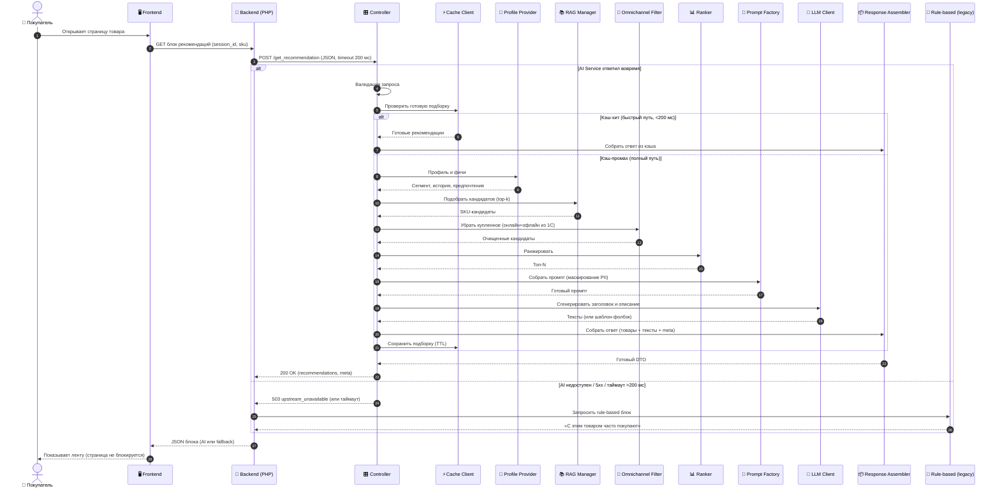

# ДЗ №2. Многоуровневое проектирование: от C4 Model до спецификации API

**Кейс:** система умных рекомендаций для ритейлера **TechnoMart** (продолжение ДЗ №1).

**Цель:** спроектировать многоуровневую архитектуру AI-сервиса с диаграммами **C4** (C2/C3),
**Sequence Diagram** для ключевого сценария и **OpenAPI**-спецификацией API для согласования
интеграции Backend ↔ AI Service.

## 🗺 Диаграммы

Исходники Mermaid (для [mermaid.live](https://mermaid.live) / GitHub / draw.io):
[`diagrams/c1-context.mmd`](diagrams/c1-context.mmd) ·
[`diagrams/c2-container.mmd`](diagrams/c2-container.mmd) ·
[`diagrams/c3-component.mmd`](diagrams/c3-component.mmd) ·
[`diagrams/sequence.mmd`](diagrams/sequence.mmd)

Тот же C4-набор в **Structurizr DSL** (C1 + C2 + C3 в одном файле):
[`diagrams/workspace.dsl`](diagrams/workspace.dsl) — скопируйте содержимое в
[Structurizr Playground](https://playground.structurizr.com/), вид переключается списком
`C1_Context / C2_Containers / C3_Components`.

Спецификация API: [`api/openapi.yaml`](api/openapi.yaml) (валидна по OpenAPI 3.0.3).

Диаграммы отрисованы ниже прямо в README (GitHub рендерит Mermaid):

<details open>
<summary>🌍 C1 — System Context (система и окружение)</summary>



> На C1 показаны только те, кто **взаимодействует** с системой и внешние
> системы (1С, каталог-фид). CEO/CTO/команда клиента — это **стейкхолдеры и драйверы**, см. раздел ниже

</details>

<details>
<summary>📦 C2 — Container Diagram (вся система)</summary>



</details>

<details>
<summary>🔬 C3 — Component Diagram (внутри AI Recommendation Service)</summary>



</details>

<details>
<summary>🔁 Sequence — «Пользователь запрашивает рекомендацию»</summary>



</details>

---

## 📦 Состав документации

| Файл | Что это |
|------|---------|
| `README.md` | Конспект C4/LLD, диаграммы, описание компонентов и API (этот файл) |
| `diagrams/c1-context.mmd` | C4 L1 — контекст: система и окружение (Mermaid) |
| `diagrams/c2-container.mmd` | C4 L2 — контейнеры всей системы (Mermaid) |
| `diagrams/c3-component.mmd` | C4 L3 — компоненты внутри AI Service (Mermaid) |
| `diagrams/sequence.mmd` | Sequence сценария «запрос рекомендации» (Mermaid) |
| `diagrams/workspace.dsl` | Structurizr DSL: C1 + C2 + C3 для [playground.structurizr.com](https://playground.structurizr.com/) |
| `api/openapi.yaml` | OpenAPI 3.0.3 для эндпоинта `/get_recommendation` |

Как получить PNG/PDF: открыть `.mmd` в [mermaid.live](https://mermaid.live) → Export.
OpenAPI можно открыть в [Swagger Editor](https://editor.swagger.io) (валидация + «Try it out»).

---

## 1. Конспект: ключевые идеи занятия

### C4 Model — уровни детализации

- **C1 Context** — система целиком и её внешнее окружение (пользователи, внешние системы).
- **C2 Container** — крупные исполняемые единицы (приложения, сервисы, БД) и протоколы между ними.
- **C3 Component** — «проваливаемся» внутрь одного контейнера: его внутренние компоненты и связи.
- **C4 Code** — классы/код (обычно не рисуют вручную).

В этом ДЗ делаем **C2** (вся система) и **C3** (внутренности AI Service) — это и есть LLD контейнера.

### Sequence Diagram

Показывает **порядок взаимодействий во времени** для конкретного сценария. Важное правило связности:
участники Sequence-диаграммы = компоненты с C3, а шаги = вызовы между ними. Так LLD остаётся
непротиворечивым.

### OpenAPI (Swagger)

Машиночитаемый **контракт API**: пути, методы, схемы запросов/ответов с типами, примеры и коды
ошибок. Позволяет командам (PHP-бэкенд и AI-сервис) договориться об интеграции до написания кода,
сгенерировать клиентов/моки и валидировать запросы.

---

## 2. Стейкхолдеры и архитектурные драйверы

Эти роли не взаимодействуют с системой напрямую (поэтому их нет на C1), но их интересы —
ключевые **драйверы и ограничения** архитектуры.

| Стейкхолдер / фактор | Интерес / боль | Как учтено в архитектуре |
|---|---|---|
| 👔 **CEO** | «Магия как у Apple», нетерпелив, первый результат за 3 мес | MVP-first, облако без закупки GPU, быстрый путь через кэш — раннее демо |
| 👔 **CTO** | Скептик, боится «уронить» монолит, ничего не переписывать в ядре | AI-контур **вынесен** из монолита; Backend лишь проксирует вызов; ядро сайта не трогаем; при сбое AI — **автоматический fallback на старый rule-based блок** (см. §6a), сайт не падает |
| 📣 **Директор по маркетингу** | Ежедневные пуши с AI-рекомендациями | Маркетолог как потребитель на C1; тот же AI Service питает пуш-кампании |
| 🧑‍💻 **Команда клиента** | Сильные PHP-разработчики, **нет DS/DE** | Ставка на managed/облачные сервисы и готовые модели; минимум ML-инфры «руками» |
| 🏗 **Интегратор (мы)** | Спроектировать и внедрить | Авторы архитектуры; на диаграммы как актор не выносимся |
| 🔒 **Безопасность / ПДн** | Данные клиентов не должны утекать в публичные LLM | Генерация только на **Private LLM**; маскирование PII в Prompt Template Factory |

---

## 3. Как архитектура закрывает требования кейса TechnoMart

| «Хотелка» / ограничение | Решение в архитектуре |
|---|---|
| **Умная лента даже для анонимов** | Рекомендации по `session_id` из cookie; `Profile Provider` строит профиль по сессии без логина |
| **Generative Descriptions** | `Prompt Template Factory` + `LLM Client` → `Private LLM Service` генерируют заголовок/описание |
| **Омниканальность** (не предлагать купленное офлайн) | `Omnichannel Filter` исключает SKU из заказов 1С (онлайн+офлайн), которые ETL подтягивает каждые 15 мин |
| **Скорость ≤ 200 мс** | `Cache` (Redis) с предрассчитанными подборками + быстрый путь в `Controller`; тяжёлая генерация прогревается заранее/асинхронно |
| **Старт за 3 месяца, без GPU** | AI-контур в облаке, начинаем с managed-сервисов и небольшой приватной модели; «железо» не блокирует старт |
| **Безопасность PII** (нельзя в публичные LLM) | Генерация только на **Private LLM**; `Prompt Template Factory` маскирует ПДн (ФИО/телефон) перед отправкой в модель |
| **Монолит «задыхается»** | AI-контур вынесен из монолита; Backend лишь проксирует вызов, тяжёлые расчёты — в отдельных хранилищах (Vector DB, Feature Store) |
| **Данные из XML/1С/кликов** | `Data Ingestion / ETL` + `Event Collector` собирают всё в Feature Store и Vector DB |

---

## 4. C2 — Container Diagram (описание)

Контейнеры (по заданию выделены **Frontend, Backend, AI Service, Vector DB, SQL DB**, плюс
обеспечивающие):

- **🖥 Frontend** — сайт и мобильное приложение, рендерит блок рекомендаций; шлёт события кликов.
- **🧱 Backend-монолит (PHP/Bitrix)** — существующая система; выступает BFF: принимает запрос блока
  и вызывает AI Service по HTTPS/JSON. Читает каталог/заказы из **MySQL**.
- **🛟 Rule-based Recommendations (legacy)** — старый модуль рекомендаций в монолите; остаётся как
  **fallback**: Backend переключается на него при сбое/таймауте AI Service (graceful degradation, см. §6a).
- **🗃 SQL DB магазина (MySQL)** — текущая операционная БД (каталог, пользователи, заказы).
- **🤖 AI Recommendation Service (Python/FastAPI)** — новый сервис, ядро ДЗ (детализирован в C3).
- **🧱 Vector DB (Qdrant/pgvector)** — эмбеддинги товаров и сессий для семантического подбора.
- **🧮 Feature Store / SQL DB (PostgreSQL)** — профили, фичи и готовые подборки.
- **⚡ Cache (Redis)** — предрассчитанные рекомендации для SLA 200 мс.
- **🔄 ETL + 📡 Event Collector** — наполняют данные из каталог-XML (раз в сутки), заказов 1С
  (15 мин) и потока кликов.
- **🧠 Private LLM Service** — приватная генеративная модель (PII не уходит наружу).

**Протоколы:** Frontend↔Backend и Backend↔AI Service — HTTPS/JSON (REST);
Backend↔MySQL — SQL; AI Service↔хранилища — нативные драйверы; события — Kafka/HTTP.

---

## 5. C3 — Component Diagram (описание)

«Проваливаемся» внутрь **AI Recommendation Service**. Компоненты (Single Responsibility):

| Компонент | Ответственность |
|---|---|
| 🎛 **Recommendation Controller** | Точка входа REST, валидация, оркестрация пайплайна, сборка ответа |
| ⚡ **Cache Client** | Быстрый путь: вернуть готовую подборку из Redis (<200 мс) |
| 👤 **Profile Provider** | Профиль и фичи пользователя/сессии из Feature Store |
| 📚 **RAG Manager** | Сбор кандидатов: история + семантический поиск в Vector DB |
| 🔁 **Omnichannel Filter** | Исключение уже купленных товаров (онлайн+офлайн) |
| 📊 **Ranker / Scorer** | ML-ранжирование кандидатов |
| 🧩 **Prompt Template Factory** | Шаблоны промптов под тип подборки + маскирование PII |
| 🧠 **LLM Client** | Вызов Private LLM, ретраи, фолбэк на шаблонный текст |
| 📦 **Response Assembler** | Финальный DTO: товары + сгенерированные тексты + meta |
| 🔭 **Observability** | Логи, трассировка, метрики (в т.ч. latency) |

> Эти же компоненты выступают участниками Sequence-диаграммы — обеспечивается связность C3 ↔ Sequence.

---

## 6. Sequence — «Пользователь запрашивает рекомендацию»

Поток (полный путь при кэш-промахе): `Controller → Cache → Profile Provider → RAG Manager →
Omnichannel Filter → Ranker → Prompt Template Factory → LLM Client → Response Assembler`.
При кэш-хите — короткий быстрый путь (Cache → Assembler), что и держит SLA 200 мс.
Если LLM/Vector DB недоступны или превышен бюджет времени — отдаётся фолбэк (HTTP 503 + rule-based блок),
страница не блокируется.

---

## 6a. Отказоустойчивость и переключение на старую систему (graceful degradation)

Ключевое требование: **AI не должен «уронить» сайт** (страх CTO) и страница не должна тормозить
(SLA ≤ 200 мс). Поэтому деградация **многоуровневая** — чем серьёзнее сбой, тем проще ответ,
но витрина работает всегда.

| Уровень | Что сломалось | Поведение системы | Где на схеме |
|---|---|---|---|
| L1 | LLM недоступен/медленный | Отдаём товары **без генеративного текста** (шаблон), `meta.generated=false` | `LLM Client` → фолбэк на шаблон (C3) |
| L2 | Vector DB / Ranker сбоит | Упрощённый подбор: **популярное в сегменте** из Feature Store/кэша | `RAG Manager` / `Ranker` (C3) |
| L3 | **AI Service целиком down / 5xx / таймаут >200 мс** | Backend (BFF) откатывается на **Rule-based (legacy)** блок в монолите | `Backend → Rule-based (legacy)` (C2, Sequence) |

Как это работает:

- Backend вызывает AI Service с **жёстким таймаутом ~200 мс** и обработкой `5xx/503`.
- При срабатывании любого из этих условий BFF **синхронно** запрашивает старый rule-based модуль
  (тот самый «с этим товаром часто покупают») и отдаёт его пользователю — **без перезагрузки и без пустого блока**.
- Старая система **остаётся в проде** на весь период внедрения → можно катить AI **на часть трафика**
  (canary / feature-flag) и мгновенно откатываться. Это прямой ответ на условие «3 месяца или закроют».

> Контрактно фолбэк зафиксирован в OpenAPI: ответ **`503 upstream_unavailable`** с пометкой
> «fallback recommended» — Backend по нему обязан показать legacy-блок.

---

## 7. API Spec — `/get_recommendation`

Полный контракт: [`api/openapi.yaml`](api/openapi.yaml). Кратко:

- **Метод/путь:** `POST /v1/get_recommendation`
- **Назначение:** контракт **Backend → AI Service**.
- **Аутентификация:** сервис-к-сервису по `X-Api-Key` (+ рекомендован mTLS во внутренней сети).
- **Запрос** (типы — в схеме `RecommendationRequest`): `session_id` (uuid, обязателен даже для анонима),
  `user_id` (nullable), `context` (`page_type`, `current_sku`, `category_id`, `device`),
  `limit` (1..50), `generate_text` (bool).
- **Ответ** (`RecommendationResponse`): `request_id`, массив `recommendations`
  (`sku`, `title`, `price`, `currency`, `score`, `reason`, `generated_title`, `generated_description`,
  `image_url`) и `meta` (`model_version`, `llm_model`, `cache_hit`, `latency_ms`, `generated`).
- **Примеры:** в спеке есть примеры запроса (аноним / залогинен) и успешного ответа.
- **Коды ошибок:** `400` (битый запрос), `401` (нет/неверный ключ), `422` (валидация),
  `429` (rate limit, с `Retry-After`), `500` (внутренняя), `503` (зависимость недоступна → фолбэк).

Пример запроса:

```json
{
  "session_id": "a3f1c9e2-7b44-4d2a-9c11-2f0e8d6b1234",
  "user_id": null,
  "context": { "page_type": "product", "current_sku": "SKU-100500", "device": "mobile" },
  "limit": 6,
  "generate_text": true
}
```

Пример ответа (фрагмент):

```json
{
  "request_id": "f17c2b9a-0d3e-4a8b-bb12-91a6f0c7e001",
  "recommendations": [
    {
      "sku": "SKU-200300",
      "title": "Беспроводная мышь Logitech MX",
      "price": 4990.00, "currency": "RUB", "score": 0.92,
      "reason": "complementary_to_viewed",
      "generated_title": "Идеальная пара к вашему ноутбуку",
      "generated_description": "Иван, вы недавно смотрели ноутбуки — эта мышь повысит продуктивность."
    }
  ],
  "meta": { "model_version": "ranker-2.3.1", "cache_hit": false, "latency_ms": 173, "generated": true }
}
```

---

## 8. Соответствие критериям приёмки

- ✅ **Нотация / направления связей** — C2 и C3 в нотации C4, стрелки направлены по потоку вызова;
  у контейнеров указан технологический стек.
- ✅ **Связность C3 ↔ Sequence** — участники Sequence-диаграммы дословно совпадают с компонентами C3
  (Controller, Cache Client, Profile Provider, RAG Manager, Omnichannel Filter, Ranker,
  Prompt Template Factory, LLM Client, Response Assembler).
- ✅ **Качество API** — OpenAPI 3.0.3 (валидирован): типы данных, ограничения (`minimum/maximum`,
  `enum`, `nullable`), примеры запросов/ответов и полный набор кодов ошибок.
