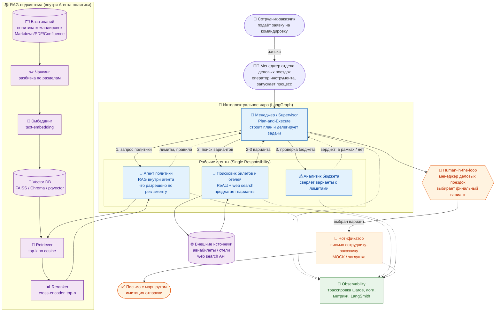
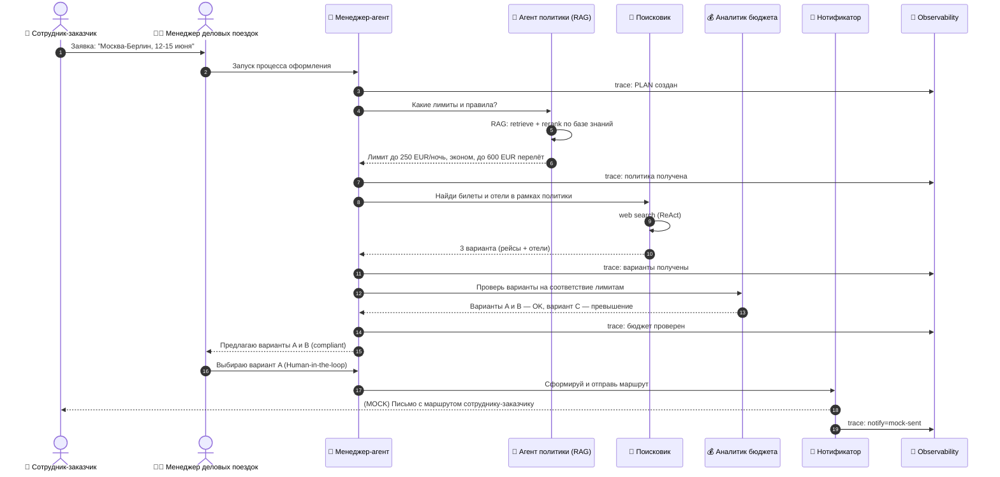

# ДЗ №3. Проектирование интеллектуального ядра: RAG и мультиагентная система

## 🗺 Диаграммы

Исходники: [`diagrams/architecture.mmd`](diagrams/architecture.mmd) · [`diagrams/sequence.mmd`](diagrams/sequence.mmd)
(для PNG/PDF — открыть код в [mermaid.live](https://mermaid.live) → Export).

Диаграммы отрисованы ниже прямо в README (GitHub рендерит Mermaid):

<details open>
<summary>📐 Архитектура мультиагентной системы</summary>



</details>

<details>
<summary>🔁 Sequence: обмен сообщениями между агентами</summary>



</details>

---

**Бизнес-процесс:** автоматизация оформления командировок — подсистема «Умный помощник».

**Цель:** спроектировать мультиагентную систему с RAG-пайплайном, которая помогает оформить
командировку: понимает корпоративную политику, ищет билеты и отели, проверяет бюджет,
а финальное решение оставляет за человеком и «отправляет» итог на почту.

> ⚠️ **Для кого инструмент.** Это **рабочее место менеджера отдела деловых поездок**, а не
> сотрудника, который едет в командировку. Помощник нужен тому, кто **оформляет** поездки и
> **планирует бюджет**, — именно он принимает финальное решение (Human-in-the-loop).
> Заказывающий сотрудник подаёт заявку, которую далее берут в работу и запускают процесс планирования командировки.

### Роли

- **Сотрудник-заказчик** — отправляет заявку на командировку (направление, даты) и ждёт результат.
- **Менеджер отдела деловых поездок** — получает заявку, **запускает процесс агента**, проверяет
  предложенные варианты, выбирает финальный (бюджет + соответствие политике) и подтверждает отправку.
- **Агенты** — выполняют специализированные задачи: извлекают правила из политики (RAG), ищут билеты и отели, проверяют бюджет, формируют итоговое предложение.

### Процесс (end-to-end)

1. **Заявка.** Сотрудник-заказчик создаёт заявку (например, «Москва → Берлин, 12–15 июня»).
2. **Приём заявки.** Менеджер деловых поездок получает заявку во входящих и запускает помощника.
3. **Работа агентов.** Агентный конвейер: политика (RAG) → поиск билетов и отелей → проверка бюджета
   → формирование compliant-вариантов. Все шаги трассируются (observability).
4. **Решение человека.** Менеджер видит 2–3 варианта, прошедших политику и бюджет, и выбирает один
   (Human-in-the-loop). Агенты только **предлагают**, не бронируют сами.
5. **Уведомление.** Итог «отправляется» письмом сотруднику-заказчику (в прототипе — заглушка).

---

## 📦 Состав документации

| Файл | Что это |
|------|---------|
| `README.md` | Конспект, выбор паттернов, архитектура, RAG-flow |
| `diagrams/architecture.mmd` | Mermaid-код схемы архитектуры (компоненты + RAG + observability) |
| `diagrams/sequence.mmd` | Mermaid-код обмена сообщениями между агентами (runtime) |
| `multi_agent_travel.ipynb` | Colab-нотбук: рабочий минимальный пример на **LangGraph** |

Как получить PNG/PDF из схемы: открыть содержимое `.mmd` в [mermaid.live](https://mermaid.live)
→ Export → PNG/SVG. Либо вставить в Structurizr / draw.io (поддерживают Mermaid).

---

## 1. Конспект: ключевые идеи

### Агентные циклы

- **ReAct (Reason + Act)** — агент в цикле чередует «рассуждение» и «действие» (вызов инструмента),
  получает наблюдение (observation) и повторяет, пока не достигнет цели.
  Подходит для агентов с инструментами: **Поисковик** ходит в web search.
- **Plan-and-Execute** — сначала строится явный план из шагов, затем шаги исполняются
  (часто разными исполнителями). Меньше «блужданий», лучше предсказуемость и контроль стоимости.
  Этот паттерн использует **Менеджер**.

### Паттерны мультиагентных систем

- **Иерархия (Supervisor / Manager–Worker)** — один управляющий агент декомпозирует задачу
  и делегирует специализированным исполнителям. Берем именно его как основу.
- **Сотрудничество (Collaboration)** — агенты обмениваются промежуточными результатами
  (политика → поиск → бюджет) через общее состояние графа.

### Три обязательных аспекта агента

1. **Планирование (Planning)** — Менеджер строит план из шагов под конкретную заявку.
2. **Действие (Action)** — агенты вызывают инструменты: RAG-retrieve, web search, проверка бюджета, отправка письма.
3. **Обсервабилити (Observability)** — каждый шаг пишет лог (trace) в состояние:
  что сделал, какой агент, какой результат. В проде — LangSmith / OpenTelemetry.

---

## 2. Выбор паттернов и декомпозиция агентов (Single Responsibility)

Базовый паттерн — **Supervisor (иерархия) + Plan-and-Execute**, исполнители работают по **ReAct**,
финальный выбор — **Human-in-the-loop**.

| Агент | Ответственность (одна!) | Цикл | Инструменты |
|-------|-------------------------|------|------------|
| 🧭 **Менеджер** | Планирует, делегирует, агрегирует, общается с человеком | Plan-and-Execute | — (оркестрация) |
| 📜 **Агент политики** | Достаёт релевантные правила из базы знаний | RAG (single-shot, 1 запрос) | Retriever + Reranker (**RAG внутри агента**) |
| 🔎 **Поисковик** | Находит билеты и отели, **предлагает** варианты | ReAct | Web search API |
| 💰 **Аналитик бюджета** | Сверяет варианты с лимитами политики | детерминированный | Калькулятор/правила |
| 📧 **Нотификатор** | Формирует и «отправляет» итог на почту (**MOCK**) | — | SMTP |

> Почему так: каждый агент делает ровно одно действие (Single Responsibility). Это упрощает тестирование, замену инструментов
> и масштабирование (любого исполнителя можно усилить или заменить независимо).

### Цикл Агента политики: RAG

- **Как реализовано: one-shot RAG, ровно один запрос.**
  Узел `policy_node` сам формирует **один** запрос из заявки, делает **один** вызов `rag_search(...)`
  (внутри: `retrieve` top-k → `rerank` top-n) и отдаёт контекст Менеджеру. Цикла «вопрос-ответ-уточнение»
  здесь нет — поэтому в таблице цикл указан как **RAG (single-shot)**, а не ReAct: для одной политики командировок одного запроса достаточно.

```python
# hw-3/multi_agent_travel.ipynb -> policy_node
def policy_node(state):
    query = f"лимиты на отель, класс и стоимость перелёта, суточные для: {state['request']}"
    context = rag_search(query, k=4, n=3)   # ОДИН retrieve + rerank, без цикла
    state["policy_context"] = context
    return state
```

- **Как можно расширить (агентный/итеративный RAG): несколько уточнений.**
  Если обернуть Агента политики в **ReAct-цикл**, он сам формулировал бы под-вопросы
  («лимит на отель?», «разрешён ли бизнес-класс?», «размер суточных?») и повторял retrieval.
  Тогда **кто придумывает вопросы** — сам агент (LLM), а **кто решает остановиться** — тоже агент,
  по условиям: достаточно контекста / достигнут `max_iterations` / новые запросы не дают новых чанков /
  релевантность после reranking ниже порога. Человек в формирование RAG-запросов **не вмешивается** —
  он принимает только финальное бизнес-решение (выбор варианта поездки).

| | Прототип (как сейчас) | Расширение (агентный RAG) |
|---|---|---|
| Кол-во запросов к RAG | 1 | 1..N (цикл) |
| Кто формирует запрос | код агента из заявки | LLM-агент сам |
| Кто решает остановиться | — (один проход) | агент: хватает контекста / лимит итераций / порог релевантности |
| Паттерн | RAG single-shot | ReAct + RAG |

**Human-in-the-loop:** агенты только **предлагают** варианты (по политике и бюджету),
а окончательное решение принимает **менеджер отдела деловых поездок** (оператор инструмента).
После его выбора итог уходит письмом сотруднику-заказчику.

---

## 3. Архитектура (Design)

Схема — в `diagrams/architecture.mmd` (рендер на mermaid.live). Краткое описание:

```
Сотрудник → Менеджер(план) → { Агент политики[RAG] , Поисковик[web] , Аналитик бюджета }
          → Человек выбирает вариант → Нотификатор(email MOCK)
          ⟂ Observability трассирует все шаги
```

- **Откуда RAG берёт данные:** корпоративная **политика командировок** (Markdown/PDF/Confluence).
  В нотбуке это мини-база знаний `TRAVEL_POLICY` (придумана ИИ).
- **RAG входит в состав агента** «Агент политики» — он не отдельный сервис, а инструмент агента.
- **Observability** — сквозной слой: список trace-событий в состоянии графа + печать таймлайна.

---

## 4. RAG Flow (детально)

База знаний — корпоративная политика командировок. Пайплайн:

1. **Ingestion / Чанкинг.**
   Документ режется на смысловые куски. Стратегия: по разделам политики (рекомендованный размер
   ~300–800 токенов, overlap 10–15 %), чтобы один чанк = одно правило/тема (лимит на отель,
   класс перелёта, суточные и т.п.). Это повышает точность ответа и упрощает цитирование источника.

2. **Эмбеддинг.**
   Каждый чанк превращается в вектор моделью эмбеддингов
   (`text-embedding-3-small` / `bge-*` / `e5-*`). В нотбуке — реальные эмбеддинги, если есть
   `OPENAI_API_KEY` (можем считать правила политики неконфиденциальными источником), иначе детерминированный TF-IDF-фолбэк.

3. **Vector DB (индексация).**
   Векторы кладутся в **Vector DB**: FAISS (локально), Chroma, pgvector, Qdrant, Weaviate.
   Хранится `vector + текст чанка + метаданные` (раздел, версия политики, ссылка на источник).

4. **Retrieval (поиск).**
   Запрос («лимит на отель в ___?») эмбеддится той же моделью; ищем **top-k** ближайших
   чанков по cosine similarity. Можно добавить гибрид (BM25 + dense) и фильтры по метаданным.

5. **Reranking (реранжинг).**
   top-k кандидатов переупорядочиваются **cross-encoder**'ом
   (например `bge-reranker` / `ms-marco-MiniLM`), берём **top-n** самых релевантных.
   Это убирает «похожие, но не отвечающие» чанки и заметно повышает precision.

6. **Augmentation + Generation.**
   Отобранные чанки подставляются в промпт агента политики как контекст; LLM формулирует
   правила/лимиты со ссылкой на источник. Результат отдаётся Менеджеру.

```
Документ → Чанкинг → Эмбеддинг → Vector DB → Retrieve(top-k) → Rerank(top-n) → Контекст → LLM
```

**Гибридность (под компетенцию):** Vector DB отвечает на семантические вопросы, а структурные
связи (кто кому подчиняется, какой грейд → какой лимит) удобно держать в **Knowledge Graph**
и подмешивать в контекст. В прототипе ограничились Vector DB + правилами бюджета.

---

## 5. Прототип (Colab, LangGraph)

`multi_agent_travel.ipynb` — минимальный пример:

- Граф **LangGraph** со state-машиной: `planner → policy(RAG) → searcher → budget → human → notifier`.
- **Менеджер делегирует** задачи исполнителям, собирает их ответы в общем `State`.
- **RAG внутри агента политики**: чанкинг → эмбеддинг → vector store → retrieve → rerank.
- **Поисковик** предлагает 3 варианта (билеты+отели); реальный web search опционален,
  есть детерминированный мок, чтобы нотбук всегда запускался.
- **Human-in-the-loop**: выбор финального варианта человеком (в нотбуке — переменная/`input`).
- **Email — заглушка**: отправка итогов заказчику командировки.
- **Observability**: каждый узел пишет trace; в конце печатается таймлайн шагов.

Нотбук запускается **без ключей** (на мок-LLM и TF-IDF-RAG). Если задать `OPENAI_API_KEY`
и `TAVILY_API_KEY`, включаются настоящая LLM, эмбеддинги и web-поиск.

### Веб-поиск через Tavily: что ищет и в каком виде отдаёт варианты

**Tavily** — это search API для LLM-агентов: по текстовому запросу он ходит в интернет и
возвращает уже очищенные результаты (заголовок, ссылка, краткий сниппет-контент), а не сырой HTML.
Поэтому агенту не нужно самому парсить сайты.

- **Что ищет.** Поисковик формирует запрос из заявки и идёт интернет за **авиабилетами
  и отелями** по направлению/датам:

```python
# hw-3/multi_agent_travel.ipynb -> searcher_node
TavilySearchResults(max_results=3).invoke(
    f"авиабилеты и отели для командировки: {state['request']}")
```

- **Что возвращает Tavily.** Список из `max_results` веб-результатов: `title`, `url`, `content`
  (текстовый сниппет с релевантной страницы), опционально общий ответ-сводка.
- **В каком виде варианты доходят до человека.** Сырые сниппеты Tavily **нормализуются** в
  единую структуру варианта, понятную Аналитику бюджета и менеджеру:

```python
{"id": "A", "flight_class": "economy", "flight_eur": 420,
 "hotel": "Park Inn Berlin", "stars": 3, "hotel_eur_night": 180, "nights": 3, "total_eur": 960}
```

  То есть менеджер видит  **2–3 сопоставимых варианта** (класс перелёта,
  цена перелёта, отель, звёзды, цена за ночь, итог), уже проверенных на соответствие политике.


### Запуск
1. Открыть `multi_agent_travel.ipynb` в Google Colab (Upload notebook).
2. (Опционально) в ячейке с ключами вставить `OPENAI_API_KEY` / `TAVILY_API_KEY`.

---