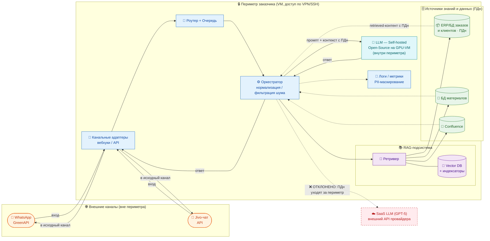

# ДЗ №4. ADR: где хостить LLM — отчёт

**Задача:** зафиксировать в ADR выбор хостинга LLM для ИИ‑бота из PRD:
SaaS (GPT‑5) vs Self‑hosted Open‑Source (Llama 3).

| Файл | Что это |
|------|---------|
| [`adr/0001-hosting-llm.md`](adr/0001-hosting-llm.md) | Решение о хостинге (SaaS vs Self‑hosted) по шаблону MADR |
| [`adr/0002-vybor-open-modeli-i-inferens.md`](adr/0002-vybor-open-modeli-i-inferens.md) | Выбор конкретной open‑модели (+ ссылки на HF) |
| [`adr/0003-vybor-gpu.md`](adr/0003-vybor-gpu.md) | Выбор GPU и сравнение цен (закупка в Москве) |
| [`adr/0004-vybor-dvizhka-inferensa.md`](adr/0004-vybor-dvizhka-inferensa.md) | Выбор движка инференса (vLLM / SGLang / TGI / TRT‑LLM) |
| [`adr/0005-vybor-embeddingov-rag.md`](adr/0005-vybor-embeddingov-rag.md) | Выбор модели эмбеддингов для RAG (+ ссылки на HF) |
| [`diagrams/data-flow-perimeter.mmd`](diagrams/data-flow-perimeter.mmd) | Схема потоков данных с границей периметра ИБ |
| [`PRD__confluence_bot-601858-a0e400.pdf`](PRD__confluence_bot-601858-a0e400.pdf) | Исходный PRD |

## Решение

**Self‑hosted Open‑Source LLM в периметре заказчика.** Обоснование, trade‑offs
и сравнение по критериям (Стоимость, Privacy, Качество, Latency, Поддержка) —
в `adr/0001-hosting-llm.md`.

## Ключевые выводы

1. **Privacy — решающий фактор.** В промпт по каждому запросу попадают ПДн
   клиентов (телефон, имя, заказы — FR‑5/FR‑9), а PRD требует держать ПДн в
   периметре заказчика. SaaS это требование нарушает → выбор предопределён.
2. **RAG снижает разрыв в качестве.** Знание берётся из retrieved‑контекста, а
   не из весов модели, поэтому open‑модель достигает целевых ≥85% (AC‑4).
3. **Стоимость предсказуема.** При 5–10 RPS GPU‑VM окупается; нет привязки к
   токен‑тарифам и доступности зарубежного API.
4. **GPU — задел на будущее.** Развитие до агентной системы (FR‑18) кратно
   увеличит число LLM‑вызовов: у SaaS это рост счёта за токены, у self‑hosted —
   фиксированный CapEx. Вдолгую облако дороже.
5. **Вариант «SaaS + Guardrails» отвергнут.** Маскирование ПДн даёт лишь
   вероятностную гарантию, данные всё равно покидают периметр; guardrails
   оставляем как дополнительный слой защиты внутри периметра.
6. **Модель (ADR-0002).** Рекомендуем **T-pro-it-2.1 (32B, Apache-2.0)** — сильный
   русский + tool-calling под будущих агентов; запасной — Qwen3-32B.
7. **Железо (ADR-0003).** Prod — **1× H100 80GB** (FP8, ~2.4–2.9 млн ₽, Москва) или
   бюджетно **A100 80GB**; Dev/PoC — **RTX 4090 24GB** или аренда.
8. **Движок инференса (ADR-0004).** Prod — **SGLang** (RadixAttention под RAG-префиксы
   + xGrammar под агентный JSON; рекомендован карточкой T-pro), Dev/fallback — **vLLM**;
   за OpenAI-совместимым роутером — взаимозаменяемы. INT4 (AWQ/GPTQ) / FP8 на 1 GPU.
9. **Эмбеддинги для RAG (ADR-0005).** Рекомендуем **BAAI/bge-m3** — гибрид
   dense+sparse (ловит артикулы/ТТХ), контекст 8192, MIT, лёгкая; в пару —
   реранкер **bge-reranker-v2-m3**. Запасные — deepvk/USER-bge-m3, Qwen3-Embedding-4B.

## Честные минусы решения (trade‑offs)

- **Затраты на GPU.** Нужны вложения в GPU‑сервер и его эксплуатация
  (мониторинг, обновления, MLOps) — это сложнее, чем вызвать API.
- **Качество на русском базово ниже GPT‑5.** Чтобы выйти на целевые метрики,
  потребуется подобрать русскоязычную open‑модель и настроить промпты/RAG.
- **Более долгий старт.** Развёртывание инференс‑стека добавляет работы к
  релизу (2–3 мес.) по сравнению с подключением готового облачного API.

## Узкие места в формулировках PRD

- **Противоречие приватности:** §5 требует «ПДн в периметре», но допускает
  внешних LLM‑провайдеров (OpenAI/Yandex).
- **PII‑маскирование = TBD**, нет требований 152‑ФЗ / data residency.
- **Не задан токен‑бюджет** и **требования к ресурсам VM/GPU** → точная оценка
  стоимости SaaS и осуществимости self‑hosting затруднена.

## Схема потоков данных

Источник: [`diagrams/data-flow-perimeter.mmd`](diagrams/data-flow-perimeter.mmd)
(PNG/SVG — открыть в [mermaid.live](https://mermaid.live) → Export).
ПДн циркулируют внутри периметра; отклонённый SaaS‑путь показан как выход за периметр.

