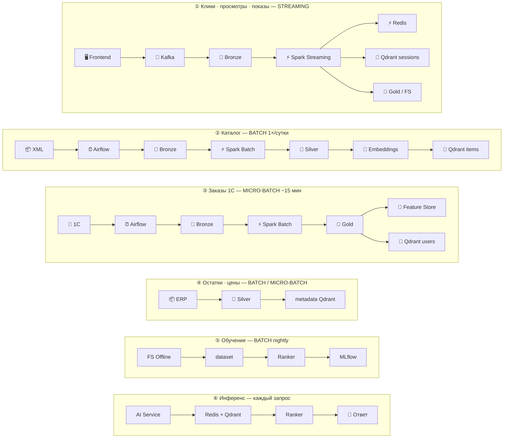
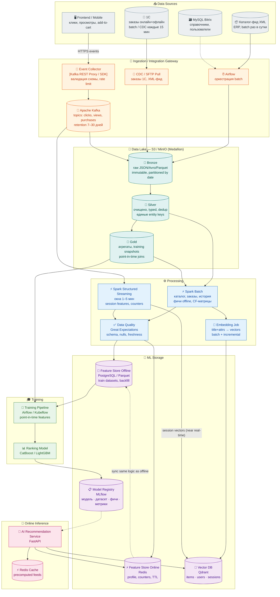
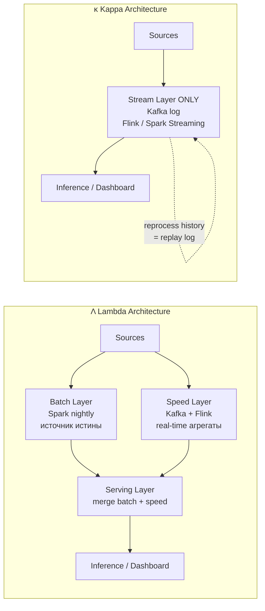

# ДЗ №5. Архитектура данных для AI-систем: Data Pipelines и интеграционные шлюзы

**Кейс:** система умных рекомендаций **TechnoMart** (продолжение ДЗ №1–2).

**Цель:** спроектировать **data pipeline** и выбрать хранилища для **консистентности данных** при обучении и инференсе AI-системы рекомендаций.

---

## Резюме

Для системы рекомендаций выбрана **гибридная Lambda-lite архитектура данных**: batch — для тяжёлых полных снимков, streaming — для свежих поведенческих сигналов.

- **Сбор данных.** Поведенческие события (показы рекомендаций, клики, просмотры, добавления в корзину, покупки) собираются в **streaming** через **Kafka**. Каталог, цены, остатки и заказы из **ERP/1С** загружаются **batch/micro-batch** по расписанию через **Airflow**.
- **Хранение (ELT, medallion).** Все сырые данные сначала сохраняются в **Data Lake (Bronze)** без потери исходной структуры. Затем **Spark** выполняет очистку, дедупликацию, валидацию схем, нормализацию идентификаторов пользователей и товаров и расчёт признаков → зона **Silver**; готовые агрегаты и датасеты для обучения → зона **Gold**.
- **Хранилища под задачи.** Для предотвращения **Training-Serving Skew** используется **Feature Store**: *offline store* — для обучения на исторических данных, *online store* — для быстрого получения тех же признаков на инференсе. **Vector DB (Qdrant)** хранит embeddings товаров, пользователей и сессий для поиска похожих (content-based и cold-start). Фактические данные (каталог, заказы, остатки, события) — в **Lakehouse / SQL**.
- **Модель.** Обучается **Ranking model** (CatBoost / LightGBM), предсказывающая вероятность целевого действия для пары **user × context × product**. Qdrant, co-purchase и ALS — источники кандидатов; **MLflow** версионирует связку модель → датасет → фичи → метрики.
- **Data Governance.** Вводятся единые определения признаков, контроль качества данных (DQ), **Schema Registry**, **lineage**, версионирование датасетов и моделей, политики доступа к ПДн. Персональные данные **не передаются в LLM** — только в обезличенном или псевдонимизированном виде.

Полный поток данных, обоснование выбора технологий и схемы — в разделах ниже.

---

## Содержание

- [Резюме](#резюме)
1. [Data Sources](#1-data-sources)
   - [Почему Stream vs Batch именно так](#почему-stream-vs-batch-именно-так)
   - [Гибридный подход](#гибридный-подход)
   - [Путь данных по каждому источнику](#путь-данных-по-каждому-источнику)
2. [Pipeline Design (ELT)](#2-pipeline-design-elt)
   - [Где что происходит](#где-что-происходит)
   - [Схема end-to-end](#схема-end-to-end)
   - [Поток данных по типам](#поток-данных-по-типам-кратко)
   - [Архитектурный паттерн: «Lambda-lite»](#архитектурный-паттерн-lambda-lite)
3. [Storage Selection](#3-storage-selection)
   - [Почему не Pinecone / только DWH](#почему-не-pinecone--только-dwh)
   - [Цепочка «Kafka → Spark → S3 → Qdrant»](#цепочка-kafka--spark--s3--qdrant)
   - [Vector DB (Qdrant): коллекции, источники, режимы загрузки](#vector-db-qdrant-коллекции-источники-режимы-загрузки)
4. [ML-пайплайн RecSys: что обучаем и чем](#4-ml-пайплайн-recsys-что-обучаем-и-чем)
   - [Что обучаем: кандидаты и ранжирование](#что-обучаем-кандидаты-и-ранжирование)
   - [Зачем модель, если есть Qdrant](#зачем-модель-если-есть-qdrant)
   - [Training dataset и target](#training-dataset-и-target)
   - [Признаки модели (Feature Store)](#признаки-модели-feature-store)
   - [Архитектура модели: PoC vs MVP](#архитектура-модели-poc-vs-mvp)
   - [Метрики оценки](#метрики-оценки)
   - [Инструменты: Feature Store, MLflow, пайплайны](#инструменты-feature-store-mlflow-пайплайны)
   - [Схема обучения и инференса](#схема-обучения-и-инференса)
5. [Как обеспечить консистентность данных](#5-как-обеспечить-консистентность-данных)
   - [Сводная таблица механизмов](#сводная-таблица-механизмов)
   - [Детализация](#детализация)
   - [Схема синхронизации Feature Store](#схема-синхронизации-feature-store)
   - [SLA обновления данных](#sla-обновления-данных)
6. [Data Governance](#6-data-governance)
   - [Роли](#роли-кратко)
7. [Соответствие требованиям](#7-соответствие-требованиям)
8. [Связь с предыдущими ДЗ](#связь-с-предыдущими-дз)
9. [Глоссарий терминов и сокращений](#глоссарий-терминов-и-сокращений)

> Конспект лекции: [`summary/README.md`](summary/README.md)

---

## 1. Data Sources

| Источник | Тип | Частота | Содержимое | Режим | Интеграция |
|----------|-----|---------|------------|-------|------------|
| **Frontend / Mobile** | События поведения | Real-time | `click`, `view`, `add_to_cart`, `search` | **Stream** | SDK → **Event Collector** → **Kafka** |
| **Каталог-фид XML** | ERP / PIM | **1×/сутки** (~02:00) | SKU, название, категория, цена, атрибуты, наличие | **Batch** | SFTP/API → **Airflow** → Data Lake Bronze |
| **1С (заказы)** | OLTP / ERP | **Каждые 15 мин** (+ nightly reconcile) | Чеки онлайн+офлайн, `user_id`, SKU, qty, store | **Batch / micro-batch** | CDC или REST-выгрузка → Airflow |
| **MySQL Bitrix** | OLTP справочники | По необходимости | Пользователи, регион, статусы SKU | **Batch** (lookup) | JDBC snapshot → Silver join |

### Почему Stream vs Batch именно так

| Данные | Stream | Batch | Обоснование |
|--------|--------|-------|-------------|
| Клики/просмотры | ✅ | — | Нужны свежие session-фичи и онлайн-персонализация; SLA секунды–минуты |
| Каталог товаров | — | ✅ | ERP отдаёт полный снимок раз в сутки; нет смысла стримить 50k SKU |
| Заказы 1С | micro-batch | ✅ | 15-мин задержка достаточна для «не рекомендовать купленное»; nightly — для обучения |

**Интеграционный шлюз (отказоустойчивость с legacy):** между Bitrix/1С и облачным AI-контуром — **брокер Kafka** как буфер: при недоступности ERP события не теряются (retention + replay), потребители масштабируются независимо.

### Гибридный подход

Для TechnoMart выбран **не один режим на всё**, а **гибрид** — режим загрузки соответствует характеру данных:

| Что | Как грузим | Зачем так |
|-----|------------|-----------|
| **Клики, просмотры, показы рекомендаций** | **Streaming** через Kafka → Spark Streaming | Свежие session/user counters; lag ≤ 5 мин |
| **Каталог товаров** | **Batch** из ERP/XML (1×/сутки) | ERP отдаёт полный снимок; 50k SKU не нужно стримить |
| **Заказы и чеки** | **Batch / micro-batch** из 1С (каждые 15 мин) | «Не рекомендовать купленное»; nightly — для train |
| **Остатки и цены** | **Batch / micro-batch** (с каталогом или чаще) | Pre-filter по наличию/региону в retrieval |
| **Embeddings товаров** | **Batch** после обновления каталога (+ incremental по diff SKU) | Content-vectors меняются при смене title/attrs |
| **Online features** | **Near real-time** из событий (stream → Redis) | SLA инференса ≤ 200 мс (ДЗ №2) |

Stream обслуживает поведение пользователей, batch — снимки ERP, micro-batch — заказы и остатки. Это реализация паттерна **Lambda-lite** из раздела 2.

### Путь данных по каждому источнику

Исходник: [`diagrams/data-flow-by-source.mmd`](diagrams/data-flow-by-source.mmd)

<details open>
<summary>🔀 Шесть потоков — от источника до хранилища / модели</summary>



</details>

**Тот же путь — текстом, по шагам:**

| # | Источник | Режим | Цепочка (→ = следующий шаг) |
|---|----------|-------|-------------------------------|
| **①** | Клики, просмотры, показы | Stream | Frontend → **Kafka** → Bronze → **Spark Streaming** → **Redis** (counters) + **Qdrant `sessions`** + Gold/FS |
| **②** | Каталог XML | Batch | ERP → **Airflow** → Bronze → **Spark Batch** → Silver → **Embedding job** → **Qdrant `items`** + FS |
| **③** | Заказы, чеки 1С | Micro-batch | 1С → **Airflow** (~15 мин) → Bronze → Spark → Gold → **Feature Store** + **Qdrant `users`** (nightly) |
| **④** | Остатки, цены | Batch / micro-batch | ERP/1С → Airflow → Silver → поля `in_stock`, `price` в **payload Qdrant** (pre-filter) |
| **⑤** | Обучение Ranker | Batch (ночь) | FS Offline + Gold → point-in-time dataset → **Ranker train** → **MLflow** |
| **⑥** | Инференс | Real-time | Запрос → **AI Service** → Redis + Qdrant (items/users/sessions) → Ranker → Cache → ответ ≤200 мс |

**MySQL Bitrix** (справочники): JDBC snapshot → join на шаге **Silver** (не отдельный поток — подмешивается в ② и ③).

---

## 2. Pipeline Design (ELT)

Выбран паттерн **ELT**: сначала **Load** сырых данных в Data Lake, **Transform** — в Spark (batch + streaming). Классический ETL отвергнут для ML-контура: часто меняются фичи и нужен immutable raw-слой для переигрывания.

### Где что происходит

| Этап | Слой | Инструмент | Операции |
|------|------|------------|----------|
| **Ingestion** | Gateway | Kafka, Airflow | Приём событий, pull batch-фидов, schema validation (Avro/JSON Schema) |
| **Bronze (Load)** | Data Lake S3 | Kafka Connect / Spark | Append-only raw, partition `dt=`, `source=` |
| **Silver (Transform)** | Lakehouse Delta | Spark | Очистка, dedup, нормализация SKU/user_id, join справочников |
| **Gold (Transform)** | Lakehouse | Spark | Агрегаты: `user_purchases_30d`, `item_ctr_7d`, training snapshots |
| **DQ** | Silver/Gold | Great Expectations | Freshness, completeness, referential integrity SKU |
| **Feature engineering** | Gold → FS | Spark batch + Structured Streaming | Offline tables + online counters (та же логика в коде) |
| **Embeddings** | Silver catalog + Gold | Spark + GPU job (опц.) | `title+attrs → vector`; incremental при изменении SKU |
| **Training dataset** | FS Offline | Spark + point-in-time join | Train/val/test без data leakage |
| **Inference** | FS Online + Vector DB | Redis + Qdrant | Профиль, counters, ANN-поиск кандидатов |

### Схема end-to-end

<details open>
<summary>📐 Data Pipeline — от источников до модели и инференса</summary>



</details>

### Поток данных по типам (кратко)

```
Клики:     Frontend → Kafka → Bronze → Stream Spark → Redis (online) + Qdrant sessions + Gold (offline)
Каталог:   XML → Airflow → Bronze → Batch Spark → Silver → Embeddings → Qdrant items
Заказы:    1С → Airflow → Bronze → Batch Spark → Gold → Feature Store + Qdrant users (nightly)
Обучение:  Gold + FS Offline → point-in-time dataset → Ranker → MLflow
Инференс:  FS Online + Qdrant (items/users/sessions) + Cache → AI Service (≤200 мс, см. ДЗ №2)
```

### Архитектурный паттерн: «Lambda-lite»

Полная Lambda (batch + speed + serving merge) избыточна. Для TechnoMart — **упрощённый гибрид**:

| Слой | Реализация | Роль |
|------|------------|------|
| **Batch (истина)** | Spark nightly + 15-min micro-batch заказов | CF-матрицы, исторические фичи, переобучение Ranker |
| **Speed** | Spark Structured Streaming (окна 1–5 мин) | Session counters, «недавно просмотренное» |
| **Serving merge** | Feature Store Online (Redis) | Единая точка чтения для AI Service |

<details>
<summary>📎 Справочник: Lambda vs Kappa</summary>



</details>

---

## 3. Storage Selection

| Этап / данные | Хранилище | Технология | Обоснование |
|---------------|-----------|------------|-------------|
| **Raw events, batch dumps** | Data Lake | **S3 / MinIO** + Parquet | Дёшево, immutable bronze, replay пайплайна |
| **Curated tables, ACID** | Lakehouse | **Delta Lake** on S3 | Upsert каталога, time travel, schema evolution |
| **Очередь / буфер** | Message broker | **Apache Kafka** | Decoupling legacy ERP/Bitrix от AI-контура; replay; horizontal scale |
| **Оркестрация batch** | Workflow | **Apache Airflow** | Cron XML/1С, зависимости, алерты |
| **Обработка** | Compute | **Apache Spark** (batch + Structured Streaming) | Единый стек для ELT, SQL + ML, micro-batch |
| **Offline features, train sets** | Feature Store (offline) | **PostgreSQL** + Parquet export | Point-in-time queries, SQL для DS; согласовано с ДЗ №2 |
| **Online features** | Feature Store (online) | **Redis** | Sub-ms чтение, TTL counters, SET для «купленного» |
| **Embeddings** | Vector DB | **Qdrant** | ANN top-k; отдельные **коллекции** items / users / sessions (см. ниже) |
| **Precomputed feeds** | Cache | **Redis** (отдельный namespace) | SLA 200 мс из ДЗ №2 |
| **Модели** | Model Registry | **MLflow** | Версии Ranker, lineage train dataset |
| **DQ metadata** | Catalog | **OpenMetadata / DataHub** (опц.) | Lineage, glossary, ownership |

### Почему не Pinecone / только DWH

| Альтернатива | Решение | Причина |
|--------------|---------|---------|
| Pinecone (SaaS Vector DB) | **Qdrant** on-prem/cloud VM | Контроль данных, metadata filters, уже выбрано в ДЗ №2; нет vendor lock-in для PII-adjacent embeddings |
| Только DWH (ClickHouse/Greenplum) | **Lake + Feature Store** | DWH медленно менять под эксперименты; нет online low-latency store; нет ANN |
| Feast managed | **PostgreSQL + Redis** (Feast-compatible schema) | Достаточно для одной recsys-команды; проще on-prem без enterprise Feast/Tecton |

### Цепочка «Kafka → Spark → S3 → Qdrant»

```
Kafka (clicks) ──→ Spark Streaming ──→ S3 Silver/Gold ──→ FS Offline
                                      └─→ Redis Online

Kafka / Airflow (catalog) ──→ Spark Batch ──→ S3 Silver ──→ Embedding job ──→ Qdrant
```

### Vector DB (Qdrant): коллекции, источники, режимы загрузки

**Vector DB** хранит **векторы для ANN-поиска** (retrieval), не табличные фичи — counters и сегменты остаются в **Feature Store**.

Candidate Generator (ДЗ №2) опрашивает **несколько коллекций параллельно** → объединяет top-K кандидатов → Omnichannel Filter → Ranker.

| Коллекция | Entity | Из чего вектор | Откуда данные | Режим загрузки | Запрос на inference |
|-----------|--------|----------------|---------------|----------------|---------------------|
| **`items`** | SKU | `title + category + attrs` (content embedding) | Silver-каталог после XML/ERP | **Batch** nightly + **incremental** по diff изменившихся SKU | «Похожие товары на просмотренный SKU» (item→item) |
| **`users`** | `user_id` | weighted avg эмбеддингов просмотренных/купленных SKU + optional two-tower | Gold: история кликов + заказы 1С | **Batch** nightly; **micro-batch** при N новых событиях | «Пользователи как ты» → их товары (user→user→items) |
| **`sessions`** | `session_id` | avg эмбеддингов SKU из текущей сессии | Kafka → Spark Streaming | **Near real-time** (окна 1–5 мин) | Cold-start анонима без `user_id` |

**Payload (metadata) в Qdrant** — для pre-filter без post-filter по всем 50k SKU: `region`, `in_stock`, `category_id`, `price_bucket`. PII (ФИО, телефон) **не** кладём — только `user_id` / token.

#### Потоки наполнения коллекций

```
items:     XML batch → Silver → Embedding job (batch) ──→ Qdrant collection "items"
users:     1С + Kafka history → Spark batch (nightly) ──→ Qdrant "users"
           └─ optional: micro-batch после активности user
sessions:  Kafka stream → Spark Streaming (1–5 min) ──→ Qdrant "sessions"
```

| Режим | Когда | Примеры в нашем контуре |
|-------|-------|-------------------------|
| **Streaming** | События без полного снимка | Клики, просмотры, показы → session vectors, online counters |
| **Batch** | Полный снимок / тяжёлый пересчёт | Каталог XML, CF-матрица, `items`/`users` embeddings nightly |
| **Micro-batch** | ERP с допустимым lag 15–30 мин | Заказы 1С, остатки/цены, дообновление `users` |
| **Near real-time** | Stream + короткое окно | Online features в Redis; `sessions` в Qdrant |

**Связь с гибридной таблицей:** stream-путь питает **sessions** и **online features**; batch/micro-batch — **items**, **users**, Feature Store offline; embeddings товаров — **строго после** batch-каталога (DQ gate: каталог свежий).

---

## 4. ML-пайплайн RecSys: что обучаем и чем

Хранилища из разделов 1–3 существуют ради конкретной модели. Здесь — что именно обучается, на каких данных, с каким таргетом и какими инструментами. Обучается **не LLM** (она только генерирует тексты — ДЗ №2), а **модель ранжирования рекомендаций**.

### Что обучаем: кандидаты и ранжирование

RecSys — **двухэтапная** (см. ДЗ №2): сначала отбор кандидатов из 50k SKU, затем ранжирование.

| Этап / артефакт | Назначение | Технология |
|-----------------|------------|------------|
| **Co-purchase model** | Товары, которые часто покупают вместе (ноутбук → мышь, SSD) | Подсчёт co-occurrence по заказам 1С (Spark batch) |
| **Collaborative Filtering / ALS** | Кандидаты по поведению похожих пользователей | implicit ALS (Spark MLlib) |
| **Item / User embeddings** | Похожие товары/пользователи по content + поведению | Embedding job → Qdrant (ANN) |
| **Ranking model** ⭐ | **Сортирует кандидатов** по вероятности целевого действия | **CatBoost / LightGBM** |
| **Business rules** | Отсечь невозможное (нет в наличии, уже куплено, несовместимо) | Детерминированные фильтры (Omnichannel Filter) |

**Основная обучаемая модель — Ranking model.** Она предсказывает вероятность целевого действия пользователя для тройки **user × context × product**: из ~300–500 кандидатов выбрать top-N.

### Зачем модель, если есть Qdrant

Qdrant и Ranking model отвечают на **разные вопросы**:

| | **Qdrant (vector search)** | **Ranking model** |
|---|----------------------------|-------------------|
| Вопрос | «Какие товары **похожи**?» | «Что **показать этому** пользователю **сейчас**, чтобы он купил?» |
| Логика | Cosine similarity эмбеддингов | Предсказание P(click/purchase) по фичам |
| Знает наличие / уже куплено | ❌ | ✅ (через фичи + business rules) |
| Знает выгоду для бизнеса (маржа, AOV) | ❌ | ✅ (через таргет/фичи) |
| Cross-sell (ноутбук → мышь, а не другой ноутбук) | ❌ (вернёт похожие ноутбуки) | ✅ |
| Роль в системе | **Один из источников кандидатов** | **Решает порядок выдачи** |

**Вывод:** Qdrant даёт кандидатов (similar items), но не заменяет рекомендательную модель. Бизнес-цель — рост CTR / conversion / AOV, а не «показать похожее».

### Training dataset и target

Каждая строка датасета: **пользователь + контекст + товар-кандидат → было ли целевое действие**.

| user_id | session_id | context_product | candidate_product | category | price | viewed_before | source | **target** |
|---------|-----------|-----------------|-------------------|----------|-------|---------------|--------|------------|
| u1 | s1 | laptop_1 | mouse_1 | accessories | 2500 | 1 | co_purchase | **1** |
| u1 | s1 | laptop_1 | bag_1 | accessories | 5000 | 0 | co_purchase | **0** |
| u3 | s3 | phone_1 | case_1 | accessories | 1200 | 0 | vector_similar | **0** |

**Target** — что оптимизируем:

| Target | Когда | Комментарий |
|--------|-------|-------------|
| `click` 1/0 | Оптимизация CTR | Ранний сигнал интереса, данных много |
| `add_to_cart` 1/0 | Сильнее клика | Ближе к покупке |
| `purchase` 1/0 | Ближе к деньгам | Данных меньше, но бизнес-эффект выше |
| Комбинированный (веса: click=1, cart=3, purchase=5) | Зрелая модель | Multi-objective |

**Решение для TechnoMart:** на **PoC** — `click`/`add_to_cart`/`purchase` после показа; на **MVP** — multi-objective (CTR как ранний сигнал, conversion и AOV как бизнес-метрики).

> **Критично:** нужно событие `recommendation_impression` — без «что показали» нельзя честно считать, что пользователь товар «не выбрал».

### Признаки модели (Feature Store)

Модель учится на признаках; все они живут в **Feature Store** (offline для train, online для serve — одна логика против skew).

| Группа | Примеры |
|--------|---------|
| **User features** | `user_viewed_categories_7d`, `user_purchases_90d`, `user_avg_order_value`, `is_authenticated` |
| **Product features** | `product_category`, `product_price`, `product_discount`, `product_ctr_30d`, `product_purchases_30d`, `product_in_stock` |
| **Context features** | `page_type` (home/product/cart), `device`, `hour`, `scenario` (cross-sell/up-sell/similar), `context_product_id` |
| **Pair features** | `same_category`, `price_ratio`, `brand_match`, `co_purchase_score`, `vector_similarity_score`, `user_category_affinity` |

### Архитектура модели: PoC vs MVP

| | **PoC** | **MVP / Production** |
|---|---------|----------------------|
| **Candidate Generation** | co-purchase, popular, content-based через Qdrant | + ALS / CF, popular fallback |
| **Ranking** | простая формула score или CatBoost/LightGBM (если есть события показов/кликов) | **CatBoost / LightGBM / XGBoost** |
| **Business Rules** | наличие, уже куплено | + совместимость, цена, промо, маржинальность |
| **LLM** | объяснение результата | объяснение результата |

Deep learning сознательно не берём — для табличных фич градиентный бустинг даёт лучший trade-off качество/latency под SLA 200 мс.

### Метрики оценки

| Тип | Метрика | Что показывает |
|-----|---------|----------------|
| **Offline** (до запуска) | **Precision@K** | Доля релевантных в top-K |
| | **Recall@K** | Сколько релевантных модель нашла |
| | **NDCG@K** | Насколько релевантные стоят выше |
| | HitRate@K / MAP@K | Попадание в top-K / средняя точность |
| | AUC / LogLoss | Качество бинарной классификации click/purchase |
| **Online** (A/B-тест) | **CTR** | Кликают ли по рекомендациям |
| | **Conversion rate** | Покупают ли после рекомендации |
| | **AOV** | Растёт ли средний чек (бизнес-цель кейса) |
| | Revenue per session, Latency, Fallback rate | Выручка, SLA 200 мс, частота fallback |

**Offline для приёмки модели:** Precision@K, Recall@K, NDCG@K.  **Online для бизнеса:** CTR, conversion, AOV, revenue.

### Инструменты: Feature Store, MLflow, пайплайны

| Инструмент | Роль в обучении |
|------------|-----------------|
| **Feature Store** (PostgreSQL + Redis) | Признаки для train (offline) и serve (online) — одна логика, защита от training-serving skew |
| **Offline Store** | Формирование training dataset (point-in-time join) |
| **Training Pipeline** (Airflow / Kubeflow) | Сбор датасета → фичи → обучение → валидация → регистрация |
| **MLflow / Model Registry** | Версии артефактов и связь **модель → датасет → фичи → метрики** |

**Что хранит MLflow** — версии артефактов, не «всю систему»:

| Артефакт | Пример |
|----------|--------|
| Ranking model | `recsys_ranker_v12` (CatBoostRanker) |
| ALS model | `als_model_v2` |
| Co-purchase table | `co_purchase_table_2026_06_27` |
| Версии | `embedding_model_version`, `feature_set_version`, `training_dataset_version` |
| Метрики | `NDCG@10 = 0.31`, `Precision@10 = 0.18` |
| Статус | `Production` |

Это отвечает на вопрос «какая модель в проде, на каких данных и фичах обучена, с какими метриками» — основа воспроизводимости и lineage.

### Схема обучения и инференса

**Offline (обучение):**

```
История событий (impression/click/cart/purchase) + каталог + заказы
        ↓  Feature Engineering (Spark, feature_defs)
   Feature Store (offline) → point-in-time Training Dataset
        ↓  Training Pipeline (Airflow)
   Ranking model учится предсказывать click/purchase (CatBoost/LightGBM)
        ↓
   MLflow фиксирует версию модели + датасета + фич + метрик
```

**Online (инференс, ≤200 мс — см. ДЗ №2):**

```
Backend → AI Service
   → Candidate Generator: co-purchase + ALS + Qdrant similar + popular
   → Ranking model: сортирует кандидатов по score
   → Business Rules: наличие / уже куплено / совместимость
   → LLM: текстовое объяснение
   → top-N рекомендаций
```

**Главное:** Qdrant — поиск похожих (источник кандидатов); Ranking model — решение, что реально рекомендовать пользователю для роста CTR/conversion/AOV.

---

## 5. Как обеспечить консистентность данных

Консистентность означает, что обучение (training) и инференс (serving) читают **одни и те же по смыслу** данные, а не «похожие из разных источников».

**Главный риск:** **Training-Serving Skew** — Ranker обучен на фичах с одной логикой агрегации, а онлайн-сервис читает другие (другая формула, **другой lag**, **другой источник**).

### Сводная таблица механизмов

| Механизм | Что даёт |
|----------|----------|
| **Единые определения признаков** | Один и тот же `item_ctr_30d` / `user_clicks_7d` при **training** и **serving** — модуль `feature_defs`, общий для Spark batch и Spark Streaming |
| **Feature Store** | Offline (PostgreSQL) и online (Redis) считаются **одной логикой**; materialization nightly + stream increment |
| **Point-in-time join** | Train-датасет без утечки будущего: фичи на момент события, не «на сегодня» |
| **Schema Registry** | Единый формат событий в Kafka (`click`, `view`, `impression`); валидация на Event Collector, совместимость версий схем |
| **Data Quality checks** | Great Expectations / Deequ: nulls, дубли, типы, freshness каталога; **DQ gate** блокирует materialization в FS и Qdrant |
| **Lineage** | Прослеживаемость: `XML → silver.catalog → feature.* → ranker-2.3.1`; OpenLineage / DataHub |
| **Versioning** | Версии **датасетов** (MLflow), **фич** (`feature_schema_version`), **моделей** (`model_version` в API), **embeddings** (Qdrant collection version) |
| **Backfill** | Пересчёт фич и embeddings за прошлый период после смены логики или новой фичи — без «дыр» в train |
| **Reconciliation** | Nightly сверка counts: Kafka events ↔ Silver ↔ Redis counters ↔ FS offline |
| **Monitoring** | Drift (PSI/KS offline vs online), lag пайплайнов, пропуски событий, latency AI Service ≤200 мс |
| **PII policies** | ПДн в Bitrix/1С; в Lake/Kafka — `user_id`/token; в Cloud LLM — только через **PII Anonymizer** (ДЗ №2) |

> **Vector DB vs Feature Store:** табличные фичи — только FS; Qdrant — embeddings. Консистентность: **item/user vectors** пересчитываются после batch-каталога и Gold-истории (те же Silver/Gold, что и для train).

### Детализация

| # | Механизм | Как реализуем |
|---|----------|---------------|
| 1 | Единые определения признаков | Модуль `feature_defs`: batch Spark + stream job импортируют одни SQL/PySpark-выражения |
| 2 | Feature Store + materialization | Nightly: Gold → FS Offline → Redis Online; stream: counters каждые 1–5 мин |
| 3 | Point-in-time correctness | Join `(user, item, event_time)` с фичами **≤ event_time** |
| 4 | Schema Registry | Avro/JSON Schema в Kafka; reject/ DLQ при битом событии |
| 5 | DQ gates | GX: каталог не старше 26 ч; Deequ на Silver; block перед FS/Qdrant upsert |
| 6 | Lineage | OpenLineage от Airflow/Spark |
| 7 | Version pinning | `feature_schema_version` + `model_version` в `meta` ответа API (ДЗ №2) |
| 8 | Backfill | Spark job по истории Lake → FS Offline; replay embeddings → Qdrant |
| 9 | Reconciliation | Nightly: Kafka vs Silver vs Redis |
| 10 | Monitoring skew | PSI/KS offline vs online; алерт при drift > порога |
| 11 | PII / Security | PII Anonymizer перед Cloud LLM; без ФИО/телефона в Qdrant payload |

### Схема синхронизации Feature Store

```
                    ┌─────────────────────────────────┐
                    │   feature_defs (single source)   │
                    └───────────────┬─────────────────┘
                                    │
              ┌─────────────────────┼─────────────────────┐
              ▼                     ▼                     ▼
      Spark Batch Job      Spark Streaming Job     Unit tests
              │                     │
              ▼                     ▼
      FS Offline (PG)         FS Online (Redis)
      train snapshots              ▲
              │                     │
              └──── materialize ────┘
                        │
                   Training                    Inference
                   (Ranker)                   (AI Service)
```

### SLA обновления данных

> **Lag** — *задержка обновления данных*: сколько времени проходит от события (клик, заказ, выгрузка каталога) до появления фичи в store, откуда её читает модель. Для anti-skew lag при **обучении** и **инференсе** должен быть **одинаковым по смыслу** (или явно смоделирован в train).

| Данные | Offline (train) | Online (serve) | Допустимый lag |
|--------|-----------------|----------------|----------------|
| Каталог SKU | Daily 03:00 | Daily 03:30 | ≤ 24 ч |
| Заказы (omnichannel) | 15 min + nightly | 15 min | ≤ 15 мин |
| Click counters | Hourly rollup | 1–5 min windows | ≤ 5 мин |
| Embeddings | Daily + on SKU change | Daily + incremental | ≤ 24 ч |

---

## 6. Data Governance

**Правила управления данными** в контуре рекомендаций: кто владелец, где истина, что можно хранить и кому смотреть.

| Область | Правило / реализация в TechnoMart |
|---------|-----------------------------------|
| **Владельцы данных (Data Owner)** | **Каталог** (SKU, attrs, media) — владелец: **PIM / merchandising**; steward: data engineer ETL. **Заказы и чеки** — **1С / финансы**; steward: интеграции ERP. **Клики, просмотры, показы блока** — **продукт / digital analytics**; steward: owner Event Collector + Kafka. **CRM / пользователи** (регион, сегмент) — **Bitrix / CRM-маркетинг**; steward: backend монолита. **ML-фичи и модели** — **RecSys / ML-команда**; steward: MLOps |
| **Источник правды (Source of Truth)** | **Цена, остаток, категория, attrs** — **ERP XML-фид** (batch 1×/сутки) → Silver `catalog`; Bitrix MySQL — только справочники, не override ERP. **Факт покупки** — **1С** (online+offline). **Поведение на сайте** — **Kafka** (immutable event log). **Embeddings** — производные от Silver catalog + Gold history, не первичный источник |
| **Качество (Data Quality)** | **Great Expectations:** null в `sku`, freshness каталога ≤26 ч, enum `category_id`. **Deequ (Spark):** uniqueness SKU, `price > 0`, referential integrity SKU в заказах. **Бизнес-правила:** не рекомендовать `in_stock=false`; DQ **gate** — при fail не пишем в FS Online / Qdrant. **Устаревшие товары:** `is_active=false` / нет в фиде → soft-delete в Silver, purge из Qdrant `items` |
| **Доступы (Access Control)** | **RBAC** по слоям: Bronze/Silver — data platform; Gold/FS offline — DS + ML; FS online / Qdrant — только **AI Service** (service account). **User-level** (история по `user_id`) — RecSys + DS под ролью с **audit log**; маркeting — только агрегаты. **Prod vs dev:** отдельные namespace S3/Kafka/Redis; prod PII не копируется в dev без **маскирования / синтетики** |
| **ПДн (152-ФЗ / Privacy)** | **ФИО, телефон, адрес, e-mail** — только Bitrix/1С **в периметре**; в Kafka/Lake/FS/Qdrant — **`user_id` / session token**, без прямых ПДн. **Cloud LLM** — только через **PII Anonymizer** (ДЗ №2): промпт без ПДн, rehydrate локально. **Embeddings** не строим на сырых ПДн. **Token Vault** — короткий TTL для map token↔PII |
| **Retention (хранение)** | **Kafka** (сырые события): **30 дней** (replay + расследования). **Lake Bronze** events: **12 мес.**, далее архив или delete по политике ИБ. **Silver/Gold / FS offline:** агрегаты и train-snapshots **24 мес.** **Redis online:** TTL counters **7–30 дней**; SET «купленное» — **90 дней**. **Qdrant:** vectors активных SKU/users; неактивные — удаление при purge каталога. **MLflow / логи inference:** **90 дней**, без PII в логах |
| **Lineage (происхождение)** | Сквозная цепочка в **OpenLineage / DataHub**, пример: `XML@ERP → bronze.catalog → silver.catalog → feature.item_ctr_30d → ranker-2.3.1 → /get_recommendation`. Отдельно: `Kafka.clicks → gold.user_* → redis.online → Ranker features`. Любой инцident «откуда фича» — traceable за ≤1 рабочий день |
| **Версионирование** | **Датасеты train** — snapshot id в **MLflow** + дата Gold partition. **Признаки** — `feature_schema_version` в реестре FS; breaking change → новая major version + backfill. **Embeddings** — `embedding_model_version` + `qdrant_collection_vN`; upsert только после DQ каталога. **Модели** — `model_version` в API `meta` (ДЗ №2); deploy Ranker только с совместимой парой (features + embeddings) |

### Роли

| Роль | Ответственность |
|------|-----------------|
| **Data Owner** | Бизнес-смысл данных, можно ли использовать в ML, SLA источника |
| **Data Steward** | Качество, метаданные, glossary (`sku`, `session_id`), эскалация при DQ fail |
| **Data Platform** | Lake, Kafka, Airflow, Spark, backup, retention jobs |
| **MLOps / RecSys** | FS, Qdrant, MLflow, monitoring drift, version pinning |

---

## 7. Соответствие требованиям

| Критерий | Статус |
|----------|--------|
| Инструменты соответствуют Stream vs Batch | ✅ Kafka/Flink-path для events; Airflow/Spark batch для ERP |
| Поток прослеживается от источника до модели | ✅ Схема + таблицы этапов |
| ML-пайплайн: модель, данные, таргет, метрики | ✅ Раздел 4: Ranking model, dataset, MLflow, NDCG/CTR |
| Feature Store и anti-skew | ✅ Раздел 5: сводная таблица + materialization + point-in-time |
| QA / Security | ✅ DQ gates, PII boundary, reconciliation |
| Data Governance | ✅ Раздел 6: владельцы, SoT, retention, доступы, lineage |
| Отказоустойчивость legacy | ✅ Kafka как буфер, replay, decoupling |
| Vector DB: коллекции и режимы загрузки | ✅ items / users / sessions + batch/stream/micro-batch |

---

## Связь с предыдущими ДЗ

| ДЗ | Что переиспользуем |
|----|-------------------|
| [**ДЗ №2**](../hw-2/README.md) | TechnoMart, контейнеры ETL/Event Collector/FS/Vector DB/Cache, Ranker pipeline, SLA 200 мс |
| [**ДЗ №3**](../hw-3/README.md) | Паттерн ingestion → embed → vector store (для item embeddings) |
| [**ДЗ №4**](../hw-4/README.md) | Подход к governance, PII, perimeter (PII Anonymizer для LLM-текстов) |

---

## Глоссарий терминов и сокращений

### Архитектура данных и хранилища

| Термин | Расшифровка / значение |
|--------|------------------------|
| **OLTP** | Online Transaction Processing — транзакционная обработка операций приложений (заказы, корзина) |
| **OLAP** | Online Analytical Processing — аналитическая обработка больших объёмов для отчётов и ML |
| **ETL** | Extract → Transform → Load: преобразование данных **до** загрузки в хранилище |
| **ELT** | Extract → Load → Transform: загрузка сырых данных, преобразование **по требованию** (выбран в проекте) |
| **DWH** | Data Warehouse — структурированное аналитическое хранилище с витринами |
| **Data Lake** | Хранилище сырых/полуобработанных данных в object storage (S3/MinIO) |
| **Lakehouse** | Data Lake + ACID-таблицы и SQL (Delta Lake / Iceberg / Hudi) |
| **Medallion** | Слоистая модель Lake: **Bronze** (raw) → **Silver** (очищено) → **Gold** (агрегаты) |
| **S3 / MinIO** | Объектное хранилище (AWS S3 и его on-prem аналог) под Data Lake |
| **Parquet / Avro** | Колоночный (Parquet) и строчный (Avro) форматы файлов для аналитики и событий |
| **Delta Lake** | Table format поверх Lake: ACID, time travel, schema evolution |

### Ingestion и обработка

| Термин | Расшифровка / значение |
|--------|------------------------|
| **Kafka** | Брокер сообщений / event log; буфер между legacy-системами и AI-контуром, replay |
| **Airflow** | Оркестратор batch-пайплайнов (расписания, зависимости, алерты) |
| **Spark** | Движок распределённой обработки (batch + Structured Streaming) |
| **Structured Streaming** | Стриминговый режим Spark (обработка событий микро-окнами 1–5 мин) |
| **CDC** | Change Data Capture — захват изменений из БД-источника (заказы 1С) |
| **SFTP** | Secure File Transfer Protocol — безопасная передача файлов (выгрузка XML-фида) |
| **Kubeflow** | Платформа ML-пайплайнов на Kubernetes (альтернатива Airflow для обучения) |
| **DLQ** | Dead Letter Queue — очередь для битых/невалидных событий |
| **Schema Registry** | Реестр схем событий Kafka (контроль формата и совместимости версий) |
| **Batch** | Пакетная обработка по расписанию (полные снимки) |
| **Stream / Streaming** | Обработка потока событий в реальном времени |
| **Micro-batch** | Частые мелкие пакеты (≈15 мин) — компромисс между batch и stream |
| **Near real-time** | Stream с коротким окном — задержка секунды–минуты |

### Хранилища ML и поиск

| Термин | Расшифровка / значение |
|--------|------------------------|
| **Feature Store** | Централизованное хранилище признаков для обучения и инференса; защита от skew |
| **Offline store** | Часть Feature Store для обучения / batch scoring / backfill (PostgreSQL, Parquet) |
| **Online store** | Часть Feature Store для real-time инференса (Redis, миллисекунды) |
| **Feature (признак)** | Измеримое свойство entity (`item_ctr_30d`, `user_clicks_7d`) |
| **Entity** | Объект, к которому привязаны фичи (`user_id`, `sku`, `session_id`) |
| **Vector DB** | БД эмбеддингов для поиска похожих (в проекте — Qdrant) |
| **Qdrant** | Используемая Vector DB; коллекции `items`, `users`, `sessions` |
| **Embedding** | Числовой вектор, представляющий товар/пользователя/сессию |
| **ANN** | Approximate Nearest Neighbor — быстрый приближённый поиск ближайших векторов |
| **KNN** | k Nearest Neighbors — поиск k ближайших соседей к точке |
| **Redis** | In-memory key-value store — online features + кэш |
| **PostgreSQL** | Реляционная СУБД — offline Feature Store |
| **TTL** | Time To Live — время жизни записи в кэше/online store до удаления |
| **MLflow** | Model Registry: версии модели → датасета → фич → метрик |
| **Model Registry** | Реестр обученных моделей и связанных артефактов |

### RecSys и обучение модели

| Термин | Расшифровка / значение |
|--------|------------------------|
| **RecSys** | Recommender System — рекомендательная система |
| **Candidate Generation** | Этап отбора кандидатов из всего каталога (co-purchase, ALS, ANN, popular) |
| **Ranking model / Ranker** | Модель, сортирующая кандидатов по вероятности целевого действия |
| **CatBoost / LightGBM / XGBoost** | Библиотеки градиентного бустинга на деревьях (табличные данные) |
| **ALS** | Alternating Least Squares — алгоритм коллаборативной фильтрации |
| **CF** | Collaborative Filtering — рекомендации по поведению похожих пользователей |
| **Co-purchase** | Модель «часто покупают вместе» (ноутбук → мышь) |
| **Cross-sell** | Допродажа сопутствующих товаров |
| **Up-sell** | Продажа более дорогой/премиальной версии |
| **Cold-start** | Проблема рекомендаций для нового пользователя/товара без истории |
| **Two-tower** | Архитектура с раздельными «башнями» для user и item эмбеддингов |
| **Target** | Целевая переменная обучения (`click`/`add_to_cart`/`purchase`) |
| **Training-Serving Skew** | Расхождение фич между обучением и инференсом → деградация в проде |
| **Point-in-time join** | Join события с фичами **на момент события** (без утечки будущего) |
| **Data leakage** | Утечка будущих данных в train → завышенные offline-метрики |
| **Backfill** | Пересчёт/догрузка фич за прошлые периоды |
| **Batch scoring** | Пакетный прогон модели по многим объектам offline (прогрев кэша) |
| **Materialization** | Перенос фич из offline/batch/stream в online store |
| **Lag** | Задержка обновления фичи после события (свежесть данных) |
| **PoC / MVP** | Proof of Concept (прототип) / Minimum Viable Product (минимальный продукт) |
| **LLM** | Large Language Model — большая языковая модель |
| **SKU** | Stock Keeping Unit — артикул/товарная позиция |

### Метрики

| Термин | Расшифровка / значение |
|--------|------------------------|
| **Precision@K** | Доля релевантных среди top-K рекомендаций |
| **Recall@K** | Доля найденных релевантных товаров из всех релевантных |
| **NDCG@K** | Normalized Discounted Cumulative Gain — учитывает, насколько релевантные стоят выше в top-K |
| **HitRate@K** | Попал ли хотя бы один нужный товар в top-K |
| **MAP@K** | Mean Average Precision — средняя точность ранжирования |
| **AUC** | Area Under ROC Curve — качество бинарной классификации |
| **LogLoss** | Логистическая функция потерь (штраф за неуверенные/ошибочные вероятности) |
| **CTR** | Click-Through Rate — доля кликов по показанным рекомендациям |
| **Conversion rate** | Доля покупок после рекомендации |
| **AOV** | Average Order Value — средний чек (бизнес-цель кейса: +10%) |
| **Revenue per session** | Выручка на сессию |
| **Fallback rate** | Частота срабатывания резервного (старого) механизма рекомендаций |
| **A/B-тест** | Сравнение двух вариантов на живых пользователях |
| **PSI / KS** | Population Stability Index / Kolmogorov-Smirnov — метрики drift распределений |
| **Drift** | Смещение распределения данных/фич во времени |

### Governance, качество и безопасность

| Термин | Расшифровка / значение |
|--------|------------------------|
| **Data Governance** | Правила, роли и процессы управления данными как активом |
| **Data Owner** | Бизнес-владелец данных (смысл, допустимость использования) |
| **Data Steward** | Операционный куратор качества и метаданных |
| **SoT** | Source of Truth — источник правды (где лежит актуальное значение) |
| **DQ** | Data Quality — качество данных (полнота, типы, дубли, freshness) |
| **Great Expectations** | Python-фреймворк проверок качества данных («unit-тесты для таблиц») |
| **Deequ** | Библиотека Data Quality от Amazon поверх Spark |
| **DQ gate** | Блокировка пайплайна при провале проверки качества |
| **Lineage / Data Lineage** | Прослеживаемость пути данных: источник → трансформации → модель |
| **OpenLineage / DataHub / OpenMetadata** | Инструменты сбора lineage и каталога данных |
| **Reconcile / Reconciliation** | Сверка согласованности данных между системами (Kafka ↔ Silver ↔ Redis) |
| **Retention** | Срок хранения данных до архивации/удаления |
| **RBAC** | Role-Based Access Control — доступ по ролям |
| **PII** | Personally Identifiable Information — персональные данные (ФИО, телефон, адрес) |
| **152-ФЗ** | Закон РФ «О персональных данных» |
| **Token Vault** | Хранилище соответствия токен ↔ реальное значение PII (короткий TTL) |
| **Anonymizer / Rehydrator** | Замена PII токенами перед облаком и восстановление в ответе |

### Источники и инфраструктура кейса

| Термин | Расшифровка / значение |
|--------|------------------------|
| **TechnoMart** | Ритейлер — заказчик системы рекомендаций (сквозной кейс ДЗ) |
| **1С** | ERP-система: заказы и чеки (онлайн + офлайн) |
| **Bitrix** | CMS/CRM-платформа магазина (MySQL: пользователи, справочники) |
| **ERP** | Enterprise Resource Planning — система управления ресурсами предприятия |
| **PIM** | Product Information Management — система управления данными о товарах |
| **SLA** | Service Level Agreement — соглашение об уровне сервиса (здесь: ответ ≤200 мс) |
| **BFF** | Backend for Frontend — бэкенд-посредник между фронтендом и AI Service |
| **FastAPI** | Python-фреймворк для REST API (AI Recommendation Service) |
| **Lambda / Kappa** | Паттерны Big Data: batch+stream+merge (Lambda) / только stream (Kappa) |
| **Lambda-lite** | Упрощённый гибрид: batch для тяжёлого, stream для свежего, merge в FS Online |
| **Replay** | Повторное чтение Kafka-лога для пересчёта истории |
