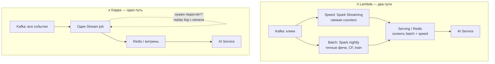

# Конспект: Архитектура данных для AI-систем

---

## Маршрут занятия

| # | Тема | Суть |
|---|------|------|
| 1 | Классическая Big Data | OLTP/OLAP, ETL, DWH, Data Lake, Lakehouse, Batch vs Stream |
| 2 | Специфика пайплайнов для AI | ELT + Lakehouse, версионирование датасетов, данные для инференса |
| 3 | Feature Store | Единый слой фич для обучения и serving, борьба с training-serving skew |
| 4 | Data Governance | Владельцы данных, lineage, качество, безопасность |
| 5 | Проектирование ML-пайплайна | End-to-end от источников до датасета и инференса |

---

## Цели занятия (что должны уметь)

1. Понимать основные паттерны Big Data.
2. Знать специфические решения для AI-пайплайнов.
3. Проектировать верхнеуровнево **end-to-end pipeline** для обучения и инференса ML-модели.

---

## 1. Классическая Big Data

### OLTP и OLAP

| | **OLTP** | **OLAP** |
|---|----------|----------|
| **Назначение** | Операционная работа приложений (транзакции) | Аналитика, отчёты, прогнозные модели |
| **СУБД** | Реляционные, транзакционные | Специализированные аналитические |
| **Структура данных** | Преимущественно **нормализованные** | Преимущественно **денормализованные** |
| **Данные** | Структурированные | Часто **неструктурированные** |
| **Гарантии** | Транзакционность (ACID) | Оптимизация под агрегации и сканы |

**OLTP** — On-Line Transaction Processing: исторически первый подход, «система записи» (магазин, ERP, CRM).  
**OLAP** — On-Line Analytical Processing: «система чтения для решений», большие объёмы, тяжёлые запросы.

---

### ETL (Extract → Transform → Load)

**Определение:** классический паттерн интеграции данных, при котором данные **сначала преобразуются**, затем загружаются в целевое хранилище.

**Зачем нужен:**
- Источников (OLTP) много и они разрознены.
- OLTP-СУБД плохо подходят для OLAP-нагрузки.
- Целесообразно собрать аналитические данные в **одном месте** на подходящей СУБД.

| Этап | Что происходит |
|------|----------------|
| **Extract** | Извлечение из систем-источников |
| **Transform** | Очистка, нормализация, агрегация (в памяти или staging) |
| **Load** | Загрузка в целевое хранилище (часто DWH) |

**Минус для research/AI:** заранее нужно знать, какие поля понадобятся; при смене требований — перевыгрузка истории.

---

### DWH (Data Warehouse)

**Определение:** централизованное **структурированное** аналитическое хранилище с заранее спроектированными **витринами** (star/snowflake schema), оптимизированное под отчёты и BI.

| Характеристика | Описание |
|----------------|----------|
| Схема | Заранее определённая, часто star schema |
| Данные | Очищенные, согласованные, исторические снимки |
| Паттерн загрузки | Обычно **ETL** или ELT с жёсткими витринами |
| Типичное применение | BI, отчётность, управленческая аналитика |

---

### ELT (Extract → Load → Transform)

**Определение:** паттерн, при котором данные **сначала загружаются «как есть»** в staging / Data Lake, а преобразования выполняются **по требованию** при построении витрин.

**Причины перехода к ELT:**
- Невозможно заранее знать все поля для analytics/research.
- Бизнес-требования меняются → нужна перевыгрузка истории.
- Нужен постоянный слой **сырых данных** (raw / bronze).

| Этап | Что происходит |
|------|----------------|
| **Extract** | Выгрузка из источников |
| **Load** | Загрузка в stage-слой (raw или слабо обработанные) |
| **Transform** | Построение витрин/фич по мере необходимости |

---

### ETL vs ELT — сравнение

| Критерий | **ETL** | **ELT** |
|----------|---------|---------|
| Где Transform | До загрузки в хранилище | После загрузки в Lake/stage |
| Гибкость схемы | Ниже (схема «на входе») | Выше (schema-on-read) |
| Сырой слой | Обычно нет | Есть (raw/bronze) |
| Подходит для | Стабильные витрины, DWH | Research, ML, часто меняющиеся требования |
| Типичное хранилище | DWH | Data Lake / Lakehouse |

---

### Data Lake

**Определение:** централизованное хранилище **сырых и полуобработанных** данных в **оригинальном** (или слабо структурированном) виде — файлы (Parquet, JSON, Avro), объекты (S3, HDFS, MinIO).

| Слой (medallion) | Содержимое | Назначение |
|------------------|------------|------------|
| **Bronze / Raw** | Данные «как пришли» | Аудит, переигрывание пайплайна |
| **Silver** | Очищенные, типизированные | Единая модель, дедупликация |
| **Gold** | Агрегаты, витрины, фичи | BI, ML, отчёты |

**Плюсы:** дёшево хранить всё, гибкость, schema-on-read.  
**Минусы:** риск «болота данных» без governance; сложнее качество и discoverability.

---

### Lakehouse

**Определение:** архитектура, объединяющая **гибкость и дешевизну Data Lake** с **ACID-транзакциями, схемой и SQL** уровня DWH (Delta Lake, Iceberg, Hudi поверх object storage).

| | Data Lake | Lakehouse | DWH |
|---|-----------|-----------|-----|
| Формат | Файлы в object storage | Файлы + table format (Delta/Iceberg) | Проприетарные таблицы |
| ACID | Нет (без доп. слоя) | Да | Да |
| ML / сырые данные | Отлично | Отлично | Сложнее |
| BI / SQL | Средне | Хорошо | Отлично |

---

### Batch vs Stream

| | **Batch**                            | **Stream** (near real-time) |
|---|--------------------------------------|----------------------------|
| **Единица обработки** | Пакет (файл, партиция за период)     | Событие / микропакет |
| **Задержка** | Минуты — часы — сутки                | Секунды — минуты |
| **Примеры источников** | ERP-выгрузка, nightly XML-фид        | Клики, просмотры, логи приложения |
| **Движки** | Spark batch, Airflow, dbt            | Kafka, Flink, Spark Streaming |
| **Сложность** | Проще, дешевле                       | Сложнее (ordering, late events, state) |
| **AI-применение** | Каталог, история заказов, дообучение | Онлайн-фичи, real-time персонализация |

**Stream** — не всегда «каждая миллисекунда»; на практике часто **micro-batch** (Spark Structured Streaming, Kafka → окно 1–5 мин).

---

## 2. Data Governance и Data Management

**Data Governance** — фреймворк правил, ролей и процессов работы с данными в IT-ландшафте. Рассматривает **данные как актив**.

**Data Management** — практическая реализация governance: инструменты, каталоги, пайплайны качества.

### Ключевые элементы

| Элемент | Определение |
|---------|-------------|
| **Data Owner** | Бизнес-владелец данных (что означает поле, можно ли использовать) |
| **Data Steward** | Операционный куратор качества и метаданных |
| **Data Catalog / MDM** | Каталог datasets, glossary, master data |
| **Data Quality (DQ)** | Полнота, уникальность, актуальность, согласованность |
| **Data Lineage** | Прослеживаемость: от источника → трансформации → потребитель |
| **Data Security** | RBAC, маскирование PII, шифрование, аудит доступа |

### DAMA DMBOK2

**DAMA DMBOK2** (Data Management Body of Knowledge) — отраслевой фреймворк из **11 областей** управления данными:

1. Data Governance  
2. Data Architecture  
3. Data Modeling & Design  
4. Data Storage & Operations  
5. Data Security  
6. Data Integration & Interoperability  
7. Document & Content Management  
8. Reference & Master Data  
9. Data Warehousing & BI  
10. Metadata Management  
11. Data Quality  

На занятии DAMA упомянут как **эталонный каркас** — при проектировании AI-пайплайна стоит явно закрывать lineage, quality, security и ownership.

---

## 3. Специфика пайплайнов для AI

| Аспект | Классический Big Data | AI / ML |
|--------|----------------------|---------|
| Паттерн загрузки | ETL → DWH | **ELT → Data Lake / Lakehouse** |
| Потребители | Аналитики, BI | Data Scientists + **production inference** |
| Версионирование | Редко на уровне строк | **Версии датасетов, моделей, фич** |
| Latency | Batch OK | **Online inference** → low-latency фичи |
| Консистентность | Между витринами | **Training ↔ Serving** (одни и те же фичи) |
| Новые хранилища | DWH, Lake | + **Vector DB**, **Feature Store** |

**Training-Serving Skew** — расхождение между данными/фичами при **обучении** и при **инференсе**. Три типичные причины:

| Причина | Что это значит | Пример для TechnoMart |
|---------|----------------|------------------------|
| **Другая логика агрегации** | Фича считается по-разному в batch и online | Offline: `user_clicks_7d` = COUNT за 7×24 ч; online: счётчик с другим окном или без dedup |
| **Другой lag** *(задержка обновления)* | В prod фича «старее» или «свежее», чем при обучении | Train: nightly-срез на 03:00; serve: Redis обновляется каждые 5 мин — модель не привыкла к другой «свежести» |
| **Другой источник** | Train и serve читают из разных таблиц/пайплайнов | Обучение на витрине DWH, инференс — ad-hoc запрос в MySQL |

**Lag** — **задержка между событием и попаданием фичи в store**, из которого её читает модель. Не путать с latency API: lag про **данные** («клик был 2 мин назад, а counter ещё не обновился»), latency — про **скорость ответа сервиса**.

Приводит к деградации модели в проде при хороших offline-метриках.

---

## 4. Feature Store

**Feature Store** — централизованная система для **управления, хранения и выдачи признаков (features)** для обучения и инференса.

**Feature (признак)** — измеримое свойство **entity** (пользователь, товар, сессия): `user_purchases_30d`, `item_ctr_7d`, `session_category_affinity`.

**Entity** — объект, к которому привязаны фичи (user_id, sku, session_id).

### Зачем нужен

| Проблема без Feature Store | Как решает Feature Store |
|----------------------------|--------------------------|
| «Одноразовые» скрипты для каждого эксперимента | Переиспользование фич между командами/моделями |
| Долгая доработка DWH-витрин под эксперимент | Быстрый доступ к Lake + собственные feature pipelines |
| Training-serving skew | **Одна и та же логика** вычисления для offline и online |
| Нет lineage фич | Реестр фич, версии, владельцы |

### Offline vs Online store

| Store | Назначение | Latency | Пример |
|-------|------------|---------|--------|
| **Offline** | Обучение, batch scoring, backfill | Секунды–часы | Parquet в S3, BigQuery, PostgreSQL |
| **Online** | Real-time inference | Миллисекунды | Redis, DynamoDB, Cassandra |

#### Обучение, batch scoring, backfill (Offline store)

| Термин | Простыми словами | Пример для TechnoMart |
|--------|------------------|------------------------|
| **Обучение (Training)** | Массовая подготовка датасета из **истории** и **обучение модели** (Ranker). Не на каждый HTTP-запрос, а пакетом за ночь/неделю | Spark собирает из PostgreSQL фичи `user_clicks_7d`, `item_ctr_30d` за 6 месяцев → LightGBM учится предсказывать клик |
| **Batch scoring** | **Пакетный прогон** уже обученной модели по большому числу пар «пользователь × товар» **без онлайн-запроса**. Результат — файл/таблица, не ответ API | Nightly job: для всех активных user_id посчитать top-100 SKU → **прогреть Redis Cache** («Умная лента» утром отдаётся <200 мс) |
| **Backfill** | **Пересчёт фич за прошлое** после изменения логики, добавления новой фичи или исправления бага | Добавили фичу `user_offline_purchases_90d` из 1С — нужно **залить её за последние 90 дней** в offline store, иначе train-датасет неполный |

**Offline store** нужен, когда можно подождать секунды–часы: большие объёмы, SQL/Spark, point-in-time join.

#### Real-time inference (Online store)

| Термин | Простыми словами | Пример для TechnoMart |
|--------|------------------|------------------------|
| **Real-time inference** | **Инференс «здесь и сейчас»**: на **каждый** запрос пользователя модель (или ranker) получает **актуальные** фичи и за миллисекунды возвращает рекомендации | Покупатель открыл карточку товара → Backend шлёт `POST /get_recommendation` → AI Service читает профиль из Redis, ищет кандидатов в Qdrant, ранжирует → ответ ≤200 мс |
| **Online features** | Небольшой набор **свежих** фич, материализованных в low-latency store для одного `user_id` / `session_id` | `user_clicks_1h`, `last_viewed_category`, SET «уже купленные SKU» — всё в Redis с TTL |
| **Materialization** | Копирование/синхронизация фич из batch/stream-пайплайна **в online store** по расписанию или инкрементально | Nightly: PostgreSQL → Redis; stream: Kafka → Spark (окно 5 мин) → обновление counters в Redis |

**Online store** — когда пользователь уже ждёт: один `GET` профиля, без тяжёлого Spark-SQL на запросе.  
**Real-time inference** — веса Ranker фиксированы; **в real-time** меняются только **фичи** и **кандидаты**, по которым модель считает score.

#### Point-in-time join

**Point-in-time join** — при сборке train-датасета к каждому историческому событию («пользователь X кликнул на SKU Y в 14:32») подтягиваются **только те фичи, которые были бы известны на этот момент** — не позже.

| Без point-in-time | С point-in-time |
|-------------------|-----------------|
| Берём `user_clicks_7d` **на сегодня** для клика полгода назад | Берём `user_clicks_7d`, посчитанный **на 14:32 того дня** |
| Модель «видит будущее» → завышенные offline-метрики | Модель учится на честном срезе → метрики ближе к проду |

*TechnoMart:* клик 15 марта 14:32 → join фич `user_purchases_30d`, `item_ctr_7d` **as of 15.03 14:32**, а не as of даты запуска обучения.

Связанный термин **point-in-time correctness** — свойство пайплайна: join всегда «на момент события», без **data leakage** (утечки будущего). Критично для recsys.

### Популярные решения

| Решение | Тип | Комментарий |
|---------|-----|-------------|
| **Feast** | Open-source | On-prem, гибко, для enterprise часто нужны доработки |
| **Hopsworks** | Платформа | On-prem / cloud, часть ML-платформы |
| **Databricks Feature Store** | Managed | В экосистеме Databricks |
| **SageMaker Feature Store** | Managed | AWS |
| **Vertex AI Feature Store** | Managed | GCP |
| **Tecton** | Managed Enterprise | Production-grade, low-latency |
| **Самописный** | Custom | PostgreSQL + Redis (как в TechnoMart из ДЗ №2) |

### Когда применять Feature Store

- Для инференса нужны **семантически те же** данные, что при обучении.
- **Высокие требования к latency** online-инференса.
- Много **зрелых моделей** в проде.
- Высокий запрос на **переиспользование фич** между командами.

### Способы подготовки датасета (и их проблемы)

| Способ | Проблема |
|--------|----------|
| Витрина DWH | Часто **нет нужных** полей; доработка долго |
| Скрипт из Data Lake | Лучше, но без FS — **одноразово**, нет переиспользования |
| Ручной сбор из источников | DQ и lineage под вопросом; **training-serving skew** |

---

## 5. Проектирование end-to-end ML-пайплайна

### Чек-лист проектирования

| Шаг | Вопросы |
|-----|---------|
| 1. Источники | Stream или batch? SLA обновления? PII? |
| 2. Ingestion | Kafka / API / SFTP / CDC? Брокер для отказоустойчивости? |
| 3. Очистка и DQ | Где bronze → silver? Great Expectations / Deequ? (см. ниже) |
| 4. Хранение | Lake (raw), Lakehouse (silver/gold), DWH, Vector DB |
| 5. Feature engineering | Batch (Spark) + stream (Flink)? Feature Store? |
| 6. Датасет | Train/val/test split, версионирование (DVC, MLflow) |
| 7. Security | Маскирование PII, синтетика, RBAC |
| 8. Lineage | OpenLineage, Data Catalog |
| 9. Inference | Какие фичи нужны online? Как синхронизировать с offline? |

#### Data Quality: Great Expectations vs Deequ

| | **Great Expectations (GX)** | **Deequ** (Amazon, open-source) |
|---|------------------------------|-----------------------------------|
| **Что это** | Python-фреймворк **проверок качества данных** («unit-тесты для таблиц») | Библиотека DQ **поверх Apache Spark** |
| **Где крутится** | Python, pandas, Spark (через интеграцию) | **Spark** — большие объёмы в Lake |
| **Что проверяет** | Схема, nulls, уникальность, диапазоны, freshness | Completeness, uniqueness, compliance, anomaly detection |
| **Пример для TechnoMart** | «В silver.catalog нет null в sku», «фид свежий <26 ч» | «100% SKU из XML есть в silver», «price > 0» на 50k строк в Spark |

### Типовая схема слоёв (для recsys)

```
Источники (OLTP, events, feeds)
    → Ingestion (Kafka / batch jobs)
    → Data Lake (Bronze raw)
    → ELT Transform (Silver/Gold)
    → Feature Store (offline + online)
    → Vector DB (embeddings)
    → Training pipeline → Model registry
    → Inference service (читает FS + Vector DB)
```

---

## 6. Паттерны Lambda и Kappa

### Зачем вообще эти паттерны?

В recsys одновременно нужны **две вещи**:

1. **Точные исторические данные** — для обучения Ranker, CF-матриц, backfill (обработка за ночь, весь каталог 50k SKU).
2. **Свежие данные** — «пользователь только что кликнул» → лента должна это учесть через минуты, не завтра.

Вопрос: **одним пайплайном или двумя?** На этом строятся Lambda и Kappa.

---

### Λ Lambda Architecture — «два конвейера + склеивание»

**Идея:** данные обрабатываются **два раза разными способами**, а перед пользователем **склеиваются**.

```
                    ┌── Batch Layer (ночью) ──→ точные витрины / фичи
Источники (Kafka) ──┤                                      ↘
                    └── Speed Layer (stream) ──→ свежие counters ↘
                                                          Serving Layer
                                                               ↓
                                                    AI Service / отчёт
```

| Слой | Что делает | Аналогия TechnoMart | Когда |
|------|------------|---------------------|-------|
| **Batch Layer** | Полный пересчёт по **всей истории** — «источник истины» | Nightly Spark: `user_purchases_30d`, CF-матрица, embeddings каталога | 03:00, раз в сутки |
| **Speed Layer** | **Приближённый** пересчёт **только новых** событий из stream | Spark Streaming: +1 к `user_clicks_1h` после каждого клика в Kafka | Каждые 1–5 мин |
| **Serving Layer** | **Склеивает** batch + speed при чтении | Redis: `clicks_7d = batch_base + speed_delta` или «batch до вчера + stream сегодня» | На каждый запрос / materialization |

**Пример «на пальцах»:**  
Batch ночью посчитал: «у Ивана 42 клика за 7 дней». Днём он сделал ещё 3 клика. Speed-слой добавляет +3. Serving отдаёт **45** — без ожидания следующей ночи.

| Плюсы | Минусы |
|-------|--------|
| Batch точный (вся история, сложные join) | **Два пайплайна** — одну и ту же логику часто пишут дважды |
| Stream даёт свежесть | Склейка batch+speed — место багов и skew |
| Проверенный паттерн для Big Data | Дороже в поддержке |

---

### κ Kappa Architecture — «только stream, batch = перемотка ленты»

**Идея:** **один** stream-пайплайн на **всё**. Нужен «batch-пересчёт»? **Переиграй Kafka-лог** с начала (replay) тем же кодом.

```
Источники → Kafka (единый log) → Stream processing (Flink / Spark Streaming)
                                        ↓
                              Online store / витрины
                                        ↓
                    «Batch» = replay топика за 90 дней тем же job
```

| | **Lambda** | **Kappa** |
|---|------------|-----------|
| Пайплайнов | 2 (batch + stream) | 1 (только stream) |
| «Ночной пересчёт» | Отдельный batch job | **Replay** Kafka с `offset=earliest` |
| Логика фич | Может **разъехаться** между слоями | **Один код** — меньше skew |
| Стоимость replay | Batch только за нужный период | Replay **всей** истории — долго и дорого |
| Каталог / ERP batch | Естественно ложится в batch-слой | Batch-источники всё равно нужно **кормить** в log |

**Пример TechnoMart (Kappa):**  
Добавили новую фичу `session_category_affinity`. Чтобы обучить Ranker, **прогоняем Spark Streaming job по топику `clicks` за 6 месяцев** — тот же код, что в проде. Не пишем отдельный batch-SQL.

| Плюсы | Минусы |
|-------|--------|
| Один код → проще anti-skew | Replay 6 мес. кликов — **часы и $$$** |
| Проще reasoning: «всё из Kafka» | ERP/XML **не stream** — их всё равно batch-ить в log |
| Хорош для чисто event-driven систем | Сложные join с каталогом/1С в stream тяжелее |

---

### Сравнение одной таблицей (расшифровка)

| Паттерн | Простыми словами | Когда выбирают |
|---------|------------------|---------------|
| **Lambda** | «Ночью считаем точно, днём — накидываем сверху из stream, потом склеиваем» | Классика: много batch-источников (ERP, XML) + event stream |
| **Kappa** | «Всё через Kafka, batch = перемотать ленту назад» | Чистый event log, готовность платить за replay |
| **Lambda-lite** *(наша практика)* | Batch для **тяжёлого** (каталог, CF, train); stream для **лёгкого свежего** (counters); merge в Feature Store Online | recsys |

---

### Что выбрали для TechnoMart (Lambda-lite)

Полная Lambda со сложным Serving merge — **избыточна**. Реалистичный вариант:

| Данные | Путь | Почему не чистая Kappa |
|--------|------|------------------------|
| Клики | Kafka → Spark Streaming → Redis | ✅ Stream |
| Каталог XML | Airflow → Spark Batch → Qdrant | ❌ Не event log, раз в сутки |
| Заказы 1С | micro-batch каждые 15 мин | ❌ ERP, не поток кликов |
| CF-матрица, train | Nightly batch | ❌ Replay всех кликов каждую ночь — дорого |

**Merge упрощён:** не отдельный Serving-сервис, а **Feature Store Online (Redis)** — batch materialization nightly + stream дописывает counters. AI Service читает **один** Redis.



---

### Шпаргалка по терминам Lambda/Kappa

| Термин | Что это |
|--------|---------|
| **Batch Layer** | Ночной (или редкий) **полный** пересчёт — источник истины |
| **Speed Layer** | Stream-обработка **новых** событий для свежести |
| **Serving Layer** | Объединяет batch + speed при выдаче данных |
| **Replay** | Повторное чтение Kafka-топика с начала — «batch» в Kappa |
| **Lambda-lite** | Batch для тяжёлого + stream для свежего + простой merge в FS Online |

---

## 7. Шпаргалка определений

| Термин | Краткое определение |
|--------|---------------------|
| **OLTP** | Транзакционная обработка операций приложений |
| **OLAP** | Аналитическая обработка больших объёмов для решений |
| **ETL** | Extract → Transform → Load |
| **ELT** | Extract → Load (raw) → Transform по требованию |
| **DWH** | Структурированное аналитическое хранилище с витринами |
| **Data Lake** | Хранилище сырых/полуобработанных данных (object storage) |
| **Lakehouse** | Lake + ACID-таблицы + SQL (Delta/Iceberg/Hudi) |
| **Batch processing** | Обработка данных пакетами по расписанию |
| **Stream processing** | Обработка потока событий в реальном времени |
| **Data Governance** | Правила, роли, процессы управления данными как активом |
| **Data Lineage** | Цепочка происхождения и трансформаций данных |
| **Data Quality (DQ)** | Проверки полноты, актуальности, согласованности данных (gates в пайплайне) |
| **Great Expectations** | Python-фреймворк «expectations» / unit-тестов для datasets |
| **Deequ** | Open-source DQ-библиотека Amazon для **Spark** (constraints на больших таблицах) |
| **Feature** | Измеримый признак entity для ML |
| **Feature Store** | Централизованное хранилище и сервис фич для train + serve |
| **Lag (data lag)** | Задержка обновления фичи после события; train и serve должны иметь согласованный lag |
| **Batch scoring** | Пакетный прогон модели по многим объектам offline (прогрев кэша, оценка), не per-request |
| **Backfill** | Пересчёт/догрузка фич за прошлые периоды после смены логики или новой фичи |
| **Real-time inference** | Инференс на каждый запрос пользователя с актуальными online-фичами (мс), без переобучения модели |
| **Materialization** | Синхронизация фич из offline/batch/stream в online store (PostgreSQL → Redis) |
| **Training-Serving Skew** | Расхождение фич/данных между обучением и инференсом (агрегация, lag, источник) |
| **Point-in-time join** | Join события с фичами **на момент события**, не на «сегодня»; защита от data leakage |
| **Point-in-time correctness** | Гарантия, что offline-фичи не содержат данных из будущего относительно label |
| **Vector DB** | Хранилище эмбеддингов для similarity search (ANN) |
| **Medallion architecture** | Bronze → Silver → Gold слои в Lake |
| **Lambda Architecture** | Batch + Speed + Serving merge: точность ночью + свежесть stream |
| **Kappa Architecture** | Только stream; «batch» = replay Kafka-лога тем же job |
| **Lambda-lite** | Упрощённый гибрид: batch для тяжёлого, stream для counters, merge в FS Online |
| **Replay** | Повторное чтение топика Kafka с начала для пересчёта истории |

---

## 8. Связь с домашним заданием (hw-5)

Для **TechnoMart RecSys** из ДЗ №2 ключевые выводы занятия:

1. **Клики** — stream (Kafka), **каталог из ERP/XML** — batch (Airflow).
2. Паттерн **ELT**: сначала raw в **Data Lake (S3)**, transform в Spark.
3. **Feature Store** (PostgreSQL offline + Redis online) — единая логика фич для Ranker train/serve.
4. **Vector DB** (Qdrant) — отдельно от табличных фич (эмбеддинги товаров/сессий).
5. **Data Governance**: lineage, версии фич, contract tests, мониторинг drift/skew.
