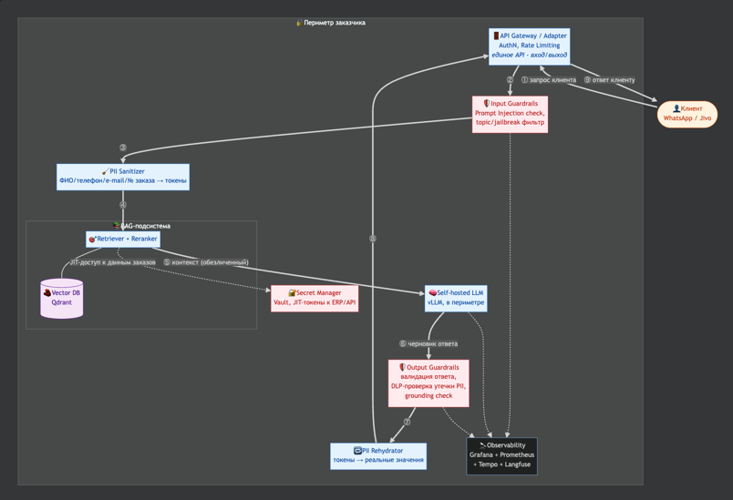
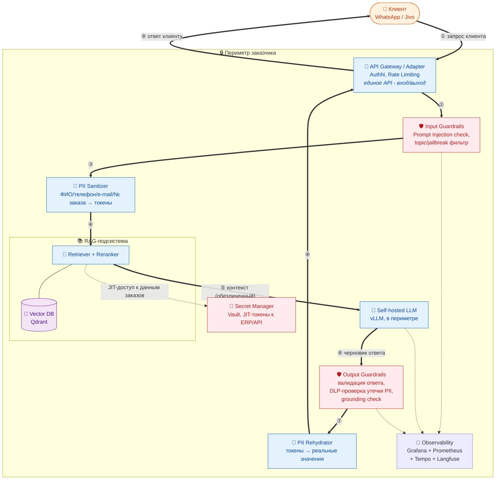
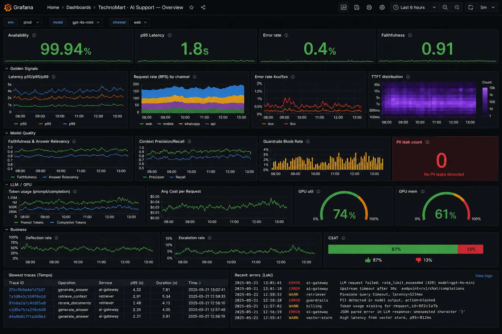

# ДЗ №6. Комплексное обеспечение качества: Тестирование, Безопасность и Наблюдаемость

**Кейс:** ритейлер **TechnoMart**

**Объект QA** — **AI‑ассистент поддержки** TechnoMart: RAG‑бот в мессенджерах (WhatsApp/Jivo) по базе знаний (Confluence) и данным заказов (ERP/1С). RAG‑система. Архитектура — в [ДЗ №4](../hw-4/README.md); компоненты безопасности и governance из [ДЗ №2](../hw-2/README.md) и [ДЗ №5](../hw-5/README.md).

**Цель:** спроектировать комплекс обеспечения качества — **Security**, **тестирование RAG** и **Observability** с AI‑метриками. 

Теория — в [конспекте](summary/README.md).

---

## Содержание

1. [Security Layer](#1-security-layer)
   - [Компоненты защиты](#компоненты-защиты)
   - [Покрытие OWASP Top 10 для LLM](#покрытие-owasp-top-10-для-llm)
2. [Testing Strategy — оценка качества RAG](#2-testing-strategy--оценка-качества-rag)
   - [Метрики качества RAG](#метрики-качества-rag)
   - [Инструмент: Ragas vs DeepEval](#инструмент-ragas-vs-deepeval)
   - [Где запускаем](#где-запускаем)
   - [Сравнение LLM-моделей в RAG](#сравнение-llm-моделей-в-rag)
3. [Observability — дашборд Grafana](#3-observability--дашборд-grafana)
   - [Стек наблюдаемости](#стек-наблюдаемости)
   - [Метрики: бизнес, модель, техника](#метрики-бизнес-модель-техника)
   - [Мокап дашборда и виджеты](#мокап-дашборда-и-виджеты)
   - [Алерты по SLO](#алерты-по-slo)
4. [Итоговый стек инструментов](#4-итоговый-стек-инструментов)
5. [Термины и сокращения](#5-термины-и-сокращения)

---

## 1. Security Layer

Три обязательных слоя защиты: **PII‑санитайзер**, **guardrails** (валидация входа/выхода) и **secret manager**.

Переиспользуем: **PII Anonymizer + Token Vault** ([ДЗ №2](../hw-2/README.md)) → основа санитайзера; **self‑hosted LLM в периметре, 152‑ФЗ** ([ДЗ №4](../hw-4/README.md)); **«ПДн не в LLM», DQ, lineage** ([ДЗ №5](../hw-5/README.md)). 

Достраиваем: явные Input/Output **Guardrails** и **Secret Manager**.

### Компоненты защиты

Единая точка входа/выхода — **API Gateway**: он принимает запрос клиента (①) и он же возвращает ответ (⑨). Сплошные стрелки — путь запроса (①→⑤) и путь ответа (⑥→⑨); пунктир — вспомогательные потоки (секреты, телеметрия). Каждый узел имеет собственный контур проверок (**Defense‑in‑Depth**), красным — добавленные элементы.

Исходник схемы (Mermaid) — раскрыть

| # | Компонент | Что делает | Где в потоке | Инструмент |
|---|-----------|-----------|--------------|------------|
| 1 | **Input Guardrails** | Детекция Prompt Injection, jailbreak, off‑topic; блок «игнорируй инструкции» | До ретрива | **NeMo Guardrails** / **Llama Guard**; быстрый пред‑фильтр — Semantic Router / regex |
| 2 | **PII Sanitizer** | Маскирование ПДн в токены **до** LLM (переиспользуем аноним. из ДЗ №2) | Перед RAG/LLM | **Microsoft Presidio** (+ словари RU: телефон E.164, № заказа) |
| 3 | **Secret Manager** | Ключи/токены к ERP/1С и внешним API не в env и не в контексте LLM; выдача **JIT** с TTL | На вызове инструментов ретривера | **HashiCorp Vault** / OpenBao |
| 4 | **Output Guardrails** | Валидация ответа: **DLP** (не утекла ли PII/секрет), grounding‑проверка (ответ опирается на контекст), фильтр токсичности/небезопасных действий | После LLM, до отправки | **Ragas/DeepEval** (grounding), regex/DLP‑правила, Guard‑модель |
| 5 | **PII Rehydrator** | Восстановление токенов в реальные значения только для авторизованного клиента | Перед ответом | ДЗ №2 (Token Vault) |

### Покрытие OWASP Top 10 для LLM

Специфичные для LLM атаки ([OWASP Top 10 for LLM](https://owasp.org/www-project-top-10-for-large-language-model-applications/)):

| Риск OWASP | Угроза | Чем закрываем |
|------------|--------|---------------|
| **LLM01: Prompt Injection** | Клиент или отравленный документ Confluence подменяет инструкции бота | Input Guardrails (детекция инъекций), grounding‑проверка на выходе, системный промпт с жёсткими границами |
| **LLM02: Insecure Output Handling** | Ответ содержит вредоносную ссылку/разметку (Markdown‑exfiltration) | Output Guardrails + экранирование, запрет внешних ссылок, egress‑контроль |
| **LLM06: Sensitive Info Disclosure** | Утечка ПДн клиента или чужих заказов в ответе | PII Sanitizer до LLM + DLP на выходе + RBAC на данные заказов (по номеру телефона клиента) |
| **LLM10: Model Theft / доступ** | Несанкционированный доступ к self‑hosted модели | Периметр ИБ (ДЗ №4), AuthN/Rate Limiting на Gateway, Secret Manager |

---

## 2. Testing Strategy — оценка качества RAG

Оцениваем **правдивость ответа относительно контекста и его релевантность вопросу** — автоматически, RAG‑метриками, на **золотом датасете** (эталонные пары «вопрос → ответ + релевантные документы»).

### Метрики качества RAG

RAG делится на два звена — **Retrieval** (что нашли) и **Generation** (что сгенерировали). Метрики покрывают оба.

| Метрика | Звено | Что измеряет (простыми словами) | Пример                                               |
|---------|-------|--------------------------------|------------------------------------------------------|
| **Faithfulness** (верность) | Generation | Доля утверждений ответа, которые **подтверждаются** найденным контекстом. Защита от галлюцинаций | Модель «додумала» факт, которого нет в документах    |
| **Answer Relevancy** (релевантность ответа) | Generation | Насколько ответ по сути отвечает на **заданный** вопрос, без «воды» и ухода в сторону | Ответ верный, но не про то, что спросили             |
| **Context Precision** (точность контекста) | Retrieval | Доля действительно релевантных чанков среди найденных; релевантные — вверху ранжирования | Ретривер тащит много мусора                          |
| **Context Recall** (полнота контекста) | Retrieval | Найдены ли **все** нужные для ответа документы | Нужный кусок БЗ не попал в контекст → ответ неполный |
| **Answer Correctness** (корректность) | End‑to‑end | Совпадение с эталонным ответом (нужен ground truth) | Ответ расходится с эталоном                          |

**Faithfulness** и **Answer Relevancy** считаются **без** ground truth — их можно мерить в т.ч. на живом трафике.

### Инструмент: Ragas vs DeepEval

Выбираем между двумя актуальными фреймворками авто‑оценки RAG (оба используют LLM‑as‑a‑judge для расчета метрик).

| Критерий | **Ragas** | **DeepEval** |
|----------|-----------|--------------|
| Фокус | Заточен именно под **RAG‑метрики** (Faithfulness, Answer/Context) | Универсальный: RAG + юнит‑тесты LLM, red‑teaming, safety |
| Формулировка тестов | Датасет метрик поверх выборки | **pytest‑подобные** тест‑кейсы (`assert`) → удобный gate в CI |
| Экосистема | LangChain/LlamaIndex, трекинг в Langfuse | LangChain + свой отчётный UI |

**Выбор — Ragas**: специализирован под RAG‑метрики, есть практический опыт, метрики ложатся в Langfuse (§3). 

**DeepEval** — опционально, для safety/red‑teaming и pytest‑gate в CI.

### Где запускаем

Полный прогон Ragas на каждый commit дорог и медленен (каждая метрика = вызовы LLM‑судьи), а качество нужно мерить на **prod‑моделях**. Поэтому — **три уровня**.

| Уровень | Когда | На чём | Датасет | Роль |
|---------|-------|--------|---------|------|
| **1. CI‑gate (smoke)** | На каждый PR | Дешёвый прогон | **Мини‑набор** (20–50 пар) | Быстро поймать регресс промпта/ретривера; блок PR при падении порога |
| **2. Pre‑release eval** | Перед релизом (скрипт) | **Prod‑модели и prod‑конфиг** RAG | **Полный золотой датасет** | Основная приёмка качества; сравнение моделей/конфигов; отчёт |
| **3. Online eval** | Постоянно в проде | Живой трафик, **семплирование** | Реальные вопросы | Faithfulness/Relevancy на выборке ответов → дрейф качества, алерты (через Langfuse) |

**Решение:** основная приёмка — **pre‑release скриптом на prod‑моделях** (уровень 2, на нём же сравниваем модели); в CI — только лёгкий smoke‑gate (уровень 1); online‑семплирование (уровень 3) ловит деградацию в проде.

---

## 3. Observability — дашборд Grafana

Три основных составляющих (метрики, логи, трейсы) + LLM‑трейсинг. Дашборд покрывает не только «железо», но и **качество ответов** и **бизнес‑эффект**

### Стек наблюдаемости

**Grafana** — единая точка визуализации и алертов; данные тянет из источников ниже:

| Слой | Инструмент | Что даёт |
|------|-----------|----------|
| **Визуализация + алерты** | **Grafana** | Дашборды и алерты поверх всех источников ниже (единая панель) |
| **Метрики** | **Prometheus** | Числовые ряды: latency, RPS, error rate, GPU/CPU, токены |
| **Логи** | **Loki** | Логи с **PII‑маскированием** (см. ДЗ №4) |
| **Трейсы (инфра)** | **Tempo** | Сквозной трейс по **всем сервисам**: Gateway → Guardrails → Retriever → Vector DB → LLM, включая **не‑LLM** участки (auth, сеть, БД заказов) |
| **Трейсы (LLM/RAG)** | **Langfuse** (self‑hosted) | Промпты, найденные чанки, токены, стоимость, online‑Ragas на семпле |

*Tempo vs Langfuse не дублируют друг друга:*

| | **Tempo** | **Langfuse** |
|---|-----------|--------------|
| Уровень | Инфраструктура, **весь путь запроса** по сервисам | **LLM/RAG‑логика**|
| Видит | auth, сеть, запрос к БД заказов, очередь, шаг LLM | промпт, чанки, токены, стоимость, качество |
| Где смотрим | В Grafana, **коррелирует с метриками/логами** (из всплеска latency → конкретный трейс) | В своём UI Langfuse |
| Отвечает на вопрос | «на каком **сервисе/шаге** застряло» | «что было с **промптом и ответом**» |

> Если ассистент — **один сервис**, Langfuse закрывает почти всё, и Tempo опционален.

> **Langfuse — локально (self‑hosted):** по требованию ДЗ №4 ПДн и промпты не покидают периметр; он же принимает online‑оценки качества (уровень 3 из п2).

### Метрики: бизнес, модель, техника

Метрики сгруппированы в три категории. Технические дополнительно размечены по **Golden Signals** (Latency, Traffic, Errors, Saturation — методология Google SRE).

**А. Бизнес‑метрики** (эффект для поддержки TechnoMart)

| Метрика | Смысл | Источник |
|---------|-------|----------|
| Deflection rate (% автоответов) | Доля обращений, закрытых ботом без оператора | app + Langfuse |
| Escalation rate | Доля переводов на живого оператора | app |
| CSAT / 👍👎 на ответ | Оценка ответа клиентом | app → Langfuse |
| Answered / Unanswered ratio | Доля «не знаю ответа» / отказов | app |
| Активные диалоги, сообщений/день | Нагрузка на канал | app |

**Б. Метрики качества ИИ-сервисов (RAG, LLM, Guardrails)**

| Метрика | Смысл | Источник |
|---------|-------|----------|
| **Faithfulness** (online, на семпле) | Нет ли галлюцинаций | Ragas → Langfuse |
| **Answer Relevancy** (online) | Ответ по существу | Ragas → Langfuse |
| **Context Precision / Recall** | Качество ретрива | Ragas → Langfuse |
| Guardrails **Block Rate** | Доля заблокированных (инъекции/toxicity) | Guardrails |
| **PII leak count** (DLP) | Срабатывания DLP на выходе | Output Guardrails |
| Retrieval hit‑rate / «пустой контекст» | Как часто ретривер ничего не нашёл | Retriever |

**В. Технические метрики** (Golden Signals + инфраструктура/LLM)

| Метрика | Golden Signal | Смысл |
|---------|---------------|-------|
| **Latency** p50/p95/p99, TTFT | Latency | Задержка ответа и время до первого токена |
| **Request rate (RPS)** | Traffic | Запросов в секунду |
| **Error rate** (4xx/5xx, LLM‑ошибки, таймауты) | Errors | Доля ошибок |
| **GPU utilization / GPU mem** | Saturation | Загрузка GPU (self‑hosted vLLM) |
| CPU / RAM / Disk | Saturation | Ресурсы VM |
| **Token usage** (prompt/completion) | — | Токены на запрос и суммарно |
| **Average Cost per Request** | — | Средняя стоимость ответа (токены × тариф/амортизация GPU) |
| vLLM: queue length, KV‑cache usage, batch size | Saturation | Здоровье инференс‑движка |
| Kafka/queue consumer lag, индексация БЗ | Saturation | Свежесть базы знаний (nightly 02:00–04:00) |

### Мокап дашборда и виджеты

Дашборд `TechnoMart · AI Support — Overview` (вдохновлён примерами [grafana.com/grafana/dashboards](https://grafana.com/grafana/dashboards/)). Верхняя строка — «светофор» SLO, ниже — Golden Signals, качество модели, LLM/GPU и бизнес. Переменные фильтра: `env`, `model_version`, `channel`.

*Визуальный мокап (данные иллюстративные). Полный список панелей:*

| Row | Панель | Тип Grafana | Источник | Порог/алерт |
|-----|--------|-------------|----------|-------------|
| 0 | Availability | Stat | Prometheus | <99.9% → warning |
| 0 | p95 Latency | Stat | Prometheus | >3s → warning |
| 0 | Error rate | Stat | Prometheus | >2% → critical |
| 0 | Faithfulness (online) | Stat | Langfuse/Ragas | <0.8 → warning |
| 1 | Latency p50/p95/p99 | Time series | Prometheus | — |
| 1 | Request rate by channel | Time series (stacked) | Prometheus | — |
| 1 | Error rate 4xx/5xx | Time series | Prometheus | — |
| 1 | TTFT distribution | Heatmap | Prometheus | — |
| 2 | Faithfulness / Answer Relevancy | Time series | Langfuse/Ragas | тренд вниз → алерт |
| 2 | Context Precision / Recall | Time series | Langfuse/Ragas | — |
| 2 | Guardrails Block Rate | Time series | Guardrails | >5% → возможная атака |
| 2 | PII leak count (DLP) | Stat | Output Guardrails | >0 → critical |
| 2 | Empty‑context % | Stat | Retriever | рост → проблема БЗ |
| 3 | Token usage | Time series | Prometheus/Langfuse | — |
| 3 | Avg Cost per Request | Time series | Langfuse | рост → алерт |
| 3 | GPU utilization / mem | Gauge | DCGM exporter | >90% длит. → saturation |
| 3 | vLLM queue / KV‑cache | Time series | vLLM /metrics | рост очереди → алерт |
| 4 | Deflection / Escalation | Time series | app | — |
| 4 | CSAT 👍👎 | Bar gauge | app/Langfuse | падение → алерт |
| 4 | Unanswered ratio | Stat | app | рост → алерт |
| 5 | Slowest traces | Table (Tempo) | Tempo | — |
| 5 | Recent errors | Logs (Loki) | Loki | — |

### Алерты по SLO

Проектируем дашборды под мониторинг ключевых **SLO** AI‑сервиса

| Алерт | Условие (правило) | Severity | Куда |
|-------|-------------------|----------|------|
| High error rate | `error_rate > 2%` 5 мин | Critical | Telegram |
| Latency SLO breach | `p95 > 3s` 10 мин | Warning | Telegram |
| Quality drift | `Faithfulness < 0.8` на семпле | Warning | Telegram + владелец продукта |
| **PII leak** | `dlp_pii_leak_count > 0` | Critical | Telegram + ИБ |
| Guardrails spike | `block_rate > 5%` (возможная атака) | Warning | Telegram + ИБ |
| GPU saturation | `gpu_util > 90%` 15 мин | Warning | Telegram |
| Stale knowledge base | нет успешной индексации > 26 ч | Warning | Telegram |

---

## 4. Итоговый стек инструментов

### Что используем в этом ДЗ (Security + Testing + Observability)

| Область | Инструмент | Что делает | Роль в проекте | Ссылка |
|---------|-----------|-----------|----------------|--------|
| Security | Microsoft Presidio | Обнаружение и обезличивание PII в тексте | PII Sanitizer: маскирование ПДн до LLM | [github.com/microsoft/presidio](https://github.com/microsoft/presidio) |
| Security | NVIDIA NeMo Guardrails | Программируемые «ограждения» LLM (фильтры инъекций/тем) | Input/Output Guardrails | [github.com/NVIDIA/NeMo-Guardrails](https://github.com/NVIDIA/NeMo-Guardrails) |
| Security | HashiCorp Vault | Хранилище секретов с динамическими токенами и TTL | Secret Manager: JIT‑токены к ERP/API | [github.com/hashicorp/vault](https://github.com/hashicorp/vault) |
| Testing | Ragas | Авто‑оценка RAG: Faithfulness, Answer/Context‑метрики | Приёмка качества RAG (golden set + online) | [github.com/explodinggradients/ragas](https://github.com/explodinggradients/ragas) |
| Observability | Grafana | Дашборды и алерты поверх всех источников | Единая панель мониторинга (§3) | [grafana.com/oss/grafana](https://grafana.com/oss/grafana/) |
| Observability | Prometheus | Сбор метрик (time‑series, PromQL) | Метрики: latency, RPS, errors, GPU, токены | [prometheus.io](https://prometheus.io/) |
| Observability | Grafana Loki | Агрегация логов по меткам | Логи с PII‑маскированием | [grafana.com/oss/loki](https://grafana.com/oss/loki/) |
| Observability | Grafana Tempo | Хранение распределённых трейсов | Трейс запроса: где тормозит/падает | [grafana.com/oss/tempo](https://grafana.com/oss/tempo/) |
| Observability | Langfuse *(self‑hosted)* | Наблюдаемость LLM: промпты, токены, стоимость, качество | LLM/RAG‑трейсинг + online‑Ragas в периметре | [github.com/langfuse/langfuse](https://github.com/langfuse/langfuse) |
| Observability | Grafana Alerting | Правила алертов + contact points | Алерты по SLO → Telegram | [grafana.com/docs/grafana/latest/alerting](https://grafana.com/docs/grafana/latest/alerting/) |

---

## 5. Термины и сокращения

| Термин | Значение |
|--------|----------|
| **RAG** (Retrieval‑Augmented Generation) | Генерация ответа с опорой на найденные во внешней базе документы |
| **PII** (Personally Identifiable Information) | Персональные данные (ФИО, телефон, e‑mail, № заказа) |
| **152‑ФЗ** | Закон РФ о персональных данных |
| **Guardrails** | Фильтры входа/выхода модели (защита от инъекций, небезопасного вывода) |
| **Prompt Injection** | Подмена инструкций модели через ввод или отравленный документ |
| **DLP** (Data Loss Prevention) | Предотвращение утечки данных (проверка ответа на PII/секреты) |
| **Secret Manager / JIT** (Just‑In‑Time) | Хранилище секретов с выдачей токенов «точно в срок» с коротким TTL |
| **TTL** (Time To Live) | Время жизни записи/токена |
| **DQ** (Data Quality) | Качество данных |
| **Defense‑in‑Depth** | Эшелонированная оборона: независимые контуры проверок на каждом узле |
| **чанк** (chunk) | Фрагмент документа, единица индексации |
| **ground truth** | Эталонный «правильный» ответ для сравнения |
| **галлюцинация** | Выдуманный моделью факт, не подтверждённый контекстом |
| **Faithfulness** | Доля утверждений ответа, подтверждённых контекстом (анти‑галлюцинация) |
| **Answer Relevancy** | Насколько ответ по существу отвечает на вопрос |
| **Context Precision / Recall** | Точность / полнота найденного контекста (retrieval) |
| **Answer Correctness** | Совпадение ответа с эталоном (нужен ground truth) |
| **Ragas / DeepEval** | Фреймворки авто‑оценки качества RAG (LLM‑as‑a‑judge) |
| **LLM‑as‑a‑judge** | Оценка ответа моделью‑судьёй |
| **Golden Signals** | Latency, Traffic, Errors, Saturation (методология Google SRE) |
| **SLO** (Service Level Objective) | Цель по уровню обслуживания (напр., «p95 ≤ 3s, доступность ≥ 99.9%») |
| **Latency p50/p95/p99** | Перцентили задержки ответа |
| **TTFT** (Time To First Token) | Время до первого токена |
| **RPS** (Requests Per Second) | Запросов в секунду |
| **KV‑cache** | Кэш ключей/значений внимания в LLM (влияет на пропускную способность vLLM) |
| **CSAT** (Customer Satisfaction) | Оценка удовлетворённости клиента |
| **Deflection / Escalation rate** | Доля ответов ботом без оператора / доля переводов на оператора |
| **Prometheus / Loki / Tempo** | Метрики / логи / трейсы |
| **Langfuse** | Наблюдаемость LLM‑приложений (трейсинг промптов, токенов, качества) |
| **MLflow** | Трекинг экспериментов и версий модель→датасет→метрики |
| **vLLM** | Движок инференса LLM (self‑hosted, источник `/metrics`) |
