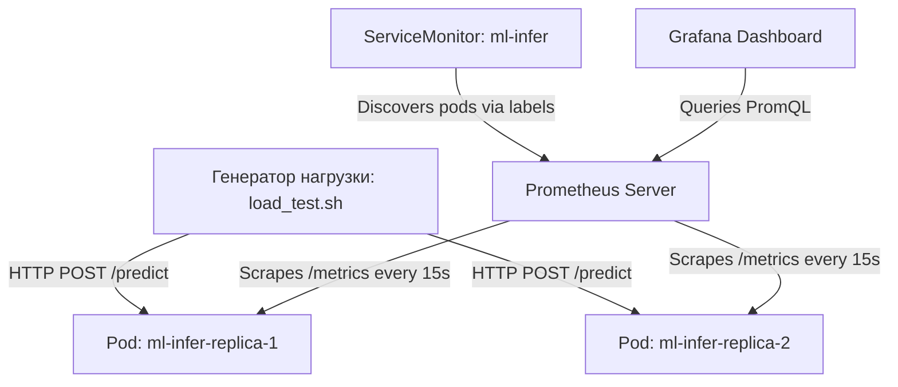

# Практика: алерты и метрики в Kubernetes (Демонстрационный стенд)


Данный демонстрационный стенд предназначен для самостоятельного изучения работы метрик, сбора логов и алертинга в Kubernetes. Он развертывает веб-приложение машинного обучения (FastAPI), собирает его метрики с помощью Prometheus Operator (через ServiceMonitor) и визуализирует их в Grafana.

---

## Архитектура и компоненты стенда

Стенд состоит из следующих ключевых частей:



1. **Kubernetes-кластер (Kind)**: Легковесный K8s-кластер, развернутый поверх Docker Desktop.
2. **ML-приложение (FastAPI)**: Находится в файле [app/app.py](app/app.py). Оно:
   * Загружает простую модель классификации Iris (`model.npz`).
   * Предоставляет эндпоинты `/health` (проверка работоспособности) и `/predict` (инференс).
   * **Симулирует проблемы**: Каждые ~20% запросов падают с кодом HTTP 500 (`ERROR_RATE`), а также добавляется случайная задержка до 2 секунд (`MAX_DELAY`), чтобы показать деградацию производительности (Latency p95).
   * Экспортирует Prometheus-метрики на `/metrics`.
3. **kube-prometheus-stack**: Включает в себя Prometheus, Grafana, Alertmanager и Prometheus Operator.
4. **ServiceMonitor**: Объект `ServiceMonitor` настраивает Prometheus на автоматическое обнаружение подов приложения по селекторам и сбор метрик каждые 15 секунд.

---

## Требования к окружению

Для запуска стенда на локальной машине должны быть установлены:
1. **Docker Desktop** (с запущенным Docker Daemon).
2. **kubectl** — интерфейс командной строки для управления Kubernetes.
3. **kind** — инструмент для запуска локальных кластеров Kubernetes в Docker.
   * [Инструкция по установке kind](https://kind.sigs.k8s.io/docs/user/quick-start/#installation)
4. **helm** — пакетный менеджер для Kubernetes.
   * [Инструкция по установке helm](https://helm.sh/docs/intro/install/)

---

## Быстрый запуск стенда

### 1. Запуск кластера и сервисов
Для запуска стенда выполните следующие команды:
```bash
# 1. Запустить Kind кластер
kind create cluster --name alerting-demo

# 2. Установить Prometheus Stack
kubectl create ns monitoring
helm repo add prometheus-community https://prometheus-community.github.io/helm-charts
helm repo update
helm install kps prometheus-community/kube-prometheus-stack \
  --namespace monitoring \
  --set grafana.adminPassword='admin' \
  --set prometheus.prometheusSpec.scrapeInterval='15s'
```

### 2. Сборка и деплой приложения
```bash
# 1. Собираем образ на хосте
docker build -t ml-infer:0.1 .

# 2. Загружаем образ внутрь ноды Kind-кластера
kind load docker-image ml-infer:0.1 --name alerting-demo

# 3. Применяем манифесты в Kubernetes
kubectl apply -f k8s/deployment.yaml
kubectl apply -f k8s/service.yaml
kubectl apply -f k8s/servicemonitor.yaml
```

### 3. Проброс портов на хост-машину
Для доступа к сервисам из локального браузера запустите подготовленный скрипт [port_forwards.sh](port_forwards.sh) в фоновом режиме:
```bash
# Запустить проброс портов
./port_forwards.sh start

# Проверить статус портов
./port_forwards.sh status
```

После этого сервисы будут доступны по следующим адресам:
* **Grafana**: [http://localhost:3000](http://localhost:3000) (логин: `admin`, пароль: `admin`)
* **Prometheus**: [http://localhost:9090](http://localhost:9090)
* **Приложение**: [http://localhost:8080](http://localhost:8080)

---

## Руководство по проведению лабораторной работы

Данное руководство поможет наглядно изучить принципы SRE, мониторинга (SLI/SLO) и алертинга.

### Шаг 1: Обзор "черного ящика" (Код приложения)
Откройте файл кода приложения [app/app.py](app/app.py) и изучите:
* Как инициализируются счетчики метрик (`Counter` для запросов и ошибок, `Histogram` для задержек).
* Как в функции `predict()` внедрены искусственные проблемы:
  * Внедрение ошибок: `random.random() < ERROR_RATE` (возвращает HTTP 500).
  * Внедрение задержки: `time.sleep(delay)`.

### Шаг 2: Проверка автообнаружения в Prometheus
1. Перейдите в веб-интерфейс Prometheus по адресу [http://localhost:9090](http://localhost:9090).
2. Откройте вкладку **Status -> Targets**.
3. Найдите в списке `serviceMonitor/default/ml-infer/0` и убедитесь, что Prometheus автоматически нашел два поды (реплики) приложения и успешно собирает с них метрики (статус `UP`).
4. *Принцип работы:* Автообнаружение происходит благодаря настроенному `ServiceMonitor`, который отслеживает поды по меткам `app: ml-infer`.

### Шаг 3: Симуляция нагрузки на сервис
Запустите скрипт генерации трафика, который отправит 300 последовательных запросов на предсказание:
```bash
./load_test.sh 8080 300
```
В выводе терминала обратите внимание, что часть запросов падает с кодом `500` (ошибки инференса), а часть проходит успешно с кодом `200`.

### Шаг 4: Визуализация метрик в Grafana
Дашборд можно настроить двумя способами: автоматически (через импорт готового JSON) или вручную.

#### Вариант А: Автоматический импорт дашборда (Рекомендуемый)
Используйте готовый файл конфигурации дашборда [dashboard.json](dashboard.json). Для импорта:
1. Откройте Grafana: [http://localhost:3000](http://localhost:3000) (логин/пароль: `admin` / `admin`).
2. Нажмите на иконку **меню** (три полоски в левом верхнем углу) и выберите **Dashboards**.
3. В правом верхнем углу нажмите кнопку **New** -> **Import**.
4. Скопируйте содержимое файла [dashboard.json](dashboard.json), вставьте его в текстовое поле **Import via panel json** (или загрузите файл с диска) и нажмите **Load**.
5. Выберите источник данных (Data Source) — **Prometheus** из выпадающего списка и нажмите **Import**.
6. Дашборд с тремя готовыми панелями отобразится мгновенно.

#### Вариант Б: Настройка вручную (Пошагово)
Для создания панелей с нуля:
1. Откройте Grafana: [http://localhost:3000](http://localhost:3000).
2. Перейдите в **Dashboards** -> **New** -> **New Dashboard** -> **Add visualization**.
3. Выберите источник данных **Prometheus**.
4. Создайте три панели со следующими параметрами:

##### Панель 1: Error Rate (Доля ошибок)
* **Запрос (PromQL)**:
  ```promql
  sum(increase(prediction_errors_total[5m])) / sum(increase(prediction_requests_total[5m]))
  ```
* **Тип визуализации**: `Time series`.
* **Легенда (Legend)**: `Custom` -> `Error Rate (SLI)`.
* **Настройки осей (Standard options -> Unit)**: Выберите `Misc` -> `percentunit` (шкала от 0.0 до 1.0).
* **Пороги (Thresholds)**: Добавьте порог: `0.15` (красный цвет), чтобы показать критическую долю ошибок в 15%.
* **Суть**: Показывает процент упавших запросов (со статусом 500) к общему числу запросов за последние 5 минут. Это ключевой индикатор надежности (SLI). При установленном `ERROR_RATE=0.2` график стабилизируется на уровне ~20% (0.2).

##### Панель 2: Latency p95 (95-й перцентиль задержки)
* **Запрос (PromQL)**:
  ```promql
  histogram_quantile(0.95, sum(rate(prediction_latency_seconds_bucket[5m])) by (le))
  ```
* **Тип визуализации**: `Time series`.
* **Легенда (Legend)**: `Custom` -> `p95 Latency`.
* **Настройки осей (Standard options -> Unit)**: Выберите `Time` -> `Seconds (s)`.
* **Пороги (Thresholds)**: `1.0` (желтый), `1.5` (красный).
* **Суть**: 95% запросов пользователей обрабатываются быстрее этого времени. Наглядно демонстрирует влияние инъекции случайной задержки до 2 секунд.

##### Панель 3: HTTP общая статистика (Throughput по статусам)
* **Запрос (PromQL)**:
  ```promql
  sum by (status) (rate(http_requests_total[5m]))
  ```
* **Тип визуализации**: `Time series`.
* **Легенда (Legend)**: `Custom` -> `status: {{status}}`.
* **Настройки осей (Standard options -> Unit)**: Выберите `Throughput` -> `requests/sec (reqps)`.
* **Суть**: Динамика интенсивности запросов к приложению с разделением по кодам ответа.

### Шаг 5: Настройка оповещений (Алертинг)
Настройка оповещений на основе метрики **Error Rate** происходит следующим образом:
1. Задается условие: если `Error Rate > 15%` в течение 2 минут — система переходит в состояние `Firing`.
2. В Grafana или Alertmanager настраиваются каналы доставки (Contact Points), например, Telegram-бот.
3. Инструкция для настройки Telegram-оповещений доступна по [этой ссылке](https://gist.github.com/nafiesl/4ad622f344cd1dc3bb1ecbe468ff9f8a).

---

## Очистка ресурсов
Когда работа со стендом завершена, остановите проброс портов и удалите кластер:
```bash
# 1. Остановить проброс портов
./port_forwards.sh stop

# 2. Удалить кластер Kind
kind delete cluster --name alerting-demo
```
