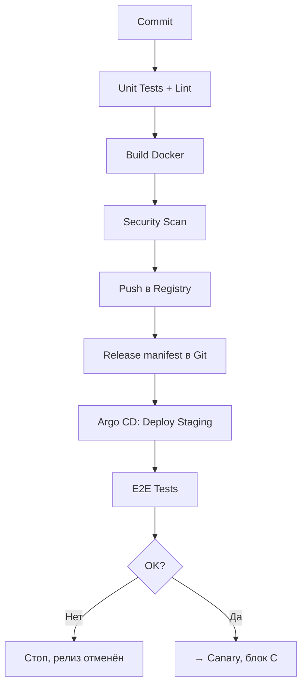
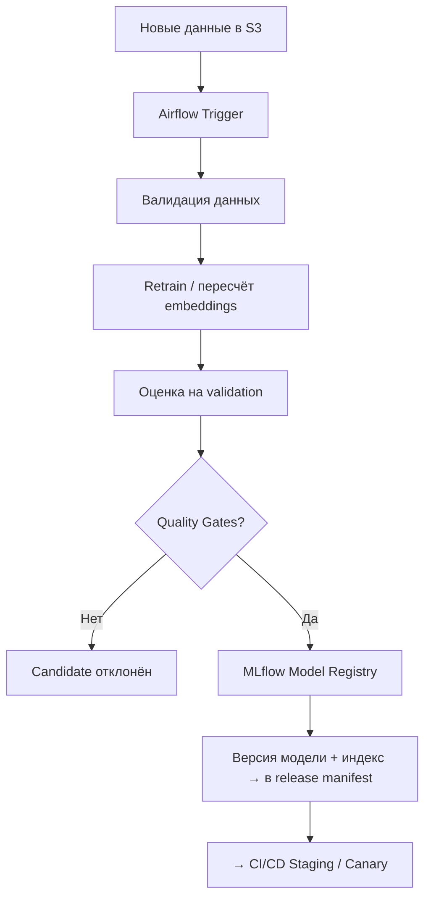
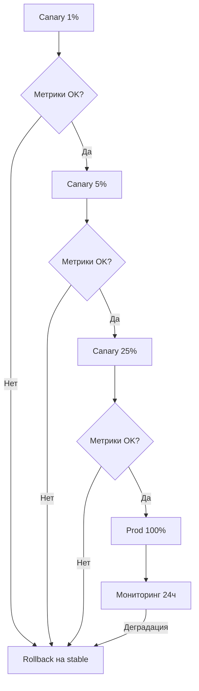

# ДЗ №8. Автоматизация поставки: IaC, CI/CD и MLOps

**Сервис:** RAG-бот поддержки. Пользователь задаёт вопрос - сервис ищет документы в векторной базе - LLM формирует ответ.

**Что делаем:** инфраструктуру (Terraform), сборку и тесты (CI/CD), обновление модели и векторной базы (Airflow + MLflow), выкатку через Canary 1% → 5% → 25% → 100% с автооткатом.

Теория — [конспект](summary/README.md).

---

## 1. Infrastructure as Code

Terraform поднимает всю инфраструктуру в Yandex Cloud:

```hcl
terraform {
  # backend — куда Terraform кладёт state (что уже создано)
  backend "s3" {
    bucket = "ai-service-tfstate"       # бакет со state-файлом
    key    = "prod/terraform.tfstate"   # путь к файлу внутри бакета
  }
  required_providers {
    yandex = { source = "yandex-cloud/yandex" }  # драйвер к Yandex Cloud
  }
}

# VPC — общая сеть для всех сервисов
resource "yandex_vpc_network" "main" { name = "ai-service-net" }

resource "yandex_vpc_subnet" "subnets" {
  for_each       = toset(["ru-central1-a", "ru-central1-b"])  # две зоны доступности
  network_id     = yandex_vpc_network.main.id                # привязка к VPC
  zone           = each.value                                # конкретная зона
  v4_cidr_blocks = [each.value == "ru-central1-a" ? "10.10.1.0/24" : "10.10.2.0/24"]  # диапазон IP
}

# Managed Kubernetes
resource "yandex_kubernetes_cluster" "main" {
  name       = "ai-service-prod"
  network_id = yandex_vpc_network.main.id
  master { regional = true }  # control plane в нескольких зонах
}

resource "yandex_kubernetes_node_group" "cpu" {
  cluster_id = yandex_kubernetes_cluster.main.id
  node_count = 3  # CPU-ноды: Airflow, MLflow, API
}

resource "yandex_kubernetes_node_group" "gpu" {
  cluster_id = yandex_kubernetes_cluster.main.id
  node_count = 2                                # GPU-ноды под инференс
  labels     = { workload = "inference" }       # метка, чтобы поды инференса сели сюда
}

# S3: датасеты, веса моделей, снэпшоты векторной базы
resource "yandex_storage_bucket" "buckets" {
  for_each   = toset(["datasets", "model-artifacts", "vector-snapshots"])
  bucket     = "ai-service-${each.value}"  # имя бакета
  versioning = true                        # хранить старые версии — нужен откат
}

resource "yandex_container_registry" "registry" { name = "ai-service-registry" }  # Docker-образы

# PostgreSQL — метаданные Airflow и MLflow Model Registry
resource "yandex_mdb_postgresql_cluster" "meta" {
  name        = "ai-service-meta"
  environment = "PRODUCTION"  # прод-класс: бэкапы, SLA
}

# Сервисные аккаунты — права у приложений, не у людей
resource "yandex_iam_service_account" "k8s"         { name = "sa-k8s" }          # кластер K8s
resource "yandex_iam_service_account" "ml_pipeline" { name = "sa-ml-pipeline" }  # Airflow / обучение

# Helm ставит софт внутрь уже готового кластера
resource "helm_release" "argocd"     { chart = "argo-cd" }               # GitOps: кластер тянет манифесты из Git
resource "helm_release" "istio"      { chart = "istio" }                 # split трафика stable / canary
resource "helm_release" "airflow"    { chart = "airflow" }               # оркестрация обучения
resource "helm_release" "mlflow"     { chart = "mlflow" }                # реестр версий моделей
resource "helm_release" "qdrant"     { chart = "qdrant" }                # векторная база RAG
resource "helm_release" "prometheus" { chart = "kube-prometheus-stack" } # метрики и алерты
```


| Ресурс                       | Зачем                                               |
| ---------------------------- | --------------------------------------------------- |
| VPC + 2 подсети              | Изоляция и отказоустойчивость по зонам              |
| Managed K8s (CPU + GPU ноды) | Staging и prod: сам сервис, Airflow, MLflow, Qdrant |
| S3 `datasets`                | Исходные документы и датасеты (versioning)          |
| S3 `model-artifacts`         | Веса и артефакты моделей                            |
| S3 `vector-snapshots`        | Снэпшоты векторной базы — для отката                |
| Container Registry           | Docker-образы сервиса                               |
| Managed PostgreSQL           | Метаданные Airflow и MLflow                         |
| Argo CD / Istio / Prometheus | GitOps, split трафика, метрики                      |


Секреты лежат в Secret Manager, доступ через сервисные аккаунты. State хранится в S3 с версионированием.

---

## 2. Схема пайплайнов: CI/CD + MLOps

Три связанных потока. Сходятся в **release manifest** (образ + версия модели + индекс) → дальше Canary.

### Блок A. CI/CD приложения




### Блок B. MLOps-конвейер




### Блок C. Canary-релиз




### Этапы CI/CD


| Этап              | Что делает                             | Гейт                                        |
| ----------------- | -------------------------------------- | ------------------------------------------- |
| Commit            | Push в Git запускает пайплайн          | —                                           |
| Unit Tests + Lint | ruff/black, тесты retrieval и API      | Любая ошибка, coverage < 80%                |
| Build Docker      | Образ с тегом = Git SHA (immutable)    | —                                           |
| Security Scan     | Три проверки безопасности (см. ниже)   | Критичные дыры в коде/образе, секреты в Git |
| Deploy Staging    | Argo CD синхронизирует staging с Git   | —                                           |
| E2E Tests         | Реальный запрос: API → retrieval → LLM | Ошибка ответа, P95 > 2 с                    |
| Deploy Prod       | Canary 1% → 5% → 25% → 100%            | См. раздел 4                                |


**Security Scan — три проверки:**


| Что сканируем | Инструмент                                                     | Простыми словами                                                       |
| ------------- | -------------------------------------------------------------- | ---------------------------------------------------------------------- |
| Исходный код  | **Semgrep** (это SAST: поиск дыр в коде без запуска программы) | Находит типичные ошибки: SQL-injection, небезопасные вызовы API        |
| Docker-образ  | **Trivy**                                                      | Смотрит, нет ли известных уязвимостей в ОС и библиотеках внутри образа |
| Репозиторий   | поиск секретов (gitleaks / trufflehog)                         | Пароли, API-ключи, токены не должны попасть в Git                      |


Любая **критичная** находка останавливает пайплайн, в staging такая сборка не едет.

---

## 3. MLOps: связь с обучением модели

**Триггеры запуска:** новый документ/датасет в S3, cron по расписанию, либо алерт мониторинга (падение hit rate, drift > порога).

**Поток:**

```
Новые данные в S3
  → Airflow DAG
  → валидация данных (схема, дубликаты, пропуски)
  → retrain модели / пересчёт embeddings + сборка индекса Qdrant
  → оценка на фиксированном validation-наборе
  → Quality Gates
  → регистрация версии в MLflow Model Registry
  → событие ModelVersionCreated запускает CI/CD
  → staging → E2E → Canary → prod
```

### Quality Gates модели

**Quality Gate** - автоматический порог на **фиксированном validation-наборе**.


| Метрика              | Что измеряет                                         | Порог                           |
| -------------------- | ---------------------------------------------------- | ------------------------------- |
| **Recall@5**         | В топ-5 найденных документов есть нужный             | Не хуже stable больше чем на 2% |
| **Faithfulness**     | Ответ опирается на найденные источники, а не выдуман | ≥ 0.85                          |
| **Пустой retrieval** | Доля запросов, по которым поиск ничего не нашёл      | ≤ 5%                            |
| **P95 latency**      | 95% ответов укладываются в это время                 | ≤ 2 с на staging                |


Все гейты должны пройти **одновременно**. Не прошёл хотя бы один - версия остаётся `Candidate`, Canary не стартует.

### Связь кода приложения и артефакта модели

Единица релиза - **release manifest** в Git, который фиксирует все версии сразу:

```yaml
release:
  application_image: cr.yandex/ai-service/rag-api:1.8.0   # код
  model:
    name: support-rag
    version: 42                                            # из MLflow Model Registry
    uri: s3://ai-service-model-artifacts/support-rag/42/
  vector_index:
    version: 2026-08-27.3                                  # снэпшот Qdrant
    uri: s3://ai-service-vector-snapshots/2026-08-27.3/
  dataset_version: sha256:91c...                           # какие данные
```

Образ он получает конкретную версию из Model Registry. Поэтому любой релиз воспроизводим, а откат возвращает весь набор: код + модель + индекс.

---

## 4. Canary Deployment

В кластере одновременно живут два деплоймента: `rag-api-stable` (текущий прод) и `rag-api-canary` (новая связка кода, модели и индекса). Трафик делит Istio.

```yaml
# VirtualService: 1% на canary
http:
  - route:
      - destination: { host: rag-api-stable }
        weight: 99
      - destination: { host: rag-api-canary }
        weight: 1
```

### План переключения трафика


| Шаг | Трафик на canary | Наблюдаем                      | Дальше                   |
| --- | ---------------- | ------------------------------ | ------------------------ |
| 1   | **1%**           | 30 мин или ≥ 1 000 запросов    | Метрики в норме → 5%     |
| 2   | **5%**           | 1 час или ≥ 5 000 запросов     | Метрики в норме → 25%    |
| 3   | **25%**          | 2 часа или ≥ 10 000 запросов   | Метрики в норме → 100%   |
| 4   | **100%**         | 24 часа усиленного мониторинга | Canary становится stable |


Пользователь закрепляется за версией по `hash(user_id)` - чтобы один человек не прыгал между старой и новой моделью в рамках диалога.

### Метрики отката

**SLO** (Service Level Objective) - договорённость «сервис считается здоровым, если…»: например 5xx < 1% и P95 latency ≤ 2 с. Если canary ломает SLO - откат.


| Группа            | Метрики                                                              |
| ----------------- | -------------------------------------------------------------------- |
| Технические (SLO) | 5xx, timeout, P95/P99 latency, **OOM**, **CrashLoopBackOff**         |
| ML / RAG          | Recall@5, доля пустых retrieval, faithfulness, доля fallback-ответов |
| Бизнес            | Доля решённых обращений, дизлайки, эскалации на оператора            |


**Автооткат срабатывает**, если в двух подряд 5-минутных окнах выполнено любое условие:

- 5xx > 1% или на 0.5 п.п. выше stable;
- P95 latency > 2 с или на 20% выше stable;
- timeout rate > 0.5%;
- пустой retrieval > 5%;
- faithfulness < 0.85 или на 3% ниже stable;
- дизлайков на 5% больше, чем у stable;
- OOM (Out Of Memory) или CrashLoopBackOff у canary-подов (память кончилась или под бесконечно падает).

**Что происходит при откате (без участия человека):**

1. Istio переводит 100% трафика на `rag-api-stable` — за минуты.
2. Argo CD откатывает release manifest на предыдущий коммит.
3. Возвращаются прошлые версии образа, модели и снэпшота векторной базы.
4. Алерт ответственным с версиями и графиками.
5. Повторный canary заблокирован, пока причина не устранена.

---

## 5. Итог

Два потока изменений сходятся в одну точку - release manifest в Git:


| Что изменилось    | Путь                                                                            |
| ----------------- | ------------------------------------------------------------------------------- |
| **Код**           | Commit → Tests → Build → Staging → E2E → Canary → Prod                          |
| **Данные/модель** | S3 → Airflow → Retrain → Quality Gates → Model Registry → тот же CI/CD → Canary |


Вывод: релиз - это связка **образ + версия модели + версия индекса + версия датасета**. Отсюда воспроизводимость, отсутствие ручных шагов и откат одним переключением трафика.

---

## 6. Инструменты


| Инструмент                  | Что делает                                              | Ссылка                                                                                        |
| --------------------------- | ------------------------------------------------------- | --------------------------------------------------------------------------------------------- |
| Terraform                   | IaC: описывает и поднимает сеть, K8s, S3, БД            | [terraform.io](https://developer.hashicorp.com/terraform/docs)                                |
| Yandex Cloud provider       | Плагин Terraform для ресурсов Yandex Cloud              | [документация провайдера](https://terraform-provider.yandexcloud.net/)                        |
| Kubernetes                  | Кластер: запускает контейнеры сервиса, Airflow, MLflow  | [kubernetes.io](https://kubernetes.io/docs/home/)                                             |
| Helm                        | Ставит готовые пакеты (charts) в кластер                | [helm.sh](https://helm.sh/docs/)                                                              |
| Docker / Container Registry | Собирает и хранит образы приложения                     | [Docker docs](https://docs.docker.com/)                                                       |
| Argo CD                     | GitOps: кластер сам подтягивает манифесты из Git        | [архитектура Argo CD](https://argo-cd.readthedocs.io/en/stable/operator-manual/architecture/) |
| Istio                       | Делит трафик между stable и canary                      | [Istio traffic management](https://istio.io/latest/docs/concepts/traffic-management/)         |
| Apache Airflow              | Оркестрация: DAG обучения и обновления индекса          | [airflow.apache.org](https://airflow.apache.org/docs/)                                        |
| MLflow                      | Учёт экспериментов и Model Registry (версии моделей)    | [Model Registry](https://mlflow.org/docs/latest/model-registry.html)                          |
| Qdrant                      | Векторная база для RAG-поиска                           | [qdrant.tech](https://qdrant.tech/documentation/)                                             |
| Prometheus + Grafana        | Метрики, дашборды, алерты (helm: kube-prometheus-stack) | [prometheus.io](https://prometheus.io/docs/introduction/overview/)                            |
| Semgrep                     | SAST: ищет уязвимости в коде без запуска                | [semgrep.dev](https://semgrep.dev/docs/)                                                      |
| Trivy                       | Сканер уязвимостей в Docker-образе                      | [Trivy](https://trivy.dev/docs/)                                                              |
| Gitleaks                    | Ищет секреты (пароли, ключи) в Git                      | [gitleaks.io](https://gitleaks.io/)                                                           |


Про Canary как подход: [Martin Fowler — Canary Release](https://martinfowler.com/bliki/CanaryRelease.html).