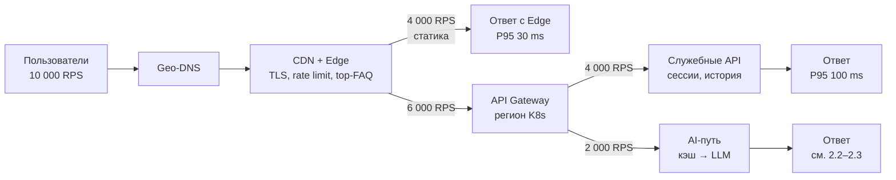
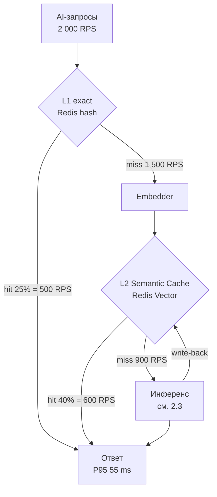
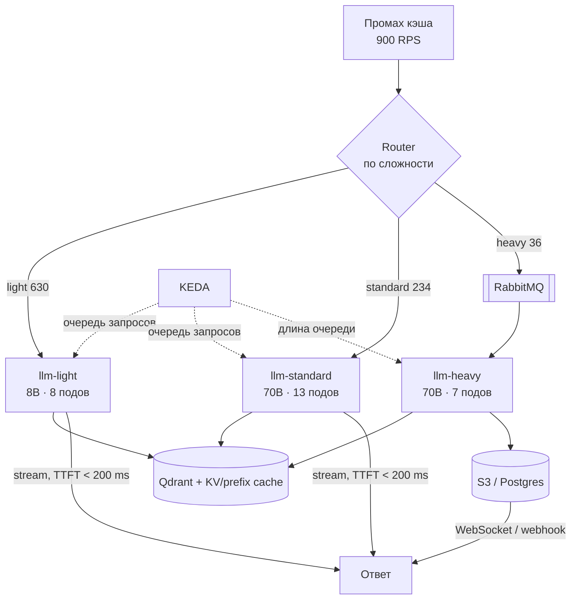
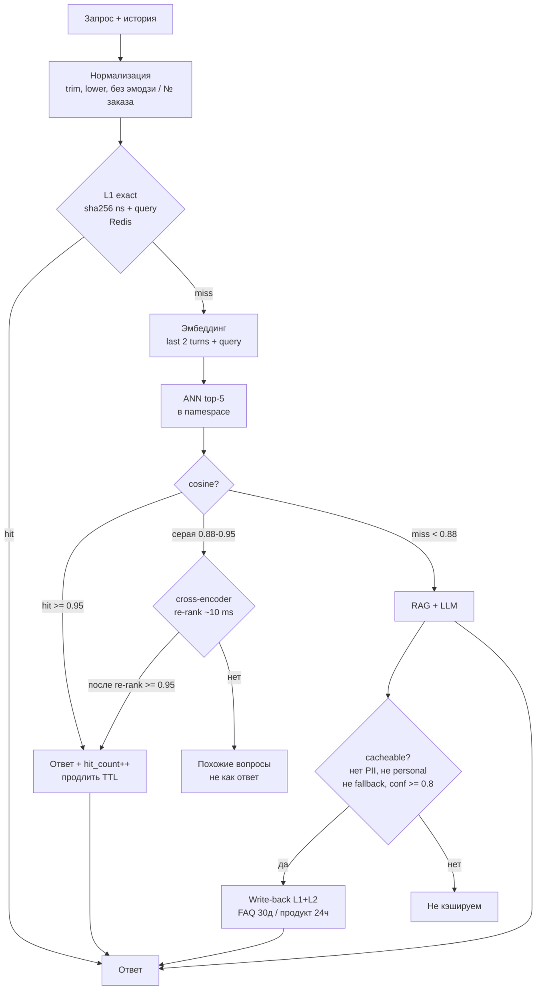
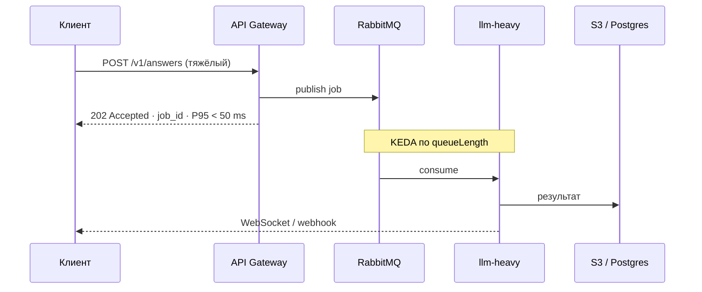
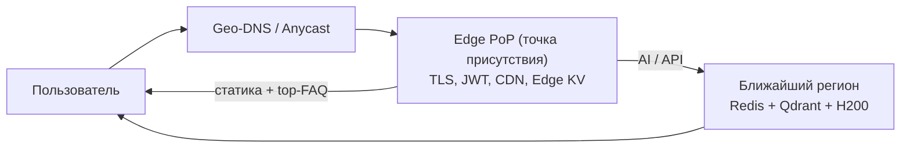

# ДЗ №9. Архитектура для высоких нагрузок и Real-time обработки

**Сервис:** RAG-бот поддержки, из [ДЗ-7](../hw-7/README.md) (Llama-3-70B INT4 + vLLM, Qdrant) и [ДЗ-8](../hw-8/README.md) (Terraform + CI/CD + Canary). Сервис вырос: **10 000 RPS**, требование **Latency < 200 ms**.

Теория — [конспект](summary/README.md).

Два слоя кэша ответов (дальше по тексту **L1 / L2**):

| | **L1** exact | **L2** Semantic Cache |
|--|--------------|------------------------|
| Что | точное совпадение вопроса | похожий **по смыслу** вопрос |
| Ключ | `sha256` нормализованной строки | вектор запроса (+ контекст диалога) |
| Где | Redis GET | Redis Vector (ANN) |
| Когда | «как оформить возврат» = та же строка | «как вернуть товар» ≈ «оформить возврат» |

---

## 1. Исходные данные: должно укладываться в 200 ms

### 1.1 Декомпозиция 10 000 RPS

Полная генерация ответа LLM физически не укладывается в 200 ms (250 токенов на 45 ток/с — это ~5.5 с).

Первое архитектурное решение — **разделить трафик на классы и назначить каждому свой SLO**.


| Класс трафика                                            | RPS (пик) | Что это                                     | SLO                                                    |
| -------------------------------------------------------- | --------- | ------------------------------------------- | ------------------------------------------------------ |
| Статика и ассеты (файлы фронта: JS, CSS, иконки, конфиг) | 4 000     | JS/CSS виджета, иконки, конфиг              | P95 < 50 ms, отдаётся с CDN, до бэкенда **не доходит** |
| Служебные API (не-LLM: сессия, история, фидбек)          | 4 000     | сессия, история диалога, фидбек, телеметрия | P95 < 100 ms, CPU-поды + Redis                         |
| **AI-запросы** (вопросы, на которые отвечает модель)     | **2 000** | нужен ответ модели                          | см. 1.2                                                |


### 1.2 SLO (Service Level Objective — целевой уровень задержки/качества) для AI-запросов


| Путь                                                                             | Доля AI-трафика | SLO                                                                  |
| -------------------------------------------------------------------------------- | --------------- | -------------------------------------------------------------------- |
| **A.** Попадание в кэш (exact) (тот же вопрос слово в слово — Redis GET)         | 25%             | **P95 полного ответа < 60 ms**                                       |
| **B.** Попадание в Semantic Cache (похожий по смыслу вопрос — векторный поиск)   | 30%             | **P95 полного ответа < 120 ms**                                      |
| **C.** Промах → синхронная генерация (кэш не помог, LLM отвечает сразу, стримом) | 43%             | **P95 TTFT (первый токен) < 200 ms**, дальше стриминг                |
| **D.** Тяжёлый запрос (отчёт, длинный файл — сразу 202, ответ позже)             | 2%              | **P95 подтверждения (202 Accepted) < 50 ms**, результат — асинхронно |


> **Ключевая идея:** «Latency < 200 ms» держится тремя способами — (1) 55% AI-запросов вообще не доходят до LLM (кэш), (2) для генерации SLO ставится на **TTFT** и ответ стримится, (3) тяжёлые запросы уходят в очередь и не занимают синхронный бюджет.


### 1.3 Допущения расчётов


| Параметр                                | Значение                         | Откуда                                                                                                                                                                                         |
| --------------------------------------- | -------------------------------- | ---------------------------------------------------------------------------------------------------------------------------------------------------------------------------------------------- |
| Пропускная способность 70B INT4 + vLLM  | **4 500 ток/с на H200** (141 GB) | A100: 1 800 ([ДЗ-7](../hw-7/README.md)); ×2.5 по bandwidth HBM3e 4.8 vs ~2.0 ТБ/с                                                                                                              |
| Пропускная способность 8B INT4 + vLLM   | **12 000 ток/с на H200**         | A100: 6 000; ×2 (8B меньше упирается в память, чем 70B)                                                                                                                                        |
| Средний ответ: light / standard / heavy | 150 / 250 / 800 ток              | допущение                                                                                                                                                                                      |
| Цена аренды H200                        | **714 ₽/ч = 521 220 ₽/мес**      | публичного SKU H200 у Cloud.ru нет; H100 PCI ≈ 549 ₽/GPU-ч × 1.3                                                                                                                               |
| Покупка H200 on-prem                    | **~4 млн ₽/карта**               | ориентир $35–45k за GPU ([Wecent 2026](https://www.szwecent.com/what-is-the-nvidia-h200-price-in-2026-complete-pricing-guide-for-enterprise-buyers/)), ~100 ₽/$; без сервера/ЦОД/электричества |
| Hit rate: L1 exact / L2 semantic        | 25% / 40%                        | оценка для support-бота, подтверждается замером на логах                                                                                                                                       |


---


## 2. Схема High-Load архитектуры

Схемы по слоям: куда уходит трафик → как кэш снимает нагрузку с LLM → как масштабируется инференс.

### 2.1 Обзор: куда уходят 10 000 RPS




Geo-DNS выбирает ближайший регион. Edge отдаёт статику и top-FAQ без захода в кластер. Gateway делит остаток: служебные API на CPU-поды, AI — дальше по цепочке кэша и инференса.

### 2.2 AI-путь: двухуровневый кэш




55% AI-запросов закрываются кэшем и до LLM не доходят (**L1** — точное совпадение строки, **L2** — похожий по смыслу вопрос). Промахи идут в инференс; успешные ответы пишутся обратно в L2 (с фильтром PII / персонализации).

### 2.3 AI-путь: инференс, async и автоскейлинг




Router делит промахи: лёгкие и стандартные — синхронный стриминг, тяжёлые — очередь и ответ позже. KEDA масштабирует поды по длине очереди (не по утилизации GPU).

---


## 3. Caching Strategy


### 3.1 Где кэшируем: семь слоёв


| #   | Слой                   | Ключ                                   | Что кэшируем                                                       | TTL         | P95   | Эффект                                           |
| --- | ---------------------- | -------------------------------------- | ------------------------------------------------------------------ | ----------- | ----- | ------------------------------------------------ |
| 0   | **CDN / Edge Workers** | URL                                    | статика виджета, top-200 FAQ-ответов (precomputed, Edge KV)        | 1–24 ч      | 30 ms | снимает 40% всего трафика, до региона не доходит |
| 1   | **API Gateway**        | JWT / API-key                          | результат authn/authz, JWKS, счётчики rate limit                   | 60 с        | 3 ms  | не ходим в IdP на каждом запросе                 |
| 2   | **L1 exact cache**     | `sha256(namespace + normalized_query)` | готовый ответ на побайтово совпадающий вопрос                      | 24 ч        | 2 ms  | 25% AI-запросов, самый дешёвый слой              |
| 3   | **L2 Semantic Cache**  | вектор запроса + контекста             | ответ на **похожий по смыслу** вопрос                              | 24 ч – 30 д | 12 ms | **40% остатка — главный рычаг**                  |
| 4   | **Embedding cache**    | `sha256(text)`                         | вектор текста                                                      | 7 д         | 1 ms  | снимает нагрузку с эмбеддер-пула                 |
| 5   | **Retrieval cache**    | `sha256(query_vector_bucket)`          | top-k `doc_id` из Qdrant                                           | 1 ч         | 2 ms  | снимает нагрузку с векторной БД                  |
| 6   | **Prefix / KV cache**  | префикс токенов                        | KV-тензоры системного промпта и RAG-контекста (vLLM APC + LMCache) | —           | —     | **−30…50% prefill → напрямую режет TTFT**        |


Слои 0–5 экономят **вызов LLM**, слой 6 экономит **фазу prefill внутри вызова**. Это разные рычаги, и нужны оба: без слоя 6 TTFT в 200 ms не укладывается.

### 3.2 Алгоритм Semantic Cache

**Проблема:** «как оформить возврат?», «Как мне вернуть товар?» и «хочу оформить возврат заказа» — один вопрос, три строки. Exact-кэш их не свяжет, LLM ответит трижды.

**Namespace** — все поиски внутри пространства:

```
namespace = hash(tenant_id, lang, acl_scope, model_version, prompt_version, index_version)
```

`tenant_id` — **организация-клиент** (B2B: банк / ритейлер), не пользователь. Кэш общий внутри тенанта.


| Поле                                                 | Что это                                  | Зачем в namespace                              |
| ---------------------------------------------------- | ---------------------------------------- | ---------------------------------------------- |
| `tenant_id`                                          | компания                                 | изоляция: банк А не видит кэш банка Б          |
| `lang`                                               | язык диалога                             | «return» ≠ «возврат»                           |
| `acl_scope`                                          | контур доступа (public / employee / vip) | сотрудник и клиент не мешают кэш               |
| `model_version` / `prompt_version` / `index_version` | версии модели, промпта, RAG-индекса      | смена версии логически инвалидирует старый кэш |


**Контекст в ключе.** Вектор = `last_2_turns + current_query`. Без контекста «а какое второе?» отдаёт чужой ответ ([баг из Azure docs](https://learn.microsoft.com/ru-ru/azure/cosmos-db/gen-ai/semantic-cache)).

**Алгоритм:**




`TAU_HIT = 0.95` - **порог cosine-сходства**: если ближайший вектор в кэше ≥ 0.95, считаем попаданием и отдаём готовый ответ без LLM. Контроль: hit rate L2 ≥ 35%, false-hit < 2% (1% попаданий дублируется в LLM).

### 3.3 Эффект: нагрузка на LLM


| Шаг                              | Вход, RPS | Hit rate       | Обслужено      | Осталось |
| -------------------------------- | --------- | -------------- | -------------- | -------- |
| L1 exact                         | 2 000     | 25%            | 500            | 1 500    |
| L2 Semantic Cache                | 1 500     | 40%            | **600**        | **900**  |
| Router: light / standard / heavy | 900       | 70% / 26% / 4% | 630 / 234 / 36 | —        |


`поды = ⌈ RPS × ток_ответа / (ток/с на H200) ⌉` → light ⌈94 500/12 000⌉=**8** + standard ⌈58 500/4 500⌉=**13** + heavy ⌈28 800/4 500⌉=**7** = **28 H200**.


| Вариант                           | До LLM  | H200    | Аренда, ₽/мес | Покупка on-prem, ₽ |
| --------------------------------- | ------- | ------- | ------------- | ------------------ |
| Без кэша (всё 70B)                | 2 000   | **112** | 58.4 млн      | **448 млн**        |
| Только L1 + роутинг               | 1 500   | 47      | 24.5 млн      | 188 млн            |
| **L1 + Semantic Cache + роутинг** | **900** | **28**  | **14.6 млн**  | **112 млн**        |


Покупка = `H200 × 4 млн ₽` (только карты). Vs аренда окупаемость **~7.7 мес** (`4 000 000 / 521 220`); сервер, стойка, охлаждение и электричество в CAPEX не входят — как в [ДЗ-7](../hw-7/README.md).

> Semantic Cache реально снимает нагрузку: **112 → 28 H200 (−75%)**, вклад L2 отдельно ≈ **−19 карт / −9.9 млн ₽/мес аренды / −76 млн ₽ CAPEX**. На A100 это же было бы 65 карт (ДЗ-7: 1 800 ток/с на 70B).

---


## 4. Scaling: KEDA по очереди запросов

**K8s + KEDA**, не Serverless: cold start 70B = 4–6 мин, в YC Functions нет GPU, при стабильных 10k RPS FaaS дороже.


| Пул                  | Baseline / min–max | Триггер KEDA                        |
| -------------------- | ------------------ | ----------------------------------- |
| `llm-light` (8B)     | 8 / 4–24           | `vllm:num_requests_waiting` > 4/под |
| `llm-standard` (70B) | 13 / 8–32          | `vllm:num_requests_waiting` > 2/под |
| `llm-heavy`          | 7 / 2–20           | RabbitMQ `queueLength` > 10/под     |


**Метрика - очередь, не GPU util.** У vLLM GPU ~90%+ из‑за continuous batching; перегрузку видно только по числу ожидающих запросов. `minReplicaCount` для 70B ≥ 8 (не 0).

```yaml
apiVersion: keda.sh/v1alpha1   # объект KEDA, не обычный HPA (не apps/v1)
kind: ScaledObject             # CRD: масштабируй Deployment по внешней метрике
metadata:
  name: llm-standard
spec:
  scaleTargetRef:
    name: llm-standard         # какой Deployment масштабировать
  minReplicaCount: 8           # пол реплик; ≥ 8, не scale-to-zero (cold start 70B = 4–6 мин)
  maxReplicaCount: 32          # потолок, чтобы не съесть весь GPU-пул
  pollingInterval: 10          # как часто KEDA опрашивает Prometheus, сек
  cooldownPeriod: 600          # не схлопывать поды сразу после спада нагрузки, сек
  triggers:                    # что считать нагрузкой: длина очереди vLLM
    - type: prometheus         # источник метрики (ещё rabbitmq, cron, …)
      metricType: AverageValue # на каждый под — по threshold ожидающих (сумма / реплики)
      metadata:
        serverAddress: http://prometheus.monitoring:9090
        query: sum(vllm:num_requests_waiting{pool="llm-standard"})
        threshold: "2"         # 26 ждущих / 13 подов = 2 → ок; 40 ждущих → scale-out
```

Для `llm-heavy` - тот же `ScaledObject`, триггер `rabbitmq` / `QueueLength`. Против cold start: веса на NVMe ноды, readiness после warmup, cron к утреннему пику. Рост ×2–×5 закрывается `maxReplicaCount` + регионы + шардирование Redis Vector.

---


## 5. Async Processing: тяжёлые запросы

Вход > 4k ток., файл и т.д., где ответ > 600 ток., multi-step. Router шлёт их в очередь **до** LLM.




Надёжность: `Idempotency-Key`; 

после 3 ошибок - **DLQ** (Dead Letter Queue - очередь «отравленных» сообщений); 

`queueLength > 500` → HTTP **429 Too Many Requests**: очередь уже забита, новые тяжёлые запросы не принимаем (backpressure), пока воркеры не разберут; 

TTL сообщения 15 мин; 

`preStop` drain при scale-down: перед убийством пода Kubernetes шлёт SIGTERM / `preStop` — воркер **перестаёт брать новые** задачи из очереди и **дожидается текущей**.

---


## 6. Global Distribution

**Global Distribution** - разнесение сервиса по миру: DNS ведёт клиента в ближайший регион, на Edge закрываются TLS/статика/FAQ, полный стек (кэш + LLM) стоит в нескольких ЦОД, а не в одном.

**Зачем:** SLO 200 ms считается **до первого полезного байта**. RTT Сингапур ↔ Москва — 250–300 ms: один round-trip уже больше бюджета, кэш в Москве не поможет. Нужно **приблизить** DNS, TLS и частые ответы к пользователю, а LLM оставить в ближайшем регионе.




### Geo-DNS и Anycast

**Geo-DNS** (latency-based routing, напр. Route 53 / аналог): по IP/измеренной задержке отдаёт **A/AAAA ближайшего живого региона** — `ru-central`, `eu-central`, `ap-southeast`. 

Health check: если регион мёртв, запись снимается, трафик уходит в соседний (SLO официально деградирует, сервис жив).

**Anycast** на Edge: один IP анонсируется из многих **PoP** (Point of Presence — точка присутствия провайдера), **BGP** (Border Gateway Protocol — протокол маршрутизации в интернете) ведёт пакет на ближайший узел. Отказ одного PoP — трафик сам уезжает на следующий, без смены URL у клиента.

### Edge computing

**Edge** (edge computing) - вычисления **на краю сети**, ближе к пользователю, а не в одном центральном ЦОД. Практически это сотни **PoP** (Point of Presence: узлы Cloudflare / CloudFront и т.п.) в городах мира.

Это **не** полноценный LLM и **не** GPU-кластер: на Edge живут лёгкие вещи (TLS, проверка токена, статика, заранее посчитанный FAQ). Тяжёлый инференс 70B остаётся в региональном Kubernetes.


| Что на Edge             | Зачем для 200 ms                                                      |
| ----------------------- | --------------------------------------------------------------------- |
| Терминация **TLS**      | handshake 20 ms вместо 250 ms до Москвы                               |
| **JWT / rate limit**    | мусор и невалидные токены не едут в GPU-кластер                       |
| **CDN** (JS/CSS/виджет) | 4 000 RPS статики не доходят до региона                               |
| **Edge KV: top-N FAQ**  | заранее посчитанные ответы на частые вопросы - путь A/B без инференса |


### Регион: полный стек рядом

В каждом регионе - **свой** Redis (**L1** exact-кэш по хешу вопроса + **L2** Semantic Cache по вектору), Qdrant, inference-поды. Кросс-региональный `GET` кэша запрещён: 150–250 ms убивает смысл Semantic Cache.

Горячие записи (`hit_count > 10`) **асинхронно** копируем событием `CacheEntryHot` (fat: текст + вектор + ответ + версии) - только без PII. 

Новый регион сразу получает частые FAQ из других регионов и не набирает попадания кэша с нуля. 

RAG-индекс - снэпшотом из S3, read-only реплика на регион (как в [ДЗ-8](../hw-8/README.md)).

`region` входит в namespace кэша → **data residency** (152-ФЗ / GDPR): персональные ответы не кэшируются и не реплицируются.

---


## 7. Итог


| Путь                                | P95                            | Как                         |
| ----------------------------------- | ------------------------------ | --------------------------- |
| A L1 / B Semantic / C LLM / D async | 55 / 98 / **TTFT 187** / 48 ms | кэш, стриминг, 202 Accepted |


| Требование           | Решение                                             | Эффект                          |
| -------------------- | --------------------------------------------------- | ------------------------------- |
| **Caching**          | CDN → Gateway → L1 → **Semantic Cache** → prefix/KV | 55% AI без LLM; **112→28 H200** |
| **Scaling**          | KEDA по **длине очереди** vLLM / RabbitMQ           | рост без переделки              |
| **Async**            | Router → RabbitMQ → 202 + WebSocket                 | тяжёлое вне sync-бюджета        |
| **Latency < 200 ms** | разные SLO по путям A–D + Edge                      | все пути в бюджете              |
| **Global**           | Geo-DNS + Edge + 3 региона                          | RTT не убивает SLO              |


1. 200 ms - разные SLO; полная генерация LLM в 200 ms нереалистична.
2. Semantic Cache - несущая конструкция (−19 H200).
3. Масштабируем по очереди, не по GPU util.

---


## Источники

- [Semantic Cache — Azure Cosmos DB](https://learn.microsoft.com/ru-ru/azure/cosmos-db/gen-ai/semantic-cache)
- [KEDA](https://keda.sh/) · [ScaledObject](https://keda.sh/docs/latest/reference/scaledobject-spec/) · [RabbitMQ scaler](https://keda.sh/docs/latest/scalers/rabbitmq-queue/) · [Prometheus scaler](https://keda.sh/docs/latest/scalers/prometheus/)
- [vLLM Metrics](https://docs.vllm.ai/en/latest/design/metrics.html) · [Prefix Caching](https://docs.vllm.ai/en/latest/features/automatic_prefix_caching.html)
- H200: [NVIDIA H200](https://www.nvidia.com/en-us/data-center/h200/) (141 GB, 4.8 ТБ/с); якорь цены H100 Cloud.ru — [тарифы Evolution GPU](https://cloud.ru/documents/tariffs/evolution/evolution-compute-gpu)
- Sizing A100 (база 1 800 ток/с) — [ДЗ-7](../hw-7/README.md)

